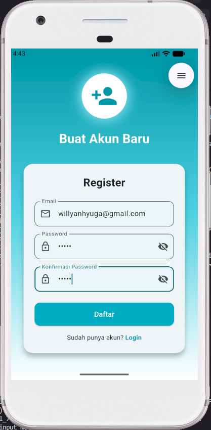
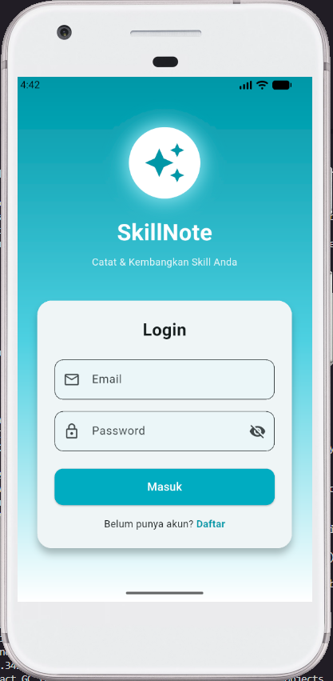
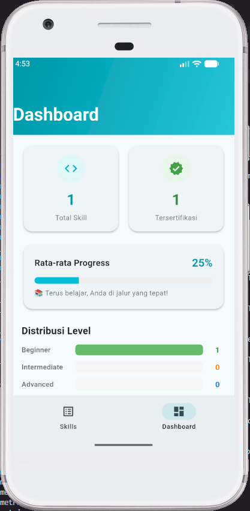
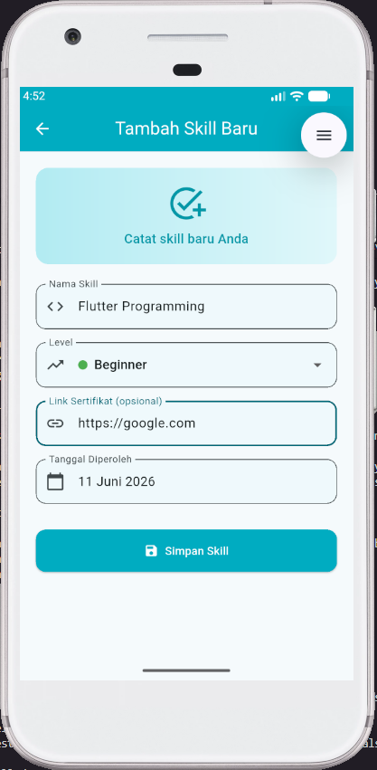
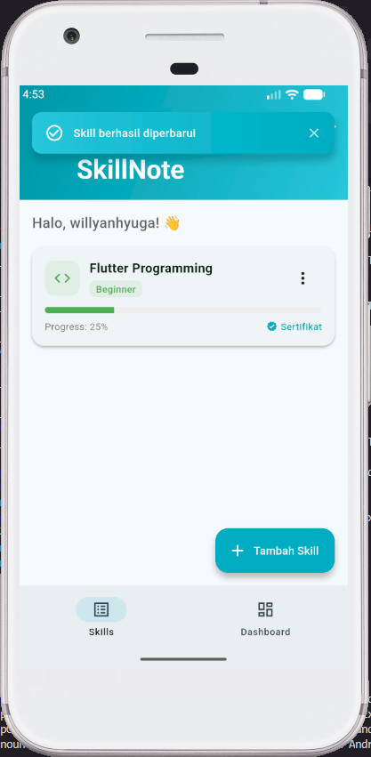

<div align="center">
    <br />
    <h1>LAPORAN PRAKTIKUM <br> APLIKASI BERBASIS PLATFORM </h1>
    <br />
    <h3>MODUL 7 <br> Integrasi Flutter Firebase/Supabase </h3>
    <br />
    
    <br />
    <br />
    <br />
    <h3>Disusun Oleh :</h3>
    <p>
        <strong>Willyan Hyuga Pratama</strong>
        <br>
        <strong>2211102129</strong>
        <br>
        <strong>S1 IF-11-REG05</strong>
    </p>
    <br />
    <h3>Dosen Pengampu :</h3>
    <p>
        <strong>Dedi Agung Prabowo, S.Kom., M.Kom</strong>
    </p>
    <br />
    <br />
    <h4>Asisten Praktikum :</h4>
    <strong>Apri Pandu Wicaksono </strong>
    <br>
    <strong>Hamka Zaenul Ardi</strong>
    <br />
    <h3>LABORATORIUM HIGH PERFORMANCE <br>FAKULTAS INFORMATIKA <br>UNIVERSITAS TELKOM PURWOKERTO <br>2026 </h3>
</div>
<hr>

## Dasar Teori

Firebase Authentication adalah layanan autentikasi dari Google yang menyediakan berbagai metode login seperti email/password, Google Sign-In, dan lainnya. Dalam aplikasi ini, Firebase Auth digunakan untuk mengelola proses registrasi, login, dan logout pengguna secara aman tanpa perlu membangun sistem autentikasi dari nol.

Cloud Firestore adalah database NoSQL berbasis dokumen yang bersifat real-time dan scalable. Data disimpan dalam bentuk koleksi (collection) dan dokumen (document) yang memungkinkan query fleksibel serta sinkronisasi data secara real-time antar perangkat. Pada proyek ini, Firestore digunakan untuk menyimpan data skill milik setiap pengguna dengan struktur dokumen yang mencakup nama skill, level, URL sertifikat, tanggal diperoleh, dan userId.

Flutter menggunakan arsitektur widget-based dimana setiap elemen UI adalah widget yang dapat bersifat stateless maupun stateful. Dengan menggunakan StreamBuilder, aplikasi dapat mendengarkan perubahan data dari Firestore secara real-time dan memperbarui tampilan secara otomatis tanpa perlu refresh manual. Overlay notification diimplementasikan menggunakan OverlayEntry dan AnimationController untuk menampilkan notifikasi CRUD yang muncul dari atas layar layaknya notifikasi sistem pada smartphone.

## Tugas Modul 7

### 1. Source Code

```dart
//Willyan Hyuga Pratama 2211102129
import 'package:flutter/material.dart';
import '../services/auth_service.dart';
import 'register_screen.dart';

class LoginScreen extends StatefulWidget {
  const LoginScreen({super.key});

  @override
  State<LoginScreen> createState() => _LoginScreenState();
}

class _LoginScreenState extends State<LoginScreen> {
  final _formKey = GlobalKey<FormState>();
  final _emailController = TextEditingController();
  final _passwordController = TextEditingController();
  final _authService = AuthService();
  bool _isLoading = false;
  bool _obscurePassword = true;

  @override
  void dispose() {
    _emailController.dispose();
    _passwordController.dispose();
    super.dispose();
  }

  Future<void> _login() async {
    if (!_formKey.currentState!.validate()) return;
```
**Kode Lengkap:** [lib/screens/login_screen.dart](lib/screens/login_screen.dart)

```dart
//Willyan Hyuga Pratama 2211102129
import 'package:flutter/material.dart';
import '../services/auth_service.dart';

class RegisterScreen extends StatefulWidget {
  const RegisterScreen({super.key});

  @override
  State<RegisterScreen> createState() => _RegisterScreenState();
}

class _RegisterScreenState extends State<RegisterScreen> {
  final _formKey = GlobalKey<FormState>();
  final _emailController = TextEditingController();
  final _passwordController = TextEditingController();
  final _confirmPasswordController = TextEditingController();
  final _authService = AuthService();
  bool _isLoading = false;
  bool _obscurePassword = true;
  bool _obscureConfirm = true;

  @override
  void dispose() {
    _emailController.dispose();
    _passwordController.dispose();
    _confirmPasswordController.dispose();
    super.dispose();
  }

  Future<void> _register() async {
```
**Kode Lengkap:** [lib/screens/register_screen.dart](lib/screens/register_screen.dart)

```dart
//Willyan Hyuga Pratama 2211102129
import 'package:flutter/material.dart';
import 'package:firebase_auth/firebase_auth.dart';
import '../models/skill_model.dart';
import '../services/auth_service.dart';
import '../services/firestore_service.dart';
import '../widgets/notification_overlay.dart';
import 'add_skill_screen.dart';
import 'edit_skill_screen.dart';
import 'dashboard_screen.dart';

class HomeScreen extends StatefulWidget {
  const HomeScreen({super.key});

  @override
  State<HomeScreen> createState() => _HomeScreenState();
}

class _HomeScreenState extends State<HomeScreen> {
  final _authService = AuthService();
  final _firestoreService = FirestoreService();
  int _currentIndex = 0;

  @override
  Widget build(BuildContext context) {
    final user = FirebaseAuth.instance.currentUser;

    return Scaffold(
      body: _currentIndex == 0
          ? _buildSkillList(user)
```
**Kode Lengkap:** [lib/screens/home_screen.dart](lib/screens/home_screen.dart)

```dart
//Willyan Hyuga Pratama 2211102129
import 'package:flutter/material.dart';
import 'package:firebase_auth/firebase_auth.dart';
import 'package:intl/intl.dart';
import '../models/skill_model.dart';
import '../services/firestore_service.dart';
import '../widgets/notification_overlay.dart';

class AddSkillScreen extends StatefulWidget {
  const AddSkillScreen({super.key});

  @override
  State<AddSkillScreen> createState() => _AddSkillScreenState();
}

class _AddSkillScreenState extends State<AddSkillScreen> {
  final _formKey = GlobalKey<FormState>();
  final _namaController = TextEditingController();
  final _sertifikatUrlController = TextEditingController();
  final _firestoreService = FirestoreService();

  String _selectedLevel = 'Beginner';
  DateTime _selectedDate = DateTime.now();
  bool _isLoading = false;

  final List<String> _levels = [
    'Beginner',
    'Intermediate',
    'Advanced',
    'Expert',
```
**Kode Lengkap:** [lib/screens/add_skill_screen.dart](lib/screens/add_skill_screen.dart)

```dart
//Willyan Hyuga Pratama 2211102129
import 'package:flutter/material.dart';
import 'package:firebase_core/firebase_core.dart';
import 'package:intl/date_symbol_data_local.dart';
import 'firebase_options.dart';
import 'screens/login_screen.dart';
import 'screens/home_screen.dart';
import 'package:firebase_auth/firebase_auth.dart';

void main() async {
  WidgetsFlutterBinding.ensureInitialized();
  await Firebase.initializeApp(
    options: DefaultFirebaseOptions.currentPlatform,
  );
  await initializeDateFormatting('id', null);
  runApp(const SkillNoteApp());
}

class SkillNoteApp extends StatelessWidget {
  const SkillNoteApp({super.key});

  @override
  Widget build(BuildContext context) {
    return MaterialApp(
      title: 'SkillNote',
      debugShowCheckedModeBanner: false,
      theme: ThemeData(
        colorScheme: ColorScheme.fromSeed(
          seedColor: Colors.cyan,
          brightness: Brightness.light,
```
**Kode Lengkap:** [lib/main.dart](lib/main.dart)

### 2. Penjelasan

SkillNote adalah aplikasi Flutter untuk mencatat dan memantau perkembangan skill serta sertifikat pengguna, dilengkapi fitur autentikasi (login, register, logout), CRUD skill dengan Cloud Firestore, dan notifikasi overlay yang muncul di atas layar saat operasi berhasil dilakukan.


### 3. Output





