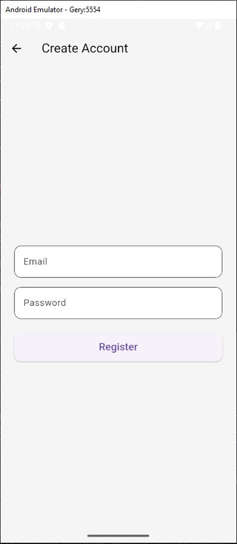
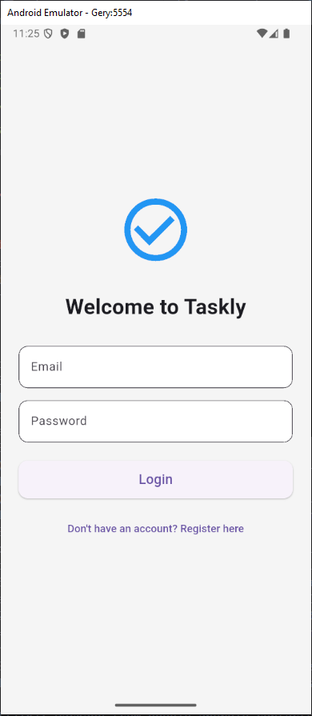
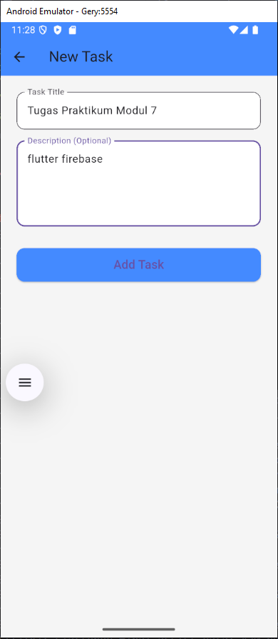
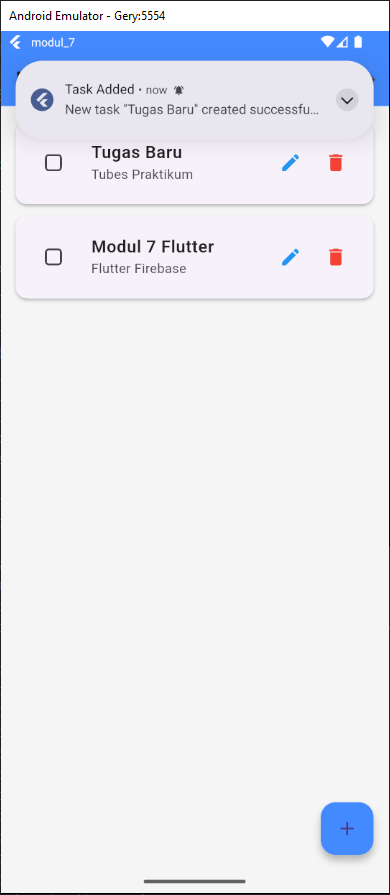

<div align="center">
    <br />
    <h1>LAPORAN PRAKTIKUM <br> APLIKASI BERBASIS PLATFORM </h1>
    <br />
    <h3>MODUL 7 <br> Integrasi Flutter Firebase/Supabase </h3>
    <br />
    
    <br />
    <br />
    <br />
    <h3>Disusun Oleh :</h3>
    <p>
        <strong>Geranada Saputra Priambudi</strong>
        <br>
        <strong>2311102008</strong>
        <br>
        <strong>S1 IF-11-REG05</strong>
    </p>
    <br />
    <h3>Dosen Pengampu :</h3>
    <p>
        <strong>Dedi Agung Prabowo, S.Kom., M.Kom</strong>
    </p>
    <br />
    <br />
    <h4>Asisten Praktikum :</h4>
    <strong>Apri Pandu Wicaksono </strong>
    <br>
    <strong>Hamka Zaenul Ardi</strong>
    <br />
    <h3>LABORATORIUM HIGH PERFORMANCE <br>FAKULTAS INFORMATIKA <br>UNIVERSITAS TELKOM PURWOKERTO <br>2026 </h3>
</div>
<hr>

## Dasar Teori

## 1. Integrasi antara framework 
pengembangan aplikasi lintas platform seperti Flutter dengan layanan Backend-as-a-Service (BaaS) telah menjadi standar industri dalam mempercepat siklus pengembangan perangkat lunak. Konsep BaaS mengeliminasi kebutuhan pengembang untuk membangun, mengonfigurasi, dan memelihara infrastruktur server fisik atau mesin virtual dari awal. Platform terkemuka seperti Firebase dan Supabase menyediakan solusi siap pakai yang mencakup pengelolaan basis data, penyimpanan berkas, hingga fungsi komputasi awan. Melalui pendekatan ini, arsitektur aplikasi menjadi lebih ramping karena kendali logika backend yang berat dioperasikan langsung oleh penyedia layanan awan, sementara pengembang dapat fokus sepenuhnya pada optimalisasi pengalaman pengguna di sisi client.

## 2. Salah satu pilar utama
dalam pemanfaatan layanan BaaS adalah sistem autentikasi yang aman dan terpusat. Keamanan data pengguna dalam ekosistem seluler dijamin melalui pustaka resmi (SDK) yang mengelola token sesi, enkripsi kata sandi, serta integrasi masuk tunggal (Single Sign-On). Firebase Authentication menyediakan mekanisme otentikasi mutakhir yang memvalidasi identitas pengguna sebelum mereka diizinkan melakukan operasi baca atau tulis pada basis data. Proses ini krusial untuk memastikan kepatuhan terhadap hak akses data personal, memisahkan dependensi data antar-akun secara ketat, serta menjaga integritas sesi aplikasi agar tidak mudah dimanipulasi oleh pihak ketiga.

## 3. Selain manajemen pengguna
komponen vital lainnya adalah pengelolaan data terdistribusi secara real-time dan sistem interaksi asinkron melalui notifikasi. Penggunaan Cloud Firestore memanfaatkan model penyimpanan dokumen NoSQL yang mendukung arsitektur berbasis aliran data (Stream-driven architecture). Ketika terjadi perubahan status data pada server, pembaruan tersebut akan disebarkan secara instan ke seluruh perangkat client yang terhubung tanpa memerlukan poling HTTP (HTTP polling) manual yang memboroskan daya. Sinkronisasi data real-time ini, jika dikombinasikan dengan sistem manajemen notifikasi lokal (local notifications), mampu memberikan umpan balik visual yang responsif kepada pengguna saat sebuah aksi atau tugas baru berhasil diproses oleh sistem.


## Tugas Modul 7
### 1. Source Code

```dart
//Geranada Saputra Priambudi 2311102008
import 'package:flutter/material.dart';
import 'package:firebase_auth/firebase_auth.dart';
import '../services/firebase_service.dart';
import 'register_screen.dart';
import 'home_screen.dart';

class LoginScreen extends StatefulWidget {
  @override
  _LoginScreenState createState() => _LoginScreenState();
}

class _LoginScreenState extends State<LoginScreen> {
  final _emailController = TextEditingController();
  final _passwordController = TextEditingController();
  final FirebaseService _firebaseService = FirebaseService();
  bool _isLoading = false;
```

**Kode Lengkap:** [lib/screens/login_screen.dart](lib/screens/login_screen.dart)

```dart
//Geranada Saputra Priambudi 2311102008
import 'package:flutter/material.dart';
import 'package:firebase_auth/firebase_auth.dart';
import '../services/firebase_service.dart';
import 'home_screen.dart';

class RegisterScreen extends StatefulWidget {
  @override
  _RegisterScreenState createState() => _RegisterScreenState();
}

class _RegisterScreenState extends State<RegisterScreen> {
  final _emailController = TextEditingController();
  final _passwordController = TextEditingController();
  final FirebaseService _firebaseService = FirebaseService();
  bool _isLoading = false;
```

**Kode Lengkap:** [lib/screens/register_screen.dart](lib/screens/register_screen.dart)

```dart
//Geranada Saputra Priambudi 2311102008
import 'package:flutter/material.dart';
import 'package:cloud_firestore/cloud_firestore.dart';
import '../services/firebase_service.dart';
import '../services/notification_service.dart';
import 'task_form_screen.dart';
import 'login_screen.dart';

class HomeScreen extends StatelessWidget {
  final FirebaseService _firebaseService = FirebaseService();

  void _logout(BuildContext context) async {
    await _firebaseService.logout();
    Navigator.pushReplacement(
      context,
      MaterialPageRoute(builder: (_) => LoginScreen()),
    );
  }
```

**Kode Lengkap:** [lib/screens/home_screen.dart](lib/screens/home_screen.dart)

```dart
//Geranada Saputra Priambudi 2311102008
import 'package:flutter/material.dart';
import '../services/firebase_service.dart';
import '../services/notification_service.dart';

class TaskFormScreen extends StatefulWidget {
  final String? taskId;
  final String? initialTitle;
  final String? initialDescription;
  final bool initialIsCompleted;

  const TaskFormScreen({
    Key? key,
    this.taskId,
    this.initialTitle,
    this.initialDescription,
    this.initialIsCompleted = false,
  }) : super(key: key);
```

**Kode Lengkap:** [lib/screens/task_form_screen.dart](lib/screens/task_form_screen.dart)

```dart
//Geranada Saputra Priambudi 2311102008
import 'package:flutter/material.dart';
import 'package:firebase_core/firebase_core.dart';
import 'package:firebase_auth/firebase_auth.dart';
import 'services/notification_service.dart';
import 'screens/login_screen.dart';
import 'screens/home_screen.dart';

void main() async {
  WidgetsFlutterBinding.ensureInitialized();
  
  // Initialize Firebase
  // Note: the user must configure firebase using `flutterfire configure` 
  // or add google-services.json manually for this to work.
  try {
    await Firebase.initializeApp();
  } catch (e) {
    debugPrint("Firebase initialization error: $e");
    // Ensure the app doesn't crash if Firebase isn't configured yet
  }

  // Initialize Local Notifications
  await NotificationService.initialize();

  runApp(MyApp());
}
```

**Kode Lengkap:** [lib/main.dart](lib/main.dart)

### 2. Penjelasan

Proyek ini adalah aplikasi yang mengintegrasikan Firebase (Authentication, Firestore) untuk fitur login/register dan manajemen order, lengkap dengan notifikasi lokal menggunakan flutter_local_notifications.

### 3. Output





