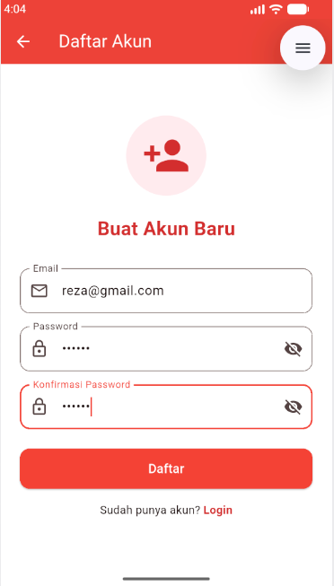
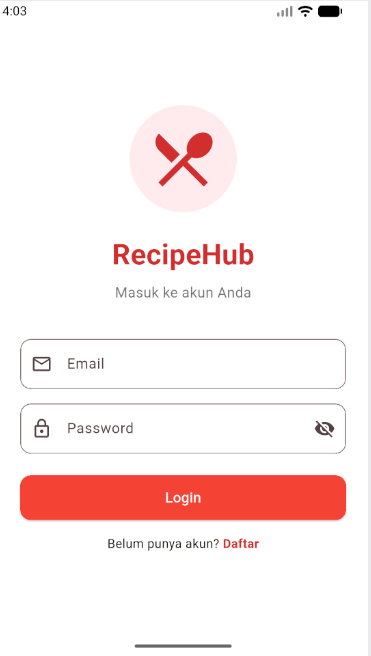
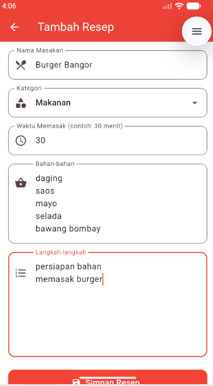
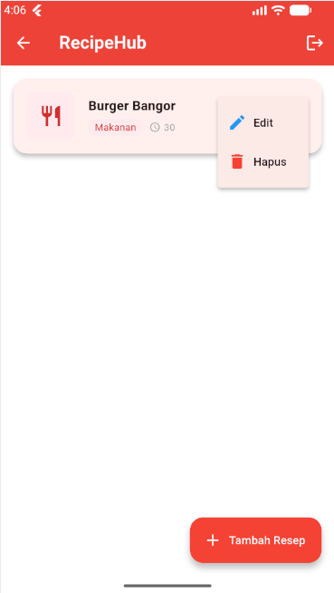
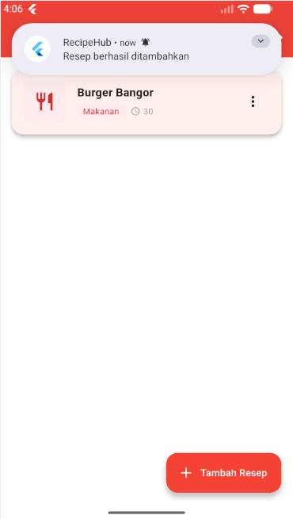

<div align="center">
    <br />
    <h1>LAPORAN PRAKTIKUM <br> APLIKASI BERBASIS PLATFORM </h1>
    <br />
    <h3>MODUL 7 <br> Integrasi Flutter Firebase/Supabase </h3>
    <br />
    
    <br />
    <br />
    <br />
    <h3>Disusun Oleh :</h3>
    <p>
        <strong>Reza Alvonzo</strong>
        <br>
        <strong>2311102026</strong>
        <br>
        <strong>S1 IF-11-REG05</strong>
    </p>
    <br />
    <h3>Dosen Pengampu :</h3>
    <p>
        <strong>Dedi Agung Prabowo, S.Kom., M.Kom</strong>
    </p>
    <br />
    <br />
    <h4>Asisten Praktikum :</h4>
    <strong>Apri Pandu Wicaksono </strong>
    <br>
    <strong>Hamka Zaenul Ardi</strong>
    <br />
    <h3>LABORATORIUM HIGH PERFORMANCE <br>FAKULTAS INFORMATIKA <br>UNIVERSITAS TELKOM PURWOKERTO <br>2026 </h3>
</div>
<hr>

## Dasar Teori

Firebase Authentication adalah layanan autentikasi dari Google yang memungkinkan developer mengimplementasikan sistem login, registrasi, dan logout pengguna dengan mudah tanpa perlu membangun backend autentikasi sendiri. Layanan ini mendukung berbagai metode seperti email/password dan Google Sign-In dengan keamanan yang sudah terstandarisasi.

Cloud Firestore adalah database NoSQL berbasis dokumen dari Firebase yang menyimpan data dalam bentuk koleksi dan dokumen. Keunggulan utamanya adalah kemampuan sinkronisasi real-time melalui stream, sehingga perubahan data langsung tercermin di semua perangkat yang terhubung tanpa perlu refresh manual.

Flutter Local Notifications adalah package yang memungkinkan aplikasi menampilkan notifikasi lokal di notification bar perangkat pengguna. Notifikasi ini bekerja tanpa memerlukan server push notification dan memberikan feedback langsung kepada pengguna setelah melakukan operasi seperti menambah, mengubah, atau menghapus data.


## Tugas Modul 7 

### 1. Source Code

```dart
// Reza Alvonzo - 2311102026 
class _LoginScreenState extends State<LoginScreen> {
  final _formKey = GlobalKey<FormState>();
  final _emailController = TextEditingController();
  final _passwordController = TextEditingController();
  final _authService = AuthService();
  bool _isLoading = false;

  Future<void> _login() async {
    if (!_formKey.currentState!.validate()) return;
    setState(() => _isLoading = true);
    try {
      await _authService.login(
        _emailController.text.trim(),
        _passwordController.text.trim(),
      );
      if (mounted) {
        Navigator.pushReplacement(
          context,
          MaterialPageRoute(builder: (_) => const HomeScreen()),
        );
      }
    } on Exception catch (e) {
      if (mounted) {
        ScaffoldMessenger.of(context).showSnackBar(
          SnackBar(content: Text('Login gagal: ${e.toString()}')),
        );
      }
    }
  }
```

**Kode Lengkap:** [lib/screens/login_screen.dart](lib/screens/login_screen.dart)

```dart
// Reza Alvonzo - 2311102026 
class _RegisterScreenState extends State<RegisterScreen> {
  final _formKey = GlobalKey<FormState>();
  final _emailController = TextEditingController();
  final _passwordController = TextEditingController();
  final _confirmPasswordController = TextEditingController();
  final _authService = AuthService();
  bool _isLoading = false;

  Future<void> _register() async {
    if (!_formKey.currentState!.validate()) return;
    setState(() => _isLoading = true);
    try {
      await _authService.register(
        _emailController.text.trim(),
        _passwordController.text.trim(),
      );
      if (mounted) {
        Navigator.pushReplacement(
          context,
          MaterialPageRoute(builder: (_) => const HomeScreen()),
        );
      }
    } on Exception catch (e) {
      if (mounted) {
        ScaffoldMessenger.of(context).showSnackBar(
          SnackBar(content: Text('Registrasi gagal: ${e.toString()}')),
        );
      }
    }
  }
```

**Kode Lengkap:** [lib/screens/register_screen.dart](lib/screens/register_screen.dart)

```dart
// Reza Alvonzo - 2311102026 
class _HomeScreenState extends State<HomeScreen> {
  final RecipeService _recipeService = RecipeService();
  final AuthService _authService = AuthService();

  @override
  void initState() {
    super.initState();
    NotificationService.initialize();
  }

  Future<void> _deleteRecipe(String id) async {
    showDialog(
      context: context,
      builder: (context) => AlertDialog(
        title: const Text('Hapus Resep'),
        content: const Text('Apakah Anda yakin ingin menghapus resep ini?'),
        actions: [
          TextButton(
            onPressed: () async {
              Navigator.pop(context);
              await _recipeService.deleteRecipe(id);
              await NotificationService.showNotification(
                title: 'RecipeHub',
                body: 'Resep berhasil dihapus',
              );
            },
          ),
        ],
      ),
    );
  }
```

**Kode Lengkap:** [lib/screens/home_screen.dart](lib/screens/home_screen.dart)

```dart
// Reza Alvonzo - 2311102026 
class _AddRecipeScreenState extends State<AddRecipeScreen> {
  final _formKey = GlobalKey<FormState>();
  final _namaController = TextEditingController();
  final _bahanController = TextEditingController();
  final _langkahController = TextEditingController();
  final _waktuController = TextEditingController();
  final _recipeService = RecipeService();
  String _selectedKategori = 'Makanan';

  Future<void> _saveRecipe() async {
    if (!_formKey.currentState!.validate()) return;
    setState(() => _isLoading = true);
    final userId = FirebaseAuth.instance.currentUser?.uid ?? '';
    final recipe = Recipe(
      namaMasakan: _namaController.text.trim(),
      bahan: _bahanController.text.trim(),
      langkah: _langkahController.text.trim(),
      kategori: _selectedKategori,
      waktuMemasak: _waktuController.text.trim(),
      userId: userId,
    );
    await _recipeService.addRecipe(recipe);
    await NotificationService.showNotification(
      title: 'RecipeHub',
      body: 'Resep berhasil ditambahkan',
    );
    if (mounted) Navigator.pop(context);
  }
```

**Kode Lengkap:** [lib/screens/add_recipe_screen.dart](lib/screens/add_recipe_screen.dart)

```dart
// Reza Alvonzo - 2311102026 
import 'package:flutter/material.dart';
import 'package:firebase_core/firebase_core.dart';
import 'firebase_options.dart';
import 'screens/login_screen.dart';
import 'screens/home_screen.dart';
import 'package:firebase_auth/firebase_auth.dart';

void main() async {
  WidgetsFlutterBinding.ensureInitialized();
  await Firebase.initializeApp(
    options: DefaultFirebaseOptions.currentPlatform,
  );
  runApp(const RecipeHubApp());
}

class RecipeHubApp extends StatelessWidget {
  const RecipeHubApp({super.key});

  @override
  Widget build(BuildContext context) {
    return MaterialApp(
      title: 'RecipeHub',
      debugShowCheckedModeBanner: false,
      theme: ThemeData(
        colorScheme: ColorScheme.fromSeed(
          seedColor: Colors.red,
          primary: Colors.red,
        ),
      ),
    );
  }
}
```

**Kode Lengkap:** [lib/main.dart](lib/main.dart)

### 2. Penjelasan

Aplikasi RecipeHub menggunakan Firebase Authentication untuk mengelola proses login, register, dan logout pengguna, serta Cloud Firestore untuk menyimpan dan mengelola data resep secara real-time dengan operasi CRUD lengkap. Setiap operasi CRUD yang berhasil akan memunculkan notifikasi lokal di notification bar handphone menggunakan package flutter_local_notifications dengan pesan seperti "Resep berhasil ditambahkan", "Resep berhasil diperbarui", dan "Resep berhasil dihapus".

### 3. Output





