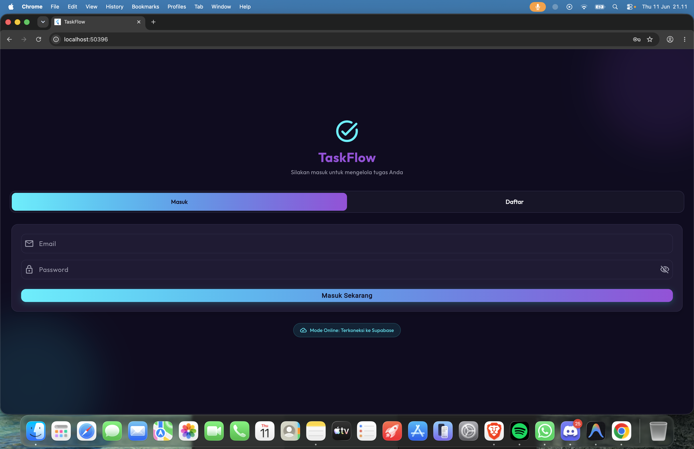
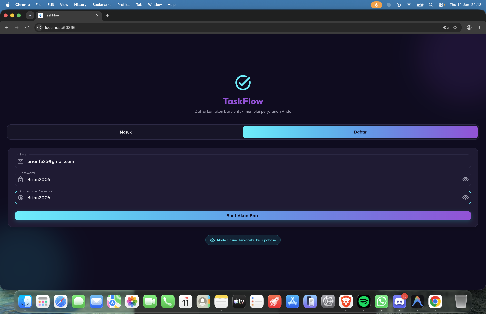
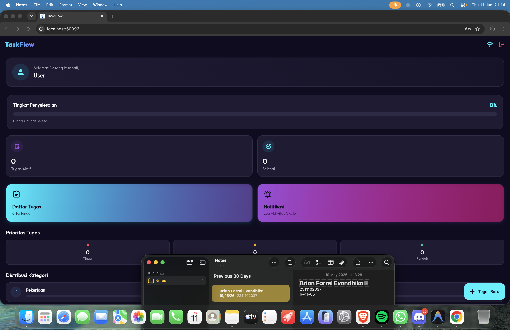
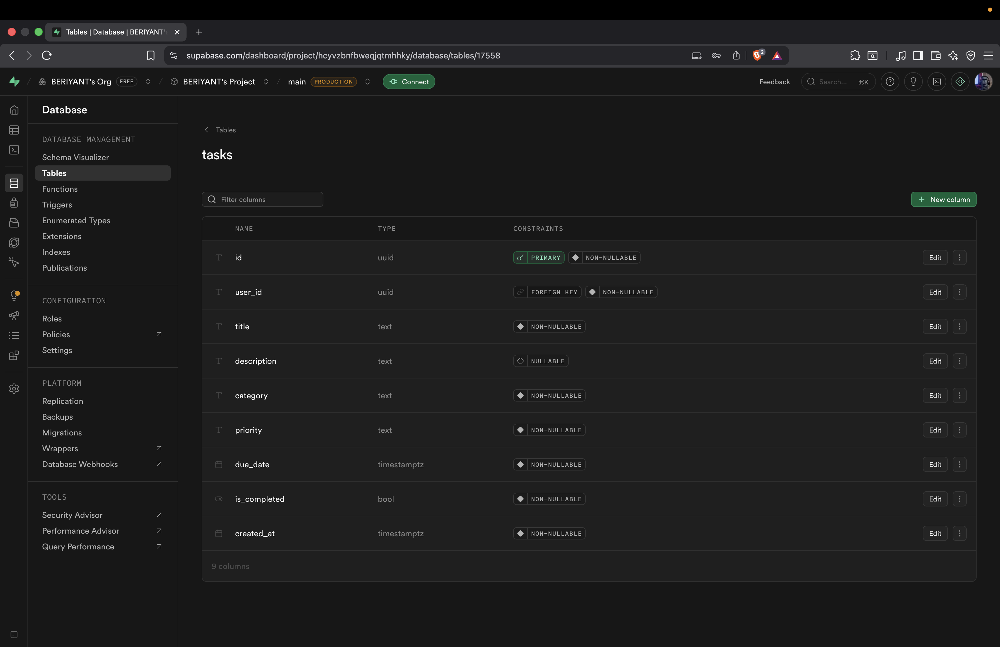

<div align="center">
  <br />
  <h1>LAPORAN PRAKTIKUM <br> APLIKASI BERBASIS PLATFORM </h1>
  <br />
  <h3>MODUL 7 <br> FLUTTER </h3>
  <br />
  
  <br />
  <br />
  <br />
  <h3>Disusun Oleh :</h3>
  <p>
    <strong>Brian Farrel Evandhika</strong>
    <br>
    <strong>2311102037</strong>
    <br>
    <strong>S1 IF-11-REG05</strong>
  </p>
  <br />
  <h3>Dosen Pengampu :</h3>
  <p>
    <strong>Dedi Agung Prabowo, S.Kom., M.Kom</strong>
  </p>
  <br />
  <br />
  <h4>Asisten Praktikum :</h4>
  <strong>Apri Pandu Wicaksono </strong>
  <br>
  <strong>Hamka Zaenul Ardi</strong>
  <br />
  <h3>LABORATORIUM HIGH PERFORMANCE <br>FAKULTAS INFORMATIKA <br>UNIVERSITAS TELKOM PURWOKERTO <br>2026 </h3>
</div>

<hr>

# Dasar Teori

<p align="justify">
Flutter merupakan kerangka kerja (framework) sumber terbuka besutan Google yang digunakan untuk membangun antarmuka aplikasi multiplatform berkualitas tinggi dari satu basis kode (codebase) menggunakan bahasa pemrograman Dart. Keunggulan utamanya meliputi performa rendering berkecepatan tinggi yang menyerupai aplikasi native berkat engine grafis mandiri, serta fitur Hot Reload yang mempercepat siklus pengkodean. Dalam arsitektur aplikasi mobile modern, Flutter kerap diintegrasikan dengan Backend as a Service (BaaS) seperti Supabase atau Firebase untuk menangani fungsionalitas sisi server seperti otentikasi pengguna, penyimpanan data cloud secara instan, database relasional/NoSQL, dan serverless functions tanpa perlu membangun server backend secara manual dari awal.
</p>
<p align="justify">
Supabase dan Firebase menjadi dua platform BaaS terdepan dengan karakteristik unik masing-masing. Firebase mengandalkan basis data dokumen NoSQL (Firestore) yang fleksibel untuk data terdistribusi berskala besar. Sementara itu, Supabase menonjol sebagai alternatif open-source modern yang mengedepankan keandalan sistem basis data relasional PostgreSQL. Supabase mempermudah pengelolaan relasi data yang kompleks secara aman lewat mekanisme Row Level Security (RLS) serta secara otomatis membangkitkan RESTful API instan berdasarkan tabel database. Memadukan Flutter dengan layanan BaaS mempermudah pengembang dalam mengimplementasikan otentikasi akun, sinkronisasi data dinamis, dan sistem pemberitahuan sehingga aplikasi dapat merespons perubahan data secara real-time dan terstruktur.
</p>

# Tugas 7 - Flutter

## 1. Source Code `lib/main.dart`
```dart
// 2311102037
// Brian Farrel Evandhika
// S1 IF-11-REG05
import 'package:flutter/material.dart';
import 'package:provider/provider.dart';
import 'package:supabase_flutter/supabase_flutter.dart';
import 'config/supabase_config.dart';
import 'providers/auth_provider.dart';
import 'providers/task_provider.dart';
import 'services/notification_service.dart';
import 'theme/app_theme.dart';
import 'screens/splash_screen.dart';

void main() async {
  WidgetsFlutterBinding.ensureInitialized();

  // Inisialisasi Supabase secara online jika kredensial terkonfigurasi
  if (SupabaseConfig.isConfigured) {
    try {
      await Supabase.initialize(
        url: SupabaseConfig.supabaseUrl,
        anonKey: SupabaseConfig.supabaseAnonKey,
      );
    } catch (e) {
      debugPrint('Failed to initialize Supabase online client: $e');
    }
  } else {
    debugPrint('Supabase credentials are not set. Starting in LOCAL OFFLINE FALLBACK MODE.');
  }

  runApp(const MyApp());
}

class MyApp extends StatelessWidget {
  const MyApp({super.key});

  @override
  Widget build(BuildContext context) {
    return MultiProvider(
      providers: [
        ChangeNotifierProvider(create: (_) => AuthProvider()),
        ChangeNotifierProvider(create: (_) => TaskProvider()),
        ChangeNotifierProvider(create: (_) => NotificationService()),
      ],
      child: MaterialApp(
        title: 'TaskFlow',
        theme: AppTheme.darkTheme,
        debugShowCheckedModeBanner: false,
        home: const SplashScreen(),
      ),
    );
  }
}
```
**Kode Lengkap : [lib/main.dart](lib/main.dart)**

## 2. Source Code `lib/config/supabase_config.dart`
```dart
// 2311102037
// Brian Farrel Evandhika
// S1 IF-11-REG05
class SupabaseConfig {
  // Masukkan kredensial Supabase Anda di bawah ini
  static const String supabaseUrl = 'https://hcyvzbnfbweqjqtmhhky.supabase.co';
  static const String supabaseAnonKey = 'sb_publishable_I2CBlkU793p1o_nriDBfBg_37VLOtGz';

  static bool get isConfigured {
    return supabaseUrl.isNotEmpty && 
           supabaseAnonKey.isNotEmpty && 
           supabaseUrl.startsWith('http');
  }
}
```
**Kode Lengkap : [lib/config/supabase_config.dart](lib/config/supabase_config.dart)**

## 3. Source Code `lib/providers/auth_provider.dart`
```dart
// 2311102037
// Brian Farrel Evandhika
// S1 IF-11-REG05
import 'dart:convert';
import 'package:flutter/material.dart';
import 'package:shared_preferences/shared_preferences.dart';
import 'package:supabase_flutter/supabase_flutter.dart';
import '../config/supabase_config.dart';

class AuthProvider extends ChangeNotifier {
  User? _supabaseUser;
  String? _localUserEmail;
  bool _isLoading = false;
  String? _errorMessage;

  bool get isLoading => _isLoading;
  String? get errorMessage => _errorMessage;
  bool get isOnlineMode => SupabaseConfig.isConfigured;

  // Mendapatkan ID user yang aktif
  String? get userId {
    if (isOnlineMode) {
      return _supabaseUser?.id;
    } else {
      return _localUserEmail; // Gunakan email sebagai ID lokal
    }
  }

  // Mendapatkan email user yang aktif
  String? get userEmail {
    if (isOnlineMode) {
      return _supabaseUser?.email;
    } else {
      return _localUserEmail;
    }
  }

  bool get isAuthenticated => userId != null;

  static const String _localUserKey = 'local_logged_in_user_email';
  static const String _localUsersDbKey = 'local_registered_users_db';

  AuthProvider() {
    _init();
  }

  Future<void> _init() async {
    _isLoading = true;
    notifyListeners();

    if (isOnlineMode) {
      // Dengar perubahan status otentikasi Supabase secara real-time
      Supabase.instance.client.auth.onAuthStateChange.listen((data) {
        _supabaseUser = data.session?.user;
        _isLoading = false;
        _errorMessage = null;
        notifyListeners();
      }, onError: (error) {
        _errorMessage = error.toString();
        _isLoading = false;
        notifyListeners();
      });
      _supabaseUser = Supabase.instance.client.auth.currentUser;
    } else {
      // Ambil sesi login lokal yang tersimpan
      final prefs = await SharedPreferences.getInstance();
      _localUserEmail = prefs.getString(_localUserKey);
      _isLoading = false;
      notifyListeners();
    }
  }

  void clearError() {
    _errorMessage = null;
    notifyListeners();
  }

  // Pendaftaran Pengguna Baru (Sign Up)
  Future<bool> signUp(String email, String password) async {
    _isLoading = true;
    _errorMessage = null;
    notifyListeners();

    try {
      if (isOnlineMode) {
        final response = await Supabase.instance.client.auth.signUp(
          email: email,
          password: password,
        );
        _isLoading = false;
        notifyListeners();
        
        if (response.session == null) {
          throw Exception('Pendaftaran berhasil! Silakan periksa inbox/spam email Anda untuk memverifikasi akun sebelum masuk.');
        }
        return true;
      } else {
        // Pendaftaran mode lokal fallback
        final prefs = await SharedPreferences.getInstance();
        final usersDbString = prefs.getString(_localUsersDbKey) ?? '{}';
        final Map<String, dynamic> usersDb = jsonDecode(usersDbString);

        if (usersDb.containsKey(email)) {
          throw Exception('Email ini sudah terdaftar');
        }

        usersDb[email] = password;
        await prefs.setString(_localUsersDbKey, jsonEncode(usersDb));

        // Auto login setelah daftar di mode lokal
        _localUserEmail = email;
        await prefs.setString(_localUserKey, email);
        _isLoading = false;
        notifyListeners();
        return true;
      }
    } catch (e) {
      _errorMessage = e.toString().replaceAll('Exception: ', '');
      _isLoading = false;
      notifyListeners();
      return false;
    }
  }

  // Masuk Pengguna (Sign In)
  Future<bool> signIn(String email, String password) async {
    _isLoading = true;
    _errorMessage = null;
    notifyListeners();

    try {
      if (isOnlineMode) {
        final response = await Supabase.instance.client.auth.signInWithPassword(
          email: email,
          password: password,
        );
        _supabaseUser = response.user;
        _isLoading = false;
        notifyListeners();
        return true;
      } else {
        // Autentikasi lokal
        final prefs = await SharedPreferences.getInstance();
        final usersDbString = prefs.getString(_localUsersDbKey) ?? '{}';
        final Map<String, dynamic> usersDb = jsonDecode(usersDbString);

        if (!usersDb.containsKey(email) || usersDb[email] != password) {
          throw Exception('Email atau password salah');
        }

        _localUserEmail = email;
        await prefs.setString(_localUserKey, email);
        _isLoading = false;
        notifyListeners();
        return true;
      }
    } catch (e) {
      _errorMessage = e.toString().replaceAll('Exception: ', '');
      _isLoading = false;
      notifyListeners();
      return false;
    }
  }

  // Keluar Pengguna (Sign Out)
  Future<void> signOut() async {
    _isLoading = true;
    notifyListeners();

    try {
      if (isOnlineMode) {
        await Supabase.instance.client.auth.signOut();
        _supabaseUser = null;
      } else {
        final prefs = await SharedPreferences.getInstance();
        await prefs.remove(_localUserKey);
        _localUserEmail = null;
      }
      _errorMessage = null;
    } catch (e) {
      _errorMessage = e.toString();
    } finally {
      _isLoading = false;
      notifyListeners();
    }
  }
}
```
**Kode Lengkap : [lib/providers/auth_provider.dart](lib/providers/auth_provider.dart)**

## 4. Source Code `lib/providers/task_provider.dart`
```dart
// 2311102037
// Brian Farrel Evandhika
// S1 IF-11-REG05
import 'package:flutter/material.dart';
import '../config/supabase_config.dart';
import '../models/task_model.dart';
import '../services/database_service.dart';
import '../services/supabase_database_service.dart';
import '../services/local_database_service.dart';
import '../services/notification_service.dart';

class TaskProvider extends ChangeNotifier {
  final DatabaseService _dbService = SupabaseConfig.isConfigured
      ? SupabaseDatabaseService()
      : LocalDatabaseService();

  final NotificationService _notificationService = NotificationService();

  List<Task> _tasks = [];
  bool _isLoading = false;
  String? _errorMessage;

  List<Task> get tasks => _tasks;
  bool get isLoading => _isLoading;
  String? get errorMessage => _errorMessage;

  // CRUD: READ Tasks
  Future<void> fetchTasks(String userId) async {
    _isLoading = true;
    _errorMessage = null;
    notifyListeners();

    try {
      _tasks = await _dbService.getTasks(userId);
    } catch (e) {
      _errorMessage = e.toString().replaceAll('Exception: ', '');
    } finally {
      _isLoading = false;
      notifyListeners();
    }
  }

  // CRUD: CREATE Task
  Future<bool> addTask(Task task) async {
    _isLoading = true;
    _errorMessage = null;
    notifyListeners();

    try {
      final createdTask = await _dbService.createTask(task);
      _tasks.insert(0, createdTask);
      
      // Kirim notifikasi CRUD pembuatan tugas baru
      await _notificationService.showNotification(
        title: 'Tugas Baru Dibuat 📝',
        message: 'Tugas "${createdTask.title}" berhasil dibuat.',
        type: 'create',
      );
      
      return true;
    } catch (e) {
      _errorMessage = e.toString().replaceAll('Exception: ', '');
      return false;
    } finally {
      _isLoading = false;
      notifyListeners();
    }
  }

  // CRUD: UPDATE Task
  Future<bool> updateTask(Task task) async {
    _isLoading = true;
    _errorMessage = null;
    notifyListeners();

    try {
      final updatedTask = await _dbService.updateTask(task);
      final index = _tasks.indexWhere((t) => t.id == task.id);
      if (index != -1) {
        final wasCompleted = _tasks[index].isCompleted;
        _tasks[index] = updatedTask;

        if (!wasCompleted && updatedTask.isCompleted) {
          await _notificationService.showNotification(
            title: 'Tugas Selesai! 🎉',
            message: 'Kerja bagus! Tugas "${updatedTask.title}" telah diselesaikan.',
            type: 'complete',
          );
        } else {
          await _notificationService.showNotification(
            title: 'Tugas Diperbarui ⚙️',
            message: 'Tugas "${updatedTask.title}" berhasil diperbarui.',
            type: 'update',
          );
        }
      }
      return true;
    } catch (e) {
      _errorMessage = e.toString().replaceAll('Exception: ', '');
      return false;
    } finally {
      _isLoading = false;
      notifyListeners();
    }
  }

  // CRUD: DELETE Task
  Future<bool> deleteTask(String taskId) async {
    _isLoading = true;
    _errorMessage = null;
    notifyListeners();

    try {
      final index = _tasks.indexWhere((t) => t.id == taskId);
      if (index != -1) {
        final taskTitle = _tasks[index].title;
        await _dbService.deleteTask(taskId);
        _tasks.removeAt(index);

        // Kirim notifikasi CRUD penghapusan tugas
        await _notificationService.showNotification(
          title: 'Tugas Dihapus 🗑️',
          message: 'Tugas "$taskTitle" telah dihapus.',
          type: 'delete',
        );
      }
      return true;
    } catch (e) {
      _errorMessage = e.toString().replaceAll('Exception: ', '');
      return false;
    } finally {
      _isLoading = false;
      notifyListeners();
    }
  }
}
```
**Kode Lengkap : [lib/providers/task_provider.dart](lib/providers/task_provider.dart)**

## 5. Source Code `lib/services/supabase_database_service.dart`
```dart
// 2311102037
// Brian Farrel Evandhika
// S1 IF-11-REG05
import 'package:supabase_flutter/supabase_flutter.dart';
import '../models/task_model.dart';
import 'database_service.dart';

class SupabaseDatabaseService implements DatabaseService {
  final _supabase = Supabase.instance.client;

  @override
  Future<List<Task>> getTasks(String userId) async {
    try {
      final response = await _supabase
          .from('tasks')
          .select()
          .eq('user_id', userId)
          .order('created_at', ascending: false);
      
      return (response as List).map((taskJson) => Task.fromJson(taskJson)).toList();
    } catch (e) {
      throw Exception('Gagal memuat tugas dari Supabase: $e');
    }
  }

  @override
  Future<Task> createTask(Task task) async {
    try {
      final response = await _supabase
          .from('tasks')
          .insert(task.toJson())
          .select()
          .single();
      
      return Task.fromJson(response);
    } catch (e) {
      throw Exception('Gagal membuat tugas di Supabase: $e');
    }
  }

  @override
  Future<Task> updateTask(Task task) async {
    try {
      final response = await _supabase
          .from('tasks')
          .update(task.toJson())
          .eq('id', task.id)
          .select()
          .single();
      
      return Task.fromJson(response);
    } catch (e) {
      throw Exception('Gagal memperbarui tugas di Supabase: $e');
    }
  }

  @override
  Future<void> deleteTask(String taskId) async {
    try {
      await _supabase.from('tasks').delete().eq('id', taskId);
    } catch (e) {
      throw Exception('Gagal menghapus tugas di Supabase: $e');
    }
  }
}
```
**Kode Lengkap : [lib/services/supabase_database_service.dart](lib/services/supabase_database_service.dart)**

## 6. Source Code `lib/services/notification_service.dart`
```dart
// 2311102037
// Brian Farrel Evandhika
// S1 IF-11-REG05
import 'dart:convert';
import 'package:flutter/foundation.dart';
import 'package:flutter_local_notifications/flutter_local_notifications.dart';
import 'package:shared_preferences/shared_preferences.dart';
import '../models/notification_model.dart';

class NotificationService extends ChangeNotifier {
  static final NotificationService _instance = NotificationService._internal();
  factory NotificationService() => _instance;
  NotificationService._internal();

  final FlutterLocalNotificationsPlugin _localNotifications = FlutterLocalNotificationsPlugin();
  bool _isInitialized = false;

  final List<NotificationLog> _logs = [];
  List<NotificationLog> get logs => List.unmodifiable(_logs);

  static const String _logsKey = 'notification_logs_key';

  // Inisialisasi Layanan Notifikasi Lokal
  Future<void> init() async {
    if (_isInitialized) return;

    await loadLogs();

    const AndroidInitializationSettings initializationSettingsAndroid =
        AndroidInitializationSettings('@mipmap/ic_launcher');

    const DarwinInitializationSettings initializationSettingsDarwin =
        DarwinInitializationSettings(
      requestAlertPermission: true,
      requestBadgePermission: true,
      requestSoundPermission: true,
    );

    const InitializationSettings initializationSettings = InitializationSettings(
      android: initializationSettingsAndroid,
      iOS: initializationSettingsDarwin,
      macOS: initializationSettingsDarwin,
    );

    try {
      await _localNotifications.initialize(
        initializationSettings,
      );
      _isInitialized = true;
    } catch (e) {
      debugPrint('Failed to initialize OS-level local notifications: $e');
    }
  }

  // Memicu Notifikasi OS & Menambahkan ke Log Riwayat Aktivitas CRUD
  Future<void> showNotification({
    required String title,
    required String message,
    required String type,
  }) async {
    // 1. Tambah log riwayat in-app
    final newLog = NotificationLog(
      id: DateTime.now().millisecondsSinceEpoch.toString(),
      title: title,
      message: message,
      timestamp: DateTime.now(),
      type: type,
    );
    
    _logs.insert(0, newLog);
    notifyListeners();
    await _saveLogs();

    // 2. Tampilkan notifikasi sistem jika diinisialisasi
    if (!_isInitialized) return;

    const AndroidNotificationDetails androidDetails = AndroidNotificationDetails(
      'taskflow_crud_channel',
      'TaskFlow Activity',
      channelDescription: 'Notifications for task management activities',
      importance: Importance.max,
      priority: Priority.high,
    );

    const NotificationDetails platformDetails = NotificationDetails(
      android: androidDetails,
    );

    try {
      await _localNotifications.show(
        newLog.hashCode,
        title,
        message,
        platformDetails,
        payload: type,
      );
    } catch (e) {
      debugPrint('Error showing local OS notification: $e');
    }
  }

  // Load log dari shared preferences
  Future<void> loadLogs() async {
    try {
      final prefs = await SharedPreferences.getInstance();
      final logsString = prefs.getString(_logsKey);
      if (logsString != null) {
        final List<dynamic> decoded = jsonDecode(logsString);
        _logs.clear();
        _logs.addAll(decoded.map((item) => NotificationLog.fromJson(item)));
        notifyListeners();
      }
    } catch (e) {
      debugPrint('Error loading notification logs: $e');
    }
  }

  // Simpan log ke shared preferences
  Future<void> _saveLogs() async {
    try {
      final prefs = await SharedPreferences.getInstance();
      final encoded = jsonEncode(_logs.map((log) => log.toJson()).toList());
      await prefs.setString(_logsKey, encoded);
    } catch (e) {
      debugPrint('Error saving notification logs: $e');
    }
  }
}
```
**Kode Lengkap : [lib/services/notification_service.dart](lib/services/notification_service.dart)**

---

# Output

Berikut adalah hasil tangkapan layar (screenshot) implementasi antarmuka dan basis data aplikasi **TaskFlow**:

| Halaman Masuk (Login Screen) | Halaman Pendaftaran (Register Screen) |
| :---: | :---: |
|  |  |

| Halaman Dashboard (TaskFlow UI) | Tampilan Database Tabel Tasks (Supabase) |
| :---: | :---: |
|  |  |

---

# Penjelasan

<p align="justify">
Aplikasi <strong>TaskFlow</strong> merupakan platform manajemen tugas (task manager) modern berbasis Flutter yang mengintegrasikan Supabase sebagai backend database cloud PostgreSQL dengan fitur tambahan fallback basis data lokal berbasis SharedPreferences untuk mode offline. Struktur data pada aplikasi ini dibangun menggunakan pemisahan yang jelas antara lapisan data (models & services), state management (Provider), serta antarmuka visual (screens & widgets) demi menjamin keterbacaan kode (clean code) dan kemudahan pengembangan lebih lanjut.
</p>

### 1. Sistem Autentikasi Pengguna
* Aplikasi menyajikan layar autentikasi tunggal dinamis (`lib/screens/auth_screen.dart`) yang menggabungkan form login dan register dalam tab navigasi animasi modern bertema gelap.
* Data registrasi dan proses login diatur oleh `AuthProvider` menggunakan library `supabase_flutter`. Jika aplikasi dijalankan secara online, data akan tervalidasi langsung melalui Supabase Auth. Namun, apabila kredensial Supabase tidak diatur, aplikasi secara cerdas beralih ke mode offline otomatis dan mengelola autentikasi berbasis email-password lokal menggunakan penyimpanan terenkripsi ringan via `SharedPreferences`.

### 2. Operasi CRUD Manajemen Tugas
* Pengguna dapat melakukan operasi CRUD lengkap untuk mengelola daftar tugas (tasks). Setiap tugas disimpan dalam model `Task` yang membawa parameter: `id`, `user_id`, `title`, `description`, `category` (Work, Personal, Shopping, Health), `priority` (High, Medium, Low), `due_date`, dan status boolean `is_completed`.
* **Create**: Pengguna dapat menambahkan tugas baru lewat form dialog popup (`lib/widgets/task_form_dialog.dart`).
* **Read**: Daftar tugas yang didapatkan dari database secara interaktif dipetakan ke dalam dashboard statistik penyelesaian serta dikelompokkan berdasarkan sebaran prioritas dan kategori di halaman dashboard utama (`lib/screens/dashboard_screen.dart`).
* **Update & Delete**: Pengguna dapat menyunting atribut tugas, mencentang tugas yang sudah selesai, serta menghapus tugas langsung dari panel slide atau tombol aksi yang memicu pembaruan status data di database.

### 3. State Management & Real-Time Sync
* Pengelolaan status (state) data diatur menggunakan package `Provider` (melalui `TaskProvider` dan `AuthProvider`) yang menyalurkan perubahan data secara responsif (reactive) ke seluruh widget terkait tanpa perlu merekonstruksi ulang susunan pohon widget.
* Saat mode online aktif, `SupabaseDatabaseService` mengirimkan kueri SQL insert, update, dan delete ke tabel database `tasks` yang ada di cloud Supabase secara real-time, sehingga data disinkronisasikan secara konsisten.

### 4. Notifikasi Lokal dan Log Aktivitas CRUD
* Aplikasi memanfaatkan package `flutter_local_notifications` untuk menampilkan push notification tingkat sistem operasi (Android/iOS) setiap kali ada perubahan pada data tugas (misalnya: ketika tugas baru berhasil dibuat, tugas diperbarui, tugas ditandai selesai, atau tugas dihapus).
* Selain memicu notifikasi sistem secara instan, `NotificationService` menyimpan catatan setiap aktivitas CRUD tersebut ke dalam array list notifikasi lokal berbasis SharedPreferences. Pengguna dapat melacak riwayat lengkap log notifikasi ini di halaman notifikasi khusus (`lib/screens/notifications_screen.dart`) dan membersihkannya kapan pun dibutuhkan.
</p>