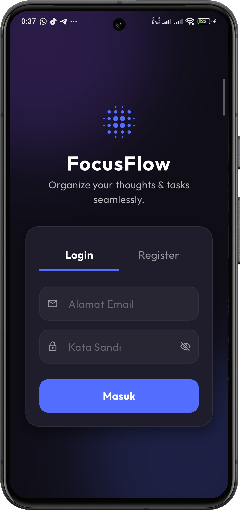
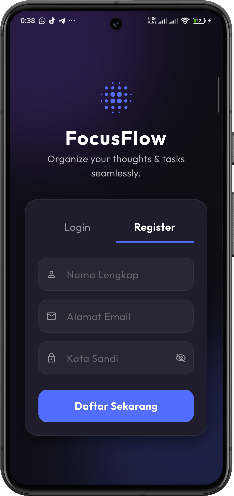
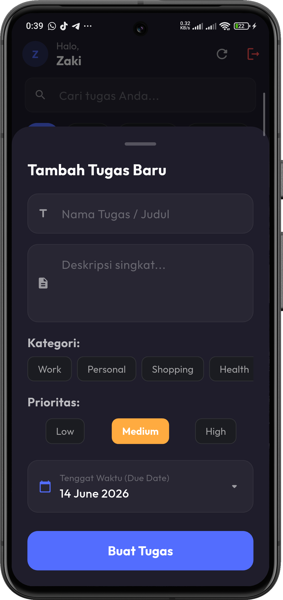
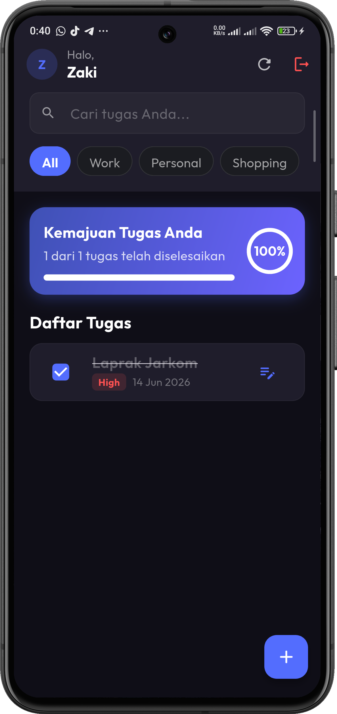
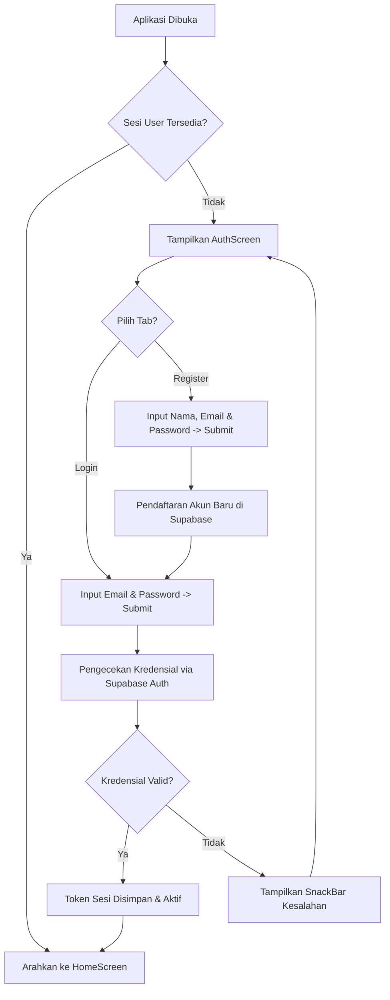

<div align="center">
  <br />
  <h1>LAPORAN PRAKTIKUM <br> APLIKASI BERBASIS PLATFORM </h1>
  <br />
  <h3>MODUL 7 <br> FLUTTER </h3>
  <br />
  
  <br />
  <br />
  <br />
  <h3>Disusun Oleh :</h3>
  <p>
    <strong>Muhammad Aulia Muzzaki Nugraha</strong>
    <br>
    <strong>2311102051</strong>
    <br>
    <strong>S1 IF-11-REG05</strong>
  </p>
  <br />
  <h3>Dosen Pengampu :</h3>
  <p>
    <strong>Dedi Agung Prabowo, S.Kom., M.Kom</strong>
  </p>
  <br />
  <br />
  <h4>Asisten Praktikum :</h4>
  <strong>Apri Pandu Wicaksono </strong>
  <br>
  <strong>Hamka Zaenul Ardi</strong>
  <br />
  <h3>LABORATORIUM HIGH PERFORMANCE <br>FAKULTAS INFORMATIKA <br>UNIVERSITAS TELKOM PURWOKERTO <br>2026 </h3>
</div>

<hr>

# Dasar Teori

## 1. Flutter dan Dart
Flutter adalah sebuah *software development kit* (SDK) sumber terbuka (*open-source*) yang dikembangkan oleh Google untuk membuat aplikasi lintas platform (Android, iOS, Web, Desktop) dari satu basis kode tunggal (*single codebase*). Flutter menggunakan bahasa pemrograman **Dart**, yang mendukung kompilasi *Just-in-Time* (JIT) untuk siklus pengembangan yang cepat melalui fitur *Hot Reload*, serta *Ahead-of-Time* (AOT) untuk performa eksekusi aplikasi yang cepat setara aplikasi native.

Arsitektur Flutter berfokus pada **Widget**. Di Flutter, hampir semua elemen antarmuka (UI) adalah widget, mulai dari tata letak (*layout*), dekorasi, teks, tombol, hingga halaman itu sendiri. Terdapat dua jenis utama widget dalam Flutter:
- **StatelessWidget**: Widget statis yang tidak dapat berubah setelah dibangun pertama kali.
- **StatefulWidget**: Widget dinamis yang dapat memperbarui tampilannya sendiri secara berkala ketika ada perubahan status (*state*).

## 2. Pengambilan Data (Data Fetching) & Realtime Stream
Dalam aplikasi modern, interaksi dengan server/database memerlukan transfer data melalui protokol HTTP. Metode umum termasuk mengirimkan permintaan (*request*) berupa `GET`, `POST`, `PUT`, atau `DELETE` dan menerima balasan (*response*) dalam format JSON. 

Selain pendekatan pemanggilan satu kali berbasis Future, Supabase mendukung konsep **Realtime Stream**. Melalui protokol WebSocket, client dapat terus berlangganan (*subscribe*) pada perubahan data yang terjadi pada database PostgreSQL secara langsung. Saat baris data pada tabel ditambahkan, diperbarui, atau dihapus, server akan segera menyiarkan perubahan tersebut ke aplikasi sehingga antarmuka pengguna dapat diperbarui seketika menggunakan `StreamBuilder`.

## 3. Otentikasi Pengguna (Authentication)
Otentikasi adalah proses pembuktian identitas pengguna yang mencoba masuk ke sistem. Di Supabase Auth, otentikasi didukung penuh menggunakan email dan kata sandi, OAuth (Google, GitHub, dll.), serta login tanpa sandi (*Magic Link*). Supabase mengelola otentikasi menggunakan token keamanan JWT (*JSON Web Tokens*). Sesi otentikasi dipantau menggunakan *Auth State Stream* (`onAuthStateChange`), yang memicu perubahan UI secara dinamis berdasarkan apakah sesi aktif tersedia atau kosong.

## 4. Operasi CRUD (Create, Read, Update, Delete) Online
CRUD adalah empat fungsi dasar penyimpanan persisten:
- **Create**: Menambahkan baris data baru ke tabel database.
- **Read**: Mengambil data dari tabel untuk ditampilkan pada aplikasi.
- **Update**: Memodifikasi data yang sudah ada di tabel berdasarkan kondisi kunci utama (*primary key*).
- **Delete**: Menghapus data dari tabel.

Menyinkronkan CRUD secara online memastikan data tidak hilang saat aplikasi ditutup atau perangkat berganti, serta memungkinkan kolaborasi multi-pengguna karena seluruh data tersimpan dengan aman pada server cloud PostgreSQL.

## 5. Notifikasi Lokal (Local Notifications)
Notifikasi adalah cara efektif untuk menarik perhatian pengguna dan memberikan konfirmasi keberhasilan sistem. **Local Notifications** dikirimkan secara langsung dari aplikasi lokal pada sistem operasi perangkat (Android/iOS) tanpa memerlukan server push eksternal (seperti Firebase Cloud Messaging). Package `flutter_local_notifications` digunakan untuk mengontrol bagaimana, kapan, dan di channel apa notifikasi sistem operasi tersebut akan ditampilkan kepada pengguna.

---

# Penjelasan Aplikasi & Source Code Utama

**FocusFlow** adalah aplikasi manajemen tugas pribadi berbasis *Dark Mode* premium dengan skema warna indigo-ungu. Aplikasi ini mengintegrasikan Supabase Auth untuk autentikasi, Supabase Database untuk penyimpanan tugas online, dan `flutter_local_notifications` untuk notifikasi CRUD.

Berikut penjelasan komponen dan potongan kode (*source code*) penting penunjang penjelasan:

### 1. Inisialisasi Layanan (`lib/main.dart`)
Berkas ini menginisialisasi koneksi dengan Supabase menggunakan URL dan Anon Key, mengaktifkan `NotificationService` lokal, serta memantau status sesi masuk pengguna menggunakan `StreamBuilder` (`AuthGateway`). Jika sesi aktif (`session != null`), pengguna dialihkan ke halaman dashboard utama. Jika tidak, pengguna akan diarahkan ke halaman login.

```dart
// Gateway Otentikasi Dinamis
class AuthGateway extends StatelessWidget {
  const AuthGateway({super.key});

  @override
  Widget build(BuildContext context) {
    return StreamBuilder<AuthState>(
      stream: Supabase.instance.client.auth.onAuthStateChange,
      builder: (context, snapshot) {
        if (snapshot.connectionState == ConnectionState.waiting) {
          return const Scaffold(
            body: Center(
              child: CircularProgressIndicator(color: Colors.indigoAccent),
            ),
          );
        }

        final session = Supabase.instance.client.auth.currentSession;
        if (session != null) {
          return const HomeScreen(); // Masuk ke Dashboard Utama
        } else {
          return const AuthScreen(); // Tampilkan Layar Login/Register
        }
      },
    );
  }
}
```

### 2. Otentikasi Pengguna (`lib/services/auth_service.dart`)
Metode otentikasi membungkus panggilan API Supabase Auth untuk masuk (`signInWithPassword`), mendaftar (`signUp`), dan keluar (`signOut`).

```dart
class AuthService {
  final SupabaseClient _client = Supabase.instance.client;

  // Sign In menggunakan Email dan Password
  Future<AuthResponse> signIn({
    required String email,
    required String password,
  }) async {
    try {
      final response = await _client.auth.signInWithPassword(
        email: email,
        password: password,
      );
      return response;
    } catch (e) {
      rethrow;
    }
  }

  // Sign Up / Registrasi User Baru
  Future<AuthResponse> signUp({
    required String email,
    required String password,
    required String fullName,
  }) async {
    try {
      final response = await _client.auth.signUp(
        email: email,
        password: password,
        data: {'full_name': fullName},
      );
      return response;
    } catch (e) {
      rethrow;
    }
  }
}
```

### 3. Operasi CRUD Database (`lib/services/database_service.dart`)
Mengimplementasikan fungsi CRUD ke database online. Berkas ini menggunakan Stream (`getTasksStream`) untuk menampilkan data secara *real-time* ke antarmuka aplikasi. Jika terdapat masalah sinkronisasi *real-time*, aplikasi menyediakan metode *fallback* menggunakan Future biasa (`getTasks`).

```dart
class DatabaseService {
  final SupabaseClient _client = Supabase.instance.client;

  // READ (Realtime Stream): Berlangganan data tugas miliki User tertentu
  Stream<List<Task>> getTasksStream(String userId) {
    return _client
        .from('tasks')
        .stream(primaryKey: ['id'])
        .eq('user_id', userId)
        .order('due_date', ascending: true)
        .map((listOfMaps) =>
            listOfMaps.map((map) => Task.fromJson(map)).toList());
  }

  // CREATE: Menambahkan tugas baru
  Future<Task> createTask(Task task) async {
    try {
      final response = await _client
          .from('tasks')
          .insert(task.toJson())
          .select()
          .single();
      return Task.fromJson(response);
    } catch (e) {
      rethrow;
    }
  }

  // UPDATE: Memperbarui isi tugas atau status penyelesaian
  Future<Task> updateTask(Task task) async {
    try {
      final response = await _client
          .from('tasks')
          .update(task.toJson())
          .eq('id', task.id!)
          .select()
          .single();
      return Task.fromJson(response);
    } catch (e) {
      rethrow;
    }
  }

  // DELETE: Menghapus data tugas
  Future<void> deleteTask(String taskId) async {
    try {
      await _client.from('tasks').delete().eq('id', taskId);
    } catch (e) {
      rethrow;
    }
  }
}
```

### 4. Pemicu Notifikasi Lokal (`lib/services/notification_service.dart`)
Modul notifikasi lokal mengelola kanal (*channel*) notifikasi Android dan iOS. Saat dipicu, notifikasi sistem operasi akan muncul seketika menggunakan parameter yang disesuaikan.

```dart
class NotificationService {
  final FlutterLocalNotificationsPlugin _notificationsPlugin =
      FlutterLocalNotificationsPlugin();

  // Memunculkan Notifikasi Lokal Sistem
  Future<void> showNotification({
    required int id,
    required String title,
    required String body,
  }) async {
    const AndroidNotificationDetails androidDetails = AndroidNotificationDetails(
      'focusflow_crud_channel',
      'FocusFlow CRUD Operations',
      channelDescription: 'Notifications for CRUD operations in FocusFlow.',
      importance: Importance.max,
      priority: Priority.high,
      ticker: 'ticker',
      playSound: true,
      enableVibration: true,
    );

    const NotificationDetails platformDetails = NotificationDetails(
      android: androidDetails,
      iOS: DarwinNotificationDetails(presentAlert: true, presentSound: true),
    );

    await _notificationsPlugin.show(
      id: id,
      title: title,
      body: body,
      notificationDetails: platformDetails,
    );
  }
}
```

---

# Output & Hasil Uji Coba Aplikasi

Berikut adalah dokumentasi tangkapan layar hasil uji coba aplikasi FocusFlow yang disimpan dalam direktori `assets/`:

### 1. Halaman Autentikasi (Login & Registrasi)
Tampilan antarmuka masuk dan pendaftaran pengguna yang didesain secara estetis menggunakan konsep *glow glassmorphism card* dengan validasi input yang lengkap (misal, minimal panjang kata sandi dan pola email).

<div align="center">
  
  <p><em>Gambar 1: Halaman Form Login & Register FocusFlow</em></p>
</div>

### 2. Dashboard Utama (Home Screen)
Menampilkan kemajuan tugas pengguna secara persentase, statistik grafis jumlah penyelesaian tugas, kolom pencarian interaktif, tab kategori filter tugas, dan daftar tugas terintegrasi.

<div align="center">
  
  <p><em>Gambar 2: Dashboard Utama dan Daftar Tugas Aktif</em></p>
</div>

### 3. Bottom Sheet Modal (Tambah & Edit Tugas) dan Notifikasi
Tampilan modal input yang muncul dari bawah layar untuk menyematkan judul tugas, prioritas (High, Medium, Low), kategori, dan due-date picker. Gambar juga memperlihatkan visual notifikasi sistem lokal yang muncul di bilah notifikasi atas saat data CRUD diperbarui.

<div align="center">
  
  <p><em>Gambar 3: Lembar Input Modal Tugas dan Tampilan Notifikasi CRUD</em></p>
</div>

### 4. Integrasi Backend (Supabase Dashboard)
Pembuktian integrasi online di mana data pengguna yang terdaftar dan tugas-tugas yang telah diinput di dalam aplikasi secara otomatis masuk dan tersinkronisasi di dalam tabel PostgreSQL Supabase secara realtime.

<div align="center">
  
  <p><em>Gambar 4: Dashboard Database Supabase Console (Real-time synchronization)</em></p>
</div>

---

# Flow & Fungsi Fitur Aplikasi

Layanan FocusFlow beroperasi berdasarkan koordinasi alur kerja terstruktur antara antarmuka pengguna (UI), sistem manajemen status sesi, operasi cloud database, dan manajer notifikasi lokal perangkat. Berikut adalah penjelasannya:

## 1. Alur Kerja Aplikasi (Application Flow)

### A. Alur Autentikasi Pengguna


1. **Inisialisasi Pertama:** Ketika aplikasi dinyalakan, `lib/main.dart` akan memanggil inisialisasi client Supabase dengan URL dan Anon API Key.
2. **Gerbang Sesi (`AuthGateway`):** Stream `onAuthStateChange` dari Supabase mendengarkan perubahan status otentikasi. Jika terdeteksi token sesi yang valid (user sudah login sebelumnya), UI secara otomatis berganti dari `AuthScreen` ke `HomeScreen` tanpa perlu login ulang.
3. **Pendaftaran Akun Baru:** Pada tab *Register*, setelah input divalidasi, sistem memanggil `AuthService.signUp()` untuk menyimpan identitas nama lengkap di dalam `user_metadata` Supabase Auth.
4. **Proses Masuk:** Pada tab *Login*, sistem memanggil `AuthService.signIn()`. Jika berhasil, Supabase akan mengembalikan data sesi pengguna dan gateway secara dinamis merender layar dashboard utama.

### B. Alur CRUD Online Realtime & Fallback
1. **Pemuatan Daftar Tugas (Read):** Setelah memasuki `HomeScreen`, widget `StreamBuilder` langsung berlangganan data ke Supabase menggunakan stream `getTasksStream(userId)`. Supabase mengirimkan data daftar tugas pengguna saat ini secara *real-time* via WebSocket.
2. **Penanganan Masalah Sinkronisasi (Fallback):** Jika terjadi hambatan jaringan atau replikasi realtime belum diaktifkan di panel Supabase, sistem secara otomatis beralih menggunakan Future `getTasks(userId)`. Pengguna juga dibekali gestur *Swipe to Refresh* atau menekan tombol segarkan untuk memicu penarikan data secara manual dari database online.
3. **Pembuatan Tugas Baru (Create):**
   * Pengguna menekan tombol Floating Action Button (FAB).
   * Bottom Sheet `TaskModal` muncul untuk mengisi detail tugas.
   * Setelah menekan tombol "Buat Tugas", model data `Task` dibentuk dan dikirim ke cloud via `DatabaseService.createTask()`.
   * Bersamaan dengan masuknya data ke tabel database online, `NotificationService` memicu notifikasi sistem lokal Android/iOS: *"Tugas Dibuat! 📝"*.
4. **Pembaruan Tugas (Update):**
   * **Mengubah Detail:** Mengklik tombol edit pada kartu tugas akan memanggil Bottom Sheet `TaskModal` yang secara otomatis terisi dengan data tugas lama. Setelah disunting, data disimpan menggunakan `DatabaseService.updateTask()`, memicu notifikasi lokal: *"Tugas Diperbarui! 🔄"*.
   * **Mengubah Status Selesai:** Mengklik kotak centang (*Checkbox*) pada daftar tugas akan membalik status boolean `is_completed`. Data di cloud segera diperbarui, memicu perubahan status grafik kemajuan tugas dan membunyikan notifikasi lokal: *"Tugas Selesai! 🎉"* (atau notifikasi tugas kembali aktif).
5. **Penghapusan Tugas (Delete):** Pengguna menggeser kartu tugas ke arah kiri (*Swipe to Dismiss*) atau menekan tombol hapus. Sistem segera memanggil `DatabaseService.deleteTask()`, menghapus baris data di cloud secara permanen, memperbarui UI secara otomatis, dan membunyikan notifikasi lokal: *"Tugas Dihapus 🗑️"*.

---

## 2. Rincian Fungsi Fitur Aplikasi

| Nama Fitur | Lokasi Berkas | Deskripsi & Fungsi Teknis |
| :--- | :--- | :--- |
| **Glow Glassmorphism Auth** | `lib/screens/auth_screen.dart` | Menyediakan UI Login & Register dengan efek gradien menyala di latar belakang, form input dinamis, fungsi sembunyikan/tampilkan kata sandi, serta validasi ketat format email dan karakter sandi. |
| **Gateway Otentikasi** | `lib/main.dart` | Mengatur rute perpindahan halaman secara dinamis dan aman berdasarkan status keaktifan sesi akun pengguna di Supabase tanpa intervensi manual. |
| **Progress Dashboard** | `lib/screens/home_screen.dart` | Kartu visual di bagian atas dashboard yang menghitung jumlah tugas selesai dibanding total tugas dan menampilkan persentase kemajuan menggunakan indikator linier serta lingkaran animasi. |
| **Pencarian Dinamis** | `lib/screens/home_screen.dart` | Filter pencarian langsung di mana input teks secara sensitif menyaring kartu tugas berdasarkan kecocokan judul atau deskripsi secara *real-time*. |
| **Filter Kategori Cepat** | `lib/screens/home_screen.dart` | Tab horizontal menggunakan *ChoiceChips* untuk menyaring tugas secara instan berdasarkan kategori (Work, Personal, Shopping, Health, General). |
| **Swipe to Dismiss** | `lib/screens/home_screen.dart` | Animasi geser kartu tugas ke kiri (*Dismissible widget*) untuk menghapus data tugas secara cepat langsung dari daftar, meminimalkan langkah navigasi pengguna. |
| **Tenggat Tanggal (Due Date)** | `lib/widgets/task_modal.dart` | Terintegrasi dengan *native DatePicker* sistem operasi agar pengguna dapat memilih batas waktu pengerjaan tugas secara teratur dan presisi. |
| **Chips Prioritas Berwarna** | `lib/widgets/task_modal.dart` | Pilihan tingkatan prioritas tugas (High, Medium, Low) dengan indikator warna khusus (merah, oranye, hijau) untuk memudahkan visualisasi tingkat urgensi pengerjaan. |
| **Notifikasi CRUD Terintegrasi** | `lib/services/notification_service.dart` | Menghubungkan fungsi CRUD database dengan API sistem operasi lokal ponsel sehingga setiap kali ada penambahan atau penghapusan data online, pengguna menerima umpan balik notifikasi bersuara/getar pada bilah notifikasi atas. |


