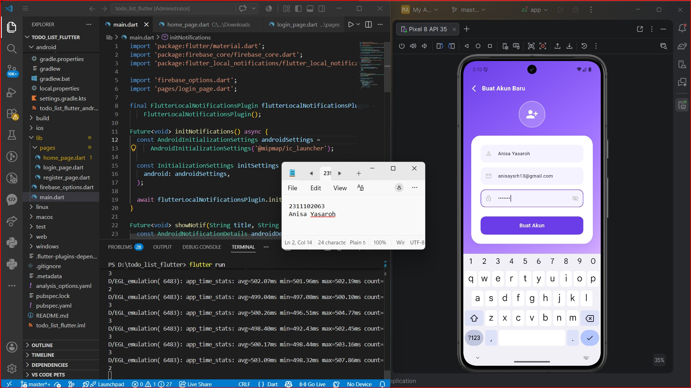
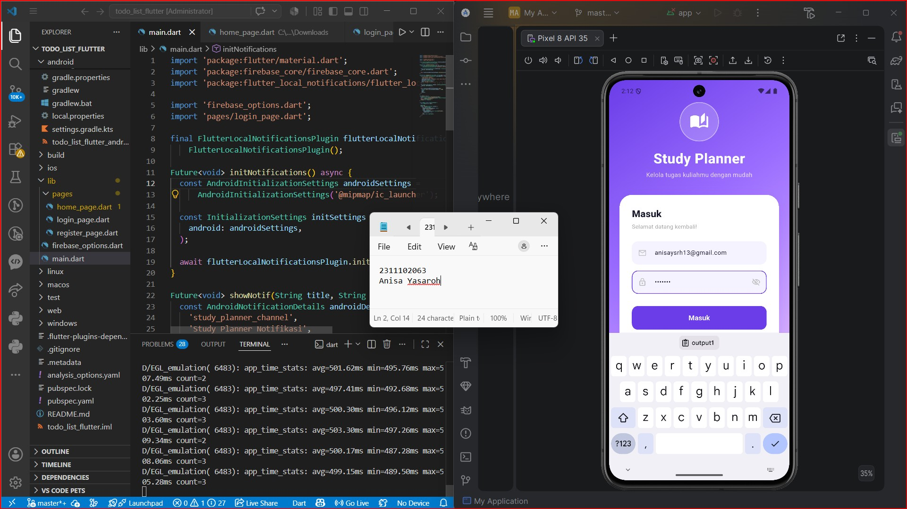
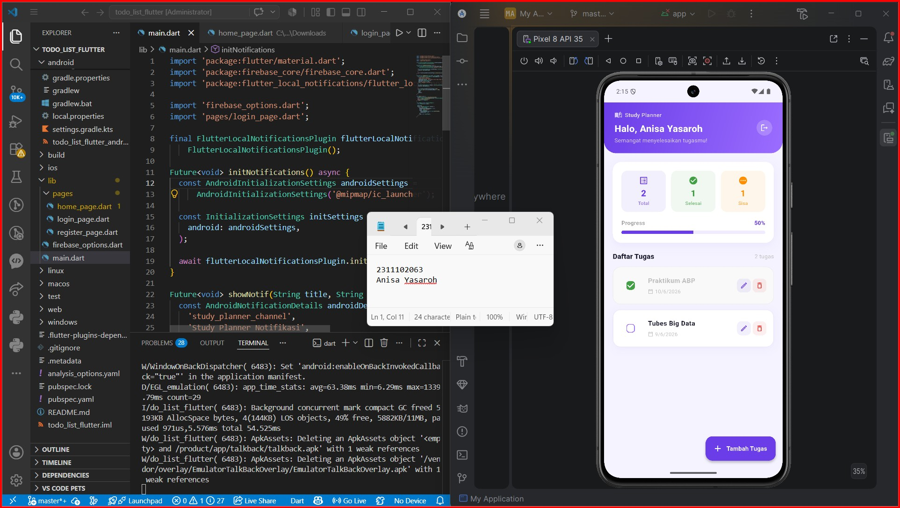
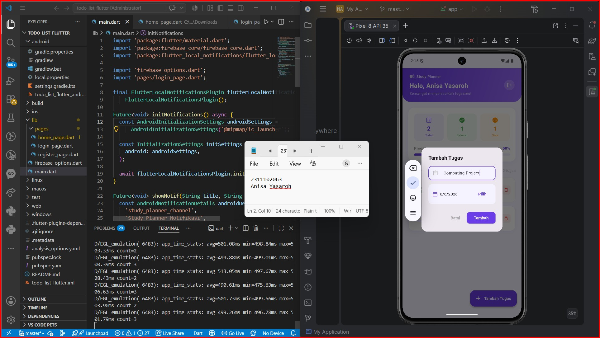
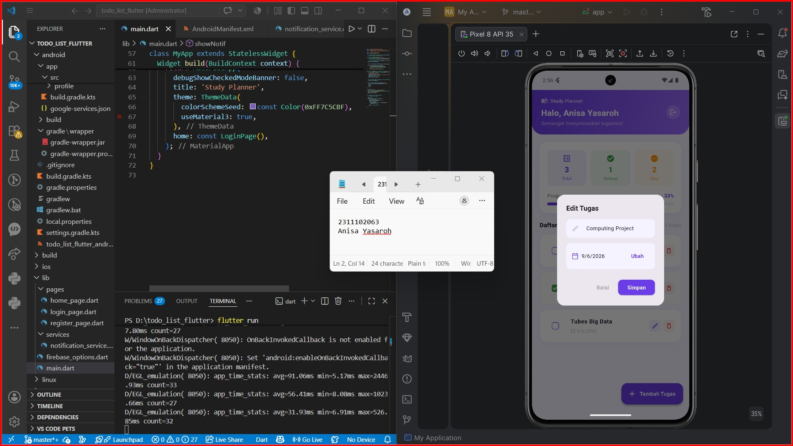
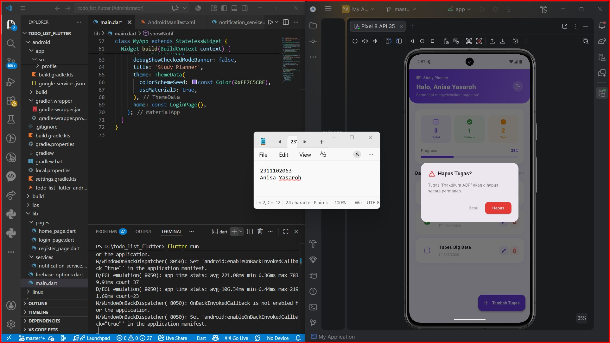
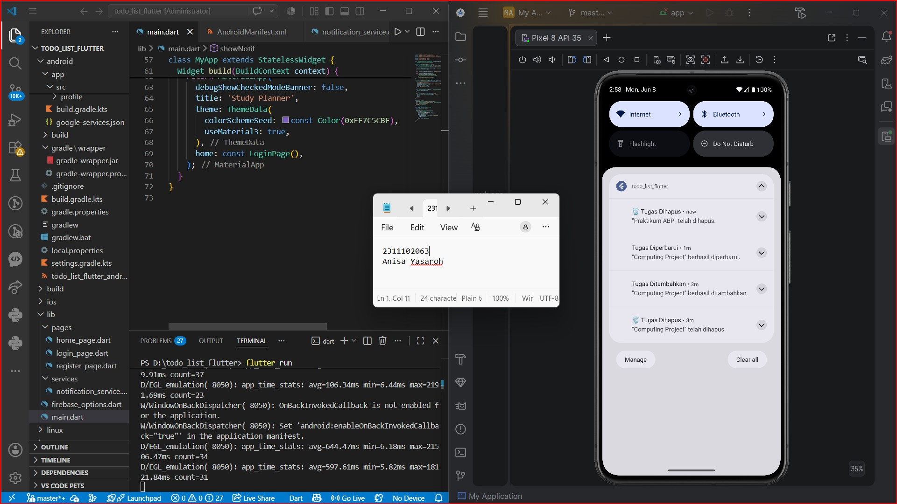
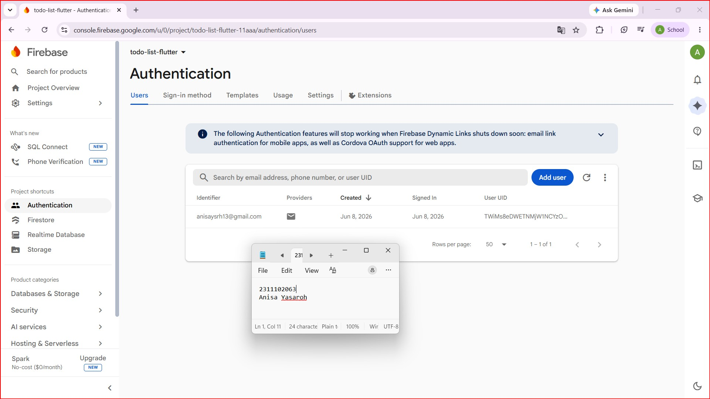
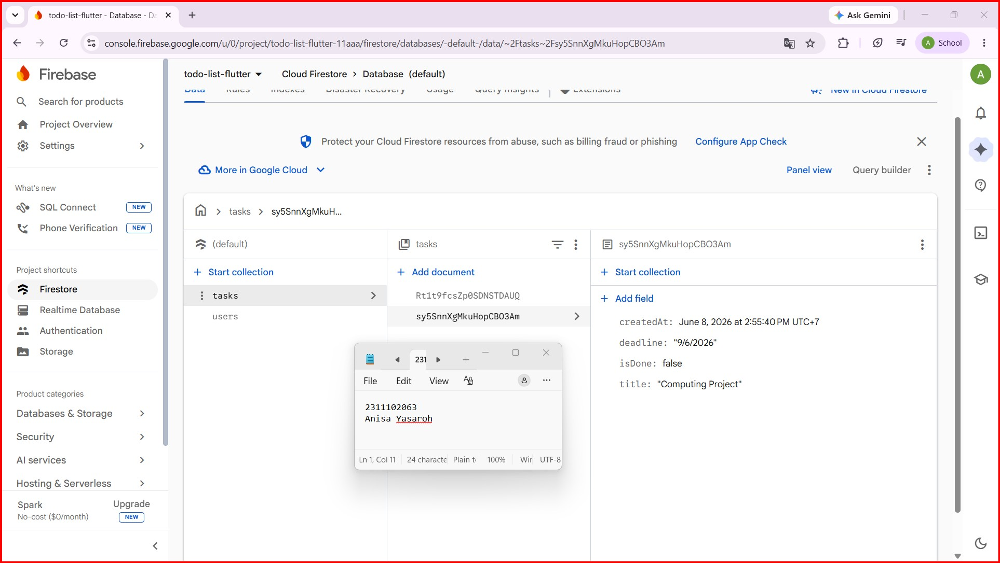

<div align="center">
  <br />
  <h1>LAPORAN PRAKTIKUM <br> APLIKASI BERBASIS PLATFORM </h1>
  <br />
  <h3>MODUL 7 <br> INTEGRASI FLUTTER FIREBASE/SUPABASE </h3>
  <br />
  
  <br />
  <br />
  <br />
  <h3>Disusun Oleh :</h3>
  <p>
    <strong>Anisa Yasaroh</strong>
    <br>
    <strong>2311102063</strong>
    <br>
    <strong>S1 IF-11-REG05</strong>
  </p>
  <br />
  <h3>Dosen Pengampu :</h3>
  <p>
    <strong>Dedi Agung Prabowo, S.Kom., M.Kom</strong>
  </p>
  <br />
  <br />
  <h4>Asisten Praktikum :</h4>
  <strong>Apri Pandu Wicaksono </strong>
  <br>
  <strong>Hamka Zaenul Ardi</strong>
  <br />
  <h3>LABORATORIUM HIGH PERFORMANCE <br>FAKULTAS INFORMATIKA <br>UNIVERSITAS TELKOM PURWOKERTO <br>2026 </h3>
</div>

<hr>

## Dasar Teori

Flutter merupakan framework open-source yang dikembangkan oleh Google untuk membangun aplikasi lintas platform menggunakan satu basis kode (single codebase). Dengan Flutter, pengembang dapat membuat aplikasi Android, iOS, web, maupun desktop tanpa harus menulis kode yang berbeda untuk setiap platform. Flutter menggunakan bahasa pemrograman Dart yang dirancang untuk mendukung pengembangan aplikasi modern dengan performa tinggi. Salah satu keunggulan Flutter adalah penggunaan widget sebagai komponen utama dalam membangun antarmuka pengguna. Seluruh elemen tampilan, seperti teks, tombol, gambar, form, dan layout, direpresentasikan dalam bentuk widget sehingga proses pengembangan aplikasi menjadi lebih terstruktur, fleksibel, dan mudah untuk dikembangkan.

Dalam Flutter terdapat dua jenis widget utama, yaitu StatelessWidget dan StatefulWidget. StatelessWidget digunakan untuk menampilkan data yang bersifat tetap dan tidak berubah selama aplikasi berjalan, sedangkan StatefulWidget digunakan untuk menampilkan data yang dapat berubah akibat interaksi pengguna maupun proses tertentu. Pada aplikasi To-Do List, StatefulWidget digunakan untuk mengelola dan menampilkan daftar tugas secara dinamis sehingga perubahan data dapat langsung ditampilkan pada antarmuka aplikasi.

Firebase merupakan platform Backend as a Service (BaaS) yang disediakan oleh Google untuk membantu pengembang dalam membangun dan mengelola aplikasi tanpa harus membuat server sendiri. Firebase menyediakan berbagai layanan seperti Authentication, Cloud Firestore, Realtime Database, Cloud Storage, Cloud Messaging, dan Analytics. Dengan memanfaatkan Firebase, pengembang dapat fokus pada pengembangan fitur aplikasi tanpa perlu menangani kompleksitas pengelolaan server dan database secara manual. Integrasi Firebase dengan Flutter juga didukung secara resmi sehingga memudahkan proses pengembangan aplikasi mobile modern.

Salah satu layanan Firebase yang digunakan dalam praktikum ini adalah Firebase Authentication. Firebase Authentication merupakan layanan yang digunakan untuk mengelola proses autentikasi pengguna secara aman. Layanan ini mendukung berbagai metode autentikasi, seperti Email dan Password, Google Sign-In, Facebook Login, GitHub Login, serta berbagai metode autentikasi lainnya. Pada aplikasi To-Do List, autentikasi dilakukan menggunakan Email dan Password sehingga pengguna dapat melakukan registrasi akun, login ke dalam aplikasi, dan logout dari sistem. Penggunaan Firebase Authentication membantu meningkatkan keamanan data pengguna karena proses autentikasi dikelola langsung oleh Firebase.

Selain Authentication, aplikasi ini juga menggunakan Cloud Firestore sebagai media penyimpanan data. Cloud Firestore merupakan database NoSQL berbasis cloud yang menyimpan data dalam bentuk collection dan document. Berbeda dengan database relasional yang menggunakan tabel, Firestore menggunakan struktur dokumen yang lebih fleksibel sehingga cocok digunakan pada aplikasi modern. Cloud Firestore mendukung sinkronisasi data secara real-time, sehingga setiap perubahan data yang dilakukan pengguna dapat langsung ditampilkan pada aplikasi tanpa perlu melakukan refresh secara manual. Dalam aplikasi To-Do List, Firestore digunakan untuk menyimpan informasi pengguna dan data tugas yang terdiri dari nama tugas, deadline, status tugas, serta waktu pembuatan tugas.

Konsep utama yang diterapkan pada aplikasi ini adalah CRUD (Create, Read, Update, Delete). CRUD merupakan operasi dasar yang digunakan dalam pengelolaan data pada hampir seluruh aplikasi berbasis database. Operasi Create digunakan untuk menambahkan data baru ke dalam database, Read digunakan untuk membaca atau menampilkan data yang tersimpan, Update digunakan untuk memperbarui data yang sudah ada, dan Delete digunakan untuk menghapus data yang tidak diperlukan lagi. Pada aplikasi To-Do List, fitur Create digunakan untuk menambahkan tugas baru, Read digunakan untuk menampilkan daftar tugas yang tersimpan pada Firestore, Update digunakan untuk mengubah nama maupun deadline tugas, sedangkan Delete digunakan untuk menghapus tugas yang sudah tidak diperlukan.

Untuk meningkatkan pengalaman pengguna, aplikasi ini juga menerapkan fitur notifikasi lokal menggunakan package flutter_local_notifications. Notifikasi lokal merupakan notifikasi yang dibuat dan dijalankan langsung oleh aplikasi pada perangkat pengguna tanpa memerlukan server eksternal. Fitur ini dapat digunakan untuk memberikan informasi atau umpan balik terhadap aktivitas yang dilakukan pengguna. Dalam aplikasi To-Do List, notifikasi digunakan untuk memberikan informasi ketika pengguna berhasil melakukan registrasi akun, login, menambahkan tugas, mengubah tugas, menghapus tugas, maupun menyelesaikan tugas tertentu. Dengan adanya notifikasi, pengguna dapat memperoleh informasi secara langsung mengenai tindakan yang telah dilakukan pada aplikasi.

Dalam proses pengembangan aplikasi Flutter yang terintegrasi dengan Firebase diperlukan beberapa package pendukung. Package firebase_core digunakan untuk melakukan inisialisasi dan koneksi aplikasi dengan layanan Firebase. Package firebase_auth digunakan untuk mengelola proses autentikasi pengguna. Package cloud_firestore digunakan untuk melakukan operasi penyimpanan, pembacaan, pembaruan, dan penghapusan data pada database Firestore. Selain itu, package flutter_local_notifications digunakan untuk menampilkan notifikasi lokal pada perangkat Android. Kombinasi berbagai package tersebut memungkinkan aplikasi To-Do List memiliki fitur autentikasi, penyimpanan data berbasis cloud, manajemen tugas, serta notifikasi yang berjalan secara terintegrasi.

Berdasarkan teknologi yang digunakan, aplikasi To-Do List pada praktikum ini merupakan implementasi pengembangan aplikasi mobile modern yang memanfaatkan Flutter sebagai framework utama dan Firebase sebagai backend. Integrasi antara Flutter dan Firebase memungkinkan aplikasi memiliki fitur autentikasi pengguna, pengelolaan data secara online, sinkronisasi data real-time, serta notifikasi lokal yang mendukung pengalaman pengguna dalam mengelola tugas sehari-hari secara lebih efektif dan efisien.


##  Tugas Modul 7 (To-Do List)
### Source code main.dart
```
import 'package:flutter/material.dart';
import 'package:firebase_core/firebase_core.dart';
import 'package:flutter_local_notifications/flutter_local_notifications.dart';

import 'firebase_options.dart';
import 'pages/login_page.dart';

final FlutterLocalNotificationsPlugin flutterLocalNotificationsPlugin =
    FlutterLocalNotificationsPlugin();

Future<void> initNotifications() async {
  const AndroidInitializationSettings androidSettings =
      AndroidInitializationSettings('@mipmap/ic_launcher');

  const InitializationSettings initSettings = InitializationSettings(
    android: androidSettings,
  );

  await flutterLocalNotificationsPlugin.initialize(initSettings);

  await flutterLocalNotificationsPlugin
      .resolvePlatformSpecificImplementation<
        AndroidFlutterLocalNotificationsPlugin
      >()
      ?.requestNotificationsPermission();
}

Future<void> showNotif(String title, String body) async {
  const AndroidNotificationDetails androidDetails = AndroidNotificationDetails(
    'study_planner_channel',
    'Study Planner Notifikasi',
    channelDescription: 'Notifikasi untuk tugas Study Planner',
    importance: Importance.high,
    priority: Priority.high,
    icon: '@mipmap/ic_launcher',
  );

  const NotificationDetails details = NotificationDetails(
    android: androidDetails,
  );

  await flutterLocalNotificationsPlugin.show(
    DateTime.now().millisecondsSinceEpoch ~/ 1000,
    title,
    body,
    details,
  );
}

void main() async {
  WidgetsFlutterBinding.ensureInitialized();
  await Firebase.initializeApp(options: DefaultFirebaseOptions.currentPlatform);
  await initNotifications();
  runApp(const MyApp());
}

class MyApp extends StatelessWidget {
  const MyApp({super.key});

  @override
  Widget build(BuildContext context) {
    return MaterialApp(
      debugShowCheckedModeBanner: false,
      title: 'Study Planner',
      theme: ThemeData(
        colorSchemeSeed: const Color(0xFF7C5CBF),
        useMaterial3: true,
      ),
      home: const LoginPage(),
    );
  }
}

```

### Source code login_page.dart
```
import 'package:flutter/material.dart';
import 'package:firebase_auth/firebase_auth.dart';
import 'register_page.dart';
import 'home_page.dart';
import '../main.dart';

class LoginPage extends StatefulWidget {
  const LoginPage({super.key});

  @override
  State<LoginPage> createState() => _LoginPageState();
}

class _LoginPageState extends State<LoginPage>
    with SingleTickerProviderStateMixin {
  final emailController = TextEditingController();
  final passwordController = TextEditingController();
  bool isLoading = false;
  bool isObscure = true;

  late AnimationController _animController;
  late Animation<double> _fadeIn;
  late Animation<Offset> _slideUp;

  @override
  void initState() {
    super.initState();
    _animController = AnimationController(
      vsync: this,
      duration: const Duration(milliseconds: 900),
    );
    _fadeIn = CurvedAnimation(parent: _animController, curve: Curves.easeOut);
    _slideUp = Tween<Offset>(begin: const Offset(0, 0.18), end: Offset.zero)
        .animate(
          CurvedAnimation(parent: _animController, curve: Curves.easeOutCubic),
        );
    _animController.forward();
  }

  @override
  void dispose() {
    _animController.dispose();
    emailController.dispose();
    passwordController.dispose();
    super.dispose();
  }
  }
```
Kode Lengkap: [login_page.dart](todo_list_flutter/lib/pages/login_page.dart)

### Source code register_page.dart
```
import 'package:cloud_firestore/cloud_firestore.dart';
import 'package:firebase_auth/firebase_auth.dart';
import 'package:flutter/material.dart';
import '../main.dart';

class RegisterPage extends StatefulWidget {
  const RegisterPage({super.key});

  @override
  State<RegisterPage> createState() => _RegisterPageState();
}

class _RegisterPageState extends State<RegisterPage>
    with SingleTickerProviderStateMixin {
  final nameController = TextEditingController();
  final emailController = TextEditingController();
  final passwordController = TextEditingController();
  bool isLoading = false;
  bool isObscure = true;

  late AnimationController _animController;
  late Animation<double> _fadeIn;
  late Animation<Offset> _slideUp;

  @override
  void initState() {
    super.initState();
    _animController = AnimationController(
      vsync: this,
      duration: const Duration(milliseconds: 800),
    );
    _fadeIn = CurvedAnimation(parent: _animController, curve: Curves.easeOut);
    _slideUp = Tween<Offset>(begin: const Offset(0, 0.15), end: Offset.zero)
        .animate(
          CurvedAnimation(parent: _animController, curve: Curves.easeOutCubic),
        );
    _animController.forward();
  }

  @override
  void dispose() {
    _animController.dispose();
    nameController.dispose();
    emailController.dispose();
    passwordController.dispose();
    super.dispose();
  }
  }
```
Kode Lengkap: [register_page.dart](todo_list_flutter/lib/pages/register_page.dart)

### Source code home_page.dart
```
import 'package:cloud_firestore/cloud_firestore.dart';
import 'package:firebase_auth/firebase_auth.dart';
import 'package:flutter/material.dart';
import '../main.dart';

class HomePage extends StatefulWidget {
  const HomePage({super.key});

  @override
  State<HomePage> createState() => _HomePageState();
}

class _HomePageState extends State<HomePage> {
  final CollectionReference tasks = FirebaseFirestore.instance.collection(
    'tasks',
  );
  final TextEditingController taskController = TextEditingController();

  String selectedDeadline = "-";
  String userName = "";

  @override
  void initState() {
    super.initState();
    _getUserName();
  }

  Future<void> _getUserName() async {
    final uid = FirebaseAuth.instance.currentUser!.uid;
    final doc = await FirebaseFirestore.instance
        .collection("users")
        .doc(uid)
        .get();
    if (doc.exists && mounted) {
      setState(() => userName = doc["name"]);
    }
  }

  Future<void> _addTask() async {
    if (taskController.text.trim().isEmpty) return;

    final title = taskController.text.trim();

    await tasks.add({
      'title': title,
      'deadline': selectedDeadline,
      'isDone': false,
      'createdAt': Timestamp.now(),
    });
  }
}
```
Kode Lengkap: [home_page.dart](todo_list_flutter/lib/pages/home_page.dart)

### Screenshot Output










### Penjelasan Code

Program yang dibuat merupakan aplikasi To-Do List berbasis Flutter dan Firebase yang menerapkan fitur Authentication, CRUD (Create, Read, Update, Delete), serta notifikasi lokal. Pada file `main.dart`, aplikasi diawali dengan proses inisialisasi Firebase menggunakan `Firebase.initializeApp()` agar aplikasi dapat terhubung dengan layanan Firebase. Selain itu, package `flutter_local_notifications` digunakan untuk mengaktifkan fitur notifikasi lokal yang akan menampilkan informasi kepada pengguna ketika melakukan aktivitas tertentu seperti login, registrasi, menambah tugas, mengubah tugas, maupun menghapus tugas. Setelah proses inisialisasi selesai, aplikasi akan menampilkan halaman `LoginPage` sebagai halaman awal yang digunakan untuk proses autentikasi pengguna.

Fitur autentikasi diimplementasikan menggunakan Firebase Authentication pada halaman login dan registrasi. Pengguna dapat membuat akun baru menggunakan email dan password, kemudian melakukan login untuk mengakses aplikasi. Data tambahan pengguna seperti nama disimpan pada collection `users` di Cloud Firestore. Pada halaman utama (`HomePage`), aplikasi menampilkan nama pengguna yang sedang login serta daftar tugas yang tersimpan pada collection `tasks`. Data tugas dikelola menggunakan konsep CRUD, yaitu menambahkan tugas baru lengkap dengan deadline, menampilkan daftar tugas secara real-time menggunakan `StreamBuilder`, mengubah informasi tugas melalui fitur edit, serta menghapus tugas yang tidak diperlukan. Selain itu, pengguna dapat menandai tugas yang telah selesai melalui checkbox sehingga aplikasi dapat membantu pengguna dalam mengelola dan memantau tugas secara lebih efektif.