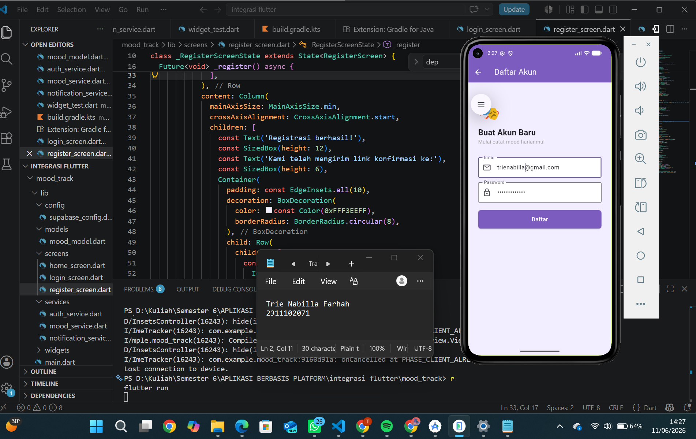
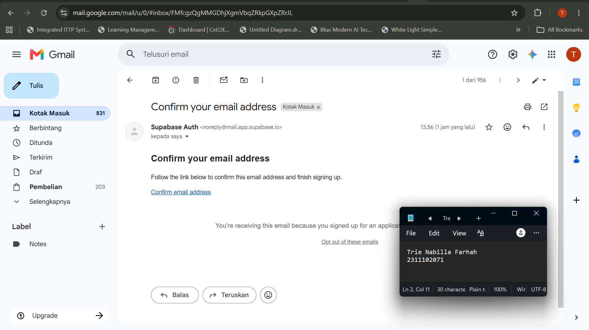
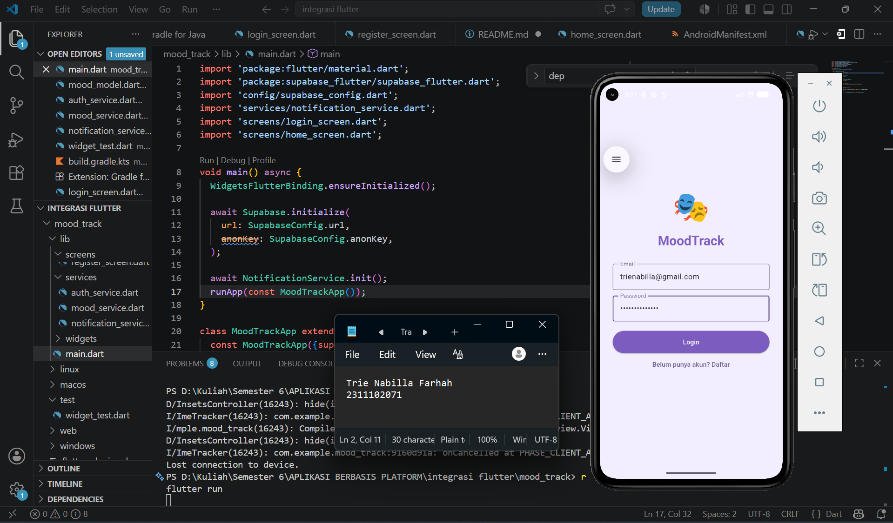
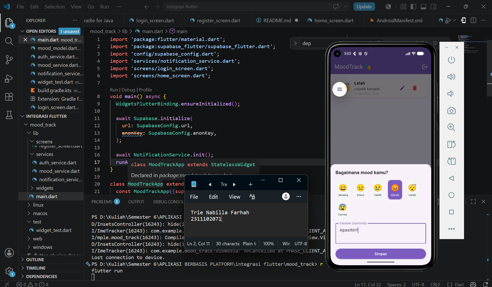
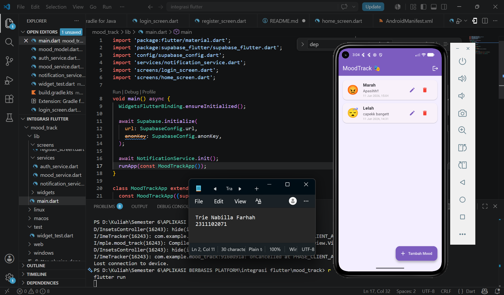
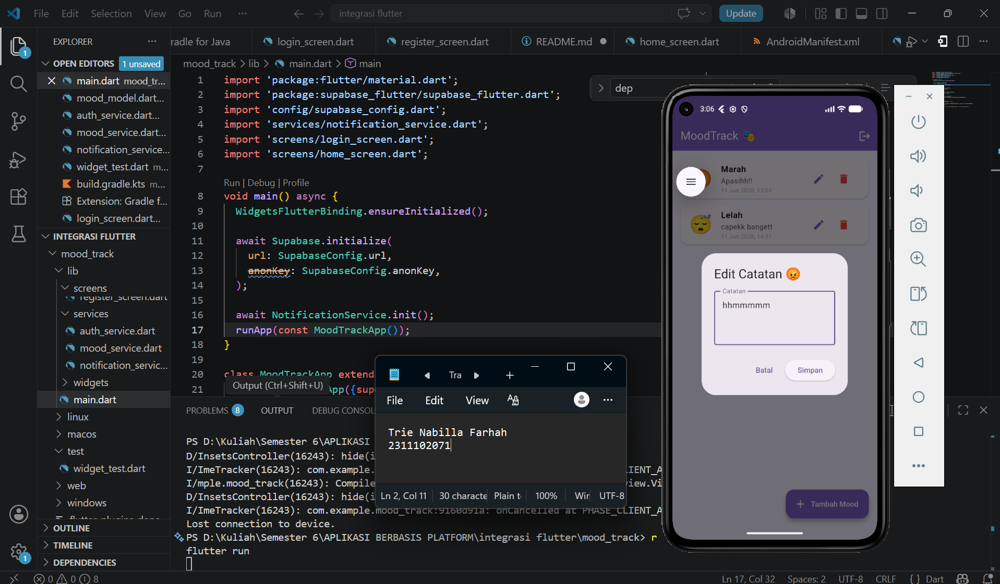
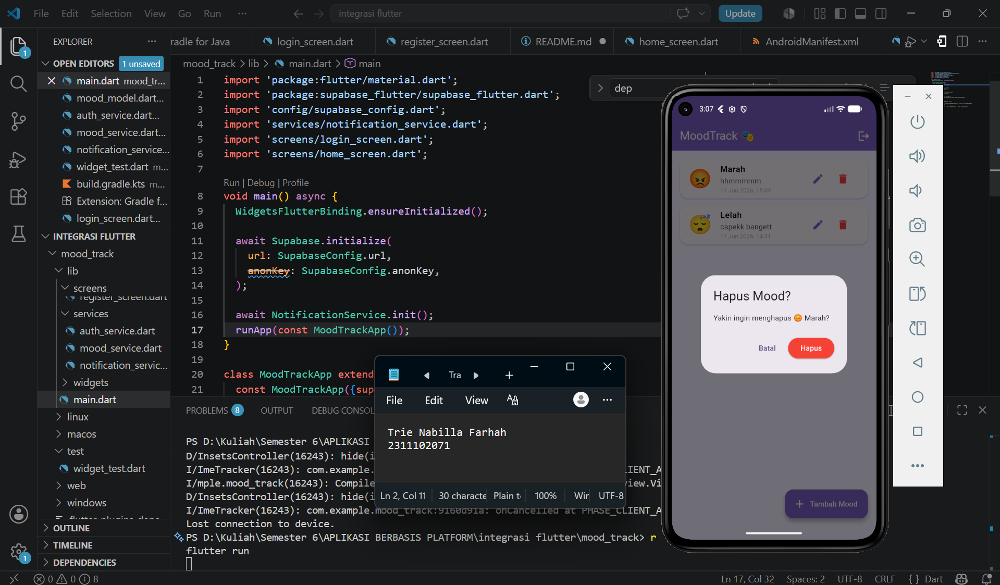
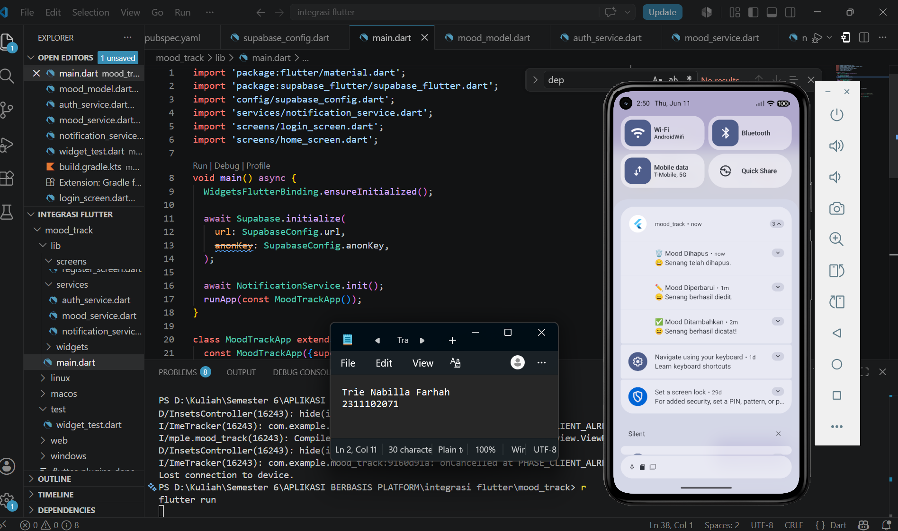
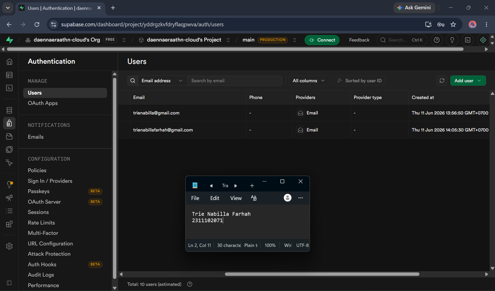

<<<<<<< HEAD
<div align="center">
  <br />
  <h1>LAPORAN PRAKTIKUM <br> APLIKASI BERBASIS PLATFORM </h1>
  <br />
  <h3>MODUL 7 <br> INTEGRASI FLUTTER FIREBASE/SUPABASE </h3>
  <br />
  
  <br />
  <br />
  <br />
  <h3>Disusun Oleh :</h3>
  <p>
    <strong>Trie Nabilla Farhah</strong>
    <br>
    <strong>2311102071</strong>
    <br>
    <strong>S1 IF-11-REG05</strong>
  </p>
  <br />
  <h3>Dosen Pengampu :</h3>
  <p>
    <strong>Dedi Agung Prabowo, S.Kom., M.Kom</strong>
  </p>
  <br />
  <br />
  <h4>Asisten Praktikum :</h4>
  <strong>Apri Pandu Wicaksono </strong>
  <br>
  <strong>Hamka Zaenul Ardi</strong>
  <br />
  <h3>LABORATORIUM HIGH PERFORMANCE <br>FAKULTAS INFORMATIKA <br>UNIVERSITAS TELKOM PURWOKERTO <br>2026 </h3>
</div>

<hr>

## Dasar Teori

### 1. Flutter

Flutter adalah framework open-source yang dikembangkan oleh Google untuk membangun aplikasi mobile, web, dan desktop dari satu basis kode (codebase). Flutter menggunakan bahasa pemrograman Dart dan mengandalkan widget sebagai komponen dasar antarmuka pengguna. Setiap elemen tampilan di Flutter, mulai dari teks, tombol, hingga layout, semuanya merupakan widget yang dapat dikombinasikan dan disusun secara hierarkis. Flutter menggunakan mesin rendering sendiri bernama Skia (atau Impeller pada versi terbaru) sehingga tampilan aplikasi konsisten di berbagai platform tanpa bergantung pada komponen antarmuka bawaan sistem operasi. Keunggulan utama Flutter adalah kemampuan Hot Reload yang memungkinkan developer melihat perubahan kode secara langsung tanpa harus menjalankan ulang aplikasi, sehingga mempercepat proses pengembangan.

### 2. Dart

Dart adalah bahasa pemrograman yang dikembangkan oleh Google dan digunakan sebagai bahasa utama dalam pengembangan aplikasi Flutter. Dart merupakan bahasa yang bersifat strongly typed, mendukung pemrograman berorientasi objek, serta memiliki fitur asynchronous programming melalui mekanisme async dan await. Fitur asynchronous ini sangat penting dalam pengembangan aplikasi mobile karena memungkinkan aplikasi tetap responsif saat menunggu proses yang membutuhkan waktu seperti pengambilan data dari server atau penyimpanan ke database.

### 3. Supabase

Supabase adalah platform Backend-as-a-Service (BaaS) open-source yang menyediakan berbagai layanan backend siap pakai, termasuk database PostgreSQL, autentikasi pengguna, penyimpanan file, dan realtime subscription. Supabase sering disebut sebagai alternatif open-source dari Firebase. Dalam pengembangan aplikasi mobile, Supabase memungkinkan developer untuk fokus pada pengembangan antarmuka tanpa perlu membangun infrastruktur backend dari awal. Supabase menyediakan Row Level Security (RLS) pada database PostgreSQL yang memungkinkan pengaturan hak akses data secara granular, sehingga setiap pengguna hanya dapat mengakses data miliknya sendiri.

### 4. Autentikasi

Autentikasi adalah proses verifikasi identitas pengguna sebelum diberikan akses ke dalam sistem. Dalam aplikasi MoodTrack, autentikasi diimplementasikan menggunakan Supabase Auth yang mendukung metode email dan password. Proses autentikasi mencakup dua alur utama yaitu registrasi untuk membuat akun baru dan login untuk masuk ke akun yang sudah ada. Supabase Auth mengelola token sesi secara otomatis sehingga pengguna tidak perlu login ulang setiap kali membuka aplikasi selama sesi masih aktif.

### 5. CRUD

CRUD merupakan singkatan dari Create, Read, Update, dan Delete, yang merupakan empat operasi dasar dalam pengelolaan data pada sebuah sistem. Create adalah operasi untuk menambahkan data baru ke dalam database. Read adalah operasi untuk mengambil dan menampilkan data yang sudah tersimpan. Update adalah operasi untuk mengubah data yang sudah ada. Delete adalah operasi untuk menghapus data dari database. Dalam aplikasi MoodTrack, keempat operasi ini diimplementasikan pada pengelolaan entri mood, di mana pengguna dapat menambah entri mood baru, melihat daftar entri yang tersimpan, mengedit catatan pada entri tertentu, serta menghapus entri yang tidak diperlukan.

### 6. Local Notification

Local notification adalah notifikasi yang dibangkitkan langsung oleh aplikasi di perangkat pengguna tanpa memerlukan koneksi ke server eksternal. Berbeda dengan push notification yang dikirim dari server, local notification dikelola sepenuhnya oleh aplikasi itu sendiri. Dalam aplikasi MoodTrack, local notification diimplementasikan menggunakan package `flutter_local_notifications` untuk memberikan umpan balik kepada pengguna setiap kali operasi CRUD berhasil dilakukan, seperti saat mood berhasil ditambahkan, diperbarui, atau dihapus. Notifikasi ini muncul di notification panel perangkat sehingga pengguna mendapat konfirmasi bahwa aksinya telah berhasil diproses oleh sistem.


##  Tugas Modul 7 (Mood Track)
### Source code main.dart
```
import 'package:flutter/material.dart';
import 'package:supabase_flutter/supabase_flutter.dart';
import 'config/supabase_config.dart';
import 'services/notification_service.dart';
import 'screens/login_screen.dart';
import 'screens/home_screen.dart';

void main() async {
  WidgetsFlutterBinding.ensureInitialized();

  await Supabase.initialize(
    url: SupabaseConfig.url,
    anonKey: SupabaseConfig.anonKey,
  );

  await NotificationService.init();
  runApp(const MoodTrackApp());
}

class MoodTrackApp extends StatelessWidget {
  const MoodTrackApp({super.key});

  @override
  Widget build(BuildContext context) {
    final session = Supabase.instance.client.auth.currentSession;

    return MaterialApp(
      title: 'MoodTrack',
      debugShowCheckedModeBanner: false,
      theme: ThemeData(
        colorScheme: ColorScheme.fromSeed(seedColor: const Color(0xFF7C5CBF)),
        useMaterial3: true,
      ),
      home: session != null ? const HomeScreen() : const LoginScreen(),
    );
  }
}

```

### Source code register_screen.dart
```
import 'package:flutter/material.dart';
import '../services/auth_service.dart';

class RegisterScreen extends StatefulWidget {
  const RegisterScreen({super.key});
  @override
  State<RegisterScreen> createState() => _RegisterScreenState();
}

class _RegisterScreenState extends State<RegisterScreen> {
  final _emailCtrl = TextEditingController();
  final _passCtrl = TextEditingController();
  final _auth = AuthService();
  bool _loading = false;

  Future<void> _register() async {
    setState(() => _loading = true);
    try {
      await _auth.register(_emailCtrl.text.trim(), _passCtrl.text.trim());
      if (mounted) {
        showDialog(
          context: context,
          barrierDismissible: false,
          builder: (ctx) => AlertDialog(
            shape: RoundedRectangleBorder(
              borderRadius: BorderRadius.circular(16),
            ),
            title: const Row(
              children: [
                Text('📧', style: TextStyle(fontSize: 28)),
                SizedBox(width: 8),
                Text('Cek Email Kamu'),
              ],
            ),
            content: Column(
              mainAxisSize: MainAxisSize.min,
              crossAxisAlignment: CrossAxisAlignment.start,
              children: [
                const Text('Registrasi berhasil!'),
                const SizedBox(height: 12),
                const Text('Kami telah mengirim link konfirmasi ke:'),
                const SizedBox(height: 6),
                Container(
                  padding: const EdgeInsets.all(10),
                  decoration: BoxDecoration(
                    color: const Color(0xFFF3EEFF),
                    borderRadius: BorderRadius.circular(8),
                  ),
                  child: Row(
                    children: [
                      const Icon(
                        Icons.email,
                        color: Color(0xFF7C5CBF),
                        size: 18,
                      ),
                      const SizedBox(width: 8),
                      Flexible(
                        child: Text(
                          _emailCtrl.text.trim(),
                          style: const TextStyle(
                            fontWeight: FontWeight.bold,
                            color: Color(0xFF7C5CBF),
                          ),
                        ),
                      ),
                    ],
                  ),
                ),
                const SizedBox(height: 12),
                const Text(
                  'Silakan buka Gmail dan klik link konfirmasi sebelum login. Cek folder Spam jika tidak ada di inbox.',
                  style: TextStyle(color: Colors.grey, fontSize: 13),
                ),
              ],
            ),
            actions: [
              ElevatedButton(
                style: ElevatedButton.styleFrom(
                  backgroundColor: const Color(0xFF7C5CBF),
                  foregroundColor: Colors.white,
                  shape: RoundedRectangleBorder(
                    borderRadius: BorderRadius.circular(8),
                  ),
                ),
                onPressed: () {
                  Navigator.pop(ctx);
                  Navigator.pop(context);
                },
                child: const Text('Oke, saya cek email'),
              ),
            ],
          ),
        );
      }
    } catch (e) {
      ScaffoldMessenger.of(
        context,
      ).showSnackBar(SnackBar(content: Text('Registrasi gagal: $e')));
    }
    setState(() => _loading = false);
  }

  @override
  Widget build(BuildContext context) {
    return Scaffold(
      appBar: AppBar(
        title: const Text('Daftar Akun'),
        backgroundColor: const Color(0xFF7C5CBF),
        foregroundColor: Colors.white,
      ),
      backgroundColor: const Color(0xFFF3EEFF),
      body: Padding(
        padding: const EdgeInsets.all(28),
        child: Column(
          crossAxisAlignment: CrossAxisAlignment.start,
          children: [
            const SizedBox(height: 16),
            const Text('🎭', style: TextStyle(fontSize: 48)),
            const SizedBox(height: 8),
            const Text(
              'Buat Akun Baru',
              style: TextStyle(fontSize: 22, fontWeight: FontWeight.bold),
            ),
            const Text(
              'Mulai catat mood harianmu!',
              style: TextStyle(color: Colors.grey),
            ),
            const SizedBox(height: 32),
            TextField(
              controller: _emailCtrl,
              keyboardType: TextInputType.emailAddress,
              decoration: const InputDecoration(
                labelText: 'Email',
                prefixIcon: Icon(Icons.email_outlined),
                border: OutlineInputBorder(),
                filled: true,
                fillColor: Colors.white,
              ),
            ),
            const SizedBox(height: 12),
            TextField(
              controller: _passCtrl,
              obscureText: true,
              decoration: const InputDecoration(
                labelText: 'Password',
                prefixIcon: Icon(Icons.lock_outlined),
                border: OutlineInputBorder(),
                filled: true,
                fillColor: Colors.white,
              ),
            ),
            const SizedBox(height: 20),
            SizedBox(
              width: double.infinity,
              child: ElevatedButton(
                onPressed: _loading ? null : _register,
                style: ElevatedButton.styleFrom(
                  backgroundColor: const Color(0xFF7C5CBF),
                  foregroundColor: Colors.white,
                  padding: const EdgeInsets.symmetric(vertical: 14),
                  shape: RoundedRectangleBorder(
                    borderRadius: BorderRadius.circular(8),
                  ),
                ),
                child: _loading
                    ? const CircularProgressIndicator(color: Colors.white)
                    : const Text('Daftar', style: TextStyle(fontSize: 16)),
              ),
            ),
          ],
        ),
      ),
    );
  }
}

```

### Source code home_screen.dart
```
import 'package:flutter/material.dart';
import 'package:intl/intl.dart';
import '../models/mood_model.dart';
import '../services/auth_service.dart';
import '../services/mood_service.dart';
import '../services/notification_service.dart';
import 'login_screen.dart';

class HomeScreen extends StatefulWidget {
  const HomeScreen({super.key});
  @override
  State<HomeScreen> createState() => _HomeScreenState();
}

class _HomeScreenState extends State<HomeScreen> {
  final _moodService = MoodService();
  final _authService = AuthService();
  List<MoodModel> _moods = [];
  bool _loading = true;

  final List<Map<String, String>> _moodOptions = [
    {'emoji': '😄', 'label': 'Senang'},
    {'emoji': '😐', 'label': 'Biasa'},
    {'emoji': '😢', 'label': 'Sedih'},
    {'emoji': '😡', 'label': 'Marah'},
    {'emoji': '😴', 'label': 'Lelah'},
    {'emoji': '😰', 'label': 'Cemas'},
  ];

  @override
  void initState() {
    super.initState();
    _loadMoods();
  }

  Future<void> _loadMoods() async {
    setState(() => _loading = true);
    final moods = await _moodService.getMoods();
    setState(() {
      _moods = moods;
      _loading = false;
    });
  }

  void _showAddMoodDialog() {
    String selectedEmoji = '😄';
    String selectedLabel = 'Senang';
    final noteCtrl = TextEditingController();

    showModalBottomSheet(
      context: context,
      isScrollControlled: true,
      shape: const RoundedRectangleBorder(
        borderRadius: BorderRadius.vertical(top: Radius.circular(20)),
      ),
      builder: (ctx) => StatefulBuilder(
        builder: (ctx, setModal) => Padding(
          padding: EdgeInsets.only(
            left: 20,
            right: 20,
            top: 20,
            bottom: MediaQuery.of(ctx).viewInsets.bottom + 20,
          ),
          child: Column(
            mainAxisSize: MainAxisSize.min,
            crossAxisAlignment: CrossAxisAlignment.start,
            children: [
              const Text(
                'Bagaimana mood kamu?',
                style: TextStyle(fontSize: 18, fontWeight: FontWeight.bold),
              ),
              const SizedBox(height: 16),
              Wrap(
                spacing: 12,
                children: _moodOptions.map((m) {
                  final selected = m['emoji'] == selectedEmoji;
                  return GestureDetector(
                    onTap: () => setModal(() {
                      selectedEmoji = m['emoji']!;
                      selectedLabel = m['label']!;
                    }),
                    child: Container(
                      padding: const EdgeInsets.all(10),
                      decoration: BoxDecoration(
                        color: selected
                            ? const Color(0xFF7C5CBF)
                            : Colors.grey.shade100,
                        borderRadius: BorderRadius.circular(12),
                      ),
                      child: Column(
                        children: [
                          Text(
                            m['emoji']!,
                            style: const TextStyle(fontSize: 28),
                          ),
                          Text(
                            m['label']!,
                            style: TextStyle(
                              color: selected ? Colors.white : Colors.black,
                              fontSize: 11,
                            ),
                          ),
                        ],
                      ),
                    ),
                  );
                }).toList(),
              ),
              const SizedBox(height: 16),
              TextField(
                controller: noteCtrl,
                decoration: const InputDecoration(
                  labelText: 'Catatan (opsional)',
                  border: OutlineInputBorder(),
                ),
                maxLines: 2,
              ),
              const SizedBox(height: 16),
              SizedBox(
                width: double.infinity,
                child: ElevatedButton(
                  onPressed: () async {
                    final mood = MoodModel(
                      id: '',
                      userId: _authService.currentUserId!,
                      moodEmoji: selectedEmoji,
                      moodLabel: selectedLabel,
                      note: noteCtrl.text.isEmpty ? null : noteCtrl.text,
                      createdAt: DateTime.now(),
                    );
                    await _moodService.addMood(mood);
                    await NotificationService.show(
                      '✅ Mood Ditambahkan',
                      '$selectedEmoji $selectedLabel berhasil dicatat!',
                    );
                    Navigator.pop(ctx);
                    _loadMoods();
                  },
                  style: ElevatedButton.styleFrom(
                    backgroundColor: const Color(0xFF7C5CBF),
                    foregroundColor: Colors.white,
                  ),
                  child: const Text('Simpan'),
                ),
              ),
            ],
          ),
        ),
      ),
    );
  }

  void _showEditDialog(MoodModel mood) {
    final noteCtrl = TextEditingController(text: mood.note);
    showDialog(
      context: context,
      builder: (ctx) => AlertDialog(
        title: Text('Edit Catatan ${mood.moodEmoji}'),
        content: TextField(
          controller: noteCtrl,
          decoration: const InputDecoration(
            labelText: 'Catatan',
            border: OutlineInputBorder(),
          ),
          maxLines: 3,
        ),
        actions: [
          TextButton(
            onPressed: () => Navigator.pop(ctx),
            child: const Text('Batal'),
          ),
          ElevatedButton(
            onPressed: () async {
              await _moodService.updateMood(mood.id, noteCtrl.text);
              await NotificationService.show(
                '✏️ Mood Diperbarui',
                '${mood.moodEmoji} ${mood.moodLabel} berhasil diedit.',
              );
              Navigator.pop(ctx);
              _loadMoods();
            },
            child: const Text('Simpan'),
          ),
        ],
      ),
    );
  }

  void _confirmDelete(MoodModel mood) {
    showDialog(
      context: context,
      builder: (ctx) => AlertDialog(
        title: const Text('Hapus Mood?'),
        content: Text(
          'Yakin ingin menghapus ${mood.moodEmoji} ${mood.moodLabel}?',
        ),
        actions: [
          TextButton(
            onPressed: () => Navigator.pop(ctx),
            child: const Text('Batal'),
          ),
          ElevatedButton(
            style: ElevatedButton.styleFrom(
              backgroundColor: Colors.red,
              foregroundColor: Colors.white,
            ),
            onPressed: () async {
              await _moodService.deleteMood(mood.id);
              await NotificationService.show(
                '🗑️ Mood Dihapus',
                '${mood.moodEmoji} ${mood.moodLabel} telah dihapus.',
              );
              Navigator.pop(ctx);
              _loadMoods();
            },
            child: const Text('Hapus'),
          ),
        ],
      ),
    );
  }

  @override
  Widget build(BuildContext context) {
    return Scaffold(
      backgroundColor: const Color(0xFFF3EEFF),
      appBar: AppBar(
        backgroundColor: const Color(0xFF7C5CBF),
        foregroundColor: Colors.white,
        title: const Text('MoodTrack 🎭'),
        actions: [
          IconButton(
            icon: const Icon(Icons.logout),
            onPressed: () async {
              await _authService.logout();
              if (mounted)
                Navigator.pushReplacement(
                  context,
                  MaterialPageRoute(builder: (_) => const LoginScreen()),
                );
            },
          ),
        ],
      ),
      body: _loading
          ? const Center(child: CircularProgressIndicator())
          : _moods.isEmpty
          ? const Center(
              child: Text(
                'Belum ada catatan mood.\nTambahkan sekarang! 😊',
                textAlign: TextAlign.center,
              ),
            )
          : ListView.builder(
              padding: const EdgeInsets.all(16),
              itemCount: _moods.length,
              itemBuilder: (ctx, i) {
                final mood = _moods[i];
                return Card(
                  margin: const EdgeInsets.only(bottom: 12),
                  shape: RoundedRectangleBorder(
                    borderRadius: BorderRadius.circular(16),
                  ),
                  child: ListTile(
                    leading: Text(
                      mood.moodEmoji,
                      style: const TextStyle(fontSize: 36),
                    ),
                    title: Text(
                      mood.moodLabel,
                      style: const TextStyle(fontWeight: FontWeight.bold),
                    ),
                    subtitle: Column(
                      crossAxisAlignment: CrossAxisAlignment.start,
                      children: [
                        if (mood.note != null && mood.note!.isNotEmpty)
                          Text(mood.note!),
                        Text(
                          DateFormat(
                            'dd MMM yyyy, HH:mm',
                          ).format(mood.createdAt.toLocal()),
                          style: const TextStyle(
                            fontSize: 11,
                            color: Colors.grey,
                          ),
                        ),
                      ],
                    ),
                    trailing: Row(
                      mainAxisSize: MainAxisSize.min,
                      children: [
                        IconButton(
                          icon: const Icon(
                            Icons.edit,
                            color: Color(0xFF7C5CBF),
                          ),
                          onPressed: () => _showEditDialog(mood),
                        ),
                        IconButton(
                          icon: const Icon(Icons.delete, color: Colors.red),
                          onPressed: () => _confirmDelete(mood),
                        ),
                      ],
                    ),
                  ),
                );
              },
            ),
      floatingActionButton: FloatingActionButton.extended(
        onPressed: _showAddMoodDialog,
        backgroundColor: const Color(0xFF7C5CBF),
        foregroundColor: Colors.white,
        icon: const Icon(Icons.add),
        label: const Text('Tambah Mood'),
      ),
    );
  }
}

```
### Source code login_screen.dart
```
import 'package:flutter/material.dart';
import '../services/auth_service.dart';
import 'home_screen.dart';
import 'register_screen.dart';

class LoginScreen extends StatefulWidget {
  const LoginScreen({super.key});
  @override
  State<LoginScreen> createState() => _LoginScreenState();
}

class _LoginScreenState extends State<LoginScreen> {
  final _emailCtrl = TextEditingController();
  final _passCtrl = TextEditingController();
  final _auth = AuthService();
  bool _loading = false;

  Future<void> _login() async {
    setState(() => _loading = true);
    try {
      await _auth.login(_emailCtrl.text.trim(), _passCtrl.text.trim());
      if (mounted) {
        Navigator.pushReplacement(
          context,
          MaterialPageRoute(builder: (_) => const HomeScreen()),
        );
      }
    } catch (e) {
      ScaffoldMessenger.of(
        context,
      ).showSnackBar(SnackBar(content: Text('Login gagal: $e')));
    }
    setState(() => _loading = false);
  }

  @override
  Widget build(BuildContext context) {
    return Scaffold(
      backgroundColor: const Color(0xFFF3EEFF),
      body: Center(
        child: SingleChildScrollView(
          padding: const EdgeInsets.all(28),
          child: Column(
            children: [
              const Text('🎭', style: TextStyle(fontSize: 64)),
              const SizedBox(height: 8),
              Text(
                'MoodTrack',
                style: Theme.of(context).textTheme.headlineMedium?.copyWith(
                  fontWeight: FontWeight.bold,
                  color: const Color(0xFF7C5CBF),
                ),
              ),
              const SizedBox(height: 32),
              TextField(
                controller: _emailCtrl,
                decoration: const InputDecoration(
                  labelText: 'Email',
                  border: OutlineInputBorder(),
                ),
              ),
              const SizedBox(height: 12),
              TextField(
                controller: _passCtrl,
                obscureText: true,
                decoration: const InputDecoration(
                  labelText: 'Password',
                  border: OutlineInputBorder(),
                ),
              ),
              const SizedBox(height: 20),
              SizedBox(
                width: double.infinity,
                child: ElevatedButton(
                  onPressed: _loading ? null : _login,
                  style: ElevatedButton.styleFrom(
                    backgroundColor: const Color(0xFF7C5CBF),
                    foregroundColor: Colors.white,
                    padding: const EdgeInsets.symmetric(vertical: 14),
                  ),
                  child: _loading
                      ? const CircularProgressIndicator(color: Colors.white)
                      : const Text('Login'),
                ),
              ),
              TextButton(
                onPressed: () => Navigator.push(
                  context,
                  MaterialPageRoute(builder: (_) => const RegisterScreen()),
                ),
                child: const Text('Belum punya akun? Daftar'),
              ),
            ],
          ),
        ),
      ),
    );
  }
}

```

### Screenshot Output










### Penjelasan Code
---

Aplikasi MoodTrack dibangun menggunakan Flutter dengan Supabase sebagai backend. Pada `main.dart`, aplikasi melakukan inisialisasi koneksi ke Supabase menggunakan URL dan Anon Key yang tersimpan di `supabase_config.dart`, sekaligus menginisialisasi layanan notifikasi lokal. Autentikasi pengguna ditangani oleh `auth_service.dart` yang menyediakan fungsi register, login, dan logout melalui Supabase Auth. Struktur data entri mood didefinisikan di `mood_model.dart` dengan atribut seperti emoji, label, catatan, dan waktu pencatatan, dilengkapi method konversi data dari dan ke format Supabase.

Alur autentikasi dimulai dari `login_screen.dart` dan `register_screen.dart`. Halaman registrasi memungkinkan pengguna membuat akun baru dengan email dan password, dan setelah berhasil akan muncul dialog yang menginformasikan pengguna untuk mengkonfirmasi email sebelum login. Halaman login memverifikasi kredensial melalui Supabase Auth dan mengarahkan pengguna ke halaman utama jika berhasil. Seluruh operasi autentikasi menampilkan SnackBar sebagai umpan balik jika terjadi kegagalan.

Setelah login, pengguna masuk ke `home_screen.dart` yang menampilkan daftar entri mood yang diambil dari Supabase melalui `mood_service.dart`. Pengguna dapat menambah mood baru melalui bottom sheet dengan memilih emoji dan menambahkan catatan, mengedit catatan melalui dialog, serta menghapus entri dengan konfirmasi terlebih dahulu. Keamanan data dijamin oleh Row Level Security (RLS) di Supabase sehingga setiap pengguna hanya dapat mengakses datanya sendiri. Setiap operasi CRUD yang berhasil akan memicu notifikasi lokal melalui `notification_service.dart` yang menggunakan package `flutter_local_notifications`, sehingga pengguna mendapat umpan balik langsung di notification panel perangkat.
=======
# Modul 7 ( Integrasi Flutter Firebase/Supabase )

Silahkan upload tugas yang sudah diberikan beserta source code nya di folder masing masing

## Task

- Buat laporan dalam format Markdown file dengan penamaan README.md
- Upload Source Code dengan format yang sudah ditentukan sebelum nya (tugas-1, tugas-2, etc)
- Masukan beberapa Screenshot Dashboard Firebase / supabase yang sudah berhasil diintegrasikan
- Tambahkan watermark pada source code, Hasil Akhir Aplikasi dan juga laporan (harus mengandung nim dan nama)

## Langkah Langkah Membuat Folder (khusus windows)

Membuat Folder terlebih dahulu dengan format NIM_Nama

~~~bash
mkdir "2311102081_Apri Pandu Wicaksono"
~~~

Pindah ke folder yang sudah di buat

~~~bash
cd "2311102081_Apri Pandu Wicaksono"
~~~

Lanjut Membuat File README

~~~bash
echo "" >> README.md
~~~

## Note

- Upload harus lewat github CLI, bukan menggunakan fitur drag and drop atau by platform github langsung
- Laporan praktikum berisi kan nama, logo, identitas, dan cover dan di upload dengan format README.md
- Di dalam folder masing masing mahasiswa harus berisi laporan (README.md, source code, dan file screenshot)

## Reference

- [Akses Materi](https://artk.my.id/modul-praktikum-abp)
- [Akun Github](https://artk.my.id/akun-github-abp-05)
>>>>>>> 2d3dd7371560a36107825da6e9a85f322f10b289
