<div align="center">
  <br />
  <h1>LAPORAN PRAKTIKUM <br> APLIKASI BERBASIS PLATFORM </h1>
  <br />
  <h3>MODUL 7 <br> INTEGRASI FLUTTER FIREBASE/SUPABASE </h3>
  <br />
  
  <br />
  <br />
  <br />
  <h3>Disusun Oleh :</h3>
  <p>
    <strong>Anisah Syifa Mustika Riyanto</strong>
    <br>
    <strong>2311102080</strong>
    <br>
    <strong>S1 IF-11-REG05</strong>
  </p>
  <br />
  <h3>Dosen Pengampu :</h3>
  <p>
    <strong>Dedi Agung Prabowo, S.Kom., M.Kom</strong>
  </p>
  <br />
  <br />
  <h4>Asisten Praktikum :</h4>
  <strong>Apri Pandu Wicaksono </strong>
  <br>
  <strong>Hamka Zaenul Ardi</strong>
  <br />
  <h3>LABORATORIUM HIGH PERFORMANCE <br>FAKULTAS INFORMATIKA <br>UNIVERSITAS TELKOM PURWOKERTO <br>2026 </h3>
</div>

<hr>

## Dasar Teori

Flutter adalah framework sumber terbuka buatan Google yang memungkinkan pembuatan aplikasi lintas platform (Android, iOS, web, desktop) hanya dengan satu basis kode. Framework ini menggunakan bahasa pemrograman Dart yang dirancang modern dan berperforma tinggi. Keunggulan utamanya terletak pada penggunaan widget sebagai fondasi antarmuka, mulai dari teks, tombol, gambar, form, hingga tata letak. Pendekatan ini membuat proses pengembangan lebih terstruktur, fleksibel, dan mudah dikembangkan.

Di Flutter, ada dua jenis widget utama: StatelessWidget (untuk data tetap yang tidak berubah) dan StatefulWidget (untuk data dinamis yang bisa berubah karena aksi pengguna atau proses lain). Dalam aplikasi To‑Do List, StatefulWidget dipakai untuk mengelola dan menampilkan daftar tugas secara dinamis, sehingga setiap perubahan langsung terlihat pada antarmuka.

Firebase adalah platform Backend as a Service (BaaS) dari Google yang membantu pengembang membangun dan mengelola aplikasi tanpa perlu membuat server sendiri. Layanan yang disediakan meliputi Authentication, Cloud Firestore, Realtime Database, Cloud Storage, Cloud Messaging, dan Analytics. Dengan Firebase, pengembang bisa fokus pada fitur aplikasi tanpa ribet urusan server. Integrasi dengan Flutter pun didukung resmi, memudahkan pengembangan aplikasi mobile modern.

Salah satu layanan Firebase yang digunakan dalam praktikum ini adalah Firebase Authentication, yang mengelola proses autentikasi pengguna secara aman. Layanan ini mendukung banyak metode, seperti email/password, Google Sign‑In, Facebook, GitHub, dll. Pada aplikasi To‑Do List, autentikasi dilakukan dengan email dan password, sehingga pengguna bisa registrasi, login, dan logout. Penggunaan Firebase Authentication meningkatkan keamanan data karena proses autentikasi dikelola langsung oleh Firebase.

Selain autentikasi, aplikasi ini juga memanfaatkan Cloud Firestore sebagai media penyimpanan data. Firestore adalah database NoSQL berbasis cloud yang menyimpan data dalam bentuk koleksi (collection) dan dokumen (document). Strukturnya lebih fleksibel daripada database relasional. Firestore mendukung sinkronisasi data real‑time, sehingga perubahan data langsung tampil di aplikasi tanpa perlu refresh manual. Dalam aplikasi To‑Do List, Firestore dipakai untuk menyimpan informasi pengguna serta data tugas (nama tugas, tenggat waktu, status, waktu pembuatan).

Konsep utama dalam aplikasi ini adalah CRUD (Create, Read, Update, Delete), operasi dasar pengelolaan data di hampir semua aplikasi berbasis database. Create menambah data baru, Read menampilkan data yang tersimpan, Update mengubah data yang ada, dan Delete menghapus data yang tidak diperlukan. Pada aplikasi To‑Do List, Create dipakai untuk menambah tugas baru, Read menampilkan daftar tugas dari Firestore, Update mengubah nama atau tenggat waktu tugas, dan Delete menghapus tugas yang sudah selesai atau tidak perlu.

Untuk meningkatkan pengalaman pengguna, aplikasi ini menerapkan notifikasi lokal menggunakan paket flutter_local_notifications. Notifikasi lokal dibuat dan dijalankan langsung oleh aplikasi di perangkat, tanpa perlu server eksternal. Fitur ini memberi umpan balik atau informasi atas aktivitas pengguna. Dalam aplikasi To‑Do List, notifikasi muncul saat pengguna berhasil registrasi, login, menambah tugas, mengubah tugas, menghapus tugas, atau menyelesaikan tugas tertentu. Dengan begitu, pengguna mendapat informasi langsung tentang tindakan yang baru dilakukan.

Dalam pengembangan aplikasi Flutter yang terintegrasi dengan Firebase, diperlukan beberapa paket pendukung: firebase_core untuk inisialisasi dan koneksi ke Firebase, firebase_auth untuk mengelola autentikasi, cloud_firestore untuk operasi CRUD pada Firestore, dan flutter_local_notifications untuk menampilkan notifikasi lokal di Android. Kombinasi paket‑paket ini memungkinkan aplikasi To‑Do List memiliki fitur autentikasi, penyimpanan data berbasis cloud, manajemen tugas, serta notifikasi yang berjalan secara terpadu.

Kesimpulannya, aplikasi To‑Do List dalam praktikum ini merupakan contoh pengembangan aplikasi mobile modern yang menggunakan Flutter sebagai kerangka kerja utama dan Firebase sebagai backend. Integrasi keduanya menghasilkan aplikasi dengan autentikasi pengguna, pengelolaan data daring, sinkronisasi data real‑time, serta notifikasi lokal. Semua ini membantu pengguna mengelola tugas sehari‑hari secara lebih efektif dan efisien.

## Tugas Modul 7

### Source code main.dart

```
import 'package:flutter/material.dart';
import 'package:firebase_core/firebase_core.dart';
import 'pages/login_page.dart';

void main() async {
  WidgetsFlutterBinding.ensureInitialized();
  await Firebase.initializeApp();
  runApp(EggStoreApp());
}

class EggStoreApp extends StatelessWidget {
  @override
  Widget build(BuildContext context) {
    return MaterialApp(
      debugShowCheckedModeBanner: false,
      title: 'Egg Store',
      theme: ThemeData(
        primarySwatch: Colors.orange,
      ),
      home: LoginPage(),
    );
  }
}

```

### Screenshot Output

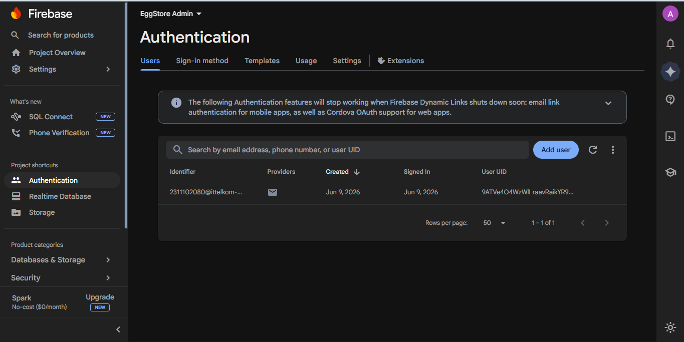
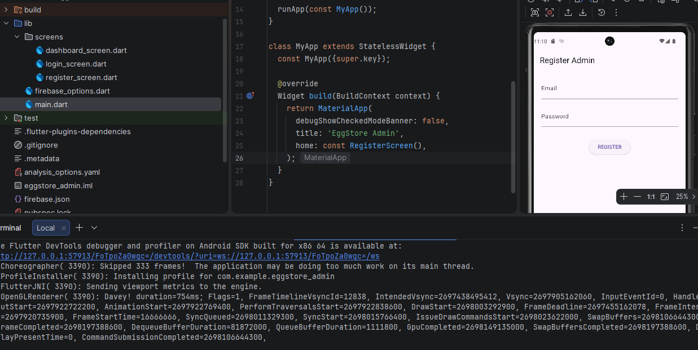
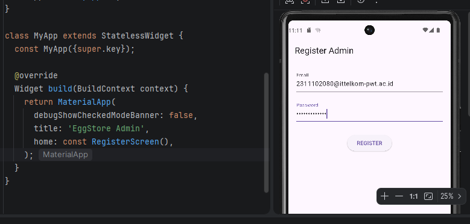
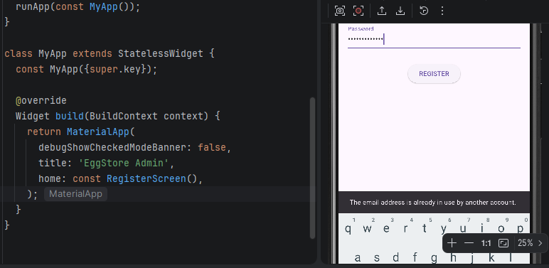
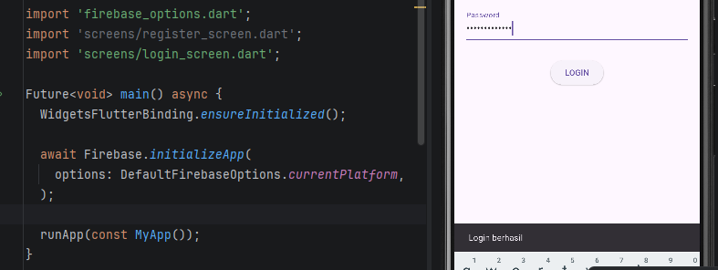
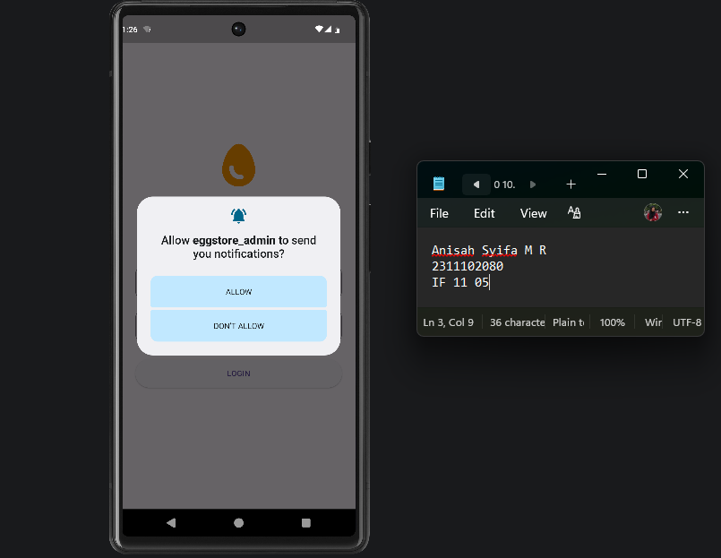
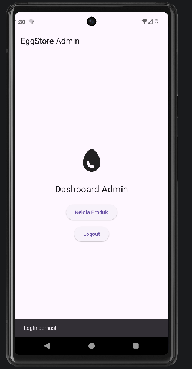
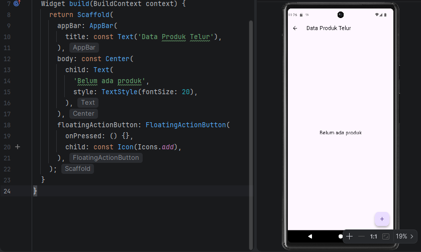
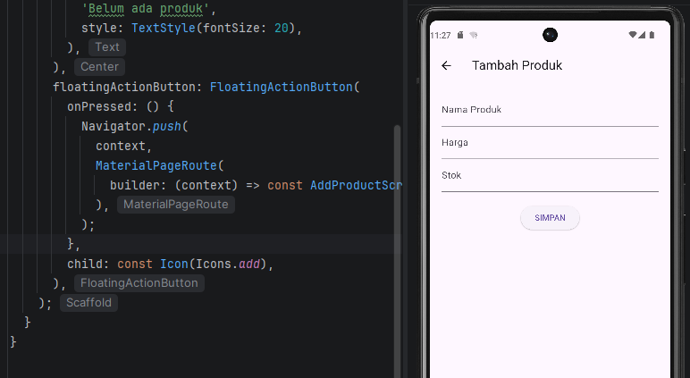
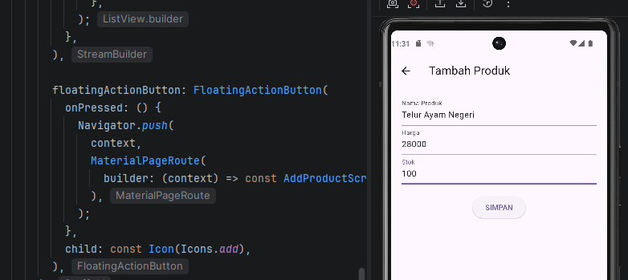
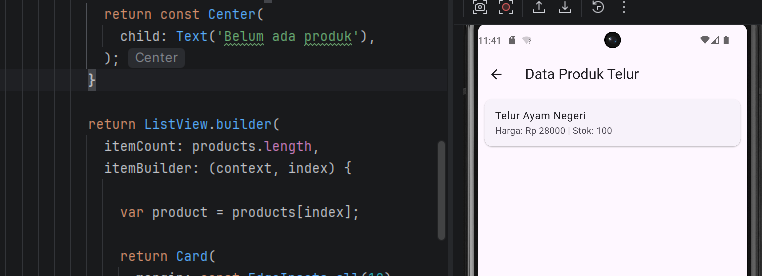
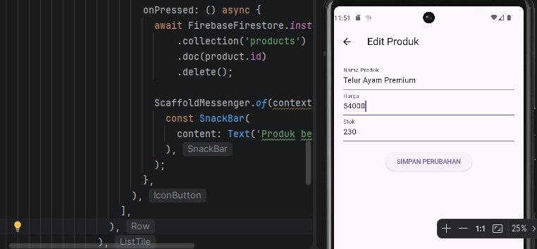
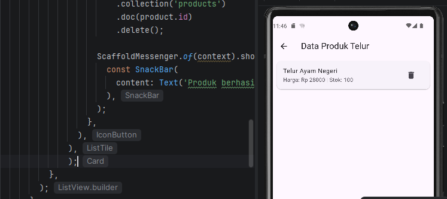
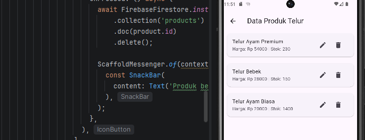

### Penjelasan Code

Aplikasi egg store adalah sistem manajemen untuk admin toko telur yang dikembangkan menggunakan Flutter dan Firebase. Aplikasi ini mendukung fitur autentikasi pengguna agar hanya admin yang dapat mengaksesnya. Fitur utama aplikasi adalah CRUD (Create, Read, Update, Delete) untuk mengelola data telur, seperti menambah stok telur baru, menampilkan daftar telur yang tersedia, mengubah informasi harga atau jumlah stok, serta menghapus data telur yang tidak diperlukan. Selain itu, aplikasi juga menampilkan notifikasi lokal sebagai umpan balik setiap kali admin melakukan operasi data, misalnya ketika berhasil menambah, mengubah, atau menghapus data telur.
