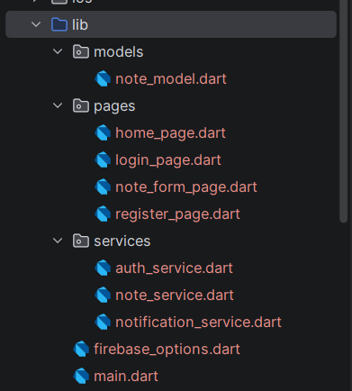
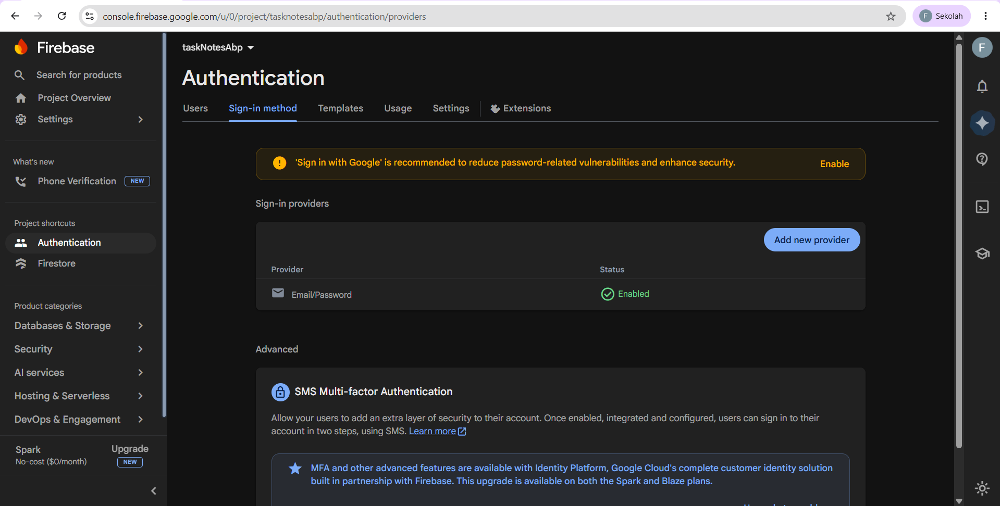
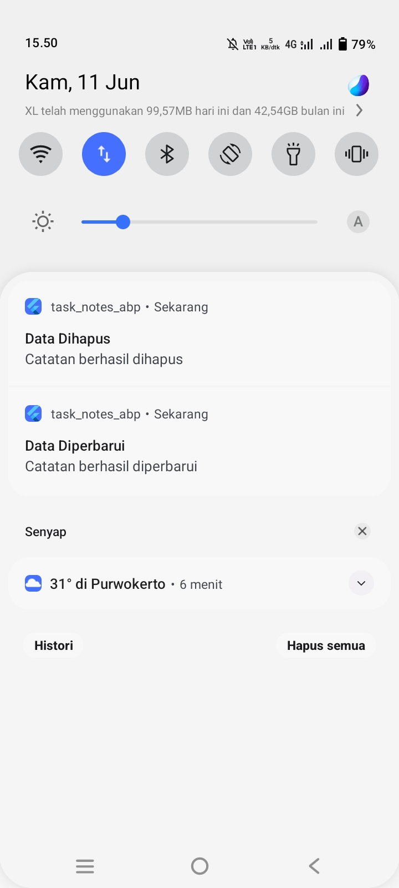
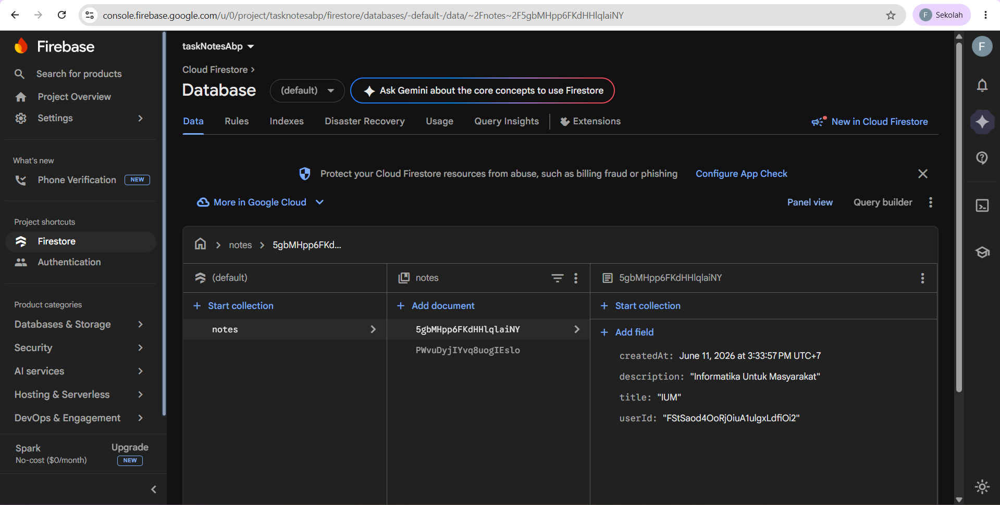

<div align="center">
  <br />
  <h1>LAPORAN PRAKTIKUM <br> APLIKASI BERBASIS PLATFORM </h1>
  <br />
  <h3>MODUL 7 <br> INTEGRASI FLUTTER </h3>
  <br />
  
  <br />
  <br />
  <br />
  <h3>Disusun Oleh :</h3>
  <p>
    <strong>Ahmad Tegar Kahfi Asyngarinanto</strong>
    <br>
    <strong>2311102083</strong>
    <br>
    <strong>S1 IF-11-REG05</strong>
  </p>
  <br />
  <h3>Dosen Pengampu :</h3>
  <p>
    <strong>Dedi Agung Prabowo, S.Kom., M.Kom</strong>
  </p>
  <br />
  <br />
  <h4>Asisten Praktikum :</h4>
  <strong>Apri Pandu Wicaksono </strong>
  <br>
  <strong>Hamka Zaenul Ardi</strong>
  <br />
  <h3>LABORATORIUM HIGH PERFORMANCE <br>FAKULTAS INFORMATIKA <br>UNIVERSITAS TELKOM PURWOKERTO <br>2026 </h3>
</div>

<hr>

# 1. Dasar Teori

## Pengembangan Aplikasi Mobile

Pengembangan aplikasi mobile merupakan proses pembuatan perangkat lunak yang dirancang untuk berjalan pada perangkat bergerak seperti smartphone dan tablet. Aplikasi mobile banyak digunakan karena mampu memberikan akses informasi dan layanan secara cepat tanpa bergantung pada perangkat komputer.

Saat ini aplikasi mobile dimanfaatkan dalam berbagai bidang, mulai dari pendidikan, kesehatan, bisnis, hingga produktivitas pribadi. Dengan memanfaatkan koneksi internet, aplikasi mobile dapat terhubung dengan server atau layanan cloud sehingga data dapat disimpan dan diakses secara online dari berbagai perangkat.

## Flutter Framework

Flutter adalah framework UI (User Interface) yang dikembangkan oleh Google untuk membangun aplikasi lintas platform menggunakan satu basis kode (single codebase). Dengan Flutter, pengembang dapat membuat aplikasi Android, iOS, Web, dan Desktop secara lebih efisien.

Flutter menggunakan konsep widget sebagai komponen utama penyusun tampilan. Setiap elemen antarmuka seperti teks, tombol, gambar, maupun layout dibangun menggunakan widget yang dapat dikombinasikan sesuai kebutuhan aplikasi.

Keunggulan Flutter antara lain:

- Performa tinggi karena menggunakan rendering engine sendiri.
- Mendukung pengembangan lintas platform.
- Memiliki fitur Hot Reload yang mempercepat proses pengembangan.
- Menyediakan banyak widget siap pakai untuk membangun antarmuka modern.

## Bahasa Pemrograman Dart

Dart merupakan bahasa pemrograman yang digunakan secara resmi dalam pengembangan aplikasi Flutter. Bahasa ini dikembangkan oleh Google dengan tujuan memberikan performa yang baik serta sintaks yang mudah dipelajari oleh pengembang.

Dalam Flutter, Dart digunakan untuk mengatur logika bisnis aplikasi, navigasi antar halaman, pengolahan data, integrasi API, hingga pengelolaan state aplikasi. Seluruh komponen aplikasi Flutter ditulis menggunakan bahasa Dart sehingga menghasilkan aplikasi yang terstruktur dan mudah dipelihara.

## Backend as a Service (BaaS)

Backend as a Service (BaaS) adalah layanan yang menyediakan infrastruktur backend siap pakai sehingga pengembang tidak perlu membangun server dari awal. Dengan memanfaatkan layanan BaaS, proses pengembangan aplikasi menjadi lebih cepat karena berbagai kebutuhan backend telah disediakan dalam bentuk layanan cloud.

Fitur yang umumnya tersedia pada platform BaaS meliputi:

- Sistem autentikasi pengguna.
- Database berbasis cloud.
- Penyimpanan file.
- Sinkronisasi data secara real-time.
- Notifikasi dan layanan tambahan lainnya.

Firebase dan Supabase merupakan contoh platform BaaS yang banyak digunakan dalam pengembangan aplikasi modern.

## Authentication

Authentication merupakan mekanisme yang digunakan untuk memverifikasi identitas pengguna sebelum mengakses suatu sistem. Proses ini bertujuan untuk memastikan bahwa pengguna yang masuk merupakan pengguna yang sah dan memiliki hak akses terhadap aplikasi.

Metode autentikasi yang umum digunakan adalah email dan password. Setelah pengguna berhasil melakukan login, sistem akan menyimpan informasi sesi sehingga pengguna dapat mengakses fitur-fitur yang tersedia tanpa perlu melakukan autentikasi ulang selama sesi masih aktif.

Penerapan authentication sangat penting karena berkaitan dengan keamanan data pengguna serta pembatasan akses terhadap fitur tertentu pada aplikasi.

## Firebase Authentication

Firebase Authentication adalah layanan autentikasi yang disediakan oleh Firebase untuk memudahkan proses registrasi dan login pengguna. Layanan ini mendukung berbagai metode autentikasi seperti email-password, Google Sign-In, Facebook Login, GitHub Login, dan metode lainnya.

Firebase Authentication memungkinkan pengembang mengelola akun pengguna tanpa harus membangun sistem autentikasi sendiri. Selain itu, layanan ini telah dilengkapi dengan mekanisme keamanan yang sesuai dengan standar industri sehingga dapat digunakan pada berbagai jenis aplikasi.

## Cloud Firestore

Cloud Firestore merupakan database NoSQL berbasis cloud yang disediakan oleh Firebase. Database ini dirancang untuk menyimpan data secara fleksibel menggunakan struktur Collection dan Document.

Karakteristik utama Cloud Firestore antara lain:

- Penyimpanan data secara online.
- Sinkronisasi data secara real-time.
- Skalabilitas tinggi.
- Mendukung akses data dari berbagai platform.

Firestore sangat cocok digunakan pada aplikasi Flutter karena memiliki integrasi yang baik serta menyediakan SDK resmi yang memudahkan proses pengembangan.

## Konsep CRUD

CRUD adalah kumpulan operasi dasar yang digunakan dalam pengelolaan data pada suatu sistem informasi. Istilah CRUD merupakan singkatan dari:

### Create

Operasi untuk menambahkan data baru ke dalam database.

### Read

Operasi untuk mengambil atau menampilkan data yang tersimpan.

### Update

Operasi untuk memperbarui informasi yang sudah ada.

### Delete

Operasi untuk menghapus data yang tidak diperlukan.

Konsep CRUD menjadi fondasi utama dalam pengembangan aplikasi berbasis data karena hampir seluruh sistem informasi memerlukan keempat operasi tersebut.

## Notifikasi pada Aplikasi Mobile 

Notifikasi merupakan mekanisme komunikasi yang digunakan aplikasi untuk menyampaikan informasi kepada pengguna. Notifikasi dapat ditampilkan ketika aplikasi sedang dibuka maupun ketika aplikasi berjalan di latar belakang.

Berdasarkan sumbernya, notifikasi dapat dibedakan menjadi:

1. Local Notification

Notifikasi yang dibuat langsung oleh aplikasi tanpa memerlukan server eksternal.

2. Push Notification

Notifikasi yang dikirimkan dari server melalui layanan tertentu seperti Firebase Cloud Messaging (FCM).

Pada aplikasi yang menerapkan fitur CRUD, notifikasi dapat digunakan sebagai umpan balik kepada pengguna setelah proses penyimpanan, perubahan, atau penghapusan data berhasil dilakukan.

## Integrasi Flutter dengan Firebase

Integrasi Flutter dan Firebase memungkinkan aplikasi mobile memanfaatkan berbagai layanan cloud yang disediakan Firebase. Proses integrasi dilakukan dengan menambahkan konfigurasi Firebase ke dalam project Flutter serta menginstal package yang diperlukan.

Beberapa package yang umum digunakan antara lain:

- `firebase_core` - Inisialisasi Firebase
- `firebase_auth` - Authentication pengguna
- `cloud_firestore` - Database online
- `flutter_local_notifications` - Local notification
- `firebase_messaging` - Push notification

Dengan adanya integrasi tersebut, aplikasi Flutter dapat melakukan autentikasi pengguna, mengelola data secara online, serta memberikan notifikasi secara otomatis kepada pengguna.

#  2. Pembahasan Tugas

## Deskripsi Aplikasi

Aplikasi yang dibuat pada praktikum ini adalah Catatan Tugas, sebuah aplikasi mobile berbasis Flutter. Aplikasi ini bertujuan untuk membantu pengguna mencatat, mengelola, dan menyimpan data catatan tugas secara digital dengan mudah dan cepat.

Fitur utama aplikasi meliputi:

- **Register dan Login** menggunakan email dan password untuk mengamankan akses pengguna.
- **Tambah, Tampilkan, Edit, dan Hapus catatan** secara online menggunakan Cloud Firestore.
- **Notifikasi CRUD** yang muncul setiap kali pengguna berhasil menambahkan, mengubah, atau menghapus data catatan.

Dengan aplikasi ini, pengguna dapat mengelola catatan tugas secara terstruktur dan data tersimpan secara aman di cloud, sehingga bisa diakses kembali kapan pun setelah login.

## Perancangan Aplikasi

Aplikasi ini dirancang untuk memudahkan pengguna dalam mencatat dan mengelola tugas secara digital. Alur penggunaan aplikasi dimulai dari halaman login, di mana pengguna memasukkan akun yang sudah terdaftar. Jika pengguna belum memiliki akun, dapat melakukan register terlebih dahulu. Setelah berhasil login, pengguna diarahkan ke halaman home yang menampilkan daftar catatan tugas. Pengguna dapat menambah catatan baru, mengedit catatan yang sudah ada, atau menghapus catatan melalui halaman Note Form Page.

Struktur halaman utama aplikasi:

- **Login Page** - Memungkinkan pengguna masuk ke aplikasi menggunakan email dan password
- **Registes Page** - Memungkinkan pengguna membuat akun baru untuk login
- **Home Page** - Menampilkan daftar catatan yang dimiliki pengguna
- **Note Form Page** - Digunakan untuk menambah atau mengedit catatan

Struktur folder project Flutter dibuat agar rapi dan mudah dipelihara. Contoh struktur folder:

```html
lib/
 ├─ main.dart
 ├─ firebase_options.dart
 ├─ pages/
 │   ├─ login_page.dart
 │   ├─ register_page.dart
 │   ├─ home_page.dart
 │   └─ note_form_page.dart
 ├─ services/
 │   ├─ auth_service.dart
 │   ├─ note_service.dart
 │   └─ notification_service.dart
 └─ models/
     └─ note_model.dart
```

Implementasi Struktur Folder seperti pada Gambar 2.1,



Gambar 2.1 Struktur Folder

## Konfigurasi Firebase

Firebase digunakan sebagai backend aplikasi untuk menyimpan data secara online dan mengelola autentikasi pengguna. Pada praktikum ini, konfigurasi Firebase dilakukan dengan langkah-langkah sebagai berikut:

1. Membuat Project Firebase

Project Firebase baru dibuat melalui Firebase Console dengan nama `taskNotesAbp` sebagai backend aplikasi.

2. Mengaktifkan Firebase Authentication

Fitur Authentication diaktifkan menggunakan metode **Email/Password** agar pengguna dapat melakukan registrasi dan login ke aplikasi.

3. Mengaktifkan Cloud Firestore

Cloud Firestore diaktifkan untuk menyimpan data catatan tugas secara online dalam bentuk collection `notes` dan dokumen dengan field `title`, `description`, `userId`, dan `createdAt`.

4. Menghubungkan Firebase ke Flutter

Integrasi dilakukan menggunakan FlutterFire CLI, yang menghasilkan file `firebase_options.dart`. File ini berisi konfigurasi Firebase agar aplikasi Flutter dapat terhubung ke project Firebase.

5. Package Firebase yang digunakan

Beberapa package Flutter digunakan untuk integrasi Firebase dan fitur pendukung, yaitu:

- `firebase_core` → inisialisasi Firebase di Flutter
- `firebase_auth` → fitur login dan register pengguna
- `cloud_firestore` → penyimpanan data CRUD online
- `flutter_local_notifications` → menampilkan notifikasi CRUD
- `intl` → memformat tanggal dan waktu data catatan

Dengan konfigurasi ini, aplikasi Flutter dapat melakukan login/register, mengelola data catatan tugas secara online, dan menampilkan notifikasi setiap kali pengguna melakukan aksi CRUD seperti ini pada Gambar 2.2,


Gambar 2.2 Konfigurasi terhadap Firebase

## Implementasi Authentication

Fitur Authentication pada aplikasi ini diterapkan menggunakan Firebase Authentication dengan metode email dan password. Fitur ini digunakan agar pengguna dapat membuat akun baru melalui halaman register dan masuk ke aplikasi melalui halaman login.

Pada proses register, pengguna diminta memasukkan email dan password. Data akun tersebut akan tersimpan pada Firebase Authentication. Setelah akun berhasil dibuat, pengguna dapat menggunakan email dan password yang sama untuk login ke aplikasi. Jika proses login berhasil, pengguna akan diarahkan ke halaman utama aplikasi yang menampilkan daftar catatan tugas.

Authentication juga digunakan untuk membatasi akses pengguna terhadap fitur utama aplikasi. Pengguna yang belum login tidak dapat masuk ke halaman pengelolaan catatan. Selain itu, aplikasi juga menyediakan fitur logout agar pengguna dapat keluar dari akun dan kembali ke halaman login.

Bukti Implementasi pada Authectication seperti pada Gambar 2.3,



Gambar 2.3 Implementasi Authentication

## Implementasi CRUD

Fitur CRUD pada aplikasi ini diterapkan untuk mengelola data catatan tugas pengguna. CRUD terdiri dari Create, Read, Update, dan Delete. Seluruh data catatan disimpan secara online menggunakan Cloud Firestore pada collection `notes`.

Pada fitur **Create**, pengguna dapat menambahkan catatan baru melalui halaman form catatan. Data yang dimasukkan berupa judul dan deskripsi catatan, kemudian disimpan ke Cloud Firestore. Pada fitur **Read**, aplikasi menampilkan daftar catatan yang sudah dibuat oleh pengguna pada halaman utama. Data tersebut diambil dari collection `notes` berdasarkan user yang sedang login.

Fitur **Update** digunakan untuk mengubah data catatan yang sudah ada. Pengguna dapat memilih catatan yang ingin diedit, kemudian memperbarui judul atau deskripsi catatan tersebut. Sementara itu, fitur **Delete** digunakan untuk menghapus catatan dari aplikasi dan database Firestore.

Penerapan CRUD pada aplikasi ini membuat pengguna dapat mengelola catatan tugas secara online. Setiap perubahan data yang dilakukan pengguna akan tersimpan pada Cloud Firestore sehingga data dapat diakses kembali setelah pengguna login.

Bukti mengenai Implementasi CRUD seperti pada Gambar 2.4, 2.5, 2.6, 2.7, 2.8, 2.9,


Gambar 2.4 Tampilan Sebelum CRUD


Gambar 2.5 Tampilan dilakukannya create


Gambar 2.6 Tampilan Setelah Create


Gambar 2.7 Tampilan Edit


Gambar 2.8 Tampilan Setelah Edit



Gambar 2.9 Tampilan Setelah Delete

## Implementasi Notifikasi CRUD

Implementasi notifikasi CRUD pada aplikasi ini dilakukan menggunakan package `flutter_local_notifications`. Notifikasi digunakan sebagai pemberitahuan kepada pengguna bahwa proses pengelolaan data catatan telah berhasil dilakukan.

Pada aplikasi Catatan Tugas, notifikasi ditampilkan setelah pengguna melakukan aksi CRUD tertentu, yaitu ketika berhasil menambahkan data, memperbarui data, dan menghapus data catatan. Setelah proses tambah data berhasil, aplikasi akan menampilkan notifikasi bahwa data telah ditambahkan. Ketika data berhasil diperbarui, aplikasi menampilkan notifikasi bahwa data telah diubah. Selain itu, saat data berhasil dihapus, aplikasi juga menampilkan notifikasi sebagai tanda bahwa catatan sudah terhapus dari aplikasi dan database.

Dengan adanya notifikasi CRUD, pengguna dapat mengetahui bahwa setiap aksi yang dilakukan telah berhasil diproses oleh aplikasi. Fitur ini juga membuat aplikasi menjadi lebih informatif karena memberikan umpan balik secara langsung kepada pengguna setelah proses pengelolaan data selesai.

Bukti mengenai Implementasi Notifikasi CRUD seperti pada Gambar 2.10, 2.11, 2.12,


Gambar 2.10 Tampilan Implementasi Notifikasi **Create**


Gambar 2.11 Tampilan Implementasi Notifikasi **Edit**


Gambar 2.12 Tampilan Implementasi Notifikasi **Delete**

## Struktur Data Firestore

Struktur data pada aplikasi Catatan Tugas dibuat menggunakan Cloud Firestore. Data catatan disimpan dalam sebuah collection bernama `notes`. Setiap data catatan yang ditambahkan oleh pengguna akan tersimpan sebagai document di dalam collection tersebut.

Setiap document pada collection `notes` memiliki beberapa field utama, yaitu `title`, `description`, `userId`, dan `createdAt`. Field `title` digunakan untuk menyimpan judul catatan, sedangkan `description` digunakan untuk menyimpan isi atau keterangan catatan. Field `userId` digunakan untuk menyimpan identitas pengguna yang sedang login, sehingga data catatan dapat dikaitkan dengan pemiliknya. Sementara itu, field `createdAt` digunakan untuk menyimpan waktu ketika catatan dibuat.

Dengan struktur data tersebut, aplikasi dapat menampilkan data catatan berdasarkan pengguna yang login. Selain itu, struktur ini juga mendukung proses CRUD karena setiap document dapat ditambahkan, dibaca, diperbarui, dan dihapus melalui Cloud Firestore.

Bukti mengenai Implementasi Notifikasi CRUD seperti pada Gambar 2.13,



Gambar 2.13 Struktur Data Firestore