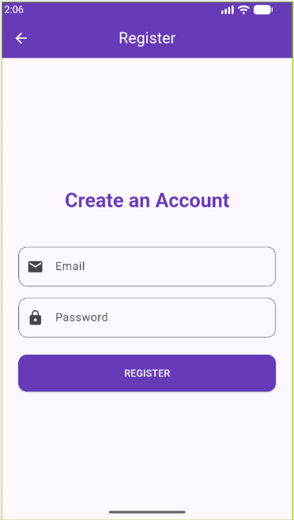
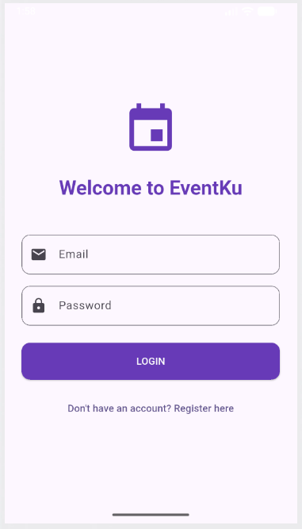
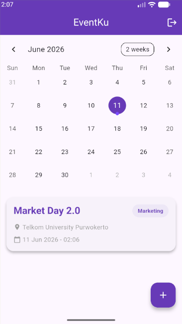
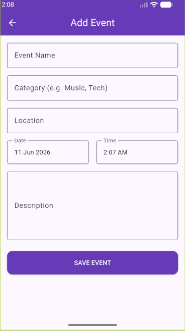
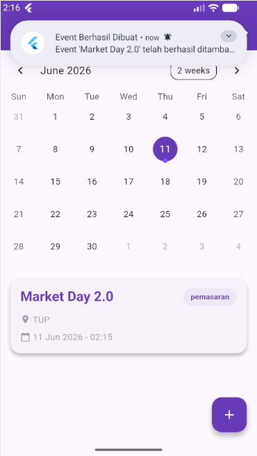

<div align="center">
    <br />
    <h1>LAPORAN PRAKTIKUM <br> APLIKASI BERBASIS PLATFORM </h1>
    <br />
    <h3>MODUL 7 <br> Integrasi Flutter Firebase/Supabase </h3>
    <br />
    
    <br />
    <br />
    <br />
    <h3>Disusun Oleh :</h3>
    <p>
        <strong>Galih Crismaningtyas</strong>
        <br>
        <strong>2311102085</strong>
        <br>
        <strong>S1 IF-11-REG05</strong>
    </p>
    <br />
    <h3>Dosen Pengampu :</h3>
    <p>
        <strong>Dedi Agung Prabowo, S.Kom., M.Kom</strong>
    </p>
    <br />
    <br />
    <h4>Asisten Praktikum :</h4>
    <strong>Apri Pandu Wicaksono </strong>
    <br>
    <strong>Hamka Zaenul Ardi</strong>
    <br />
    <h3>LABORATORIUM HIGH PERFORMANCE <br>FAKULTAS INFORMATIKA <br>UNIVERSITAS TELKOM PURWOKERTO <br>2026 </h3>
</div>
<hr>

## Dasar Teori

Flutter merupakan framework open-source yang dikembangkan oleh Google untuk membangun aplikasi multi-platform dari satu codebase. Flutter menggunakan bahasa pemrograman Dart dan menyediakan widget-widget yang kaya untuk membangun antarmuka pengguna (UI) yang responsif dan menarik. Dalam pengembangan aplikasi mobile, Flutter sering diintegrasikan dengan layanan backend seperti Firebase untuk menyediakan fitur-fitur seperti autentikasi pengguna, penyimpanan data real-time, dan notifikasi push tanpa perlu membangun server sendiri.

Firebase adalah platform Backend-as-a-Service (BaaS) dari Google yang menyediakan berbagai layanan untuk pengembangan aplikasi, di antaranya Firebase Authentication untuk mengelola proses login dan registrasi pengguna, serta Cloud Firestore sebagai database NoSQL berbasis dokumen yang mendukung sinkronisasi data secara real-time. Dengan menggunakan Cloud Firestore, data yang disimpan dapat langsung diperbarui di semua perangkat yang terhubung tanpa perlu melakukan refresh manual, sehingga cocok untuk aplikasi yang memerlukan pembaruan data secara instan seperti aplikasi manajemen event.

Flutter Local Notifications adalah package yang memungkinkan aplikasi Flutter menampilkan notifikasi lokal pada perangkat pengguna tanpa memerlukan koneksi ke server push notification. Notifikasi lokal berguna untuk memberikan feedback langsung kepada pengguna setelah melakukan aksi tertentu, seperti menambah, mengubah, atau menghapus data. Dengan mengatur channel notification pada tingkat importance yang tinggi (max) dan priority high, notifikasi akan tampil sebagai heads-up notification yang muncul di bagian atas layar perangkat, memberikan informasi yang langsung terlihat tanpa harus membuka panel notifikasi.

## Tugas Modul 7 

### 1. Source Code

**main.dart**
```dart
//Galih Crismaningtyas 2311102085
import 'package:flutter/material.dart';
import 'package:firebase_core/firebase_core.dart';
import 'firebase_options.dart';
import 'screens/home_screen.dart';
import 'screens/login_screen.dart';
import 'services/auth_service.dart';
import 'services/notification_service.dart';

void main() async {
  WidgetsFlutterBinding.ensureInitialized();
  
  try {
    await Firebase.initializeApp(
      options: DefaultFirebaseOptions.currentPlatform,
    );
  } catch (e) {
    print("Firebase initialization failed: $e");
  }

  await NotificationService().init();

  runApp(const EventKuApp());
}

class EventKuApp extends StatelessWidget {
  const EventKuApp({super.key});

  @override
  Widget build(BuildContext context) {
    return MaterialApp(
```

**Kode Lengkap:** [lib/main.dart](lib/main.dart)

**login_screen.dart**
```dart
//Galih Crismaningtyas 2311102085
import 'package:flutter/material.dart';
import '../services/auth_service.dart';
import 'register_screen.dart';

class LoginScreen extends StatefulWidget {
  const LoginScreen({super.key});

  @override
  State<LoginScreen> createState() => _LoginScreenState();
}

class _LoginScreenState extends State<LoginScreen> {
  final _emailController = TextEditingController();
  final _passwordController = TextEditingController();
  final _authService = AuthService();
  bool _isLoading = false;

  void _login() async {
    setState(() => _isLoading = true);
    try {
      await _authService.login(
        _emailController.text.trim(),
        _passwordController.text.trim(),
      );
    } catch (e) {
      ScaffoldMessenger.of(context).showSnackBar(
        SnackBar(content: Text('Login failed: ${e.toString()}')),
      );
```

**Kode Lengkap:** [lib/screens/login_screen.dart](lib/screens/login_screen.dart)

**register_screen.dart**
```dart
//Galih Crismaningtyas 2311102085
import 'package:flutter/material.dart';
import '../services/auth_service.dart';

class RegisterScreen extends StatefulWidget {
  const RegisterScreen({super.key});

  @override
  State<RegisterScreen> createState() => _RegisterScreenState();
}

class _RegisterScreenState extends State<RegisterScreen> {
  final _emailController = TextEditingController();
  final _passwordController = TextEditingController();
  final _authService = AuthService();
  bool _isLoading = false;

  void _register() async {
    setState(() => _isLoading = true);
    try {
      await _authService.register(
        _emailController.text.trim(),
        _passwordController.text.trim(),
      );
      if (mounted) Navigator.pop(context);
    } catch (e) {
      ScaffoldMessenger.of(context).showSnackBar(
        SnackBar(content: Text('Registration failed: ${e.toString()}')),
      );
```

**Kode Lengkap:** [lib/screens/register_screen.dart](lib/screens/register_screen.dart)

**home_screen.dart**
```dart
//Galih Crismaningtyas 2311102085
import 'package:flutter/material.dart';
import 'package:table_calendar/table_calendar.dart';
import '../models/event_model.dart';
import '../services/auth_service.dart';
import '../services/firestore_service.dart';
import '../widgets/event_card.dart';
import 'event_form_screen.dart';

class HomeScreen extends StatefulWidget {
  const HomeScreen({super.key});

  @override
  State<HomeScreen> createState() => _HomeScreenState();
}

class _HomeScreenState extends State<HomeScreen> {
  final AuthService _authService = AuthService();
  final FirestoreService _firestoreService = FirestoreService();

  CalendarFormat _calendarFormat = CalendarFormat.month;
  DateTime _focusedDay = DateTime.now();
  DateTime? _selectedDay;

  @override
  void initState() {
    super.initState();
    _selectedDay = _focusedDay;
  }

  void _logout() async {
    await _authService.logout();
```

**Kode Lengkap:** [lib/screens/home_screen.dart](lib/screens/home_screen.dart)

**event_form_screen.dart**
```dart
//Galih Crismaningtyas 2311102085
import 'package:flutter/material.dart';
import 'package:intl/intl.dart';
import '../models/event_model.dart';
import '../services/firestore_service.dart';
import '../services/auth_service.dart';
import '../services/notification_service.dart';

class EventFormScreen extends StatefulWidget {
  final EventModel? event;

  const EventFormScreen({super.key, this.event});

  @override
  State<EventFormScreen> createState() => _EventFormScreenState();
}

class _EventFormScreenState extends State<EventFormScreen> {
  final _formKey = GlobalKey<FormState>();
  final _namaEventController = TextEditingController();
  final _lokasiController = TextEditingController();
  final _deskripsiController = TextEditingController();
  final _kategoriController = TextEditingController();
  DateTime _selectedDate = DateTime.now();
  TimeOfDay _selectedTime = TimeOfDay.now();
  bool _isLoading = false;

  @override
  void initState() {
    super.initState();
```

**Kode Lengkap:** [lib/screens/event_form_screen.dart](lib/screens/event_form_screen.dart)

**event_detail_screen.dart**
```dart
//Galih Crismaningtyas 2311102085
import 'package:flutter/material.dart';
import 'package:intl/intl.dart';
import '../models/event_model.dart';
import '../services/firestore_service.dart';
import '../services/auth_service.dart';
import '../services/notification_service.dart';
import 'event_form_screen.dart';

class EventDetailScreen extends StatelessWidget {
  final EventModel event;

  const EventDetailScreen({super.key, required this.event});

  void _deleteEvent(BuildContext context) async {
    final bool? confirm = await showDialog<bool>(
      context: context,
      builder: (context) => AlertDialog(
        title: const Text('Delete Event'),
        content: const Text('Are you sure you want to delete this event?'),
        actions: [
          TextButton(
            onPressed: () => Navigator.pop(context, false),
            child: const Text('Cancel'),
          ),
          TextButton(
            onPressed: () => Navigator.pop(context, true),
            child: const Text('Delete', style: TextStyle(color: Colors.red)),
          ),
```

**Kode Lengkap:** [lib/screens/event_detail_screen.dart](lib/screens/event_detail_screen.dart)

**auth_service.dart**
```dart
//Galih Crismaningtyas 2311102085
import 'package:firebase_auth/firebase_auth.dart';

class AuthService {
  final FirebaseAuth _auth = FirebaseAuth.instance;

  User? get currentUser => _auth.currentUser;

  Stream<User?> get authStateChanges => _auth.authStateChanges();

  Future<User?> login(String email, String password) async {
    try {
      UserCredential result = await _auth.signInWithEmailAndPassword(
        email: email,
        password: password,
      );
      return result.user;
    } catch (e) {
      throw e;
    }
  }

  Future<User?> register(String email, String password) async {
    try {
      UserCredential result = await _auth.createUserWithEmailAndPassword(
        email: email,
        password: password,
      );
      return result.user;
    } catch (e) {
      throw e;
```

**Kode Lengkap:** [lib/services/auth_service.dart](lib/services/auth_service.dart)

**firestore_service.dart**
```dart
//Galih Crismaningtyas 2311102085
import 'package:cloud_firestore/cloud_firestore.dart';
import '../models/event_model.dart';

class FirestoreService {
  final CollectionReference _eventsCollection =
      FirebaseFirestore.instance.collection('events');

  Future<void> createEvent(EventModel event) async {
    try {
      await _eventsCollection.add(event.toMap());
    } catch (e) {
      throw e;
    }
  }

  Stream<List<EventModel>> getEvents() {
    return _eventsCollection
        .orderBy('tanggal', descending: false)
        .snapshots()
        .map((snapshot) {
      return snapshot.docs.map((doc) => EventModel.fromFirestore(doc)).toList();
    });
  }

  Stream<List<EventModel>> getUserEvents(String userId) {
    return _eventsCollection
        .where('userId', isEqualTo: userId)
        .snapshots()
        .map((snapshot) {
```

**Kode Lengkap:** [lib/services/firestore_service.dart](lib/services/firestore_service.dart)

**notification_service.dart**
```dart
//Galih Crismaningtyas 2311102085
import 'package:flutter_local_notifications/flutter_local_notifications.dart';

class NotificationService {
  static final NotificationService _instance = NotificationService._internal();
  factory NotificationService() => _instance;
  NotificationService._internal();

  final FlutterLocalNotificationsPlugin _localNotificationsPlugin =
      FlutterLocalNotificationsPlugin();

  Future<void> init() async {
    const AndroidInitializationSettings initializationSettingsAndroid =
        AndroidInitializationSettings('@mipmap/ic_launcher');

    const InitializationSettings initializationSettings =
        InitializationSettings(android: initializationSettingsAndroid);

    await _localNotificationsPlugin.initialize(
      settings: initializationSettings,
    );

    final androidPlugin =
        _localNotificationsPlugin.resolvePlatformSpecificImplementation<
            AndroidFlutterLocalNotificationsPlugin>();
    if (androidPlugin != null) {
      await androidPlugin.requestNotificationsPermission();
    }

    const AndroidNotificationChannel channel = AndroidNotificationChannel(
      'event_channel_id',
```

**Kode Lengkap:** [lib/services/notification_service.dart](lib/services/notification_service.dart)

### 2. Penjelasan

Proyek **EventKu** adalah aplikasi manajemen event berbasis Flutter yang terintegrasi dengan Firebase, di mana pengguna dapat melakukan registrasi/login menggunakan Firebase Authentication, kemudian melakukan operasi CRUD (Create, Read, Update, Delete) pada data event yang tersimpan di Cloud Firestore secara real-time. Setiap kali pengguna berhasil menambah, mengubah, atau menghapus event, aplikasi akan menampilkan notifikasi lokal berupa heads-up notification yang muncul di bagian atas layar perangkat sebagai konfirmasi bahwa operasi telah berhasil dilakukan.

### 3. Output






