<div align="center">
  <br />
  <h1>LAPORAN PRAKTIKUM <br>APLIKASI BERBASIS PLATFORM </h1>
  <br />
  <h3>MODUL 7 <br> Integrasi Flutter Firebase/Supabase </h3>
  <br />
  
  <br />
  <br />
  <br />
  <h3>Disusun Oleh :</h3>
  <p>
    <strong>Buswiryawan Raditya Boenyamin</strong>
    <br>
    <strong>2311102090</strong>
    <br>
    <strong>S1 IF-11-REG05</strong>
  </p>
  <br />
  <h3>Dosen Pengampu :</h3>
  <p>
    <strong>Dedi Agung Prabowo, S.Kom., M.Kom</strong>
  </p>
  <br />
  <h4>Asisten Praktikum :</h4>
  <strong>Apri Pandu Wicaksono </strong>
  <br>
  <strong>Hamka Zaenul Ardi</strong>
  <br />
  <h3>LABORATORIUM HIGH PERFORMANCE <br>FAKULTAS INFORMATIKA <br>UNIVERSITAS TELKOM PURWOKERTO <br>2026 </h3>
</div>

<hr>

# Dasar Teori
## 1. Autentikasi

Autentikasi merupakan proses pemverifikasian identitas pengguna melalui alamat surat elektronik dan kata sandi. Proses ini dimulai dengan tahap pendaftaran, di mana pengguna memasukkan data pribadi mereka. Data tersebut kemudian diproses melalui mekanisme enkripsi untuk melindungi keamanan kode sandi. Setelah dienkripsi, data pengguna disimpan ke dalam pangkalan data yang aman. Pada tahap berikutnya, pengguna dapat masuk ke sistem dengan menggunakan alamat surat elektronik dan kode sandi mereka. Sistem akan memvalidasi kedua informasi tersebut untuk memastikan keakuratan identitas pengguna. Jika validasi berhasil, sistem akan membuat sebuah token yang berfungsi sebagai bukti sah bahwa pengguna telah terverifikasi. Token ini disimpan di perangkat lokal pengguna dan akan dikirimkan bersama setiap permintaan yang dilakukan pengguna. Latar belakang sistem akan memverifikasi token tersebut sebelum memproses permintaan selanjutnya.

Autentikasi memiliki beberapa fungsi penting dalam sistem. Pertama, autentikasi melindungi data pribadi pengguna dari akses tidak sah. Kedua, autentikasi memungkinkan sistem untuk melacak identitas pengguna yang melakukan setiap tindakan dalam aplikasi, sehingga sistem dapat mencatat riwayat kegiatan dengan akurat. Ketiga, autentikasi memungkinkan sistem untuk menyimpan dan menampilkan preferensi khusus setiap pengguna sesuai dengan kebutuhan dan pilihan mereka.

---

## 2. CRUD (Buat, Baca, Perbarui, Hapus)

CRUD merupakan empat operasi dasar yang digunakan untuk mengelola data dalam sistem. Operasi pertama adalah buat (create), yang berfungsi untuk menambahkan data baru ke dalam sistem. Contoh konkretnya adalah ketika pengguna membuat catatan baru dalam aplikasi. Operasi kedua adalah baca (read), yang berfungsi untuk menampilkan atau mengambil data yang sudah ada dalam sistem. Pengguna dapat melihat daftar lengkap dari semua catatan yang telah dibuat sebelumnya. Operasi ketiga adalah perbarui (update), yang berfungsi untuk mengubah data yang sudah ada dalam sistem. Misalnya, pengguna dapat menyunting judul atau isi dari catatan yang telah disimpan sebelumnya. Operasi keempat adalah hapus (delete), yang berfungsi untuk menghapus data dari sistem. Pengguna dapat menghapus catatan yang tidak lagi diperlukan.

Dalam sistem tradisional, pengguna harus melakukan penyegaran manual untuk melihat perubahan data yang telah disimpan. Ketika pengguna memasukkan data baru, sistem akan memvalidasi data tersebut dan mengirimkannya ke latar belakang untuk disimpan ke dalam pangkalan data. Namun, antarmuka pengguna tidak akan menampilkan perubahan secara otomatis. Pengguna harus menyegarkan aplikasi secara manual untuk melihat data yang telah diperbarui. Proses ini memerlukan interaksi tambahan dari pengguna dan dapat mengganggu pengalaman pengguna.

Pendekatan CRUD waktu-nyata menawarkan solusi yang berbeda. Pada sistem ini, pangkalan data secara otomatis mendeteksi ketika ada perubahan data dan mengirimkan pembaruan tersebut langsung ke aplikasi klien. Pengguna tidak perlu menyegarkan aplikasi secara manual untuk melihat perubahan data. Sinkronisasi data antara latar belakang dan antarmuka pengguna terjadi secara otomatis dan seketika. Sistem hanya mengirimkan data yang berubah, bukan seluruh dataset, sehingga proses ini lebih hemat sumber daya dan bandwidth. Pengalaman pengguna menjadi lebih responsif karena waktu tunggu berkurang drastis, dan pengguna dapat melihat hasil tindakan mereka dengan segera tanpa penundaan.

---

## 3. Notifikasi

Notifikasi memberikan umpan balik kepada pengguna mengenai hasil tindakan yang dilakukan dalam aplikasi. Umpan balik ini penting untuk memastikan pengguna mengetahui apakah tindakan mereka berhasil atau mengalami kegagalan. Terdapat dua jenis notifikasi utama yang digunakan dalam pengembangan aplikasi, yaitu notifikasi dorong dan notifikasi lokal.

Notifikasi dorong dikirim dari peladen cloud terpusat dan dapat diterima oleh pengguna meskipun aplikasi tidak sedang berjalan. Ketika pengguna menerima notifikasi dorong, sistem akan menampilkan pesan kepada pengguna di mana pun mereka berada, bahkan jika aplikasi sedang ditutup atau berada di latar belakang perangkat. Untuk mengimplementasikan notifikasi dorong, pengembang harus melakukan konfigurasi cloud yang cukup kompleks dan memerlukan pengaturan infrastruktur yang rumit. Karena notifikasi ini harus dikirim dari server cloud ke perangkat pengguna, waktu tunggu pengiriman relatif lebih lama dibandingkan dengan metode lain.

Notifikasi lokal dibuat dan ditampilkan langsung pada perangkat pengguna tanpa perlu melibatkan server eksternal. Ketika pengguna melakukan tindakan seperti membuat, memperbarui, atau menghapus data, sistem akan menjalankan fungsi CRUD yang sesuai. Setelah proses CRUD selesai dan menghasilkan status berhasil atau gagal, sistem akan memicu mekanisme pembuatan notifikasi lokal. Notifikasi tersebut akan ditampilkan segera pada perangkat pengguna tanpa penundaan dari server. Notifikasi lokal muncul secara seketika karena semua proses terjadi di perangkat lokal tanpa perlu komunikasi dengan server eksternal. Karena tidak melibatkan server cloud, sistem notifikasi lokal lebih hemat sumber daya dan tidak memerlukan bandwidth jaringan yang signifikan. Implementasi notifikasi lokal juga lebih sederhana dibandingkan dengan notifikasi dorong karena konfigurasi yang dibutuhkan tidak seserius yang diperlukan untuk layanan cloud. Notifikasi lokal sangat cocok digunakan untuk memberikan umpan balik instan kepada pengguna mengenai hasil tindakan mereka dalam aplikasi.

---

## 4. Integrasi Ketiga Modul

Ketiga modul autentikasi, CRUD, dan notifikasi bekerja secara terintegrasi untuk menciptakan alur kerja yang kohesif dalam aplikasi. Proses dimulai ketika pengguna melakukan login dengan memasukkan alamat surat elektronik dan kode sandi mereka. Sistem autentikasi akan memverifikasi kredensial tersebut dan memberikan akses kepada pengguna. Setelah pengguna berhasil login, antarmuka aplikasi akan menampilkan daftar data yang relevan kepada pengguna. Data ini ditampilkan menggunakan operasi baca dari modul CRUD.

Pengguna kemudian dapat memilih tindakan yang ingin dilakukan terhadap data tersebut. Pengguna dapat memilih untuk membuat data baru, memperbarui data yang sudah ada, atau menghapus data yang tidak diperlukan lagi. Setelah pengguna memilih tindakan, data akan divalidasi untuk memastikan keakuratan dan kelengkapannya. Data yang telah divalidasi kemudian dikirim ke latar belakang sistem untuk diproses dan disimpan ke dalam pangkalan data.

Setelah proses penyimpanan selesai, baik berhasil maupun gagal, sistem akan menampilkan notifikasi kepada pengguna. Notifikasi ini memberikan umpan balik instan tentang hasil tindakan yang dilakukan pengguna. Jika penyimpanan berhasil, notifikasi akan menginformasikan keberhasilan tersebut. Jika penyimpanan gagal, notifikasi akan memberitahu pengguna tentang kesalahan yang terjadi. Bersamaan dengan tampilan notifikasi, antarmuka pengguna akan diperbarui secara otomatis untuk mencerminkan perubahan data yang baru saja terjadi. Dalam sistem dengan fitur waktu-nyata, pembaruan ini terjadi secara otomatis tanpa memerlukan tindakan manual dari pengguna.

---

## 5. Teknologi yang Digunakan

### Supabase

Supabase merupakan layanan pangkalan data terbuka yang menyediakan beberapa modul komprehensif untuk mendukung pengembangan aplikasi modern. Layanan ini dirancang untuk memberikan alternatif yang terjangkau dan dapat dikustomisasi dibandingkan dengan layanan proprietary lainnya.

Supabase menyediakan modul autentikasi yang memungkinkan pengguna untuk login menggunakan alamat surat elektronik dan kode sandi. Autentikasi ini dilengkapi dengan kontrol keamanan tingkat baris, yang berarti setiap pengguna hanya dapat mengakses data yang sesuai dengan hak akses mereka. Pangkalan data yang digunakan adalah PostgreSQL, yang merupakan sistem penyimpanan data relasional yang andal, powerful, dan telah terbukti dapat menangani volume data yang besar. PostgreSQL dapat diakses dengan mudah dan menyediakan berbagai fitur lanjutan untuk pengelolaan data yang kompleks.

Salah satu fitur unggulan Supabase adalah layanan waktu-nyata yang menggunakan mekanisme replikasi basis data PostgreSQL. Mekanisme ini secara otomatis mendeteksi ketika ada perubahan data dalam basis data dan mengirimkan informasi perubahan tersebut ke aplikasi klien. Dengan cara ini, antarmuka pengguna dapat diperbarui secara otomatis tanpa memerlukan permintaan tambahan dari klien. Supabase juga menyediakan antarmuka pemrograman aplikasi REST, yang memungkinkan aplikasi untuk mengakses data melalui permintaan HTTP. Semua komunikasi dilindungi dengan token yang dienkripsi, sehingga keamanan data terjamin.

Keunggulan penggunaan Supabase terletak pada beberapa aspek. Pertama, Supabase adalah perangkat lunak bersumber terbuka, yang berarti kode sumbernya tersedia untuk diperiksa dan dimodifikasi sesuai kebutuhan. Kedua, biaya operasional Supabase lebih terjangkau dibandingkan dengan layanan komersial lainnya, terutama ketika digunakan untuk proyek dalam skala kecil hingga menengah. Ketiga, Supabase dapat dijalankan dan dikelola secara mandiri menggunakan infrastruktur pribadi, sehingga pengguna memiliki kontrol penuh terhadap data mereka dan tidak bergantung pada server pihak ketiga.

Arsitektur Supabase untuk fitur waktu-nyata bekerja sebagai berikut: aplikasi klien berkomunikasi dengan antarmuka REST milik Supabase, dan antarmuka ini berkomunikasi dengan pangkalan data PostgreSQL. Ketika data di dalam PostgreSQL berubah, mekanisme replikasi basis data mendeteksi perubahan tersebut dan mengirimkan informasi perubahan melalui saluran komunikasi khusus ke aplikasi klien. Saluran komunikasi ini awalnya berbasis protokol koneksi soket, yang memungkinkan komunikasi dua arah yang cepat dan efisien. Mekanisme ini memungkinkan sistem CRUD waktu-nyata berfungsi dengan sempurna tanpa memerlukan penyegaran manual dari pengguna.

### Firebase (Alternatif Lain)

Firebase merupakan layanan platform alternatif yang menyediakan modul serupa untuk pengembangan aplikasi modern. Berbeda dengan Supabase yang berbasis open-source, Firebase adalah layanan proprietary yang dikembangkan oleh Google dan menawarkan integrasi langsung dengan berbagai layanan Google lainnya.

Firebase menyediakan modul autentikasi yang memungkinkan pengguna untuk login menggunakan alamat surat elektronik dan kode sandi, mirip dengan autentikasi Supabase. Untuk penyimpanan data, Firebase menggunakan Firestore, yang merupakan sistem pangkalan data berbasis cloud dengan fitur waktu-nyata bawaan. Setiap perubahan data dalam Firestore akan secara otomatis disinkronkan ke semua klien yang mendengarkan data tersebut. Selain itu, Firebase menyediakan layanan bernama pesan awan Firebase, yang memungkinkan pengiriman notifikasi dorong kepada pengguna di berbagai perangkat mereka. Fitur ini sangat berguna untuk mengirim notifikasi penting kepada pengguna bahkan ketika aplikasi tidak sedang berjalan.

Keunggulan Firebase adalah integrasi yang sangat mudah dengan kerangka kerja pengembangan aplikasi Flutter. Paket-paket yang diperlukan untuk mengintegrasikan Firebase dengan Flutter sudah tersedia dan didukung secara resmi oleh tim pengembang Flutter. Ini membuat proses implementasi menjadi lebih cepat dan lebih sederhana dibandingkan dengan integrasi manual yang diperlukan untuk layanan lain.

---


# Tugas 4 Flutter
untuk tugas minggu ini Karena kemarin kita sudah belajar fetch data menggunakan HTTP, sekarang buatlah aplikasi Flutter dengan tema bebas yang menerapkan Authentication, CRUD dan Notifikasi CRUD nya. Untuk backend silakan menggunakan Firebase atau Supabase, sehingga aplikasi dapat melakukan Login/Register serta menyimpan dan mengelola data secara online.
- Buat laporan dalam format Markdown file dengan penamaan README.md
- Upload Source Code dengan format yang sudah ditentukan sebelum nya (tugas-1, tugas-2, etc)
- Masukan beberapa Screenshot Dashboard Firebase / supabase yang sudah berhasil diintegrasikan
- Tambahkan watermark pada source code, Hasil Akhir Aplikasi dan juga laporan (harus mengandung nim dan nama)
## Source Code

### 1. main.dart
[lib/main.dart](lib/main.dart)
```dart
// 2311102090-Buswiryawan Raditya Boenyamin
import 'package:flutter/material.dart';
import 'package:supabase_flutter/supabase_flutter.dart';
import 'package:provider/provider.dart';
import 'package:google_fonts/google_fonts.dart';
import 'package:flutter_dotenv/flutter_dotenv.dart';
import 'services/notification_service.dart';
import 'services/theme_provider.dart';
import 'screens/splash_screen.dart';
import 'screens/login_screen.dart';
import 'screens/register_screen.dart';
import 'screens/task_list_screen.dart';

void main() async {
  WidgetsFlutterBinding.ensureInitialized();

  // Load environment variables
  await dotenv.load(fileName: ".env");

  // Inisialisasi Supabase menggunakan .env
  await Supabase.initialize(
    url: dotenv.env['SUPABASE_URL']!,
    anonKey: dotenv.env['SUPABASE_ANON_KEY']!,
  );

  // Inisialisasi Notifications
  await NotificationService().initNotifications();

  runApp(
    ChangeNotifierProvider(
      create: (_) => ThemeProvider(),
      child: const MyApp(),
    ),
  );
}

class MyApp extends StatelessWidget {
  const MyApp({super.key});

  @override
  Widget build(BuildContext context) {
    return Consumer<ThemeProvider>(
      builder: (context, themeProvider, child) {
        return MaterialApp(
          title: 'Task Management App',
          debugShowCheckedModeBanner: false,
          themeMode: themeProvider.themeMode,
          theme: _buildTheme(Brightness.light),
          darkTheme: _buildTheme(Brightness.dark),
          home: const SplashScreen(),
          routes: {
            '/login': (context) => const LoginScreen(),
            '/register': (context) => const RegisterScreen(),
            '/tasks': (context) => const TaskListScreen(),
            '/splash': (context) => const SplashScreen(),
          },
        );
      },
    );
  }

  ThemeData _buildTheme(Brightness brightness) {
    final isDark = brightness == Brightness.dark;
    
    // Monochrome Palette
    final primaryColor = isDark ? Colors.white : Colors.black;
    final backgroundColor = isDark ? const Color(0xFF111111) : Colors.white;
    final surfaceColor = isDark ? const Color(0xFF222222) : const Color(0xFFF5F5F5);

    return ThemeData(
      useMaterial3: true,
      brightness: brightness,
      scaffoldBackgroundColor: backgroundColor,
      
      // Typography
      textTheme: GoogleFonts.interTextTheme(
        ThemeData(brightness: brightness).textTheme,
      ).copyWith(
        displayLarge: GoogleFonts.inter(fontWeight: FontWeight.w900, color: primaryColor),
        displayMedium: GoogleFonts.inter(fontWeight: FontWeight.w800, color: primaryColor),
        titleLarge: GoogleFonts.inter(fontWeight: FontWeight.w700, color: primaryColor),
        labelSmall: GoogleFonts.jetBrainsMono(color: isDark ? Colors.white54 : Colors.black54),
      ),

      // Component Themes
      appBarTheme: AppBarTheme(
        backgroundColor: backgroundColor,
        foregroundColor: primaryColor,
        elevation: 0,
        centerTitle: false,
        titleTextStyle: GoogleFonts.inter(
          fontWeight: FontWeight.w900,
          fontSize: 24,
          color: primaryColor,
          letterSpacing: -1,
        ),
      ),

      elevatedButtonTheme: ElevatedButtonThemeData(
        style: ElevatedButton.styleFrom(
          backgroundColor: primaryColor,
          foregroundColor: backgroundColor,
          elevation: 0,
          shape: const RoundedRectangleBorder(borderRadius: BorderRadius.zero), // Sharp edges
          padding: const EdgeInsets.symmetric(vertical: 18),
          textStyle: GoogleFonts.jetBrainsMono(fontWeight: FontWeight.w700, fontSize: 16),
        ),
      ),

      inputDecorationTheme: InputDecorationTheme(
        filled: true,
        fillColor: surfaceColor,
        border: OutlineInputBorder(
          borderRadius: BorderRadius.zero, // Sharp edges
          borderSide: BorderSide(color: isDark ? Colors.white24 : Colors.black12),
        ),
        enabledBorder: OutlineInputBorder(
          borderRadius: BorderRadius.zero,
          borderSide: BorderSide(color: isDark ? Colors.white24 : Colors.black12),
        ),
        focusedBorder: OutlineInputBorder(
          borderRadius: BorderRadius.zero,
          borderSide: BorderSide(color: primaryColor, width: 2),
        ),
        labelStyle: GoogleFonts.jetBrainsMono(),
        hintStyle: GoogleFonts.jetBrainsMono(fontSize: 14),
      ),

      cardTheme: CardThemeData(
        color: backgroundColor,
        elevation: 0,
        shape: RoundedRectangleBorder(
          borderRadius: BorderRadius.zero,
          side: BorderSide(color: isDark ? Colors.white10 : Colors.black12),
        ),
      ),
      
      colorScheme: ColorScheme.fromSeed(
        seedColor: primaryColor,
        brightness: brightness,
        primary: primaryColor,
        onPrimary: backgroundColor,
        surface: surfaceColor,
      ),
    );
  }
}
```

### 2. task.dart
[lib/models/task.dart](lib/models/task.dart)
```dart
// 2311102090-Buswiryawan Raditya Boenyamin
class Task {
  final String id;
  final String userId;
  final String title;
  final String description;
  final bool isCompleted;
  final DateTime createdAt;
  final DateTime updatedAt;

  Task({
    required this.id,
    required this.userId,
    required this.title,
    required this.description,
    required this.isCompleted,
    required this.createdAt,
    required this.updatedAt,
  });

  factory Task.fromMap(Map<String, dynamic> map) {
    return Task(
      id: map['id'] as String,
      userId: map['user_id'] as String,
      title: map['title'] as String,
      description: map['description'] as String,
      isCompleted: map['is_completed'] as bool? ?? false,
      createdAt: DateTime.parse(map['created_at'] as String),
      updatedAt: DateTime.parse(map['updated_at'] as String),
    );
  }

  Map<String, dynamic> toMap() {
    return {
      'id': id,
      'user_id': userId,
      'title': title,
      'description': description,
      'is_completed': isCompleted,
      'created_at': createdAt.toIso8601String(),
      'updated_at': updatedAt.toIso8601String(),
    };
  }

  Task copyWith({
    String? id,
    String? userId,
    String? title,
    String? description,
    bool? isCompleted,
    DateTime? createdAt,
    DateTime? updatedAt,
  }) {
    return Task(
      id: id ?? this.id,
      userId: userId ?? this.userId,
      title: title ?? this.title,
      description: description ?? this.description,
      isCompleted: isCompleted ?? this.isCompleted,
      createdAt: createdAt ?? this.createdAt,
      updatedAt: updatedAt ?? this.updatedAt,
    );
  }
}
```

### 3. add_task_screen.dart
[lib/screens/add_task_screen.dart](lib/screens/add_task_screen.dart)
```dart
// 2311102090-Buswiryawan Raditya Boenyamin
import 'package:flutter/material.dart';
import 'package:google_fonts/google_fonts.dart';
import '../services/task_service.dart';

class AddTaskScreen extends StatefulWidget {
  const AddTaskScreen({super.key});

  @override
  State<AddTaskScreen> createState() => _AddTaskScreenState();
}

class _AddTaskScreenState extends State<AddTaskScreen> {
  final _formKey = GlobalKey<FormState>();
  final _titleController = TextEditingController();
  final _descriptionController = TextEditingController();
  final _taskService = TaskService();
  bool _isLoading = false;

  @override
  void dispose() {
    _titleController.dispose();
    _descriptionController.dispose();
    super.dispose();
  }

  Future<void> _createTask() async {
    if (_formKey.currentState!.validate()) {
      setState(() => _isLoading = true);
      try {
        final task = await _taskService.createTask(
          title: _titleController.text.trim(),
          description: _descriptionController.text.trim(),
        );
        if (task != null && mounted) Navigator.of(context).pop();
      } catch (e) {
        if (mounted) {
          ScaffoldMessenger.of(context).showSnackBar(
            SnackBar(
              content: Text('ERR::INSERT_FAILED', style: GoogleFonts.jetBrainsMono(fontSize: 12)),
              backgroundColor: Colors.redAccent,
              shape: const RoundedRectangleBorder(borderRadius: BorderRadius.zero),
            ),
          );
        }
      } finally {
        if (mounted) setState(() => _isLoading = false);
      }
    }
  }

  @override
  Widget build(BuildContext context) {
    final theme = Theme.of(context);
    return Scaffold(
      appBar: AppBar(
        title: const Text('NEW_ENTRY'),
        leading: IconButton(
          onPressed: () => Navigator.pop(context),
          icon: const Icon(Icons.close_rounded),
        ),
      ),
      body: SafeArea(
        child: SingleChildScrollView(
          padding: const EdgeInsets.all(32),
          child: Form(
            key: _formKey,
            child: Column(
              crossAxisAlignment: CrossAxisAlignment.start,
              children: [
                _buildLabel('ENTRY_TITLE_STRING'),
                TextFormField(
                  controller: _titleController,
                  maxLength: 100,
                  style: GoogleFonts.inter(fontWeight: FontWeight.w700, fontSize: 18),
                  decoration: const InputDecoration(hintText: 'OBJECTIVE_NAME'),
                  validator: (v) => (v == null || v.length < 3) ? 'ERR_STRING_TOO_SHORT' : null,
                ),
                const SizedBox(height: 32),
                _buildLabel('DESCRIPTION_DATA_BLOB'),
                TextFormField(
                  controller: _descriptionController,
                  maxLines: 8,
                  maxLength: 500,
                  style: GoogleFonts.jetBrainsMono(fontSize: 14),
                  decoration: const InputDecoration(hintText: 'ADDITIONAL_CONTEXT_REQUIRED'),
                  validator: (v) => (v == null || v.length < 5) ? 'ERR_DATA_INSUFFICIENT' : null,
                ),
                const SizedBox(height: 60),
                SizedBox(
                  width: double.infinity,
                  child: ElevatedButton(
                    onPressed: _isLoading ? null : _createTask,
                    child: _isLoading
                        ? const SizedBox(height: 20, width: 20, child: CircularProgressIndicator(strokeWidth: 2, color: Colors.white))
                        : const Text('COMMIT_CHANGES'),
                  ),
                ),
                const SizedBox(height: 20),
                Center(
                  child: TextButton(
                    onPressed: () => Navigator.pop(context),
                    child: Text(
                      'ABORT_OPERATION',
                      style: GoogleFonts.jetBrainsMono(fontSize: 11, color: theme.colorScheme.primary, decoration: TextDecoration.underline),
                    ),
                  ),
                ),
              ],
            ),
          ),
        ),
      ),
    );
  }

  Widget _buildLabel(String text) {
    return Padding(
      padding: const EdgeInsets.only(bottom: 8, left: 2),
      child: Text(
        text,
        style: GoogleFonts.jetBrainsMono(fontSize: 11, fontWeight: FontWeight.w800, color: Theme.of(context).colorScheme.primary.withOpacity(0.5)),
      ),
    );
  }
}

```

### 4. edit_task_screen.dart
[lib/screens/edit_task_screen.dart](lib/screens/edit_task_screen.dart)
```dart
// 2311102090-Buswiryawan Raditya Boenyamin
import 'package:flutter/material.dart';
import 'package:google_fonts/google_fonts.dart';
import '../models/task.dart';
import '../services/task_service.dart';

class EditTaskScreen extends StatefulWidget {
  final Task task;

  const EditTaskScreen({super.key, required this.task});

  @override
  State<EditTaskScreen> createState() => _EditTaskScreenState();
}

class _EditTaskScreenState extends State<EditTaskScreen> {
  final _formKey = GlobalKey<FormState>();
  late TextEditingController _titleController;
  late TextEditingController _descriptionController;
  late bool _isCompleted;
  final _taskService = TaskService();
  bool _isLoading = false;

  @override
  void initState() {
    super.initState();
    _titleController = TextEditingController(text: widget.task.title);
    _descriptionController = TextEditingController(text: widget.task.description);
    _isCompleted = widget.task.isCompleted;
  }

  @override
  void dispose() {
    _titleController.dispose();
    _descriptionController.dispose();
    super.dispose();
  }

  Future<void> _updateTask() async {
    if (_formKey.currentState!.validate()) {
      setState(() => _isLoading = true);
      try {
        final updatedTask = await _taskService.updateTask(
          taskId: widget.task.id,
          title: _titleController.text.trim(),
          description: _descriptionController.text.trim(),
          isCompleted: _isCompleted,
        );
        if (updatedTask != null && mounted) Navigator.of(context).pop();
      } catch (e) {
        if (mounted) {
          ScaffoldMessenger.of(context).showSnackBar(
            SnackBar(
              content: Text('ERR::UPDATE_FAILED', style: GoogleFonts.jetBrainsMono(fontSize: 12)),
              backgroundColor: Colors.redAccent,
              shape: const RoundedRectangleBorder(borderRadius: BorderRadius.zero),
            ),
          );
        }
      } finally {
        if (mounted) setState(() => _isLoading = false);
      }
    }
  }

  @override
  Widget build(BuildContext context) {
    final theme = Theme.of(context);
    return Scaffold(
      appBar: AppBar(
        title: const Text('EDIT_ENTRY'),
        actions: [
          IconButton(
            onPressed: () => _confirmDelete(),
            icon: const Icon(Icons.delete_outline_rounded, color: Colors.redAccent),
          ),
          const SizedBox(width: 8),
        ],
      ),
      body: SafeArea(
        child: SingleChildScrollView(
          padding: const EdgeInsets.all(32),
          child: Form(
            key: _formKey,
            child: Column(
              crossAxisAlignment: CrossAxisAlignment.start,
              children: [
                _buildLabel('ENTRY_ID_HEX'),
                Text(
                  widget.task.id.toUpperCase(),
                  style: GoogleFonts.jetBrainsMono(fontSize: 10, color: theme.colorScheme.primary.withOpacity(0.3)),
                ),
                const SizedBox(height: 32),
                _buildLabel('OBJECTIVE_STRING'),
                TextFormField(
                  controller: _titleController,
                  maxLength: 100,
                  style: GoogleFonts.inter(fontWeight: FontWeight.w700, fontSize: 18),
                  decoration: const InputDecoration(hintText: 'TITLE'),
                  validator: (v) => (v == null || v.length < 3) ? 'ERR_STRING_TOO_SHORT' : null,
                ),
                const SizedBox(height: 32),
                _buildLabel('CONTEXT_DATA'),
                TextFormField(
                  controller: _descriptionController,
                  maxLines: 6,
                  maxLength: 500,
                  style: GoogleFonts.jetBrainsMono(fontSize: 14),
                  decoration: const InputDecoration(hintText: 'DESCRIPTION'),
                  validator: (v) => (v == null || v.length < 5) ? 'ERR_DATA_INSUFFICIENT' : null,
                ),
                const SizedBox(height: 32),
                _buildStatusToggle(),
                const SizedBox(height: 60),
                SizedBox(
                  width: double.infinity,
                  child: ElevatedButton(
                    onPressed: _isLoading ? null : _updateTask,
                    child: _isLoading
                        ? const SizedBox(height: 20, width: 20, child: CircularProgressIndicator(strokeWidth: 2, color: Colors.white))
                        : const Text('UPDATE_DATABASE_NODE'),
                  ),
                ),
              ],
            ),
          ),
        ),
      ),
    );
  }

  Widget _buildLabel(String text) {
    return Padding(
      padding: const EdgeInsets.only(bottom: 8, left: 2),
      child: Text(
        text,
        style: GoogleFonts.jetBrainsMono(fontSize: 11, fontWeight: FontWeight.w800, color: Theme.of(context).colorScheme.primary.withOpacity(0.5)),
      ),
    );
  }

  Widget _buildStatusToggle() {
    final theme = Theme.of(context);
    return Container(
      padding: const EdgeInsets.all(16),
      decoration: BoxDecoration(
        border: Border.all(color: theme.colorScheme.primary.withOpacity(0.1)),
      ),
      child: Row(
        children: [
          Expanded(
            child: Text(
              'TOGGLE_COMPLETION_STATE',
              style: GoogleFonts.jetBrainsMono(fontSize: 12, fontWeight: FontWeight.bold),
            ),
          ),
          Switch(
            value: _isCompleted,
            activeThumbColor: Colors.black,
            onChanged: (v) => setState(() => _isCompleted = v),
          ),
        ],
      ),
    );
  }

  Future<void> _confirmDelete() async {
    final confirmed = await showDialog<bool>(
      context: context,
      builder: (context) => AlertDialog(
        shape: const RoundedRectangleBorder(borderRadius: BorderRadius.zero),
        title: Text('CRITICAL::DELETE_CONFIRMATION', style: GoogleFonts.jetBrainsMono(fontWeight: FontWeight.bold, fontSize: 14)),
        content: Text('THIS_ACTION_IS_IRREVERSIBLE. CONTINUE?', style: GoogleFonts.jetBrainsMono(fontSize: 12)),
        actions: [
          TextButton(onPressed: () => Navigator.pop(context, false), child: Text('ABORT', style: GoogleFonts.jetBrainsMono(color: Colors.grey, fontSize: 12))),
          TextButton(onPressed: () => Navigator.pop(context, true), child: Text('CONFIRM_DELETE', style: GoogleFonts.jetBrainsMono(color: Colors.redAccent, fontWeight: FontWeight.bold, fontSize: 12))),
        ],
      ),
    );
    if (confirmed == true) {
      await _taskService.deleteTask(taskId: widget.task.id, taskTitle: widget.task.title);
      if (mounted) Navigator.pop(context);
    }
  }
}

```
### 5. login_screen.dart
[lib/screens/login_screen.dart](lib/screens/login_screen.dart)
```dart
// 2311102090-Buswiryawan Raditya Boenyamin
import 'package:flutter/material.dart';
import 'package:google_fonts/google_fonts.dart';
import '../services/auth_service.dart';
import '../widgets/monochrome_logo.dart';

class LoginScreen extends StatefulWidget {
  const LoginScreen({super.key});

  @override
  State<LoginScreen> createState() => _LoginScreenState();
}

class _LoginScreenState extends State<LoginScreen> {
  final _formKey = GlobalKey<FormState>();
  final _emailController = TextEditingController();
  final _passwordController = TextEditingController();
  final _authService = AuthService();
  bool _obscurePassword = true;
  bool _isLoading = false;

  @override
  void dispose() {
    _emailController.dispose();
    _passwordController.dispose();
    super.dispose();
  }

  Future<void> _login() async {
    if (_formKey.currentState!.validate()) {
      setState(() => _isLoading = true);
      try {
        final success = await _authService.login(
          email: _emailController.text.trim(),
          password: _passwordController.text,
        );
        if (success && mounted) {
          Navigator.of(context).pushReplacementNamed('/tasks');
        }
      } catch (e) {
        if (mounted) {
          ScaffoldMessenger.of(context).showSnackBar(
            SnackBar(
              content: Text('LOGIN_FAILED::${e.toString().toUpperCase()}', 
                style: GoogleFonts.jetBrainsMono(color: Colors.white, fontSize: 12)),
              backgroundColor: Colors.black,
              behavior: SnackBarBehavior.floating,
              shape: const RoundedRectangleBorder(borderRadius: BorderRadius.zero),
            ),
          );
        }
      } finally {
        if (mounted) setState(() => _isLoading = false);
      }
    }
  }

  @override
  Widget build(BuildContext context) {
    final theme = Theme.of(context);
    
    return Scaffold(
      body: SafeArea(
        child: Center(
          child: SingleChildScrollView(
            padding: const EdgeInsets.symmetric(horizontal: 40),
            child: Column(
              crossAxisAlignment: CrossAxisAlignment.start,
              children: [
                // Header Logo
                const MonochromeLogo(size: 60),
                const SizedBox(height: 32),
                Text(
                  'TASK\nMANAGEMENT',
                  style: theme.textTheme.displayLarge?.copyWith(
                    height: 0.9,
                    letterSpacing: -2,
                  ),
                ),

                const SizedBox(height: 12),
                Text(
                  'SECURE_LOGIN_REQUIRED',
                  style: GoogleFonts.jetBrainsMono(
                    fontSize: 12,
                    color: theme.colorScheme.primary.withOpacity(0.5),
                    fontWeight: FontWeight.bold,
                  ),
                ),
                const SizedBox(height: 60),
                
                // Form
                Form(
                  key: _formKey,
                  child: Column(
                    crossAxisAlignment: CrossAxisAlignment.start,
                    children: [
                      _buildLabel('EMAIL_ADDRESS'),
                      TextFormField(
                        controller: _emailController,
                        style: GoogleFonts.jetBrainsMono(fontSize: 15),
                        keyboardType: TextInputType.emailAddress,
                        validator: (v) => (v == null || !v.contains('@')) ? 'ERR_INVALID_EMAIL' : null,
                        decoration: const InputDecoration(hintText: 'user@system.io'),
                      ),
                      const SizedBox(height: 24),
                      _buildLabel('ACCESS_TOKEN'),
                      TextFormField(
                        controller: _passwordController,
                        obscureText: _obscurePassword,
                        style: GoogleFonts.jetBrainsMono(fontSize: 15),
                        validator: (v) => (v == null || v.length < 6) ? 'ERR_TOKEN_TOO_SHORT' : null,
                        decoration: InputDecoration(
                          hintText: '••••••••',
                          suffixIcon: IconButton(
                            icon: Icon(_obscurePassword ? Icons.lock_outline : Icons.lock_open),
                            onPressed: () => setState(() => _obscurePassword = !_obscurePassword),
                          ),
                        ),
                      ),
                      const SizedBox(height: 48),
                      
                      // Login Button
                      SizedBox(
                        width: double.infinity,
                        child: ElevatedButton(
                          onPressed: _isLoading ? null : _login,
                          child: _isLoading
                              ? const SizedBox(height: 20, width: 20, child: CircularProgressIndicator(strokeWidth: 2))
                              : const Text('INITIALIZE_SESSION'),
                        ),
                      ),
                      const SizedBox(height: 24),
                      
                      // Register Link
                      Center(
                        child: TextButton(
                          onPressed: () => Navigator.of(context).pushNamed('/register'),
                          child: Text(
                            'CREATE_NEW_ACCOUNT_INDEX',
                            style: GoogleFonts.jetBrainsMono(
                              fontSize: 12,
                              color: theme.colorScheme.primary,
                              decoration: TextDecoration.underline,
                            ),
                          ),
                        ),
                      ),
                    ],
                  ),
                ),
              ],
            ),
          ),
        ),
      ),
    );
  }

  Widget _buildLabel(String text) {
    return Padding(
      padding: const EdgeInsets.only(bottom: 8, left: 2),
      child: Text(
        text,
        style: GoogleFonts.jetBrainsMono(
          fontSize: 11,
          fontWeight: FontWeight.w700,
          color: Theme.of(context).colorScheme.primary.withOpacity(0.7),
        ),
      ),
    );
  }
}

```
### 6. register_screen.dart
[lib/screens/register_screen.dart](lib/screens/register_screen.dart)
```dart
// 2311102090-Buswiryawan Raditya Boenyamin
import 'package:flutter/material.dart';
import 'package:google_fonts/google_fonts.dart';
import '../services/auth_service.dart';

class RegisterScreen extends StatefulWidget {
  const RegisterScreen({super.key});

  @override
  State<RegisterScreen> createState() => _RegisterScreenState();
}

class _RegisterScreenState extends State<RegisterScreen> {
  final _formKey = GlobalKey<FormState>();
  final _nameController = TextEditingController();
  final _emailController = TextEditingController();
  final _passwordController = TextEditingController();
  final _confirmPasswordController = TextEditingController();
  final _authService = AuthService();
  final bool _obscurePassword = true;
  bool _isLoading = false;

  @override
  void dispose() {
    _nameController.dispose();
    _emailController.dispose();
    _passwordController.dispose();
    _confirmPasswordController.dispose();
    super.dispose();
  }

  Future<void> _register() async {
    if (_formKey.currentState!.validate()) {
      setState(() => _isLoading = true);
      try {
        final success = await _authService.register(
          email: _emailController.text.trim(),
          password: _passwordController.text,
          fullName: _nameController.text.trim(),
        );
        if (success && mounted) {
          showDialog(
            context: context,
            builder: (context) => AlertDialog(
              shape: const RoundedRectangleBorder(borderRadius: BorderRadius.zero),
              title: Text('SUCCESS::ACCOUNT_CREATED', style: GoogleFonts.jetBrainsMono(fontWeight: FontWeight.w800, fontSize: 16)),
              content: Text('IDENT_VERIFIED. PLEASE_PROCEED_TO_LOGIN.', style: GoogleFonts.jetBrainsMono(fontSize: 12)),
              actions: [
                TextButton(
                  onPressed: () {
                    Navigator.of(context).pop();
                    Navigator.of(context).pushReplacementNamed('/login');
                  },
                  child: Text('REDIRECT_TO_LOGIN', style: GoogleFonts.jetBrainsMono(fontWeight: FontWeight.w700, fontSize: 12)),
                ),
              ],
            ),
          );
        }
      } catch (e) {
        if (mounted) {
          ScaffoldMessenger.of(context).showSnackBar(
            SnackBar(
              content: Text('REG_ERR::${e.toString().toUpperCase()}', style: GoogleFonts.jetBrainsMono(fontSize: 11)),
              backgroundColor: Colors.redAccent,
              shape: const RoundedRectangleBorder(borderRadius: BorderRadius.zero),
            ),
          );
        }
      } finally {
        if (mounted) setState(() => _isLoading = false);
      }
    }
  }

  @override
  Widget build(BuildContext context) {
    final theme = Theme.of(context);
    return Scaffold(
      body: SafeArea(
        child: SingleChildScrollView(
          padding: const EdgeInsets.symmetric(horizontal: 40, vertical: 40),
          child: Column(
            crossAxisAlignment: CrossAxisAlignment.start,
            children: [
              Text(
                'ACCOUNT\nREGISTRATION',
                style: theme.textTheme.displayLarge?.copyWith(height: 0.9, letterSpacing: -2),
              ),
              const SizedBox(height: 12),
              Text(
                'START_NEW_SESSION_NODE',
                style: GoogleFonts.jetBrainsMono(fontSize: 12, color: theme.colorScheme.primary.withOpacity(0.5), fontWeight: FontWeight.bold),
              ),
              const SizedBox(height: 48),
              Form(
                key: _formKey,
                child: Column(
                  crossAxisAlignment: CrossAxisAlignment.start,
                  children: [
                    _buildLabel('FULL_NAME_STRING'),
                    TextFormField(
                      controller: _nameController,
                      style: GoogleFonts.jetBrainsMono(fontSize: 14),
                      validator: (v) => (v == null || v.isEmpty) ? 'ERR_REQUIRED' : null,
                      decoration: const InputDecoration(hintText: 'John Doe'),
                    ),
                    const SizedBox(height: 24),
                    _buildLabel('EMAIL_ADDRESS'),
                    TextFormField(
                      controller: _emailController,
                      style: GoogleFonts.jetBrainsMono(fontSize: 14),
                      keyboardType: TextInputType.emailAddress,
                      validator: (v) => (v == null || !v.contains('@')) ? 'ERR_INVALID_EMAIL' : null,
                      decoration: const InputDecoration(hintText: 'user@domain.io'),
                    ),
                    const SizedBox(height: 24),
                    _buildLabel('ACCESS_TOKEN_SECRET'),
                    TextFormField(
                      controller: _passwordController,
                      obscureText: _obscurePassword,
                      style: GoogleFonts.jetBrainsMono(fontSize: 14),
                      validator: (v) => (v == null || v.length < 6) ? 'ERR_TOO_SHORT' : null,
                      decoration: const InputDecoration(hintText: '••••••••'),
                    ),
                    const SizedBox(height: 24),
                    _buildLabel('CONFIRM_TOKEN'),
                    TextFormField(
                      controller: _confirmPasswordController,
                      obscureText: _obscurePassword,
                      style: GoogleFonts.jetBrainsMono(fontSize: 14),
                      validator: (v) => v != _passwordController.text ? 'ERR_MISMATCH' : null,
                      decoration: const InputDecoration(hintText: '••••••••'),
                    ),
                    const SizedBox(height: 48),
                    SizedBox(
                      width: double.infinity,
                      child: ElevatedButton(
                        onPressed: _isLoading ? null : _register,
                        child: _isLoading
                            ? const SizedBox(height: 20, width: 20, child: CircularProgressIndicator(strokeWidth: 2, color: Colors.white))
                            : const Text('INITIALIZE_ACCOUNT'),
                      ),
                    ),
                    const SizedBox(height: 24),
                    Center(
                      child: TextButton(
                        onPressed: () => Navigator.of(context).pop(),
                        child: Text(
                          'RETURN_TO_LOGIN_INDEX',
                          style: GoogleFonts.jetBrainsMono(fontSize: 12, color: theme.colorScheme.primary, decoration: TextDecoration.underline),
                        ),
                      ),
                    ),
                  ],
                ),
              ),
            ],
          ),
        ),
      ),
    );
  }

  Widget _buildLabel(String text) {
    return Padding(
      padding: const EdgeInsets.only(bottom: 8, left: 2),
      child: Text(
        text,
        style: GoogleFonts.jetBrainsMono(fontSize: 11, fontWeight: FontWeight.w700, color: Theme.of(context).colorScheme.primary.withOpacity(0.7)),
      ),
    );
  }
}

```
### 7. splash_screen.dart
[lib/screens/splash_screen.dart](lib/screens/splash_screen.dart)
```dart
// 2311102090-Buswiryawan Raditya Boenyamin
import 'package:flutter/material.dart';
import 'package:google_fonts/google_fonts.dart';
import '../services/auth_service.dart';
import '../widgets/monochrome_logo.dart';

class SplashScreen extends StatefulWidget {
  const SplashScreen({super.key});

  @override
  State<SplashScreen> createState() => _SplashScreenState();
}

class _SplashScreenState extends State<SplashScreen> {
  final _authService = AuthService();

  @override
  void initState() {
    super.initState();
    _checkAuthStatus();
  }

  Future<void> _checkAuthStatus() async {
    await Future.delayed(const Duration(seconds: 2));
    if (!mounted) return;

    if (_authService.isLoggedIn) {
      Navigator.of(context).pushReplacementNamed('/tasks');
    } else {
      Navigator.of(context).pushReplacementNamed('/login');
    }
  }

  @override
  Widget build(BuildContext context) {
    final theme = Theme.of(context);
    return Scaffold(
      backgroundColor: theme.colorScheme.primary,
      body: Center(
        child: Column(
          mainAxisAlignment: MainAxisAlignment.center,
          children: [
            MonochromeLogo(
              size: 120,
              color: theme.colorScheme.onPrimary,
              showLabel: true,
            ),
            const SizedBox(height: 48),
            Text(
              'BOOTING_SEQUENCE_INITIALIZED',
              style: GoogleFonts.jetBrainsMono(
                fontSize: 10,
                color: theme.colorScheme.onPrimary.withOpacity(0.5),
                fontWeight: FontWeight.bold,
              ),
            ),
          ],
        ),
      ),
    );
  }
}

```
### 8. task_list_screen.dart
[lib/screens/task_list_screen.dart](lib/screens/task_list_screen.dart)
```dart
// 2311102090-Buswiryawan Raditya Boenyamin
import 'package:flutter/material.dart';
import 'package:google_fonts/google_fonts.dart';
import 'package:provider/provider.dart';
import '../models/task.dart';
import '../services/task_service.dart';
import '../services/auth_service.dart';
import '../services/theme_provider.dart';
import 'add_task_screen.dart';
import 'edit_task_screen.dart';

class TaskListScreen extends StatefulWidget {
  const TaskListScreen({super.key});

  @override
  State<TaskListScreen> createState() => _TaskListScreenState();
}

class _TaskListScreenState extends State<TaskListScreen> {
  final _taskService = TaskService();
  final _authService = AuthService();
  late Stream<List<Task>> _taskStream;

  @override
  void initState() {
    super.initState();
    _taskStream = _taskService.getTasksStream();
  }

  @override
  Widget build(BuildContext context) {
    final theme = Theme.of(context);
    final isDark = theme.brightness == Brightness.dark;

    return Scaffold(
      backgroundColor: theme.scaffoldBackgroundColor,
      appBar: AppBar(
        title: const Text('INDEX::TASKS'),
        actions: [
          _buildUserAvatar(context),
          const SizedBox(width: 12),
          _buildMoreActions(),
          const SizedBox(width: 12),
        ],
      ),
      body: StreamBuilder<List<Task>>(
        stream: _taskStream,
        builder: (context, snapshot) {
          if (snapshot.connectionState == ConnectionState.waiting) {
            return const Center(child: CircularProgressIndicator());
          }

          if (snapshot.hasError) {
            return _buildErrorState(isDark);
          }

          final tasks = snapshot.data ?? [];
          if (tasks.isEmpty) return _buildEmptyState(isDark);

          // Get the most recent pending task as the "Hero"
          final pendingTasks = tasks.where((t) => !t.isCompleted).toList();
          final completedTasks = tasks.where((t) => t.isCompleted).toList();
          final heroTask = pendingTasks.isNotEmpty ? pendingTasks.first : null;
          final remainingPending = pendingTasks.isNotEmpty ? pendingTasks.sublist(1) : [];

          return RefreshIndicator(
            onRefresh: () async {
              setState(() {
                _taskStream = _taskService.getTasksStream();
              });
            },
            child: ListView(
              padding: const EdgeInsets.all(24),
              physics: const AlwaysScrollableScrollPhysics(),
              children: [
                if (heroTask != null) ...[
                  _buildMonoLabel('ACTIVE_FOCUS'),
                  _buildHeroCard(heroTask, isDark),
                  const SizedBox(height: 48),
                ],
                
                if (remainingPending.isNotEmpty) ...[
                  _buildMonoLabel('UP_NEXT'),
                  ...remainingPending.map((task) => _buildMinimalItem(task, isDark)),
                  const SizedBox(height: 48),
                ],

                if (completedTasks.isNotEmpty) ...[
                  _buildMonoLabel('COMPLETED_INDEX'),
                  ...completedTasks.map((task) => _buildMinimalItem(task, isDark, isDone: true)),
                ],
                
                const SizedBox(height: 48),
                _buildWatermark(isDark),
                const SizedBox(height: 100),
              ],
            ),
          );
        },
      ),
      floatingActionButton: FloatingActionButton(
        onPressed: () async {
          await Navigator.of(context).push(MaterialPageRoute(builder: (context) => const AddTaskScreen()));
          setState(() {
            _taskStream = _taskService.getTasksStream();
          });
        },
        backgroundColor: theme.colorScheme.primary,
        foregroundColor: theme.colorScheme.onPrimary,
        shape: const RoundedRectangleBorder(borderRadius: BorderRadius.zero),
        child: const Icon(Icons.add, size: 32),
      ),
    );
  }

  Widget _buildMonoLabel(String text) {
    return Padding(
      padding: const EdgeInsets.only(bottom: 16),
      child: Text(
        text,
        style: GoogleFonts.jetBrainsMono(
          fontSize: 10,
          fontWeight: FontWeight.w800,
          letterSpacing: 1.5,
          color: Theme.of(context).colorScheme.primary.withOpacity(0.5),
        ),
      ),
    );
  }

  Widget _buildHeroCard(Task task, bool isDark) {
    final theme = Theme.of(context);
    return GestureDetector(
      onTap: () async {
        await Navigator.of(context).push(MaterialPageRoute(builder: (context) => EditTaskScreen(task: task)));
        setState(() {
          _taskStream = _taskService.getTasksStream();
        });
      },
      child: Container(
        width: double.infinity,
        padding: const EdgeInsets.all(32),
        color: theme.colorScheme.primary,
        child: Column(
          crossAxisAlignment: CrossAxisAlignment.start,
          children: [
            Text(
              task.title.toUpperCase(),
              style: GoogleFonts.inter(
                fontSize: 32,
                fontWeight: FontWeight.w900,
                color: theme.colorScheme.onPrimary,
                height: 1,
                letterSpacing: -1,
              ),
            ),
            if (task.description.isNotEmpty) ...[
              const SizedBox(height: 16),
              Text(
                task.description,
                style: GoogleFonts.jetBrainsMono(
                  fontSize: 13,
                  color: theme.colorScheme.onPrimary.withOpacity(0.7),
                ),
                maxLines: 3,
                overflow: TextOverflow.ellipsis,
              ),
            ],
            const SizedBox(height: 32),
            _buildStatusTag('PRIORITY_HIGH'),
          ],
        ),
      ),
    );
  }

  Widget _buildMinimalItem(Task task, bool isDark, {bool isDone = false}) {
    final theme = Theme.of(context);
    return GestureDetector(
      onTap: () async {
        await Navigator.of(context).push(MaterialPageRoute(builder: (context) => EditTaskScreen(task: task)));
        setState(() {
          _taskStream = _taskService.getTasksStream();
        });
      },
      child: Container(
        padding: const EdgeInsets.symmetric(vertical: 20),
        decoration: BoxDecoration(
          border: Border(bottom: BorderSide(color: isDark ? Colors.white10 : Colors.black12)),
        ),
        child: Row(
          children: [
            _buildCheckbox(task),
            const SizedBox(width: 20),
            Expanded(
              child: Column(
                crossAxisAlignment: CrossAxisAlignment.start,
                children: [
                  Text(
                    task.title,
                    style: GoogleFonts.inter(
                      fontSize: 16,
                      fontWeight: FontWeight.w700,
                      decoration: isDone ? TextDecoration.lineThrough : null,
                      color: isDone ? theme.colorScheme.primary.withOpacity(0.3) : theme.colorScheme.primary,
                    ),
                  ),
                  const SizedBox(height: 4),
                  Text(
                    '${task.createdAt.hour}:${task.createdAt.minute.toString().padLeft(2, '0')} • SYSTEM_LOG_${task.id.substring(0, 4).toUpperCase()}',
                    style: GoogleFonts.jetBrainsMono(
                      fontSize: 10,
                      color: theme.colorScheme.primary.withOpacity(0.4),
                    ),
                  ),
                ],
              ),
            ),
          ],
        ),
      ),
    );
  }

  Widget _buildStatusTag(String label) {
    return Container(
      padding: const EdgeInsets.symmetric(horizontal: 8, vertical: 4),
      decoration: BoxDecoration(border: Border.all(color: Colors.white24)),
      child: Text(
        label,
        style: GoogleFonts.jetBrainsMono(fontSize: 9, fontWeight: FontWeight.bold, color: Colors.white),
      ),
    );
  }

  Widget _buildCheckbox(Task task) {
    final isDone = task.isCompleted;
    return GestureDetector(
      onTap: () => _taskService.toggleTaskCompletion(
        taskId: task.id,
        currentStatus: task.isCompleted,
        taskTitle: task.title,
      ),
      child: Container(
        width: 20,
        height: 20,
        decoration: BoxDecoration(
          border: Border.all(color: Theme.of(context).colorScheme.primary, width: 2),
          color: isDone ? Theme.of(context).colorScheme.primary : Colors.transparent,
        ),
        child: isDone ? const Icon(Icons.check, size: 14, color: Colors.white) : null,
      ),
    );
  }

  Widget _buildUserAvatar(BuildContext context) {
    final theme = Theme.of(context);
    return GestureDetector(
      onTap: () => _showUserProfile(context),
      child: Container(
        width: 32,
        height: 32,
        decoration: BoxDecoration(border: Border.all(color: theme.colorScheme.primary)),
        child: Center(
          child: Text(
            _authService.getUserFullName().isNotEmpty ? _authService.getUserFullName().substring(0, 1).toUpperCase() : 'U',
            style: GoogleFonts.jetBrainsMono(fontWeight: FontWeight.bold, fontSize: 14),
          ),
        ),
      ),
    );
  }

  void _showUserProfile(BuildContext context) {
    final theme = Theme.of(context);
    final nameController = TextEditingController(text: _authService.getUserFullName());
    bool isEditing = false;

    showDialog(
      context: context,
      builder: (context) => StatefulBuilder(
        builder: (context, setDialogState) => AlertDialog(
          shape: const RoundedRectangleBorder(borderRadius: BorderRadius.zero),
          content: Column(
            mainAxisSize: MainAxisSize.min,
            children: [
              const SizedBox(height: 16),
              Container(
                width: 80,
                height: 80,
                decoration: BoxDecoration(border: Border.all(color: theme.colorScheme.primary)),
                child: Icon(Icons.person_rounded, size: 48, color: theme.colorScheme.primary),
              ),
              const SizedBox(height: 24),
              if (!isEditing) ...[
                Text(
                  _authService.getUserFullName(),
                  textAlign: TextAlign.center,
                  style: GoogleFonts.inter(fontSize: 20, fontWeight: FontWeight.w800, color: theme.colorScheme.primary),
                ),
                TextButton.icon(
                  onPressed: () => setDialogState(() => isEditing = true),
                  icon: const Icon(Icons.edit_rounded, size: 16),
                  label: Text('EDIT_NAME', style: GoogleFonts.jetBrainsMono(fontSize: 10, fontWeight: FontWeight.bold)),
                ),
              ] else ...[
                TextField(
                  controller: nameController,
                  autofocus: true,
                  style: GoogleFonts.inter(fontWeight: FontWeight.bold),
                  decoration: const InputDecoration(hintText: 'NEW_NAME_STRING'),
                ),
                const SizedBox(height: 8),
                Row(
                  mainAxisAlignment: MainAxisAlignment.center,
                  children: [
                    TextButton(
                      onPressed: () => setDialogState(() => isEditing = false),
                      child: Text('CANCEL', style: GoogleFonts.jetBrainsMono(fontSize: 10, color: Colors.grey)),
                    ),
                    TextButton(
                      onPressed: () async {
                        final success = await _authService.updateFullName(nameController.text.trim());
                        if (success) {
                          setState(() {}); // Refresh list screen
                          if (context.mounted) Navigator.pop(context);
                        }
                      },
                      child: Text('SAVE_CHANGES', style: GoogleFonts.jetBrainsMono(fontSize: 10, fontWeight: FontWeight.bold)),
                    ),
                  ],
                ),
              ],
              const SizedBox(height: 8),
              Text(
                _authService.getUserEmail(),
                textAlign: TextAlign.center,
                style: GoogleFonts.jetBrainsMono(fontSize: 11, color: theme.colorScheme.primary.withOpacity(0.5)),
              ),
              const SizedBox(height: 32),
              TextButton(
                onPressed: () => _confirmAccountDeletion(context),
                child: Text(
                  'PURGE_ACCOUNT_INDEX',
                  style: GoogleFonts.jetBrainsMono(
                    fontSize: 10,
                    fontWeight: FontWeight.bold,
                    color: Colors.redAccent,
                    decoration: TextDecoration.underline,
                  ),
                ),
              ),
            ],
          ),
        ),
      ),
    );
  }

  Future<void> _confirmAccountDeletion(BuildContext context) async {
    final confirmed = await showDialog<bool>(
      context: context,
      builder: (context) => AlertDialog(
        shape: const RoundedRectangleBorder(borderRadius: BorderRadius.zero),
        title: Text('CRITICAL::ACCOUNT_PURGE_CONFIRMATION', 
          style: GoogleFonts.jetBrainsMono(fontWeight: FontWeight.bold, fontSize: 14)),
        content: Text('THIS_ACTION_WILL_PERMANENTLY_DELETE_YOUR_IDENTITY_AND_ALL_TASKS. CONTINUE?', 
          style: GoogleFonts.jetBrainsMono(fontSize: 11)),
        actions: [
          TextButton(
            onPressed: () => Navigator.pop(context, false),
            child: Text('ABORT_SEQUENCE', style: GoogleFonts.jetBrainsMono(color: Colors.grey, fontSize: 12)),
          ),
          TextButton(
            onPressed: () => Navigator.pop(context, true),
            child: Text('CONFIRM_PURGE', 
              style: GoogleFonts.jetBrainsMono(color: Colors.redAccent, fontWeight: FontWeight.bold, fontSize: 12)),
          ),
        ],
      ),
    );

    if (confirmed == true) {
      final success = await _authService.deleteAccount();
      if (success && mounted) {
        Navigator.of(context).pushReplacementNamed('/login');
      }
    }
  }

  Widget _buildMoreActions() {
    final themeProvider = Provider.of<ThemeProvider>(context, listen: false);
    final isDark = themeProvider.themeMode == ThemeMode.dark;

    return PopupMenuButton<String>(
      onSelected: (v) {
        if (v == 'logout') {
          _logout();
        } else if (v == 'theme') themeProvider.toggleTheme(!isDark);
      },
      shape: const RoundedRectangleBorder(borderRadius: BorderRadius.zero),
      itemBuilder: (context) => [
        PopupMenuItem(
          value: 'theme',
          child: Text('TOGGLE_VISUAL_MODE::${isDark ? 'LIGHT' : 'DARK'}', style: GoogleFonts.jetBrainsMono(fontSize: 12, fontWeight: FontWeight.bold)),
        ),
        const PopupMenuDivider(),
        PopupMenuItem(
          value: 'logout',
          child: Text('TERMINATE_SESSION', style: GoogleFonts.jetBrainsMono(fontSize: 12, fontWeight: FontWeight.bold, color: Colors.redAccent)),
        ),
      ],
      child: const Icon(Icons.menu_rounded),
    );
  }

  Widget _buildEmptyState(bool isDark) {
    return Center(
      child: Column(
        mainAxisAlignment: MainAxisAlignment.center,
        children: [
          Text(
            'NULL_DATA_DETECTED',
            style: GoogleFonts.jetBrainsMono(fontSize: 18, fontWeight: FontWeight.w800),
          ),
          const SizedBox(height: 8),
          Text(
            'INITIALIZE_FIRST_TASK_ENTRY',
            style: GoogleFonts.jetBrainsMono(fontSize: 11, color: isDark ? Colors.white38 : Colors.black38),
          ),
        ],
      ),
    );
  }

  Widget _buildErrorState(bool isDark) {
    return Center(
      child: Padding(
        padding: const EdgeInsets.all(40),
        child: Column(
          mainAxisAlignment: MainAxisAlignment.center,
          children: [
            const Icon(Icons.terminal_rounded, size: 48),
            const SizedBox(height: 24),
            Text(
              'CRITICAL_SYSTEM_ERROR',
              style: GoogleFonts.jetBrainsMono(fontWeight: FontWeight.bold, color: Colors.redAccent),
            ),
            const SizedBox(height: 8),
            Text(
              'VERIFY_DATABASE_REALTIME_STATUS',
              textAlign: TextAlign.center,
              style: GoogleFonts.jetBrainsMono(fontSize: 10),
            ),
          ],
        ),
      ),
    );
  }

  Widget _buildWatermark(bool isDark) {
    return Center(
      child: Text(
        'DEV_NODE::2311102090_RADITYA_BOENYAMIN',
        style: GoogleFonts.jetBrainsMono(
          fontSize: 9,
          fontWeight: FontWeight.bold,
          color: isDark ? Colors.white10 : Colors.black12,
          letterSpacing: 1,
        ),
      ),
    );
  }

  Future<void> _logout() async {
    await _authService.logout();
    if (mounted) Navigator.of(context).pushReplacementNamed('/login');
  }
}

```
### 9. auth_service.dart
[lib/services/auth_service.dart](lib/services/auth_service.dart)
```dart
// 2311102090-Buswiryawan Raditya Boenyamin
import 'package:supabase_flutter/supabase_flutter.dart';
import 'notification_service.dart';

class AuthService {
  static final AuthService _instance = AuthService._internal();

  factory AuthService() {
    return _instance;
  }

  AuthService._internal();

  final _supabase = Supabase.instance.client;
  final _notificationService = NotificationService();

  // Get current user
  User? get currentUser => _supabase.auth.currentUser;

  // Check if user is logged in
  bool get isLoggedIn => _supabase.auth.currentUser != null;

  // Get user ID
  String? get userId => _supabase.auth.currentUser?.id;

  // Stream for auth changes
  Stream<AuthState> get authStateChanges =>
      _supabase.auth.onAuthStateChange;

  // Register dengan email dan password
  Future<bool> register({
    required String email,
    required String password,
    required String fullName,
  }) async {
    try {
      final AuthResponse res = await _supabase.auth.signUp(
        email: email,
        password: password,
        data: {'full_name': fullName},
      );

      if (res.user != null) {
        await _notificationService.showAuthNotification(
          'DAFTAR_BERHASIL',
          'SYSTEM_LOG: ACCOUNT_$email CREATED',
        );
        return true;
      }
      return false;
    } on AuthException catch (e) {
      await _notificationService.showErrorNotification(e.message);
      rethrow;
    }
  }

  // Login dengan email dan password
  Future<bool> login({
    required String email,
    required String password,
  }) async {
    try {
      final AuthResponse res = await _supabase.auth.signInWithPassword(
        email: email,
        password: password,
      );

      if (res.user != null) {
        await _notificationService.showAuthNotification(
          'LOGIN_SUCCESS',
          'WELCOME_BACK: ${res.user!.userMetadata?['full_name'] ?? email}',
        );
        return true;
      }
      return false;
    } on AuthException catch (e) {
      await _notificationService.showErrorNotification(e.message);
      rethrow;
    }
  }

  // Logout
  Future<void> logout() async {
    try {
      await _supabase.auth.signOut();
      await _notificationService.showAuthNotification(
        'LOGOUT_SUCCESS',
        'SYSTEM_NODE_LOGGED_OUT',
      );
    } on AuthException catch (e) {
      await _notificationService.showErrorNotification(e.message);
      rethrow;
    }
  }

  // Get user full name
  String getUserFullName() {
    return currentUser?.userMetadata?['full_name'] ?? 'User';
  }

  // Get user email
  String getUserEmail() {
    return currentUser?.email ?? '';
  }

  // Update Nama User
  Future<bool> updateFullName(String newName) async {
    try {
      await _supabase.auth.updateUser(
        UserAttributes(data: {'full_name': newName}),
      );
      await _notificationService.showAuthNotification(
        'IDENT_UPDATED',
        'SYSTEM_LOG: USER_NAME_CHANGED_TO_${newName.toUpperCase()}',
      );
      return true;
    } on AuthException catch (e) {
      await _notificationService.showErrorNotification(e.message);
      return false;
    }
  }

  // Delete Account
  Future<bool> deleteAccount() async {
    try {
      // Menjalankan RPC 'delete_user' yang harus dibuat di Supabase SQL Editor
      await _supabase.rpc('delete_user');
      await logout();
      await _notificationService.showAuthNotification(
        'ACCOUNT_TERMINATED',
        'SYSTEM_LOG: ALL_USER_DATA_PURGED_FROM_HOST',
      );
      return true;
    } on AuthException catch (e) {
      await _notificationService.showErrorNotification(e.message);
      return false;
    } catch (e) {
      await _notificationService.showErrorNotification('FAILED_TO_EXECUTE_PURGE_SEQUENCE');
      return false;
    }
  }

  // Reset password
  Future<bool> resetPassword({required String email}) async {
    try {
      await _supabase.auth.resetPasswordForEmail(email);
      await _notificationService.showAuthNotification(
        'EMAIL_RESET_SENT',
        'CHECK_INBOX_FOR_NEW_TOKEN',
      );
      return true;
    } on AuthException catch (e) {
      await _notificationService.showErrorNotification(e.message);
      return false;
    }
  }
}

```
### 10. notification_service.dart
[lib/services/notification_service.dart](lib/services/notification_service.dart)
```dart
// 2311102090-Buswiryawan Raditya Boenyamin
import 'package:flutter/material.dart';
import 'package:awesome_notifications/awesome_notifications.dart';

class NotificationService {
  static final NotificationService _instance = NotificationService._internal();

  factory NotificationService() {
    return _instance;
  }

  NotificationService._internal();

  Future<void> initNotifications() async {
    await AwesomeNotifications().initialize(
      null,
      [
        NotificationChannel(
          channelGroupKey: 'basic_channel_group',
          channelKey: 'basic_channel',
          channelName: 'System Log Notifications',
          channelDescription: 'Technical log updates for task operations',
          defaultColor: Colors.black,
          ledColor: Colors.white,
          importance: NotificationImportance.High,
          channelShowBadge: true,
          defaultRingtoneType: DefaultRingtoneType.Notification,
        ),
      ],
      channelGroups: [
        NotificationChannelGroup(
          channelGroupKey: 'basic_channel_group',
          channelGroupName: 'System Log Group',
        ),
      ],
      debug: true,
    );

    await AwesomeNotifications()
        .isNotificationAllowed()
        .then((isAllowed) async {
      if (!isAllowed) {
        await AwesomeNotifications().requestPermissionToSendNotifications();
      }
    });
  }

  Future<void> showTaskCreatedNotification(String taskTitle) async {
    await AwesomeNotifications().createNotification(
      content: NotificationContent(
        id: DateTime.now().millisecond,
        channelKey: 'basic_channel',
        title: 'TASK_ENTRY::CREATED',
        body: 'LOG_ID: ${taskTitle.toUpperCase()} HAS_BEEN_INITIALIZED',
        notificationLayout: NotificationLayout.Default,
        color: Colors.black,
      ),
    );
  }

  Future<void> showTaskUpdatedNotification(String taskTitle) async {
    await AwesomeNotifications().createNotification(
      content: NotificationContent(
        id: DateTime.now().millisecond,
        channelKey: 'basic_channel',
        title: 'TASK_ENTRY::UPDATED',
        body: 'LOG_ID: ${taskTitle.toUpperCase()} DATA_SYNC_COMPLETE',
        notificationLayout: NotificationLayout.Default,
        color: Colors.black,
      ),
    );
  }

  Future<void> showTaskDeletedNotification(String taskTitle) async {
    await AwesomeNotifications().createNotification(
      content: NotificationContent(
        id: DateTime.now().millisecond,
        channelKey: 'basic_channel',
        title: 'TASK_ENTRY::TERMINATED',
        body: 'LOG_ID: ${taskTitle.toUpperCase()} REMOVED_FROM_DATABASE',
        notificationLayout: NotificationLayout.Default,
        color: Colors.black,
      ),
    );
  }

  Future<void> showTaskCompletedNotification(String taskTitle) async {
    await AwesomeNotifications().createNotification(
      content: NotificationContent(
        id: DateTime.now().millisecond,
        channelKey: 'basic_channel',
        title: 'TASK_ENTRY::SUCCESS',
        body: 'LOG_ID: ${taskTitle.toUpperCase()} STATUS::COMPLETED',
        notificationLayout: NotificationLayout.Default,
        color: Colors.black,
      ),
    );
  }

  Future<void> showErrorNotification(String message) async {
    await AwesomeNotifications().createNotification(
      content: NotificationContent(
        id: DateTime.now().millisecond,
        channelKey: 'basic_channel',
        title: 'CRITICAL_SYSTEM_ERROR',
        body: 'EXCEPTION_LOG: ${message.toUpperCase()}',
        notificationLayout: NotificationLayout.Default,
        color: Colors.red,
      ),
    );
  }

  Future<void> showAuthNotification(String title, String message) async {
    await AwesomeNotifications().createNotification(
      content: NotificationContent(
        id: DateTime.now().millisecond,
        channelKey: 'basic_channel',
        title: 'AUTH_SERVICE::${title.replaceAll(' ', '_').toUpperCase()}',
        body: message.toUpperCase(),
        notificationLayout: NotificationLayout.Default,
        color: Colors.black,
      ),
    );
  }
}

```
### 11. task_service.dart
[lib/services/task_service.dart](lib/services/task_service.dart)
```dart
// 2311102090-Buswiryawan Raditya Boenyamin
import 'package:supabase_flutter/supabase_flutter.dart';
import 'package:uuid/uuid.dart';
import '../models/task.dart';
import 'notification_service.dart';
import 'auth_service.dart';

class TaskService {
  static final TaskService _instance = TaskService._internal();

  factory TaskService() {
    return _instance;
  }

  TaskService._internal();

  final _supabase = Supabase.instance.client;
  final _authService = AuthService();
  final _notificationService = NotificationService();
  static const String _tableName = 'tasks';

  // CREATE - Tambah task baru
  Future<Task?> createTask({
    required String title,
    required String description,
  }) async {
    try {
      final userId = _authService.userId;
      if (userId == null) throw Exception('User tidak terautentikasi');

      final taskId = const Uuid().v4();
      final now = DateTime.now();

      final task = Task(
        id: taskId,
        userId: userId,
        title: title,
        description: description,
        isCompleted: false,
        createdAt: now,
        updatedAt: now,
      );

      // Gunakan .select() untuk memastikan data berhasil di-insert dan didapat kembali
      await _supabase.from(_tableName).insert(task.toMap()).select();
      
      await _notificationService.showTaskCreatedNotification(title);
      return task;
    } catch (e) {
      await _notificationService.showErrorNotification(
        'Gagal membuat task: ${e.toString()}',
      );
      rethrow;
    }
  }

  // READ - Ambil semua task user
  Future<List<Task>> getAllTasks() async {
    try {
      final userId = _authService.userId;
      if (userId == null) throw Exception('User tidak terautentikasi');

      final response = await _supabase
          .from(_tableName)
          .select()
          .eq('user_id', userId)
          .order('created_at', ascending: false);

      final tasks = (response as List)
          .map((task) => Task.fromMap(task as Map<String, dynamic>))
          .toList();

      return tasks;
    } catch (e) {
      await _notificationService.showErrorNotification(
        'Gagal memuat task: ${e.toString()}',
      );
      rethrow;
    }
  }

  // READ (Stream) - Real-time update tasks
  Stream<List<Task>> getTasksStream() {
    final userId = _authService.userId;
    if (userId == null) {
      throw Exception('User tidak terautentikasi');
    }

    return _supabase
        .from(_tableName)
        .stream(primaryKey: ['id'])
        .eq('user_id', userId)
        .order('created_at', ascending: false)
        .map((data) {
          return data
              .map((task) => Task.fromMap(task))
              .toList();
        });
  }

  // UPDATE - Perbarui task
  Future<Task?> updateTask({
    required String taskId,
    required String title,
    required String description,
    required bool isCompleted,
  }) async {
    try {
      final userId = _authService.userId;
      if (userId == null) throw Exception('User tidak terautentikasi');

      final now = DateTime.now();

      await _supabase
          .from(_tableName)
          .update({
            'title': title,
            'description': description,
            'is_completed': isCompleted,
            'updated_at': now.toIso8601String(),
          })
          .eq('id', taskId)
          .eq('user_id', userId);

      await _notificationService.showTaskUpdatedNotification(title);

      // Fetch dan return updated task
      final response = await _supabase
          .from(_tableName)
          .select()
          .eq('id', taskId)
          .eq('user_id', userId)
          .single();

      return Task.fromMap(response);
    } catch (e) {
      await _notificationService.showErrorNotification(
        'Gagal update task: ${e.toString()}',
      );
      rethrow;
    }
  }

  // UPDATE - Toggle task completion
  Future<void> toggleTaskCompletion({
    required String taskId,
    required bool currentStatus,
    required String taskTitle,
  }) async {
    try {
      final userId = _authService.userId;
      if (userId == null) throw Exception('User tidak terautentikasi');

      final newStatus = !currentStatus;

      await _supabase
          .from(_tableName)
          .update({
            'is_completed': newStatus,
            'updated_at': DateTime.now().toIso8601String(),
          })
          .eq('id', taskId)
          .eq('user_id', userId);

      if (newStatus) {
        await _notificationService.showTaskCompletedNotification(taskTitle);
      } else {
        await _notificationService.showTaskUpdatedNotification(taskTitle);
      }
    } catch (e) {
      await _notificationService.showErrorNotification(
        'Gagal update status task: ${e.toString()}',
      );
      rethrow;
    }
  }

  // DELETE - Hapus task
  Future<bool> deleteTask({
    required String taskId,
    required String taskTitle,
  }) async {
    try {
      final userId = _authService.userId;
      if (userId == null) throw Exception('User tidak terautentikasi');

      await _supabase
          .from(_tableName)
          .delete()
          .eq('id', taskId)
          .eq('user_id', userId)
          .select(); // Ensure the operation triggers a realtime update

      await _notificationService.showTaskDeletedNotification(taskTitle);
      return true;
    } catch (e) {
      await _notificationService.showErrorNotification(
        'Gagal hapus task: ${e.toString()}',
      );
      rethrow;
    }
  }

  // Get task statistics
  Future<Map<String, int>> getTaskStats() async {
    try {
      final userId = _authService.userId;
      if (userId == null) throw Exception('User tidak terautentikasi');

      final allTasks = await getAllTasks();
      final completedTasks =
          allTasks.where((task) => task.isCompleted).length;

      return {
        'total': allTasks.length,
        'completed': completedTasks,
        'pending': allTasks.length - completedTasks,
      };
    } catch (e) {
      return {'total': 0, 'completed': 0, 'pending': 0};
    }
  }
}

```
### 12. theme_provider.dart
[lib/services/theme_provider.dart](lib/services/theme_provider.dart)
```dart
// 2311102090-Buswiryawan Raditya Boenyamin
import 'package:flutter/material.dart';
import 'package:shared_preferences/shared_preferences.dart';

class ThemeProvider with ChangeNotifier {
  static const String _themeKey = "theme_mode";
  ThemeMode _themeMode = ThemeMode.system;

  ThemeMode get themeMode => _themeMode;

  ThemeProvider() {
    _loadTheme();
  }

  void toggleTheme(bool isDark) {
    _themeMode = isDark ? ThemeMode.dark : ThemeMode.light;
    notifyListeners();
    _saveTheme(isDark);
  }

  Future<void> _loadTheme() async {
    final prefs = await SharedPreferences.getInstance();
    final isDark = prefs.getBool(_themeKey);
    if (isDark != null) {
      _themeMode = isDark ? ThemeMode.dark : ThemeMode.light;
      notifyListeners();
    }
  }

  Future<void> _saveTheme(bool isDark) async {
    final prefs = await SharedPreferences.getInstance();
    await prefs.setBool(_themeKey, isDark);
  }
}

```
### 13. monochrome_logo.dart
[lib/widgets/monochrome_logo.dart](lib/widgets/monochrome_logo.dart)
```dart
// 2311102090-Buswiryawan Raditya Boenyamin
import 'package:flutter/material.dart';
import 'package:google_fonts/google_fonts.dart';

class MonochromeLogo extends StatelessWidget {
  final double size;
  final Color? color;
  final bool showLabel;

  const MonochromeLogo({
    super.key,
    this.size = 80,
    this.color,
    this.showLabel = false,
  });

  @override
  Widget build(BuildContext context) {
    final theme = Theme.of(context);
    final primaryColor = color ?? theme.colorScheme.primary;

    return Column(
      mainAxisSize: MainAxisSize.min,
      children: [
        Container(
          width: size,
          height: size,
          decoration: BoxDecoration(
            border: Border.all(color: primaryColor, width: size * 0.08),
          ),
          padding: EdgeInsets.all(size * 0.15),
          child: Stack(
            children: [
              Positioned.fill(
                child: CustomPaint(
                  painter: _LogoPainter(primaryColor),
                ),
              ),
            ],
          ),
        ),
        if (showLabel) ...[
          const SizedBox(height: 16),
          Text(
            'TASK_SYSTEM_v2',
            style: GoogleFonts.jetBrainsMono(
              fontSize: size * 0.15,
              fontWeight: FontWeight.w900,
              color: primaryColor,
              letterSpacing: 2,
            ),
          ),
        ],
      ],
    );
  }
}

class _LogoPainter extends CustomPainter {
  final Color color;
  _LogoPainter(this.color);

  @override
  void paint(Canvas canvas, Size size) {
    final paint = Paint()
      ..color = color
      ..style = PaintingStyle.fill;

    // A sharp, geometric "T" and checkmark hybrid
    final path = Path();
    
    // The "T" vertical bar
    path.moveTo(size.width * 0.4, 0);
    path.lineTo(size.width * 0.6, 0);
    path.lineTo(size.width * 0.6, size.height);
    path.lineTo(size.width * 0.4, size.height);
    path.close();

    // The horizontal slash (checkmark style)
    path.moveTo(0, size.height * 0.4);
    path.lineTo(size.width, size.height * 0.1);
    path.lineTo(size.width, size.height * 0.3);
    path.lineTo(0, size.height * 0.6);
    path.close();

    canvas.drawPath(path, paint);
  }

  @override
  bool shouldRepaint(covariant CustomPainter oldDelegate) => false;
}

```
# Output :
Aplikasi management tugas digital berbasis Flutter ini dirancang untuk membantu pengguna mengelola aktivitas harian secara terorganisir dengan dukungan backend Supabase untuk sinkronisasi data secara real-time dan penyimpanan yang aman. Sistem ini mengintegrasikan fitur autentikasi akun yang aman, pengelolaan tugas (menambah, melihat, dan mengubah daftar aktivitas), serta layanan notifikasi pengingat otomatis. Untuk mengoptimalkan fokus dan keterbacaan informasi, aplikasi ini mengusung manajemen visual monokromatik dengan tipografi tegas, yang dilengkapi dengan pengaturan tema mode terang dan mode gelap sesuai preferensi kenyamanan mata pengguna.
## Register Aplikasi
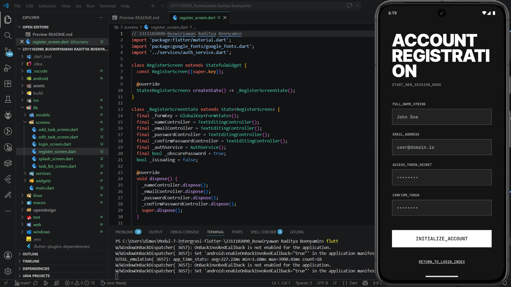
## Verifikasi Email
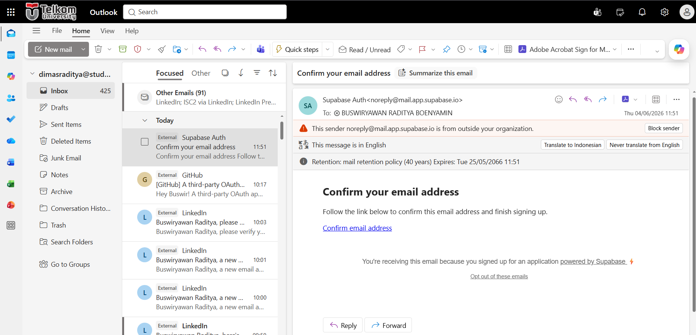
## Login Aplikasi
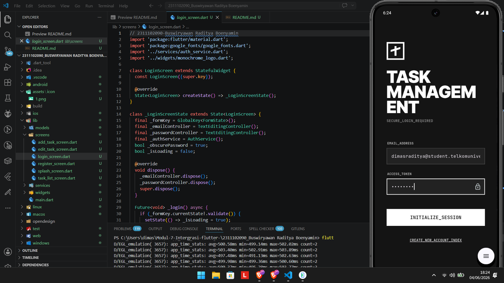
## Create Task
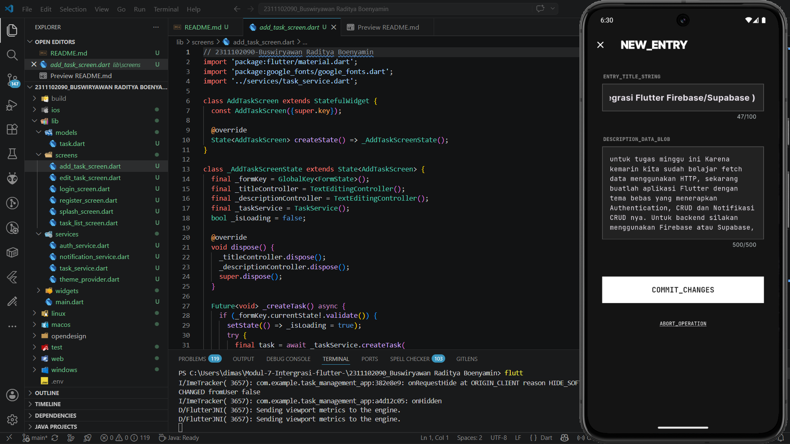
## Read Task
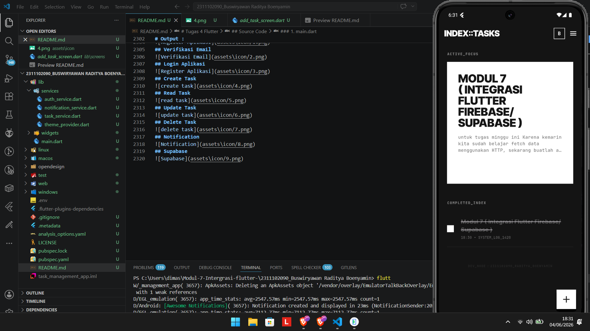
## Update Task
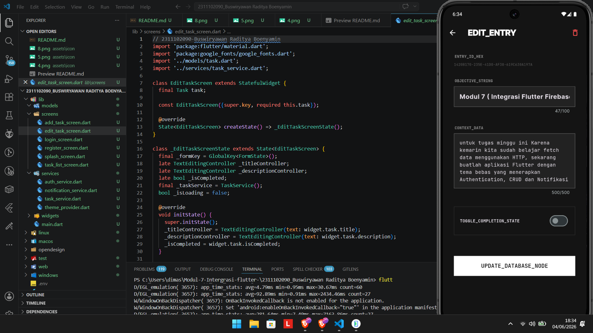
## Delete Task
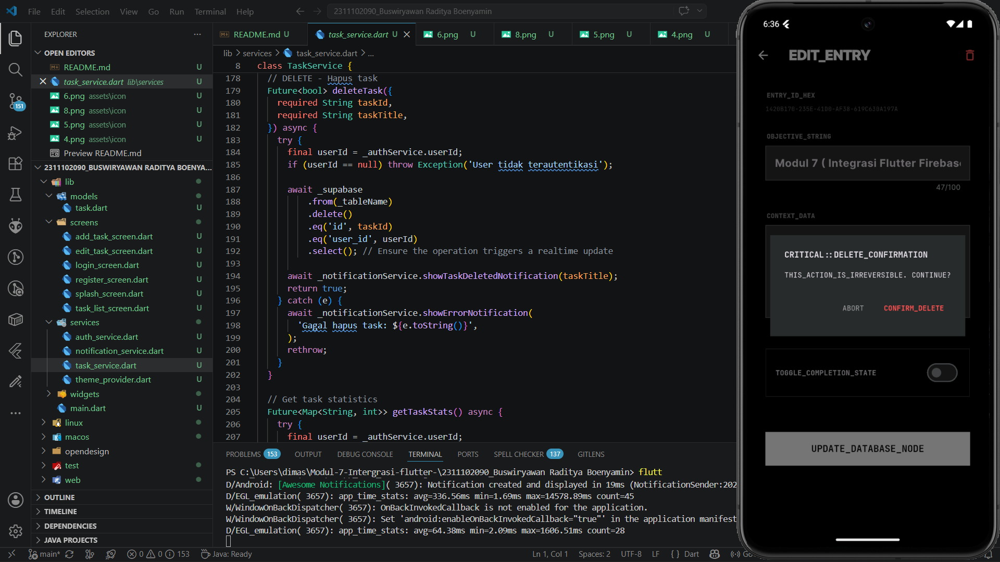
## Notification
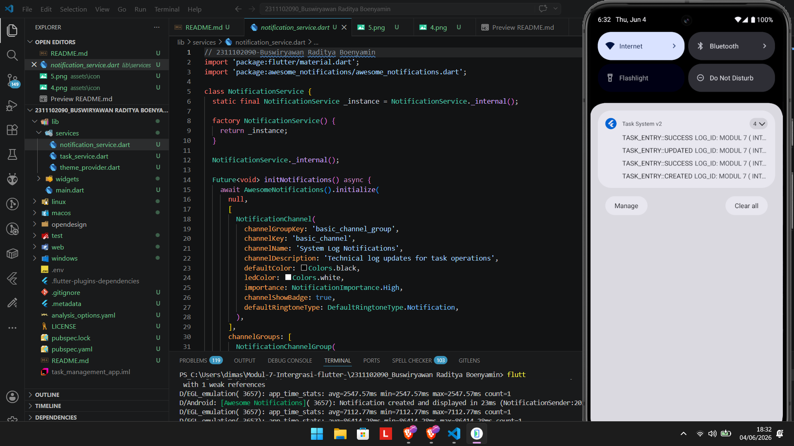
## Supabase
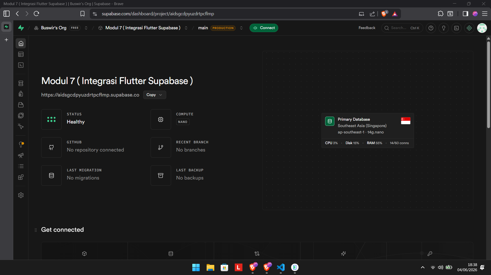
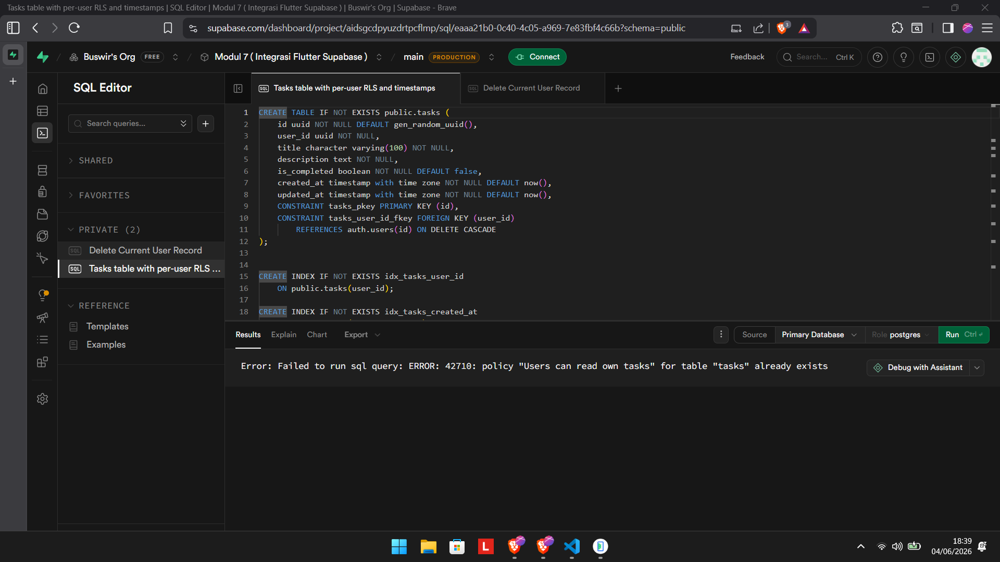
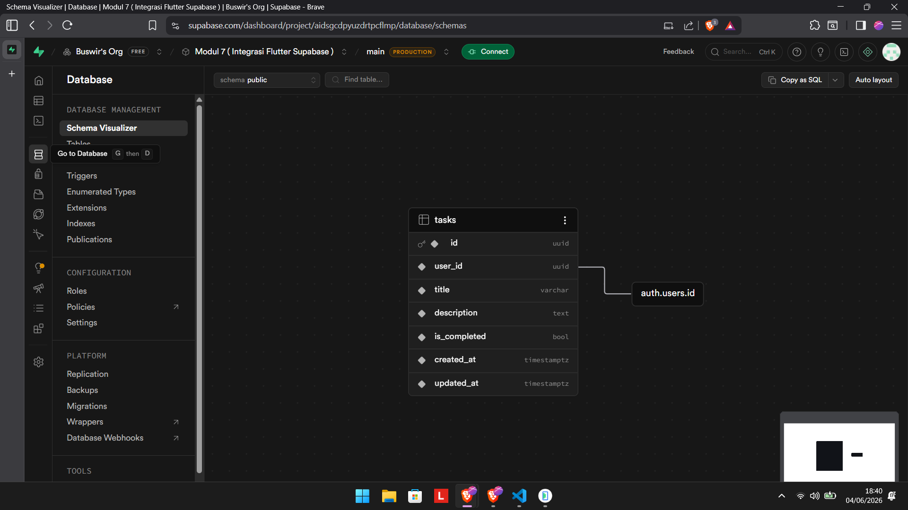
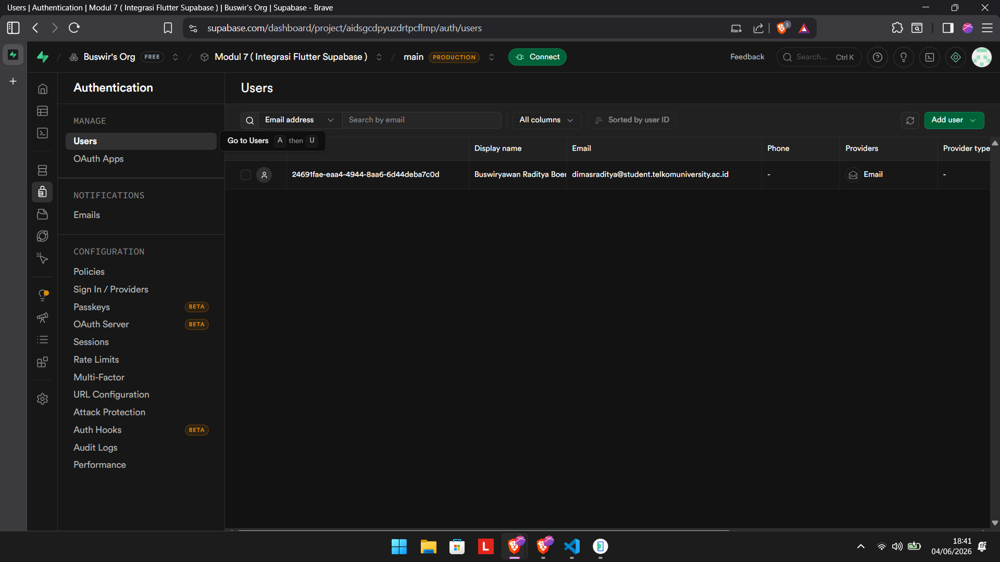

# Kesimpulan
  Aplikasi Manajemen Tugas ini merupakan perangkat lunak yang berfungsi untuk mengorganisasi aktivitas harian secara sistematis.
  Integrasi dengan basis data terpusat menjamin keamanan informasi dan sinkronisasi data pengguna secara akurat. Desain antarmuka yang
  menggunakan skema warna monokromatik bertujuan untuk meningkatkan fokus dan efisiensi interaksi pengguna. Secara keseluruhan,
  aplikasi ini telah berhasil menggabungkan fungsi manajemen tugas, sistem keamanan akun, dan layanan pengingat otomatis ke dalam satu
  platform yang fungsional dan mudah dioperasikan.