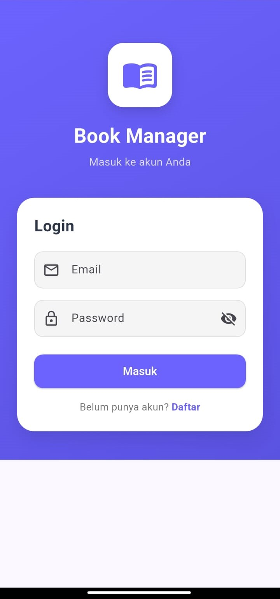
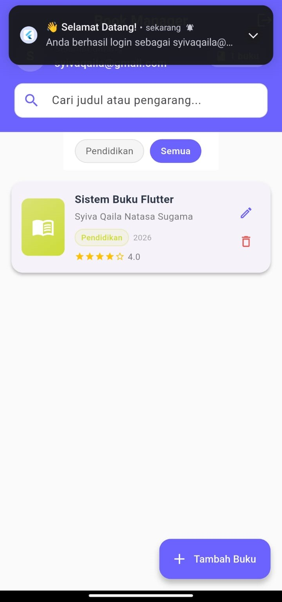
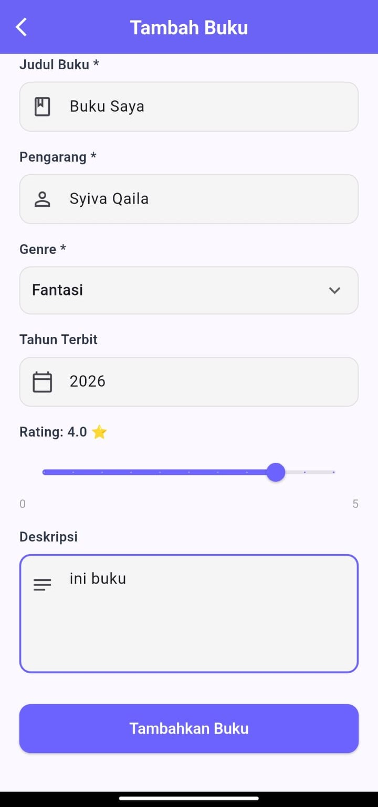
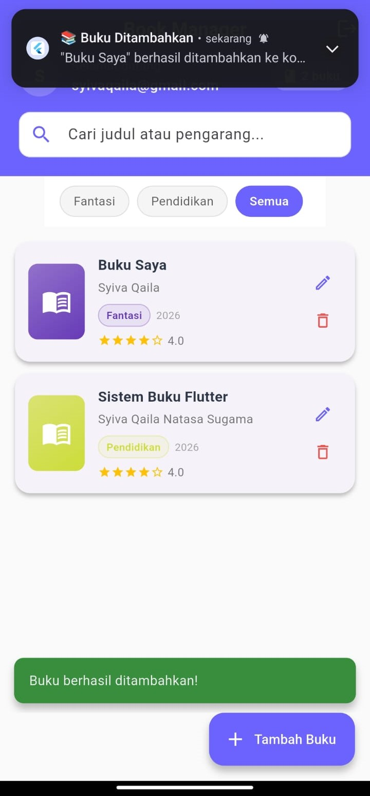

<div align="center">
    <br />
    <h1>LAPORAN PRAKTIKUM <br> APLIKASI BERBASIS PLATFORM </h1>
    <br />
    <h3>MODUL 7 <br> Integrasi Flutter Firebase Supabase </h3>
    <br />
    
    <br />
    <br />
    <br />
    <h3>Disusun Oleh :</h3>
    <p>
        <strong>Syiva Qaila Natasa Sugama</strong>
        <br>
        <strong>2311102106</strong>
        <br>
        <strong>S1 IF-11-REG05</strong>
    </p>
    <br />
    <h3>Dosen Pengampu :</h3>
    <p>
        <strong>Dedi Agung Prabowo, S.Kom., M.Kom</strong>
    </p>
    <br />
    <br />
    <h4>Asisten Praktikum :</h4>
    <strong>Apri Pandu Wicaksono </strong>
    <br>
    <strong>Hamka Zaenul Ardi</strong>
    <br />
    <h3>LABORATORIUM HIGH PERFORMANCE <br>FAKULTAS INFORMATIKA <br>UNIVERSITAS TELKOM PURWOKERTO <br>2026 </h3>
</div>
<hr>

## Dasar Teori

### 1. Ekosistem Flutter dan Arsitektur Backend-as-a-Service (BaaS)
Flutter merupakan framework sumber terbuka yang dikembangkan oleh Google untuk membangun aplikasi multi-platform yang terkompilasi secara native dari satu basis kode tunggal (single codebase). Dalam pengembangan aplikasi modern yang dinamis, Flutter membutuhkan integrasi dengan komponen sisi server (backend) untuk menangani manajemen data, autentikasi, dan komputasi awan.

Untuk meningkatkan efisiensi pengembangan, pendekatan Backend-as-a-Service (BaaS) sering digunakan sebagai alternatif dari pembuatan backend konvensional. BaaS menyediakan infrastruktur siap pakai berbasis awan (cloud-based infrastructure) yang mencakup database, autentikasi, penyimpanan file (storage), hingga fungsi serverless, sehingga pengembang dapat berfokus penuh pada logika aplikasi di sisi klien (frontend). Dua penyedia BaaS terkemuka saat ini adalah Firebase (oleh Google) dan Supabase (alternatif sumber terbuka berbasis PostgreSQL).

### 2. Firebase dan Firebase Core
Firebase adalah platform pengembangan aplikasi besutan Google yang menyediakan berbagai layanan backend terintegrasi. Untuk menghubungkan aplikasi Flutter dengan ekosistem Firebase, modul firebase_core wajib diinisialisasi terlebih dahulu di dalam fungsi utama (main()) aplikasi.


### 3. Firebase Authentication
Autentikasi merupakan gerbang utama dalam mengamankan hak akses data pengguna pada sebuah aplikasi. Firebase Authentication menyediakan layanan backend, SDK siap pakai, serta pustaka UI untuk memverifikasi identitas pengguna.
Layanan ini mendukung berbagai metode autentikasi, seperti berbasis email dan kata sandi (email and password authentication), penyedia identitas federasi (Google, Facebook, GitHub), hingga sistem token kustom. Dalam implementasinya, Firebase Authentication menghasilkan objek User yang memiliki atribut unik berupa uid (Unique Identifier). uid inilah yang bertindak sebagai kunci relasional (foreign key) untuk mengisolasi data di sisi database agar bersifat privat.

## Tugas Modul 7

### 1. Source Code

```dart
//Syiva Qaila Natasa Sugama 2311102106 IF-11-05
import 'package:flutter/material.dart';
import 'package:provider/provider.dart';
import '../../providers/auth_provider.dart';
import '../home/home_screen.dart';
import 'register_screen.dart';

class LoginScreen extends StatefulWidget {
  const LoginScreen({super.key});

  @override
  State<LoginScreen> createState() => _LoginScreenState();
}

class _LoginScreenState extends State<LoginScreen> {
  final _formKey = GlobalKey<FormState>();
  final _emailController = TextEditingController();
  final _passwordController = TextEditingController();
  bool _obscurePassword = true;

  @override
  void dispose() {
    _emailController.dispose();
    _passwordController.dispose();
    super.dispose();
  }
```

**Kode Lengkap:** [lib/screens/auth/login_screen.dart](lib/screens/auth/login_screen.dart)

```dart
//Syiva Qaila Natasa Sugama 2311102106 IF-11-05
import 'package:flutter/material.dart';
import 'package:provider/provider.dart';
import '../../providers/auth_provider.dart';
import '../../providers/book_provider.dart';
import '../../models/book_model.dart';
import '../../screens/auth/login_screen.dart';
import '../book/book_form_screen.dart';
import '../book/book_detail_screen.dart';
import '../../widgets/book_card.dart';
import '../../widgets/genre_filter_chip.dart';

class HomeScreen extends StatefulWidget {
  const HomeScreen({super.key});

  @override
  State<HomeScreen> createState() => _HomeScreenState();
}

class _HomeScreenState extends State<HomeScreen> {
  final _searchController = TextEditingController();

  @override
  void initState() {
    super.initState();
    WidgetsBinding.instance.addPostFrameCallback((_) {
      final authProvider = context.read<AuthProvider>();
      final bookProvider = context.read<BookProvider>();
      if (authProvider.user != null) {
        bookProvider.listenToBooks(authProvider.user!.uid);
      }
    });
  }
```

**Kode Lengkap:** [lib/screens/home/home_screen.dart](lib/screens/home/home_screen.dart)

```dart
//Syiva Qaila Natasa Sugama 2311102106 IF-11-05
import 'package:flutter/material.dart';
import 'package:firebase_core/firebase_core.dart';
import 'package:provider/provider.dart';

import 'firebase_options.dart';
import 'providers/auth_provider.dart';
import 'providers/book_provider.dart';
import 'screens/splash_screen.dart';

void main() async {
  WidgetsFlutterBinding.ensureInitialized();
  await Firebase.initializeApp(
    options: DefaultFirebaseOptions.currentPlatform,
  );
  runApp(const MyApp());
}
```

**Kode Lengkap:** [lib/main.dart](lib/main.dart)

### 2. Penjelasan

Book Manager adalah aplikasi mobile Flutter untuk mengelola koleksi buku pribadi, di mana pengguna bisa register/login menggunakan Firebase Authentication, lalu melakukan operasi CRUD (tambah, lihat, edit, hapus) data buku yang tersimpan secara online di Firestore. Setiap aksi CRUD memicu notifikasi lokal sebagai konfirmasi, dan data buku tiap user bersifat privat — hanya bisa diakses oleh pemiliknya.

### 3. Output




