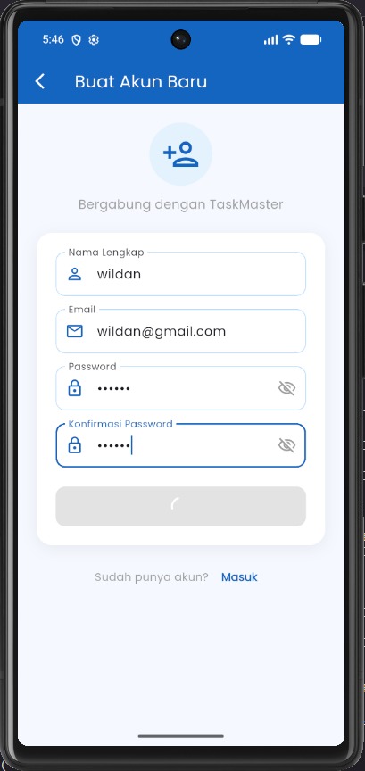
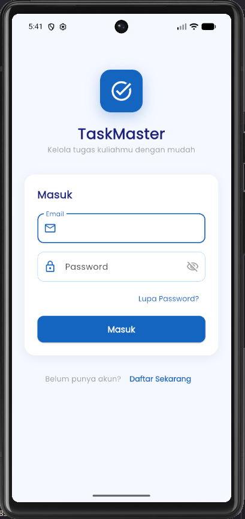
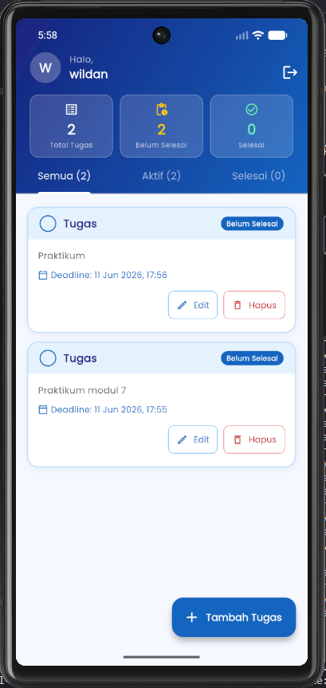
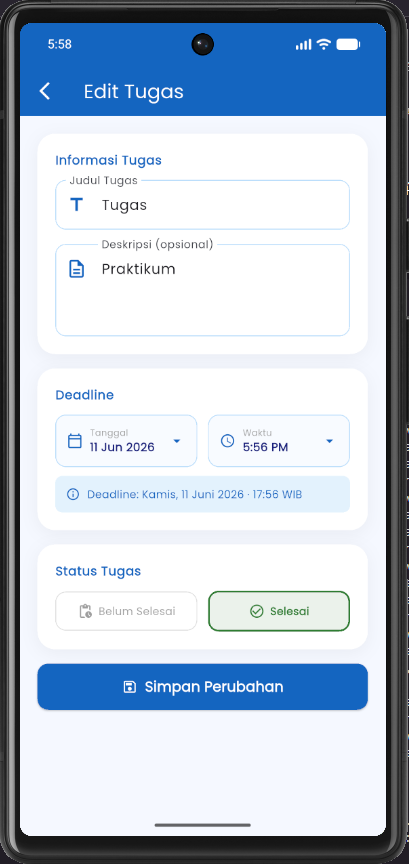
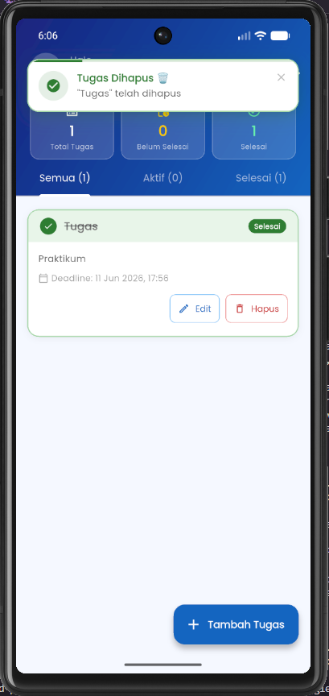

<div align="center">
    <br />
    <h1>LAPORAN PRAKTIKUM <br> APLIKASI BERBASIS PLATFORM </h1>
    <br />
    <h3>MODUL 7 <br> Integrasi Flutter Firebase/Supabase </h3>
    <br />
    
    <br />
    <br />
    <br />
    <h3>Disusun Oleh :</h3>
    <p>
        <strong>Wildan Fachri Dzulfikar</strong>
        <br>
        <strong>2311102107</strong>
        <br>
        <strong>S1 IF-11-REG05</strong>
    </p>
    <br />
    <h3>Dosen Pengampu :</h3>
    <p>
        <strong>Dedi Agung Prabowo, S.Kom., M.Kom</strong>
    </p>
    <br />
    <br />
    <h4>Asisten Praktikum :</h4>
    <strong>Apri Pandu Wicaksono </strong>
    <br>
    <strong>Hamka Zaenul Ardi</strong>
    <br />
    <h3>LABORATORIUM HIGH PERFORMANCE <br>FAKULTAS INFORMATIKA <br>UNIVERSITAS TELKOM PURWOKERTO <br>2026 </h3>
</div>
<hr>

## Dasar Teori

Pengembangan aplikasi berbasis platform modern saat ini sangat bergantung pada integrasi layanan berbasis awan (cloud services) untuk mempercepat proses pembangunan dan meningkatkan skalabilitas. Salah satu pendekatan yang paling populer adalah Backend-as-a-Service (BaaS), di mana pengembang tidak perlu membangun infrastruktur server dari awal, melainkan memanfaatkan layanan siap pakai yang mencakup autentikasi, basis data, hingga penyimpanan berkas. Firebase dan Supabase merupakan dua platform BaaS terkemuka yang sering diintegrasikan dengan framework lintas platform seperti Flutter. Firebase, yang dikembangkan oleh Google, menggunakan pendekatan basis data NoSQL (seperti Cloud Firestore), sedangkan Supabase hadir sebagai alternatif open-source yang berbasis pada keandalan Relational Database Management System (RDBMS) menggunakan PostgreSQL.

Dalam arsitektur aplikasi Flutter yang terhubung dengan Firebase atau Supabase, sistem autentikasi bertindak sebagai gerbang utama untuk mengamankan data pengguna. Layanan autentikasi ini menyediakan metode verifikasi identitas yang aman, mulai dari login berbasis email dan kata sandi tradisional hingga penyedia pihak ketiga (OAuth) seperti Google atau GitHub. Melalui pustaka resmi (SDK) yang disediakan oleh masing-masing platform, Flutter dapat dengan mudah mengelola sesi pengguna, mendeteksi status perubahan auth state secara real-time, serta menerapkan enkripsi standar industri untuk melindungi kredensial mahasiswa, sehingga setiap pengguna hanya dapat mengakses data yang menjadi haknya.

Selain autentikasi, komponen krusial dalam integrasi ini adalah sinkronisasi data secara real-time antara aplikasi client dan basis data awan. Cloud Firestore pada Firebase maupun fitur Realtime pada Supabase memungkinkan aplikasi Flutter memanfaatkan mekanisme Stream atau Subscription. Mekanisme ini memastikan bahwa setiap perubahan data yang terjadi di server—seperti penambahan, pembaruan, atau penghapusan tugas kuliah—akan langsung direfleksikan ke antarmuka aplikasi (User Interface) pengguna secara instan tanpa perlu memuat ulang (refresh) halaman secara manual. Hal ini sangat mendukung terciptanya pengalaman pengguna (user experience) yang responsif, dinamis, dan interaktif dalam manajemen tugas sehari-hari.

## Tugas Modul 7 

### 1. Source Code

```dart
//Wildan Fachri Dzulfikar
//2311102107
import 'package:firebase_auth/firebase_auth.dart';
import 'package:flutter/material.dart';
import '../../services/auth_service.dart';
import '../../widgets/app_notification.dart';
import 'register_screen.dart';
import 'reset_password_screen.dart';

class LoginScreen extends StatefulWidget {
  const LoginScreen({super.key});

  @override
  State<LoginScreen> createState() => _LoginScreenState();
}
```

**Kode Lengkap:** [lib/screens/auth/login_screen.dart](lib/screens/auth/login_screen.dart)

```dart
//Wildan Fachri Dzulfikar
//2311102107
import 'package:firebase_auth/firebase_auth.dart';
import 'package:flutter/material.dart';
import '../../services/auth_service.dart';
import '../../widgets/app_notification.dart';

class RegisterScreen extends StatefulWidget {
  const RegisterScreen({super.key});

  @override
  State<RegisterScreen> createState() => _RegisterScreenState();
}
```

**Kode Lengkap:** [lib/screens/auth/register_screen.dart](lib/screens/auth/register_screen.dart)

```dart
//Wildan Fachri Dzulfikar
//2311102107
import 'package:flutter/material.dart';
import 'package:firebase_auth/firebase_auth.dart';
import '../../models/task_model.dart';
import '../../services/auth_service.dart';
import '../../services/task_service.dart';
import '../../widgets/app_notification.dart';
import '../../widgets/task_card.dart';
import '../task/task_form_screen.dart';
class HomeScreen extends StatefulWidget {
  const HomeScreen({super.key});

  @override
  State<HomeScreen> createState() => _HomeScreenState();
}
```

**Kode Lengkap:** [lib/screens/home/home_screen.dart](lib/screens/home/home_screen.dart)

```dart
//Wildan Fachri Dzulfikar
//2311102107
import 'package:flutter/material.dart';
import 'package:intl/intl.dart';
import '../../models/task_model.dart';
import '../../services/auth_service.dart';
import '../../services/task_service.dart';
import '../../widgets/app_notification.dart';

class TaskFormScreen extends StatefulWidget {
  final TaskModel? task;

  const TaskFormScreen({super.key, this.task});

  @override
  State<TaskFormScreen> createState() => _TaskFormScreenState();
}
```

**Kode Lengkap:** [lib/screens/task/task_form_screen.dart](lib/screens/task/task_form_screen.dart)

```dart
//Wildan Fachri Dzulfikar
//2311102107
import 'package:flutter/material.dart';
import 'package:firebase_core/firebase_core.dart';
import 'package:google_fonts/google_fonts.dart';
import 'package:intl/date_symbol_data_local.dart';
import 'firebase_options.dart';
import 'screens/auth/login_screen.dart';
import 'screens/home/home_screen.dart';
import 'services/auth_service.dart';

void main() async {
  WidgetsFlutterBinding.ensureInitialized();
  await Firebase.initializeApp(
    options: DefaultFirebaseOptions.currentPlatform,
  );
  await initializeDateFormatting('id_ID', null);
  runApp(const TaskMasterApp());
}

class TaskMasterApp extends StatelessWidget {
  const TaskMasterApp({super.key});

```

**Kode Lengkap:** [lib/main.dart](lib/main.dart)

### 2. Penjelasan

TaskMaster adalah aplikasi manajemen tugas mahasiswa berbasis Flutter yang menggunakan Firebase Authentication untuk sistem login/register/reset password dan Cloud Firestore sebagai database real-time untuk menyimpan data tugas. Aplikasi ini memungkinkan setiap pengguna mengelola tugasnya sendiri secara penuh (tambah, lihat, edit, hapus, ubah status) lengkap dengan dashboard statistik dan notifikasi in-app yang muncul sebagai banner animasi di atas layar.

### 3. Output






