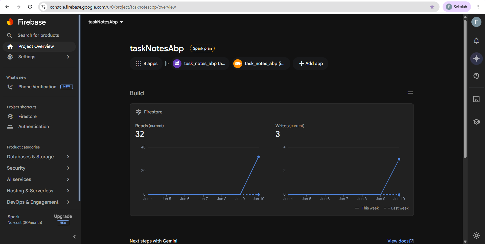
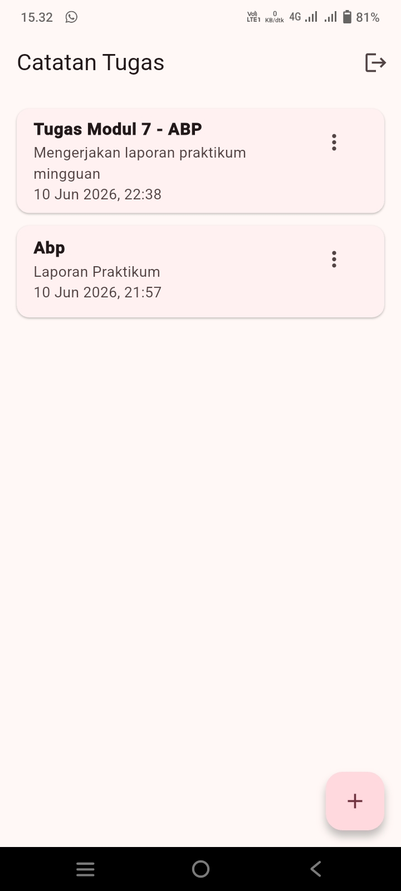
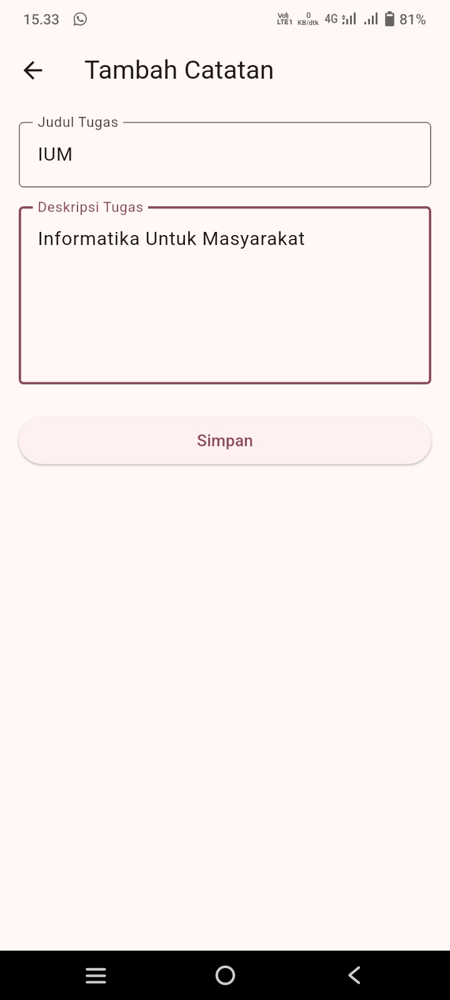
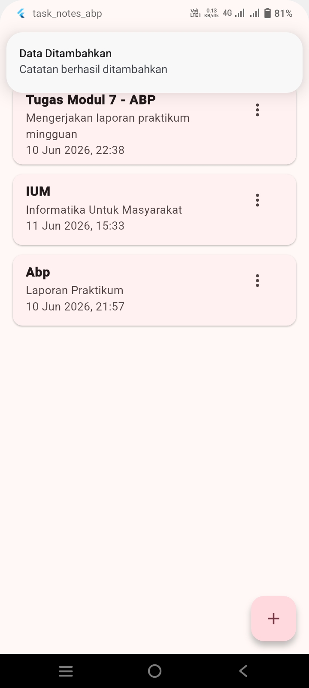
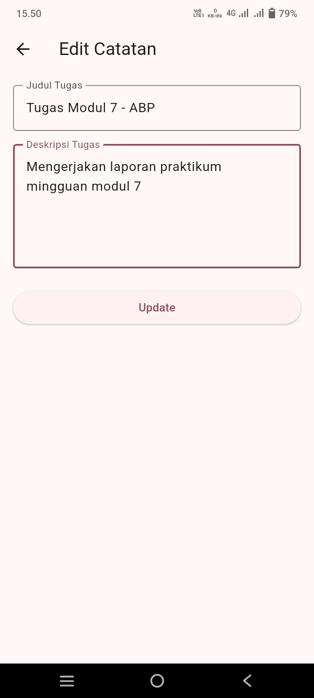
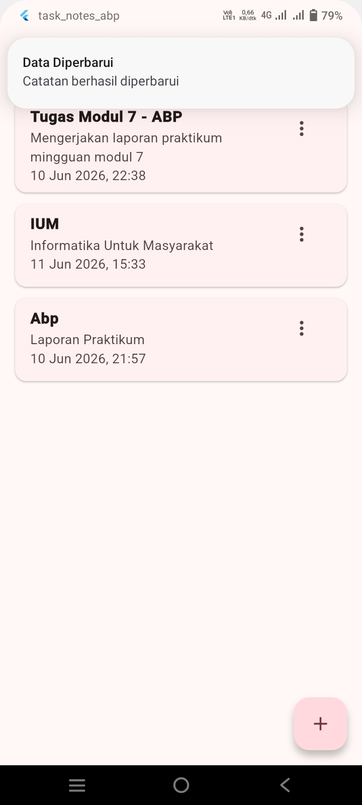

<div align="center">
  <br />
  <h1>LAPORAN PRAKTIKUM <br> APLIKASI BERBASIS PLATFORM </h1>
  <br />
  <h3>MODUL 7 <br> INTEGRASI FLUTTER </h3>
  <br />
  
  <br />
  <br />
  <br />
  <h3>Disusun Oleh :</h3>
  <p>
    <strong>Fajar Ario Abdillah</strong>
    <br>
    <strong>2311102114</strong>
    <br>
    <strong>S1 IF-11-REG05</strong>
  </p>
  <br />
  <h3>Dosen Pengampu :</h3>
  <p>
    <strong>Dedi Agung Prabowo, S.Kom., M.Kom</strong>
  </p>
  <br />
  <br />
  <h4>Asisten Praktikum :</h4>
  <strong>Apri Pandu Wicaksono </strong>
  <br>
  <strong>Hamka Zaenul Ardi</strong>
  <br />
  <h3>LABORATORIUM HIGH PERFORMANCE <br>FAKULTAS INFORMATIKA <br>UNIVERSITAS TELKOM PURWOKERTO <br>2026 </h3>
</div>

<hr>

# 1. Dasar Teori

## Aplikasi Mobile

Aplikasi mobile merupakan perangkat lunak yang dirancang untuk digunakan pada perangkat bergerak seperti smartphone dan tablet. Aplikasi ini dibuat untuk membantu pengguna melakukan aktivitas tertentu secara lebih mudah, cepat, dan praktis melalui perangkat yang dapat dibawa ke mana saja.

Dalam praktikum ini, aplikasi yang dikembangkan termasuk ke dalam aplikasi mobile karena dibuat menggunakan Flutter dan dijalankan pada perangkat Android. Aplikasi tersebut memiliki fungsi untuk membantu pengguna mencatat serta mengelola data catatan tugas secara digital. Dengan adanya aplikasi mobile ini, pengguna dapat melakukan proses login, menambahkan data, melihat data, mengubah data, dan menghapus data secara langsung melalui perangkat yang digunakan.

## Flutter

Flutter merupakan framework open-source yang digunakan untuk membangun aplikasi berbasis mobile, web, maupun desktop. Flutter dikembangkan menggunakan bahasa pemrograman Dart dan memungkinkan pengembang membuat aplikasi dengan tampilan antarmuka yang menarik serta responsif.

Dalam praktikum ini, Flutter digunakan sebagai framework utama untuk membuat aplikasi Catatan Tugas. Flutter dipilih karena mendukung pengembangan aplikasi Android dengan struktur kode yang cukup mudah dipahami. Selain itu, Flutter juga memudahkan pembuatan tampilan halaman seperti login, register, daftar catatan, serta form tambah dan edit data dalam satu project aplikasi.

## Dart

Dart adalah bahasa pemrograman yang digunakan untuk mengembangkan aplikasi Flutter. Bahasa ini memungkinkan pembuatan tampilan antarmuka, pengaturan logika aplikasi, pemrosesan data, serta integrasi dengan layanan backend seperti Firebase.

Dalam praktikum ini, Dart digunakan pada file seperti `main.dart`, `auth_service.dart`, `note_service.dart`, dan halaman login/register untuk membangun fitur login, register, CRUD data catatan, serta notifikasi yang muncul setelah aksi CRUD berhasil dilakukan.

## Firebase

Firebase merupakan platform backend yang disediakan oleh Google untuk membantu proses pengembangan aplikasi. Firebase menyediakan berbagai layanan seperti autentikasi pengguna, database online, penyimpanan file, hosting, dan layanan lain yang dapat digunakan tanpa harus membuat server secara manual.

Dalam praktikum ini, Firebase digunakan sebagai backend utama pada aplikasi Catatan Tugas. Firebase berfungsi untuk mengelola proses login dan register pengguna melalui Firebase Authentication serta menyimpan data catatan secara online menggunakan Cloud Firestore. Dengan adanya Firebase, data pada aplikasi dapat tersimpan secara terpusat dan dapat diakses kembali ketika pengguna melakukan login.

## Firebase Authentication

Firebase Authentication merupakan layanan dari Firebase yang digunakan untuk mengelola proses autentikasi pengguna dalam aplikasi. Autentikasi berfungsi untuk memastikan bahwa pengguna yang masuk ke dalam aplikasi adalah pengguna yang sudah memiliki akun dan terdaftar pada sistem.

Dalam praktikum ini, Firebase Authentication digunakan untuk membuat fitur register dan login menggunakan email serta password. Pengguna harus melakukan register terlebih dahulu sebelum dapat login ke aplikasi. Setelah berhasil login, pengguna dapat masuk ke halaman utama dan mengelola data catatan tugas. Dengan adanya Firebase Authentication, akses ke aplikasi menjadi lebih terkontrol karena hanya pengguna yang sudah terdaftar yang dapat menggunakan fitur utama aplikasi.

## Cloud Firestore

Cloud Firestore merupakan layanan database berbasis cloud yang disediakan oleh Firebase. Database ini digunakan untuk menyimpan dan mengelola data aplikasi secara online sehingga data dapat diakses kembali ketika pengguna membuka aplikasi.

Cloud Firestore menyimpan data dalam bentuk collection dan document. Pada praktikum ini, collection yang digunakan adalah notes, sedangkan setiap document berisi data catatan tugas pengguna. Data yang disimpan meliputi judul catatan, deskripsi catatan, userId, dan waktu pembuatan data. Dengan menggunakan Cloud Firestore, aplikasi dapat menjalankan proses tambah, tampil, edit, dan hapus data secara online.

## CRUD

CRUD merupakan singkatan dari Create, Read, Update, dan Delete, yaitu operasi dasar dalam pengelolaan data pada sebuah aplikasi. Pada aplikasi Catatan Tugas, penerapan CRUD dilakukan sebagai berikut:

1. Create – menambahkan catatan baru ke database Firestore.
2. Read – menampilkan daftar catatan yang sudah dibuat oleh pengguna.
3. Update – mengubah isi catatan yang sudah ada.
4. Delete – menghapus catatan dari database.

Dengan menggunakan CRUD, aplikasi dapat mengelola data secara online melalui Cloud Firestore, sehingga setiap perubahan data langsung tersimpan dan dapat diakses kembali ketika pengguna login.

## Notifikasi

Notifikasi merupakan pesan pemberitahuan yang ditampilkan oleh aplikasi kepada pengguna. Notifikasi berfungsi untuk memberikan informasi bahwa suatu proses atau aktivitas dalam aplikasi telah berhasil dilakukan.

Dalam praktikum ini, notifikasi digunakan untuk memberikan pemberitahuan setelah pengguna melakukan proses CRUD pada data catatan tugas. Notifikasi akan muncul ketika data berhasil ditambahkan, diperbarui, atau dihapus. Fitur notifikasi ini dibuat menggunakan package `flutter_local_notifications`, sehingga aplikasi dapat menampilkan pemberitahuan secara lokal pada perangkat pengguna.

## Struktur Data pada Firestore

Pada aplikasi ini, data catatan disimpan dalam collection bernama notes di Cloud Firestore. Setiap catatan disimpan sebagai document yang memiliki beberapa field, yaitu:

- `title` – untuk menyimpan judul catatan.
- `description` – untuk menyimpan isi atau keterangan catatan.
- `userId` – untuk menyimpan identitas pengguna yang membuat catatan, sehingga data hanya terkait dengan pengguna tersebut.
- `createdAt` – untuk mencatat waktu pembuatan catatan.

## Integrasi Flutter dan Firebase

Integrasi Flutter dan Firebase dilakukan agar aplikasi dapat menggunakan layanan backend Firebase, seperti Authentication dan Cloud Firestore.

Pada praktikum ini, integrasi dilakukan menggunakan Firebase CLI dan FlutterFire CLI, yang menghasilkan file konfigurasi `firebase_options.dart`. File ini berisi semua pengaturan yang dibutuhkan Flutter agar dapat terhubung dengan project Firebase yang telah dibuat.

Selain itu, package `firebase_core` digunakan untuk inisialisasi Firebase di aplikasi Flutter. Setelah Firebase terhubung, aplikasi dapat melakukan proses login/register, menyimpan data catatan secara online, dan menampilkan notifikasi CRUD.

Dengan integrasi ini, semua fitur backend aplikasi dapat berjalan secara real-time tanpa perlu membuat server sendiri.  

#  2. Pembahasan Tugas

## Deskripsi Aplikasi

Aplikasi yang dibuat pada praktikum ini adalah Catatan Tugas, sebuah aplikasi mobile berbasis Flutter. Aplikasi ini bertujuan untuk membantu pengguna mencatat, mengelola, dan menyimpan data catatan tugas secara digital dengan mudah dan cepat.

Fitur utama aplikasi meliputi:

- **Register dan Login** menggunakan email dan password untuk mengamankan akses pengguna.
- **Tambah, Tampilkan, Edit, dan Hapus catatan** secara online menggunakan Cloud Firestore.
- **Notifikasi CRUD** yang muncul setiap kali pengguna berhasil menambahkan, mengubah, atau menghapus data catatan.

Dengan aplikasi ini, pengguna dapat mengelola catatan tugas secara terstruktur dan data tersimpan secara aman di cloud, sehingga bisa diakses kembali kapan pun setelah login.

## Perancangan Aplikasi

Aplikasi ini dirancang untuk memudahkan pengguna dalam mencatat dan mengelola tugas secara digital. Alur penggunaan aplikasi dimulai dari halaman login, di mana pengguna memasukkan akun yang sudah terdaftar. Jika pengguna belum memiliki akun, dapat melakukan register terlebih dahulu. Setelah berhasil login, pengguna diarahkan ke halaman home yang menampilkan daftar catatan tugas. Pengguna dapat menambah catatan baru, mengedit catatan yang sudah ada, atau menghapus catatan melalui halaman Note Form Page.

Struktur halaman utama aplikasi:

- **Login Page** - Memungkinkan pengguna masuk ke aplikasi menggunakan email dan password
- **Registes Page** - Memungkinkan pengguna membuat akun baru untuk login
- **Home Page** - Menampilkan daftar catatan yang dimiliki pengguna
- **Note Form Page** - Digunakan untuk menambah atau mengedit catatan

Struktur folder project Flutter dibuat agar rapi dan mudah dipelihara. Contoh struktur folder:

```html
lib/
 ├─ main.dart
 ├─ firebase_options.dart
 ├─ pages/
 │   ├─ login_page.dart
 │   ├─ register_page.dart
 │   ├─ home_page.dart
 │   └─ note_form_page.dart
 ├─ services/
 │   ├─ auth_service.dart
 │   ├─ note_service.dart
 │   └─ notification_service.dart
 └─ models/
     └─ note_model.dart
```

Implementasi Struktur Folder seperti pada Gambar 2.1,


Gambar 2.1 Struktur Folder

## Konfigurasi Firebase

Firebase digunakan sebagai backend aplikasi untuk menyimpan data secara online dan mengelola autentikasi pengguna. Pada praktikum ini, konfigurasi Firebase dilakukan dengan langkah-langkah sebagai berikut:

1. Membuat Project Firebase

Project Firebase baru dibuat melalui Firebase Console dengan nama `taskNotesAbp` sebagai backend aplikasi.

2. Mengaktifkan Firebase Authentication

Fitur Authentication diaktifkan menggunakan metode **Email/Password** agar pengguna dapat melakukan registrasi dan login ke aplikasi.

3. Mengaktifkan Cloud Firestore

Cloud Firestore diaktifkan untuk menyimpan data catatan tugas secara online dalam bentuk collection `notes` dan dokumen dengan field `title`, `description`, `userId`, dan `createdAt`.

4. Menghubungkan Firebase ke Flutter

Integrasi dilakukan menggunakan FlutterFire CLI, yang menghasilkan file `firebase_options.dart`. File ini berisi konfigurasi Firebase agar aplikasi Flutter dapat terhubung ke project Firebase.

5. Package Firebase yang digunakan

Beberapa package Flutter digunakan untuk integrasi Firebase dan fitur pendukung, yaitu:

- `firebase_core` → inisialisasi Firebase di Flutter
- `firebase_auth` → fitur login dan register pengguna
- `cloud_firestore` → penyimpanan data CRUD online
- `flutter_local_notifications` → menampilkan notifikasi CRUD
- `intl` → memformat tanggal dan waktu data catatan

Dengan konfigurasi ini, aplikasi Flutter dapat melakukan login/register, mengelola data catatan tugas secara online, dan menampilkan notifikasi setiap kali pengguna melakukan aksi CRUD seperti ini pada Gambar 2.2,



Gambar 2.2 Konfigurasi terhadap Firebase

## Implementasi Authentication

Fitur Authentication pada aplikasi ini diterapkan menggunakan Firebase Authentication dengan metode email dan password. Fitur ini digunakan agar pengguna dapat membuat akun baru melalui halaman register dan masuk ke aplikasi melalui halaman login.

Pada proses register, pengguna diminta memasukkan email dan password. Data akun tersebut akan tersimpan pada Firebase Authentication. Setelah akun berhasil dibuat, pengguna dapat menggunakan email dan password yang sama untuk login ke aplikasi. Jika proses login berhasil, pengguna akan diarahkan ke halaman utama aplikasi yang menampilkan daftar catatan tugas.

Authentication juga digunakan untuk membatasi akses pengguna terhadap fitur utama aplikasi. Pengguna yang belum login tidak dapat masuk ke halaman pengelolaan catatan. Selain itu, aplikasi juga menyediakan fitur logout agar pengguna dapat keluar dari akun dan kembali ke halaman login.

Bukti Implementasi pada Authectication seperti pada Gambar 2.3,


Gambar 2.3 Implementasi Authentication

## Implementasi CRUD

Fitur CRUD pada aplikasi ini diterapkan untuk mengelola data catatan tugas pengguna. CRUD terdiri dari Create, Read, Update, dan Delete. Seluruh data catatan disimpan secara online menggunakan Cloud Firestore pada collection `notes`.

Pada fitur **Create**, pengguna dapat menambahkan catatan baru melalui halaman form catatan. Data yang dimasukkan berupa judul dan deskripsi catatan, kemudian disimpan ke Cloud Firestore. Pada fitur **Read**, aplikasi menampilkan daftar catatan yang sudah dibuat oleh pengguna pada halaman utama. Data tersebut diambil dari collection `notes` berdasarkan user yang sedang login.

Fitur **Update** digunakan untuk mengubah data catatan yang sudah ada. Pengguna dapat memilih catatan yang ingin diedit, kemudian memperbarui judul atau deskripsi catatan tersebut. Sementara itu, fitur **Delete** digunakan untuk menghapus catatan dari aplikasi dan database Firestore.

Penerapan CRUD pada aplikasi ini membuat pengguna dapat mengelola catatan tugas secara online. Setiap perubahan data yang dilakukan pengguna akan tersimpan pada Cloud Firestore sehingga data dapat diakses kembali setelah pengguna login.

Bukti mengenai Implementasi CRUD seperti pada Gambar 2.4, 2.5, 2.6, 2.7, 2.8, 2.9,



Gambar 2.4 Tampilan Sebelum CRUD



Gambar 2.5 Tampilan dilakukannya create



Gambar 2.6 Tampilan Setelah Create



Gambar 2.7 Tampilan Edit



Gambar 2.8 Tampilan Setelah Edit


Gambar 2.9 Tampilan Setelah Delete

## Implementasi Notifikasi CRUD

Implementasi notifikasi CRUD pada aplikasi ini dilakukan menggunakan package `flutter_local_notifications`. Notifikasi digunakan sebagai pemberitahuan kepada pengguna bahwa proses pengelolaan data catatan telah berhasil dilakukan.

Pada aplikasi Catatan Tugas, notifikasi ditampilkan setelah pengguna melakukan aksi CRUD tertentu, yaitu ketika berhasil menambahkan data, memperbarui data, dan menghapus data catatan. Setelah proses tambah data berhasil, aplikasi akan menampilkan notifikasi bahwa data telah ditambahkan. Ketika data berhasil diperbarui, aplikasi menampilkan notifikasi bahwa data telah diubah. Selain itu, saat data berhasil dihapus, aplikasi juga menampilkan notifikasi sebagai tanda bahwa catatan sudah terhapus dari aplikasi dan database.

Dengan adanya notifikasi CRUD, pengguna dapat mengetahui bahwa setiap aksi yang dilakukan telah berhasil diproses oleh aplikasi. Fitur ini juga membuat aplikasi menjadi lebih informatif karena memberikan umpan balik secara langsung kepada pengguna setelah proses pengelolaan data selesai.

Bukti mengenai Implementasi Notifikasi CRUD seperti pada Gambar 2.10, 2.11, 2.12,


Gambar 2.10 Tampilan Implementasi Notifikasi **Create**


Gambar 2.11 Tampilan Implementasi Notifikasi **Edit**


Gambar 2.12 Tampilan Implementasi Notifikasi **Delete**

## Struktur Data Firestore

Struktur data pada aplikasi Catatan Tugas dibuat menggunakan Cloud Firestore. Data catatan disimpan dalam sebuah collection bernama `notes`. Setiap data catatan yang ditambahkan oleh pengguna akan tersimpan sebagai document di dalam collection tersebut.

Setiap document pada collection `notes` memiliki beberapa field utama, yaitu `title`, `description`, `userId`, dan `createdAt`. Field `title` digunakan untuk menyimpan judul catatan, sedangkan `description` digunakan untuk menyimpan isi atau keterangan catatan. Field `userId` digunakan untuk menyimpan identitas pengguna yang sedang login, sehingga data catatan dapat dikaitkan dengan pemiliknya. Sementara itu, field `createdAt` digunakan untuk menyimpan waktu ketika catatan dibuat.

Dengan struktur data tersebut, aplikasi dapat menampilkan data catatan berdasarkan pengguna yang login. Selain itu, struktur ini juga mendukung proses CRUD karena setiap document dapat ditambahkan, dibaca, diperbarui, dan dihapus melalui Cloud Firestore.

Bukti mengenai Implementasi Notifikasi CRUD seperti pada Gambar 2.13,


Gambar 2.13 Struktur Data Firestore