<div align="center">
  <br />
  <h1>LAPORAN PRAKTIKUM <br> PEMROGRAMAN PERANGKAT BERGERAK</h1>
  <br />
  <h3>MODUL 7 <br> Integrasi Flutter Firebase/Supabase</h3>
  <br />
  
  <br />
  <br />
  <br />
  <h3>Disusun Oleh :</h3>
  <p>
    <strong>Amanda Windhu Gustyas</strong>
    <br>
    <strong>2311102121</strong>
    <br>
    <strong>S1 IF-11-REG05</strong>
  </p>
  <br />
  <h3>Dosen Pengampu :</h3>
  <p>
    <strong>Dedi Agung Prabowo, S.Kom., M.Kom</strong>
  </p>
  <br />
  <br />
  <h4>Asisten Praktikum :</h4>
  <strong>Apri Pandu Wicaksono</strong>
  <br>
  <strong>Hamka Zaenul Ardi</strong>
  <br />
  <h3>LABORATORIUM HIGH PERFORMANCE <br>FAKULTAS INFORMATIKA <br>UNIVERSITAS TELKOM PURWOKERTO <br>2026</h3>
</div>

<hr>

---

# Dasar Teori & Penjelasan Program

Pada modul ini, dikembangkan sebuah aplikasi **CRUD Mahasiswa** menggunakan Flutter yang terhubung langsung dengan layanan cloud Firebase. Aplikasi ini dirancang agar mampu mengelola data mahasiswa (nama, NIM, dan program studi) secara lengkap mulai dari menampilkan, menambah, mengubah, hingga menghapus data — dengan sistem login dan registrasi sebagai lapisan keamanan akses data.

Tiga konsep utama yang menjadi landasan implementasi pada modul ini adalah:

### a. Firebase Authentication

Firebase Authentication adalah layanan Google yang menyediakan mekanisme verifikasi identitas pengguna tanpa memerlukan pengelolaan server sendiri. Pada aplikasi ini, metode autentikasi yang digunakan adalah **Email & Password**. Setiap kali pengguna mendaftar, Firebase akan secara otomatis membuat akun baru dan menghasilkan sebuah **User ID (UID)** yang unik — sebuah kode pengenal yang menjadi kunci untuk memisahkan data antar pengguna di database. Sesi login pengguna pun tersimpan secara persisten, sehingga pengguna tidak perlu login ulang setiap kali membuka aplikasi.

### b. Cloud Firestore

Cloud Firestore adalah database berbasis dokumen (*document-based NoSQL*) yang berjalan di infrastruktur cloud Google. Berbeda dengan database relasional (SQL) yang menggunakan baris dan kolom, Firestore menyimpan data dalam bentuk **dokumen** yang tergabung dalam **koleksi**. Pada aplikasi ini, setiap data mahasiswa disimpan sebagai satu dokumen di dalam koleksi `mahasiswa`, dan setiap dokumen memiliki field `userId` yang mengikatnya kepada akun pengguna tertentu. Keunggulan lain Firestore adalah kemampuan *real-time listener* melalui `snapshots()`, di mana tampilan aplikasi akan otomatis diperbarui begitu ada perubahan data di server, tanpa perlu me-refresh secara manual.

### c. Notifikasi 

Untuk memberikan umpan balik yang responsif kepada pengguna, aplikasi ini mengimplementasikan notifikasi push lokal menggunakan paket `flutter_local_notifications`. Tidak seperti notifikasi dari server (FCM), notifikasi lokal ini diaktifkan langsung dari dalam kode aplikasi setelah sebuah operasi berhasil diselesaikan. Notifikasi akan muncul di bilah status (*status bar*) perangkat Android, mencakup kejadian seperti: login berhasil, registrasi berhasil, tambah data, edit data, maupun hapus data mahasiswa.

---

# Kode Implementasi

### 1. Kode Connect Database (Inisialisasi Firebase)

```dart
// lib/main.dart
// NIM: 2311102121 | Nama: Amanda Windhu Gustyas

void main() async {
  WidgetsFlutterBinding.ensureInitialized();

  // Menghubungkan aplikasi ke project Firebase menggunakan konfigurasi platform
  await Firebase.initializeApp(
    options: DefaultFirebaseOptions.currentPlatform,
  );

  // Meminta izin dan menyiapkan channel notifikasi sebelum aplikasi berjalan
  await NotificationService().init();

  runApp(const MyApp());
}
```

**Penjelasan:**
`WidgetsFlutterBinding.ensureInitialized()` wajib dipanggil di awal karena operasi `Firebase.initializeApp()` bersifat asinkron dan memerlukan binding Flutter sudah siap. File `firebase_options.dart` yang dihasilkan oleh perintah `flutterfire configure` berisi semua kunci API dan identitas project untuk masing-masing platform (Android, iOS, Web). Dengan meneruskan `DefaultFirebaseOptions.currentPlatform`, aplikasi secara otomatis memilih konfigurasi yang sesuai dengan platform tempat ia berjalan.

---

### 2. Kode Login dan Register

```dart
// lib/services/firebase_service.dart
// NIM: 2311102121 | Nama: Amanda Windhu Gustyas

class AppFirebaseService {
  final FirebaseAuth _auth = FirebaseAuth.instance;
  final FirebaseFirestore _firestore = FirebaseFirestore.instance;

  // Mendapatkan pengguna yang sedang aktif login
  User? get currentUser => _auth.currentUser;

  // Stream untuk memantau perubahan status login/logout secara real-time
  Stream<User?> get authStateChanges => _auth.authStateChanges();

  // Membuat akun baru dengan email dan password
  Future<UserCredential> registerWithEmailAndPassword(
      String email, String password) async {
    return await _auth.createUserWithEmailAndPassword(
      email: email,
      password: password,
    );
  }

  // Masuk menggunakan akun yang sudah terdaftar
  Future<UserCredential> loginWithEmailAndPassword(
      String email, String password) async {
    return await _auth.signInWithEmailAndPassword(
      email: email,
      password: password,
    );
  }

  // Keluar dari sesi aktif
  Future<void> logout() async {
    await _auth.signOut();
  }
}
```

**Penjelasan:**
Kelas `AppFirebaseService` dibuat menggunakan pola *Singleton* agar instansinya konsisten di seluruh aplikasi. Property `authStateChanges` adalah sebuah *Stream* yang sangat penting — ia digunakan oleh `AuthWrapper` di `main.dart` untuk memantau status sesi secara reaktif. Ketika pengguna berhasil login, stream ini memancarkan objek `User`, dan aplikasi otomatis berpindah ke `HomePage`. Saat logout, stream memancarkan `null` dan aplikasi kembali ke `LoginPage`. Pola ini menghilangkan kebutuhan routing manual yang rentan bug.

---

### 3. Kode CRUD (Firestore)

```dart
// lib/services/firebase_service.dart - bagian CRUD Mahasiswa
// NIM: 2311102121 | Nama: Amanda Windhu Gustyas

// CREATE - Menyimpan data mahasiswa baru ke Firestore
Future<void> addMahasiswa(String nama, String nim, String jurusan) async {
  if (currentUser == null) throw Exception("User not logged in");
  await _firestore.collection('mahasiswa').add({
    'userId'    : currentUser!.uid,   // Pengikat data ke akun pemilik
    'nama'      : nama,
    'nim'       : nim,
    'jurusan'   : jurusan,
    'createdAt' : FieldValue.serverTimestamp(),
  });
}

// READ - Mengalirkan daftar mahasiswa secara real-time
Stream<QuerySnapshot> getMahasiswaStream() {
  if (currentUser == null) throw Exception("User not logged in");
  return _firestore
      .collection('mahasiswa')
      .where('userId', isEqualTo: currentUser!.uid)
      .snapshots();
}

// UPDATE - Memperbarui data mahasiswa berdasarkan ID dokumen
Future<void> updateMahasiswa(
    String docId, String nama, String nim, String jurusan) async {
  await _firestore.collection('mahasiswa').doc(docId).update({
    'nama'      : nama,
    'nim'       : nim,
    'jurusan'   : jurusan,
    'updatedAt' : FieldValue.serverTimestamp(),
  });
}

// DELETE - Menghapus dokumen mahasiswa dari Firestore secara permanen
Future<void> deleteMahasiswa(String docId) async {
  await _firestore.collection('mahasiswa').doc(docId).delete();
}
```

**Penjelasan:**

- **Create:** Metode `.add()` digunakan karena Firestore akan secara otomatis menghasilkan ID dokumen yang unik. Field `userId` sengaja disisipkan agar satu akun tidak dapat membaca atau mengubah data milik akun lain — ini adalah implementasi dasar dari *data isolation*.
- **Read:** Daripada mengambil data satu kali (`.get()`), metode `.snapshots()` digunakan untuk membuat koneksi *stream* persisten. Di sisi UI, `StreamBuilder` mendengarkan stream ini dan merender ulang daftar setiap kali ada perubahan. Filter `.where('userId', ...)` memastikan setiap pengguna hanya melihat datanya sendiri.
- **Update:** Metode `.update()` hanya memodifikasi field yang disebutkan tanpa menimpa seluruh dokumen. `docId` diperoleh dari properti `.id` pada setiap dokumen yang dikembalikan oleh stream.
- **Delete:** Operasi ini bersifat permanen dan tidak dapat dibatalkan. Oleh karena itu, di sisi UI ditambahkan dialog konfirmasi sebelum `deleteMahasiswa()` dipanggil.

---

### 4. Kode Notifikasi

```dart
// lib/services/notification_service.dart
// NIM: 2311102121 | Nama: Amanda Windhu Gustyas

class NotificationService {
  // Singleton agar satu instansi dipakai di seluruh aplikasi
  static final NotificationService _instance = NotificationService._internal();
  factory NotificationService() => _instance;
  NotificationService._internal();

  final FlutterLocalNotificationsPlugin flutterLocalNotificationsPlugin =
      FlutterLocalNotificationsPlugin();

  // Inisialisasi: mendaftarkan channel dan meminta izin notifikasi
  Future<void> init() async {
    const AndroidInitializationSettings initializationSettingsAndroid =
        AndroidInitializationSettings('@mipmap/ic_launcher');

    const InitializationSettings initializationSettings =
        InitializationSettings(android: initializationSettingsAndroid);

    await flutterLocalNotificationsPlugin.initialize(
      settings: initializationSettings,
    );

    // Meminta izin notifikasi dari pengguna (Android 13+)
    flutterLocalNotificationsPlugin
        .resolvePlatformSpecificImplementation<
            AndroidFlutterLocalNotificationsPlugin>()
        ?.requestNotificationsPermission();
  }

  // Menampilkan notifikasi ke status bar perangkat
  Future<void> showNotification({
    required int id,
    required String title,
    required String body,
  }) async {
    const AndroidNotificationDetails androidDetails =
        AndroidNotificationDetails(
      'crud_mahasiswa_channel',
      'CRUD Mahasiswa Notifications',
      channelDescription: 'Notifikasi hasil operasi data mahasiswa',
      importance: Importance.max,
      priority: Priority.high,
    );

    await flutterLocalNotificationsPlugin.show(
      id: id,
      title: title,
      body: body,
      notificationDetails: const NotificationDetails(android: androidDetails),
    );
  }
}
```

```dart
// Contoh pemanggilan notifikasi di login_page.dart, register_page.dart, home_page.dart

// Setelah login berhasil:
await _notificationService.showNotification(
  id: 10,
  title: "Login Berhasil! 🎉",
  body: "Selamat datang kembali, ${_emailController.text.trim()}",
);

// Setelah register berhasil:
await _notificationService.showNotification(
  id: 11,
  title: "Registrasi Berhasil! ✨",
  body: "Akun berhasil dibuat. Selamat bergabung!",
);

// Setelah tambah data mahasiswa berhasil:
_notificationService.showNotification(
  id: 1, title: "Berhasil!", body: "Data mahasiswa berhasil ditambahkan.",
);

// Setelah edit data berhasil:
_notificationService.showNotification(
  id: 2, title: "Berhasil!", body: "Data mahasiswa berhasil diupdate.",
);

// Setelah hapus data berhasil:
_notificationService.showNotification(
  id: 3, title: "Dihapus!", body: "Data mahasiswa berhasil dihapus.",
);
```

**Penjelasan:**
`NotificationService` menggunakan pola *Singleton* agar objek plugin tidak diinisialisasi berulang kali. Proses `init()` dipanggil di `main()` sebelum `runApp()` untuk memastikan channel notifikasi sudah terdaftar di sistem Android sebelum ada notifikasi yang mencoba masuk. Parameter `id` pada `showNotification()` berfungsi sebagai penanda unik — jika `showNotification` dipanggil dengan `id` yang sama sebelum notifikasi sebelumnya dibersihkan, notifikasi lama akan digantikan alih-alih membuat notifikasi baru yang menumpuk.

---

# Output Screenshot

### 1. Register

<div>
  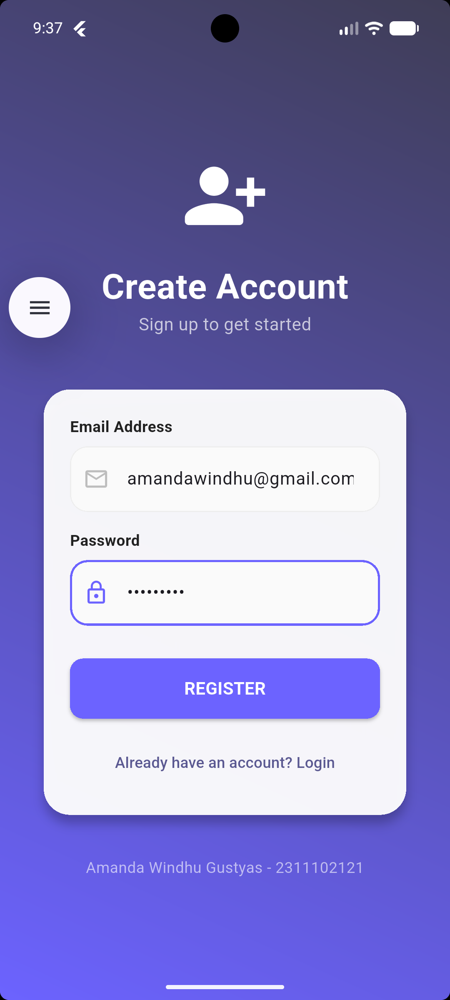
      
  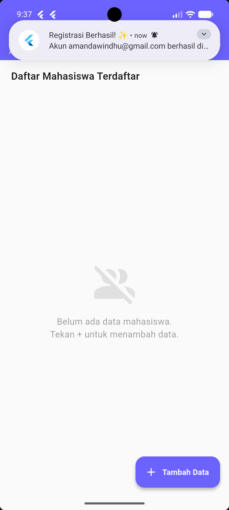
</div>

<br>

### 2. Login

<div>
  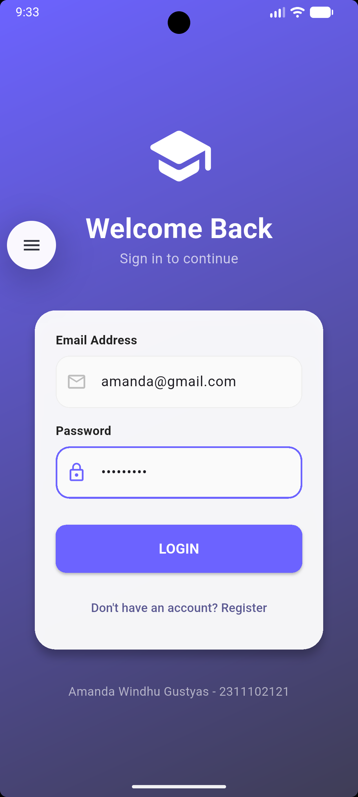
      
  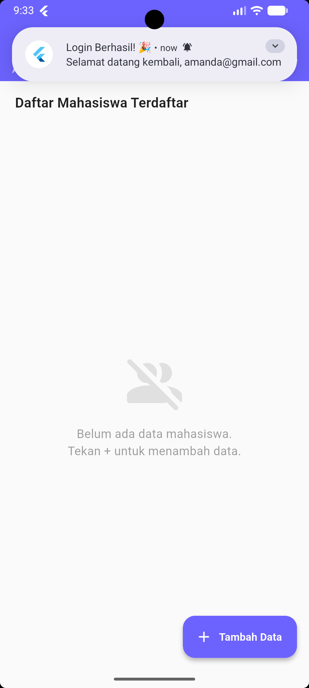
</div>

<br>

### 3. Create Data

<div>
  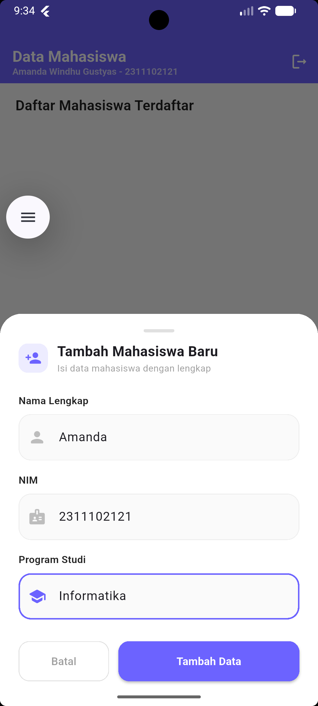
      
  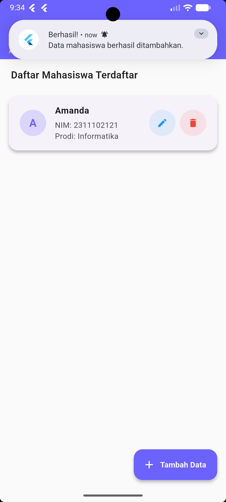
</div>

<br>

### 4. Edit Data

<div>
  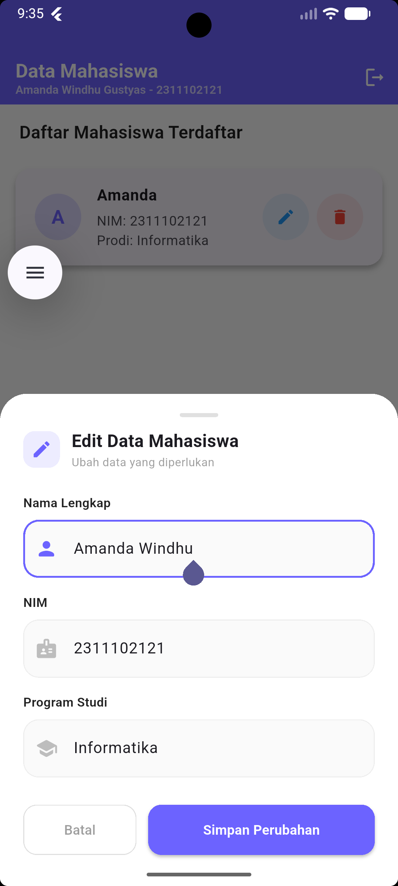
      
  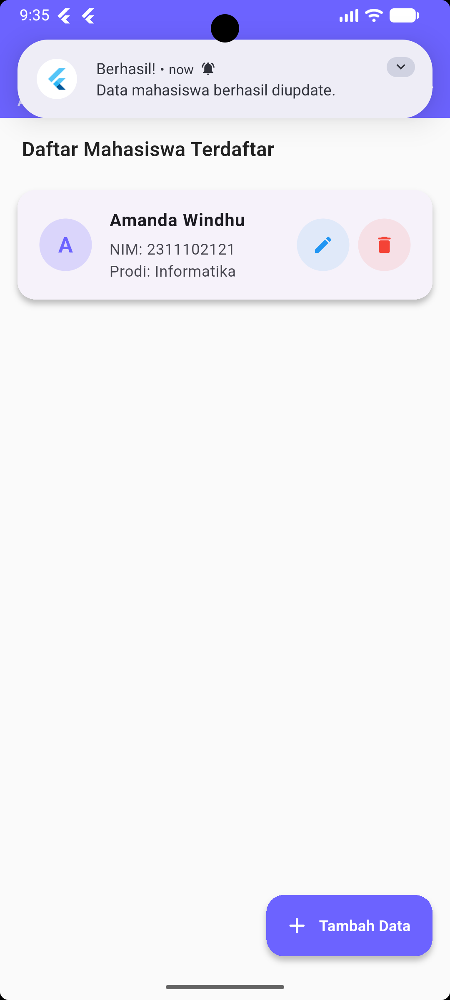
</div>

<br>

### 5. Delete Data

<div>
  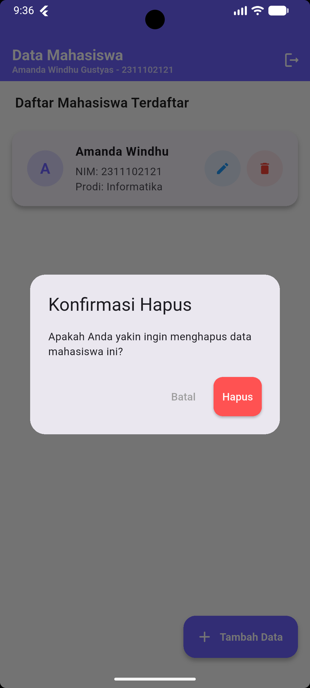
      
  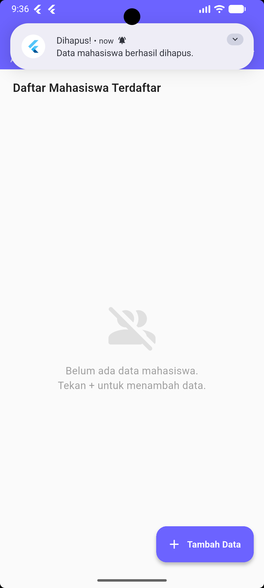
</div>

<br>

### 6. Notifikasi

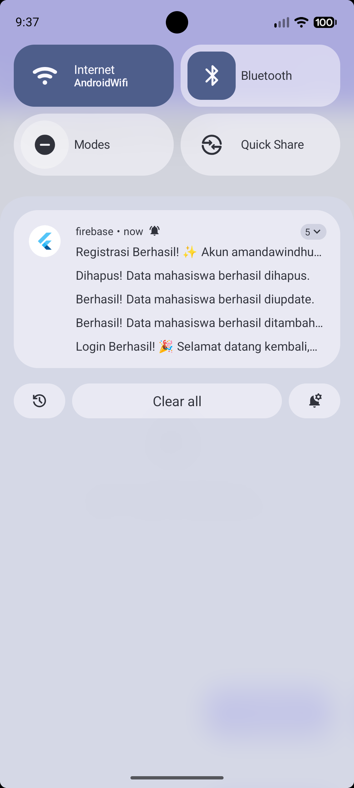

<br>

### 7. Firebase Authentication

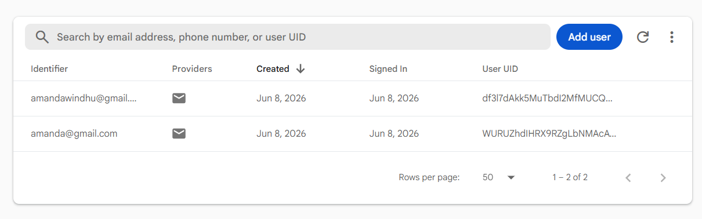

<br>

### 8. Firebase Database (Firestore)

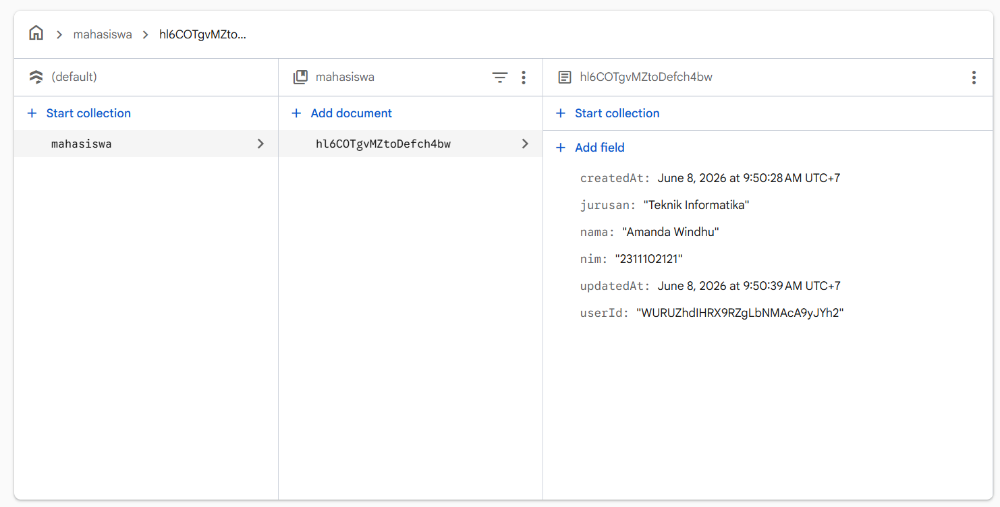

---