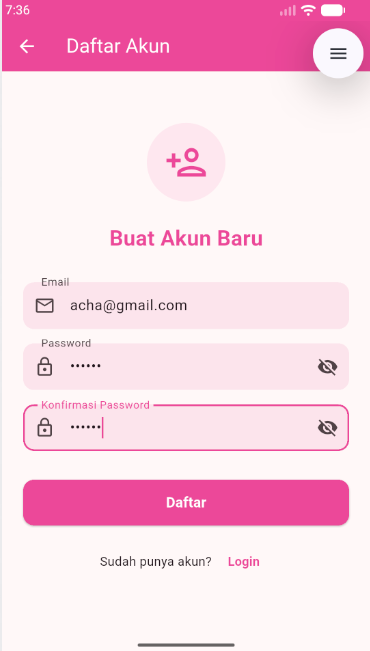
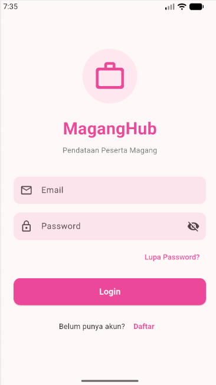
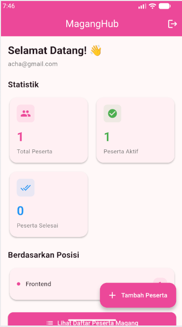
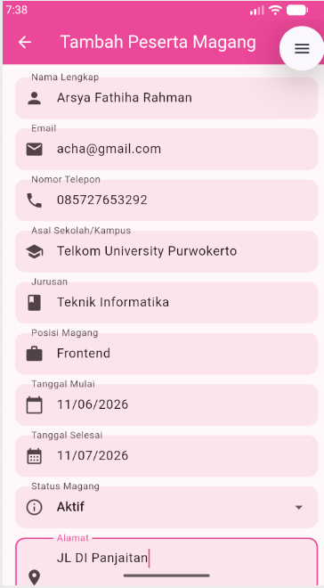
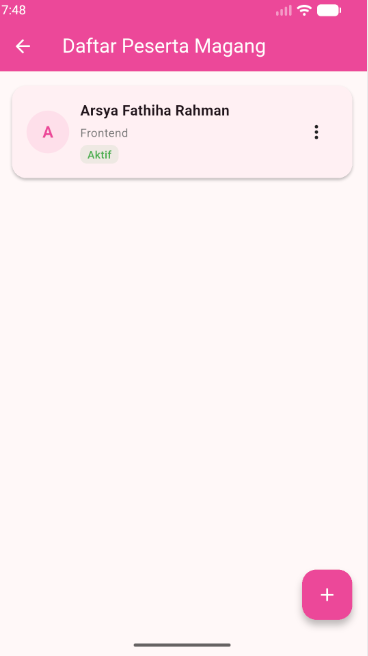
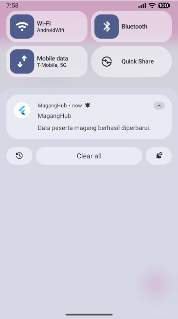

<div align="center">
    <br />
    <h1>LAPORAN PRAKTIKUM <br> APLIKASI BERBASIS PLATFORM </h1>
    <br />
    <h3>MODUL 7 <br> Integrasi Flutter Firebase/Supabase </h3>
    <br />
    
    <br />
    <br />
    <br />
    <h3>Disusun Oleh :</h3>
    <p>
        <strong>Arsya Fathiha Rahman</strong> 
        <br>
        <strong>2311102152</strong>
        <br>
        <strong>S1 IF-11-REG05</strong>
    </p>
    <br />
    <h3>Dosen Pengampu :</h3>
    <p>
        <strong>Dedi Agung Prabowo, S.Kom., M.Kom</strong>
    </p>
    <br />
    <br />
    <h4>Asisten Praktikum :</h4>
    <strong>Apri Pandu Wicaksono </strong>
    <br>
    <strong>Hamka Zaenul Ardi</strong>
    <br />
    <h3>LABORATORIUM HIGH PERFORMANCE <br>FAKULTAS INFORMATIKA <br>UNIVERSITAS TELKOM PURWOKERTO <br>2026 </h3>
</div>
<hr>

## Dasar Teori

Firebase merupakan platform pengembangan aplikasi mobile dan web yang dikembangkan oleh Google. Firebase menyediakan berbagai layanan backend seperti Firebase Authentication untuk mengelola autentikasi pengguna, Cloud Firestore sebagai database NoSQL yang bersifat real-time dan tersimpan di cloud, serta Firebase Cloud Messaging (FCM) untuk mengirimkan push notification ke perangkat pengguna. Dengan Firebase, developer tidak perlu membangun server backend sendiri karena seluruh infrastruktur sudah dikelola oleh Google.

Flutter adalah framework open-source dari Google untuk membangun aplikasi multi-platform (Android, iOS, Web, Desktop) menggunakan satu codebase dengan bahasa pemrograman Dart. Flutter menggunakan pendekatan widget-based UI yang memungkinkan developer membangun antarmuka yang responsif dan modern. Integrasi Flutter dengan Firebase dilakukan melalui plugin resmi seperti firebase_core, firebase_auth, cloud_firestore, dan firebase_messaging yang memudahkan koneksi ke layanan Firebase.

Push notification adalah mekanisme pengiriman pesan dari server ke perangkat pengguna secara real-time tanpa perlu aplikasi dalam keadaan terbuka. Firebase Cloud Messaging (FCM) memungkinkan pengiriman notifikasi pada kondisi foreground, background, maupun terminated. Pada Flutter, library flutter_local_notifications digunakan untuk menampilkan notifikasi secara lokal ketika aplikasi sedang aktif di foreground, sehingga pengguna tetap mendapatkan informasi terkini mengenai perubahan data pada aplikasi.

## Tugas Modul 7

### 1. Source Code

```dart
// Arsya Fathiha Rahman 2311102152 IF-11-05
import 'package:flutter/material.dart';
import '../services/auth_service.dart';
import 'register_screen.dart';
import 'reset_password_screen.dart';

class LoginScreen extends StatefulWidget {
  const LoginScreen({super.key});

  @override
  State<LoginScreen> createState() => _LoginScreenState();
}

class _LoginScreenState extends State<LoginScreen> {
  final _formKey = GlobalKey<FormState>();
  final _emailController = TextEditingController();
  final _passwordController = TextEditingController();
  final _authService = AuthService();
  bool _isLoading = false;
```
**Kode Lengkap:** [lib/screens/login_screen.dart](lib/screens/login_screen.dart)

```dart
// Arsya Fathiha Rahman 2311102152 IF-11-05
import 'package:flutter/material.dart';
import '../services/auth_service.dart';

class RegisterScreen extends StatefulWidget {
  const RegisterScreen({super.key});

  @override
  State<RegisterScreen> createState() => _RegisterScreenState();
}

class _RegisterScreenState extends State<RegisterScreen> {
  final _formKey = GlobalKey<FormState>();
  final _emailController = TextEditingController();
  final _passwordController = TextEditingController();
  final _confirmPasswordController = TextEditingController();
  final _authService = AuthService();
  bool _isLoading = false;
  bool _obscurePassword = true;
```
**Kode Lengkap:** [lib/screens/register_screen.dart](lib/screens/register_screen.dart)

```dart
// Arsya Fathiha Rahman 2311102152 IF-11-05
import 'package:flutter/material.dart';
import 'package:firebase_auth/firebase_auth.dart';
import '../services/auth_service.dart';
import '../services/firestore_service.dart';
import '../widgets/stat_card.dart';
import 'intern_list_screen.dart';
import 'add_intern_screen.dart';

class DashboardScreen extends StatefulWidget {
  const DashboardScreen({super.key});

  @override
  State<DashboardScreen> createState() => _DashboardScreenState();
}

class _DashboardScreenState extends State<DashboardScreen> {
  final _authService = AuthService();
  final _firestoreService = FirestoreService();
  String get _userId => FirebaseAuth.instance.currentUser?.uid ?? '';
```
**Kode Lengkap:** [lib/screens/dashboard_screen.dart](lib/screens/dashboard_screen.dart)

```dart
// Arsya Fathiha Rahman 2311102152 IF-11-05
import 'package:flutter/material.dart';
import 'package:firebase_auth/firebase_auth.dart';
import 'package:intl/intl.dart';
import '../models/intern_model.dart';
import '../services/firestore_service.dart';
import '../notifications/notification_service.dart';

class AddInternScreen extends StatefulWidget {
  const AddInternScreen({super.key});

  @override
  State<AddInternScreen> createState() => _AddInternScreenState();
}

class _AddInternScreenState extends State<AddInternScreen> {
  final _formKey = GlobalKey<FormState>();
  final _firestoreService = FirestoreService();

  final _namaController = TextEditingController();
```
**Kode Lengkap:** [lib/screens/add_intern_screen.dart](lib/screens/add_intern_screen.dart)

```dart
// Arsya Fathiha Rahman 2311102152 IF-11-05
import 'package:flutter/material.dart';
import 'package:firebase_core/firebase_core.dart';
import 'package:firebase_messaging/firebase_messaging.dart';
import 'firebase/firebase_options.dart';
import 'notifications/notification_service.dart';
import 'screens/login_screen.dart';
import 'screens/dashboard_screen.dart';
import 'package:firebase_auth/firebase_auth.dart';

@pragma('vm:entry-point')
Future<void> _firebaseMessagingBackgroundHandler(RemoteMessage message) async {
  await Firebase.initializeApp(options: DefaultFirebaseOptions.currentPlatform);
}

void main() async {
  WidgetsFlutterBinding.ensureInitialized();

  try {
    await Firebase.initializeApp(
```
**Kode Lengkap:** [lib/main.dart](lib/main.dart)

### 2. Penjelasan

Proyek MagangHub adalah aplikasi Flutter yang terintegrasi dengan Firebase untuk mengelola data peserta magang secara online, mencakup fitur autentikasi (login, register, logout, reset password), CRUD data peserta magang yang tersimpan di Cloud Firestore, dashboard statistik, serta push notification menggunakan Firebase Cloud Messaging dan flutter_local_notifications yang muncul setiap kali data berhasil ditambahkan, diperbarui, atau dihapus.

### 3. Output






