<div align="center">
  <br />
  <h1>LAPORAN PRAKTIKUM <br> PEMROGRAMAN PERANGKAT BERGERAK</h1>
  <br />
  <h3>MODUL 7 <br> Integrasi Flutter Firebase/Supabase</h3>
  <br />
  
  <br />
  <br />
  <br />
  <h3>Disusun Oleh :</h3>
  <p>
    <strong>Naya Putwi Setiasih</strong>
    <br>
    <strong>2311102155</strong>
    <br>
    <strong>S1 IF-11-REG05</strong>
  </p>
  <br />
  <h3>Dosen Pengampu :</h3>
  <p>
    <strong>Dedi Agung Prabowo, S.Kom., M.Kom</strong>
  </p>
  <br />
  <br />
  <h4>Asisten Praktikum :</h4>
  <strong>Apri Pandu Wicaksono</strong>
  <br>
  <strong>Hamka Zaenul Ardi</strong>
  <br />
  <h3>LABORATORIUM HIGH PERFORMANCE <br>FAKULTAS INFORMATIKA <br>UNIVERSITAS TELKOM PURWOKERTO <br>2026</h3>
</div>

<hr>

---

# Dasar Teori & Penjelasan Program

Aplikasi yang dibangun pada praktikum ini merupakan aplikasi pencatatan (Notes App) berbasis platform perangkat lunak bergerak yang memanfaatkan *framework* Flutter sebagai sisi *frontend* (antarmuka pengguna) dan layanan Firebase sebagai *Backend-as-a-Service (BaaS)*. Tujuan utama dari aplikasi ini adalah mempraktikkan bagaimana aplikasi *mobile* dapat terhubung secara *real-time* ke sistem *database* awan (*cloud database*) dan mengelola sesi pengguna secara instan dan aman.

Terdapat tiga fondasi pilar yang diterapkan pada modul ini:

1. **Autentikasi (Authentication):** Menggunakan layanan Firebase Authentication untuk mengelola pembuatan akun pengguna baru (*register*) dan proses masuk log (*login*) yang memanfaatkan protokol email dan kata sandi. Penggunaan layanan autentikasi eksternal ini memastikan bahwa setiap proses registrasi dan validasi *password* diproses serta dienkripsi dengan standar industri di *server* Google tanpa perlu *maintenance server* sendiri.
2. **Manajemen Data (CRUD):** Memanfaatkan Cloud Firestore, sebuah *database NoSQL* berkinerja tinggi buatan Google yang beroperasi secara nirserver (*serverless*) dan menyimpan data dalam format hierarki dokumen (*documents*) dan koleksi (*collections*). Fitur CRUD (*Create, Read, Update, Delete*) dijalankan secara masif untuk proses menyimpan catatan pengguna ke *collection* `notes`. Data juga diproteksi dengan menyisipkan identitas unik pengguna (`userId`), lalu data dipanggil secara asinkronus (*stream snapshots*) sehingga antarmuka daftar catatan akan memperbarui isinya (*auto-reload*) detik itu juga saat ada data baru masuk.
3. **Sistem Notifikasi Terintegrasi:** Sistem notifikasi diaplikasikan untuk memberikan interaksi balik *User Experience (UX)* secara seketika setelah aplikasi melakukan komunikasi asinkron (komunikasi belakang layar) dengan *database*. Terdapat dua tingkatan notifikasi; pertama adalah teguran halus di dalam tampilan aplikasi menggunakan *SnackBar*, dan kedua adalah notifikasi level sistem (memanfaatkan modul *Local Push Notifications*) yang muncul dari bilah status *Control Panel* bawaan Android/iOS layaknya pesan masuk WhatsApp, baik saat sukses login, menambah catatan, maupun mengubah catatan.

Penyatuan teknologi ini mengilustrasikan bagaimana seorang *developer* modern tidak harus membangun *REST API backend* dari awal menggunakan infrastruktur *server* konvensional, namun cukup memanfaatkan antarmuka penghubung SDK mutakhir yang ditawarkan oleh *platform backend* kekinian demi menghemat waktu *deployment*.

---

# Kode Implementasi

Berikut adalah penjabaran langsung berupa potongan kode yang digunakan dalam mengimplementasikan fungsionalitas integrasi *database*, autentikasi, fungsi pengolahan data CRUD, hingga pembentukan notifikasi.

### 1. Kode Connect Database (Inisialisasi Firebase)

```dart
void main() async {
  WidgetsFlutterBinding.ensureInitialized();
  
  // Menyiapkan plugin notifikasi lokal sebelum masuk aplikasi
  await NotificationService().init();

  try {
    // Inisialisasi Firebase Database menggunakan konfigurasi platform
    await Firebase.initializeApp(
      options: DefaultFirebaseOptions.currentPlatform,
    );
  } catch (e) {
    debugPrint("Firebase belum dikonfigurasi. Error: $e");
  }

  runApp(const MyApp());
}
```

**Penjelasan Kode:**
Fungsi `main()` ini merupakan pintu gerbang utama aplikasi. `WidgetsFlutterBinding.ensureInitialized()` ditugaskan untuk memastikan jembatan (binding) antara mesin *native* (Android/iOS) dan antarmuka Flutter sudah terhubung sebelum memanggil plugin. Setelah itu, perintah `Firebase.initializeApp()` menjalankan konfigurasi *credential/key* berdasarkan sistem operasi pengguna (`currentPlatform`). Jika inisialisasi tersebut sukses tanpa hambatan, barulah kanvas antarmuka utama (`runApp`) mulai dirender agar aplikasi dapat digunakan.

### 2. Kode Login dan Register

```dart
// Potongan Kode dari file: firebase_service.dart

// Register
Future<UserCredential> registerWithEmailAndPassword(String email, String password) async {
  return await _auth.createUserWithEmailAndPassword(
    email: email,
    password: password,
  );
}

// Login
Future<UserCredential> loginWithEmailAndPassword(String email, String password) async {
  return await _auth.signInWithEmailAndPassword(
    email: email,
    password: password,
  );
}
```

**Penjelasan Kode:**
Aplikasi memanfaatkan modul `FirebaseAuth` milik Firebase untuk menangani masalah otentikasi. Metode `createUserWithEmailAndPassword` akan membawa *email* dan kata sandi baru menuju *server* Firebase; apabila *email* belum pernah terdaftar, akun tersebut akan terbentuk beserta identitas uniknya (`UID`). Sementara itu, fungsi `signInWithEmailAndPassword` bertugas mengonfirmasi kecocokan *email* dan kata sandi yang dimasukkan (*login*); jika terverifikasi, aplikasi akan menerima token masuk yang memungkinkan pengguna untuk menjelajah menu utama (Dashboard).

### 3. Kode CRUD (Firestore)

```dart
// Potongan Kode dari file: firebase_service.dart

// Create (Add Note)
Future<void> addNote(String title, String content) async {
  if (currentUser == null) throw Exception("User not logged in");
  await _firestore.collection('notes').add({
    'userId': currentUser!.uid,
    'title': title,
    'content': content,
    'createdAt': FieldValue.serverTimestamp(),
  });
}

// Read (Get Notes Stream Real-Time)
Stream<QuerySnapshot> getNotesStream() {
  if (currentUser == null) throw Exception("User not logged in");
  return _firestore
      .collection('notes')
      .where('userId', isEqualTo: currentUser!.uid)
      .snapshots();
}

// Update (Edit Note)
Future<void> updateNote(String docId, String newTitle, String newContent) async {
  await _firestore.collection('notes').doc(docId).update({
    'title': newTitle,
    'content': newContent,
    'updatedAt': FieldValue.serverTimestamp(),
  });
}

// Delete (Delete Note)
Future<void> deleteNote(String docId) async {
  await _firestore.collection('notes').doc(docId).delete();
}
```

**Penjelasan Kode:**

- **Create:** Menggunakan perintah `.add()` pada referensi *collection* `notes`. Uniknya, kode menyisipkan *property* `userId` yang isinya didapat dari informasi token yang sedang login (`currentUser!.uid`). Hal ini krusial untuk mencegah catatan tercampur dengan milik orang lain.
- **Read:** Tidak menggunakan proses pengambilan tunggal, melainkan `snapshots()` untuk membentuk jembatan komunikasi (*Stream*) dua arah. Berkat klausa `where('userId', isEqualTo: currentUser!.uid)`, sistem otomatis memfilter dan hanya menarik data catatan yang pemiliknya sesuai. Jika ada perubahan data di sisi *database*, aplikasi seketika me-render ulang tampilannya secara *real-time*.
- **Update:** Metode `.update()` membidik *document ID* (kunci acak) spesifik pada dokumen untuk mengganti data judul dan isinya saja, termasuk menulis ulang rekam waktu modifikasi dengan `FieldValue.serverTimestamp()`.
- **Delete:** Fungsi `.delete()` menyingkirkan sebuah dokumen catatan dari peredaran *server* Cloud Firestore secara permanen berdasarkan *document ID* targetnya.

### 4. Kode Notifikasi

```dart
// Potongan Kode dari file: home_page.dart (Saat menekan tombol Simpan)

try {
  if (docId == null) {
    // 1. Jalankan Proses Tambah (Add)
    await _firebaseService.addNote(title, content);
  
    // 2. Pemanggilan Push Notification level Sistem (Emulator)
    NotificationService().showNotification(
      id: 1,
      title: 'Tambah Catatan',
      body: 'Catatan "$title" berhasil ditambahkan!',
    );
  } else {
    // 1. Jalankan Proses Edit (Update)
    await _firebaseService.updateNote(docId, title, content);
  
    // 2. Pemanggilan Push Notification level Sistem (Emulator)
    NotificationService().showNotification(
      id: 2,
      title: 'Edit Catatan',
      body: 'Catatan "$title" berhasil diperbarui!',
    );
  }
} catch (e) {
  debugPrint('Terjadi Kesalahan: $e');
}
```

**Penjelasan Kode:**
Rangkaian kode di atas berada di dalam *block* **`try-catch`**. Logikanya, aplikasi akan memanggil proses komunikasi asinkron (`await _firebaseService.addNote` atau `updateNote`) terlebih dahulu ke Firebase. Karena ini asinkron, baris kode selanjutnya tidak akan berjalan sampai *database* merespons "*Sukses*". Apabila server memberikan status "*Sukses*", barulah fungsi `showNotification()` tereksekusi yang bertugas merangsang fungsi sistem operasi untuk menurunkan panel *push notification* berisikan laporan interaktif ke *status bar* layar pengguna. Jika jaringan terputus atau *server error*, kode akan melompat ke blok `catch` dan notifikasi sukses tersebut dijamin tak akan muncul, melainkan memunculkan peringatan kegagalan.

---

# Output Screenshoot

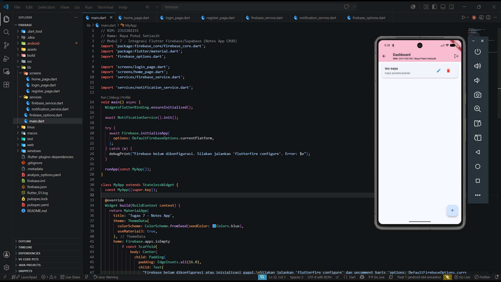

### 1. Register

<table>
  <tr>
    <td align="center"><b>Form Register</b></td>
    <td align="center"><b>Register Berhasil</b></td>
  </tr>
  <tr>
    <td>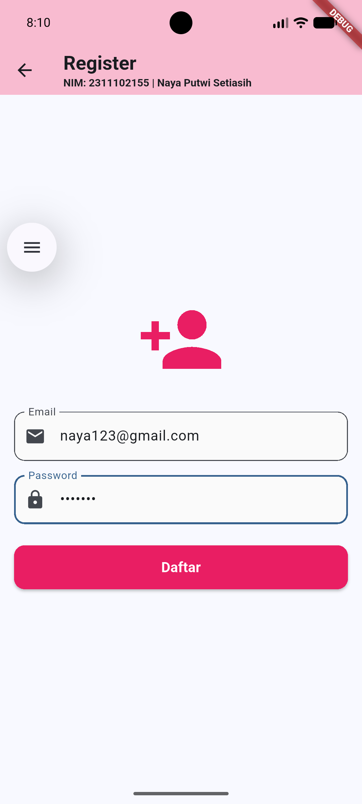</td>
    <td>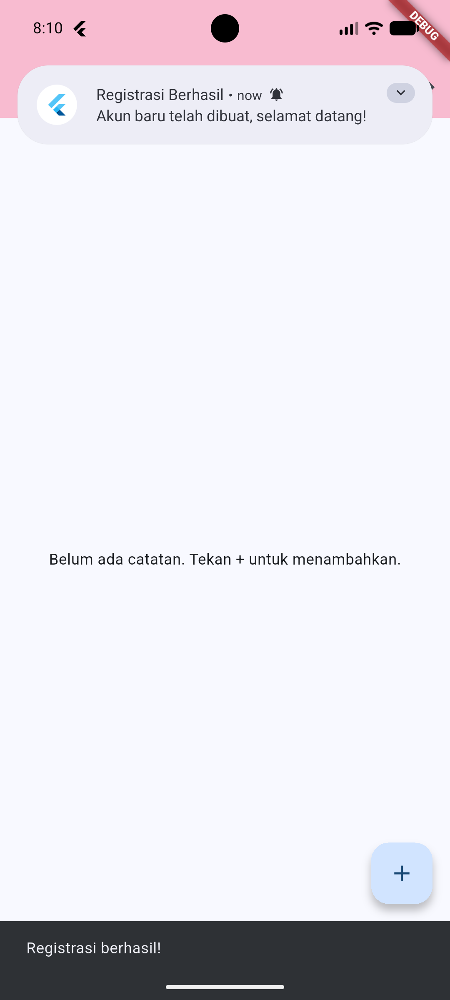</td>
  </tr>
</table>

<br>

### 2. Login

<table>
  <tr>
    <td align="center"><b>Form Login</b></td>
    <td align="center"><b>Login Berhasil</b></td>
  </tr>
  <tr>
    <td>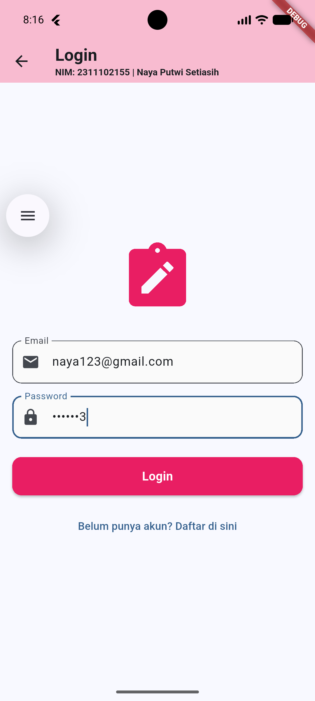</td>
    <td>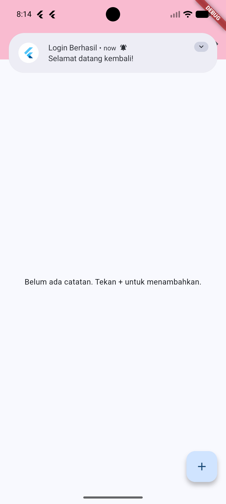</td>
  </tr>
</table>

<br>

### 3. Create Data

<table>
  <tr>
    <td align="center"><b>Form Tambah Catatan</b></td>
    <td align="center"><b>Tambah Catatan Berhasil</b></td>
  </tr>
  <tr>
    <td>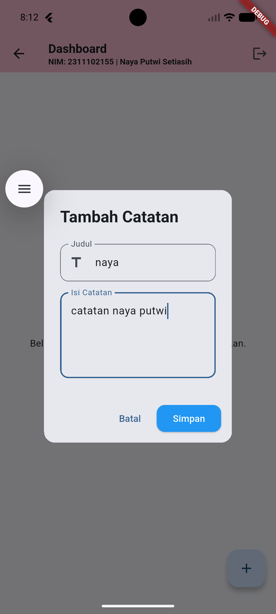</td>
    <td>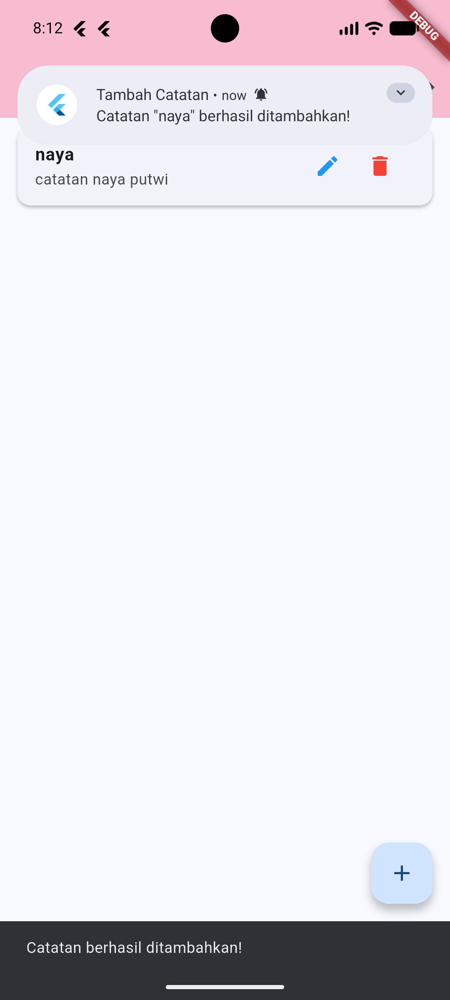</td>
  </tr>
</table>

<br>

### 4. Edit Data

<table>
  <tr>
    <td align="center"><b>Form Edit Catatan</b></td>
    <td align="center"><b>Edit Catatan Berhasil</b></td>
  </tr>
  <tr>
    <td>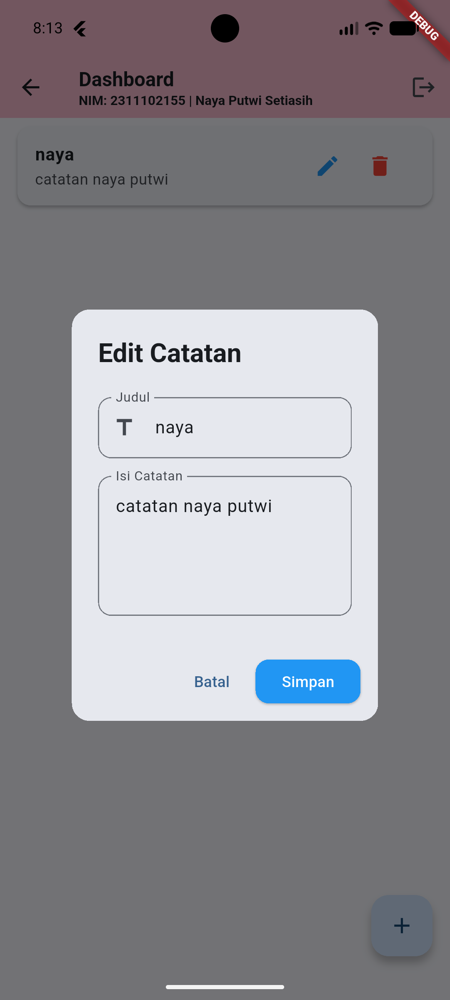</td>
    <td>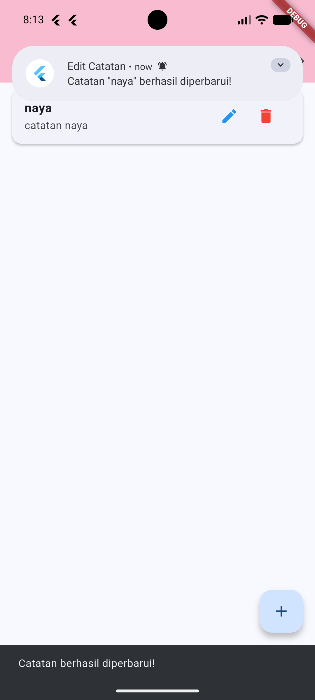</td>
  </tr>
</table>

<br>

### 5. Delete Data

<table>
  <tr>
    <td align="center"><b>Konfirmasi Hapus</b></td>
    <td align="center"><b>Hapus Berhasil</b></td>
  </tr>
  <tr>
    <td>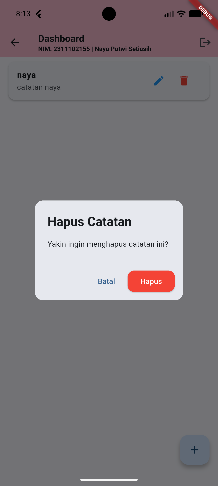</td>
    <td>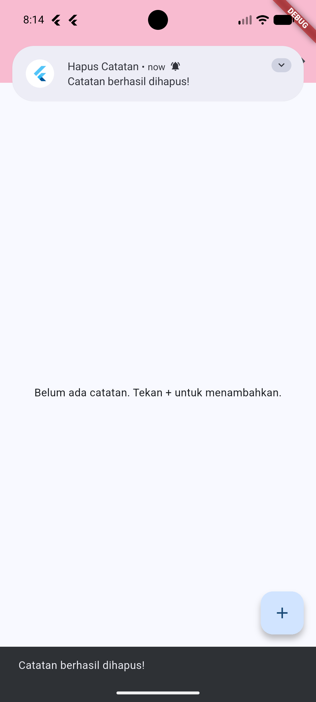</td>
  </tr>
</table>

<br>

### 6. Notifikasi

<table>
  <tr>
    <td align="center"><b>Push Notification Muncul</b></td>
  </tr>
  <tr>
    <td>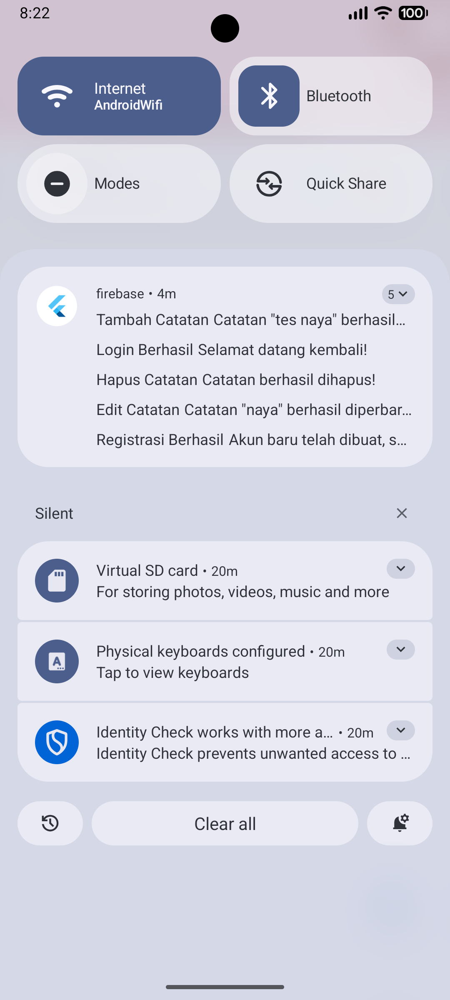</td>
  </tr>
</table>

### 7. Firebase Database

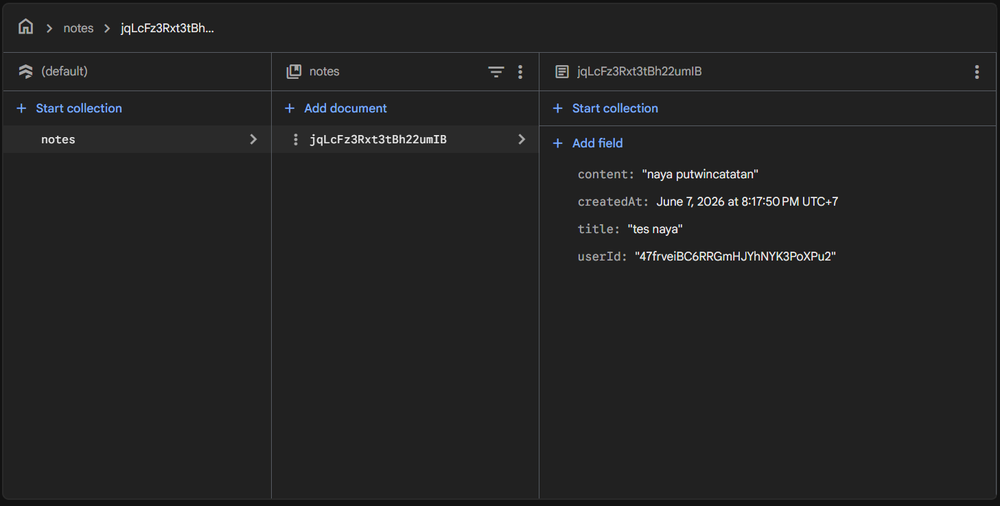

### 8. Firebase Auth

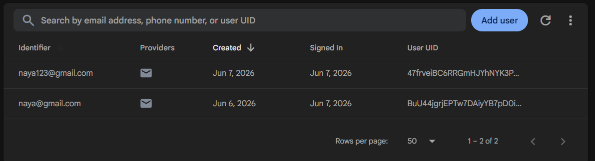
