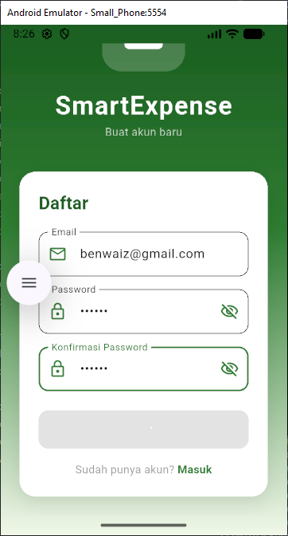
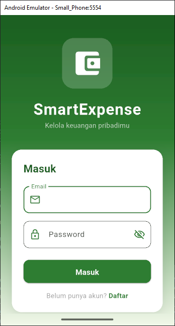
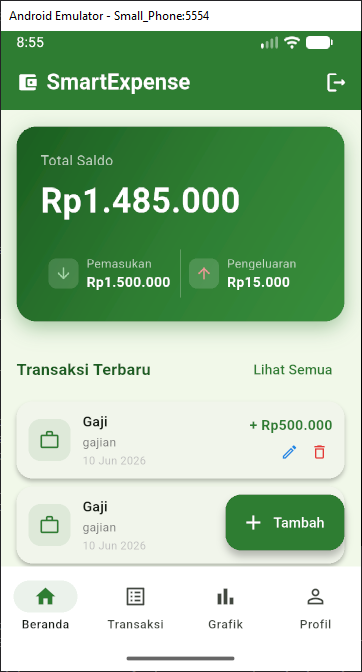
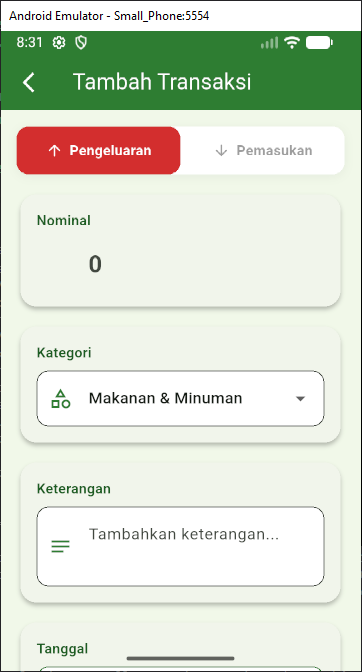
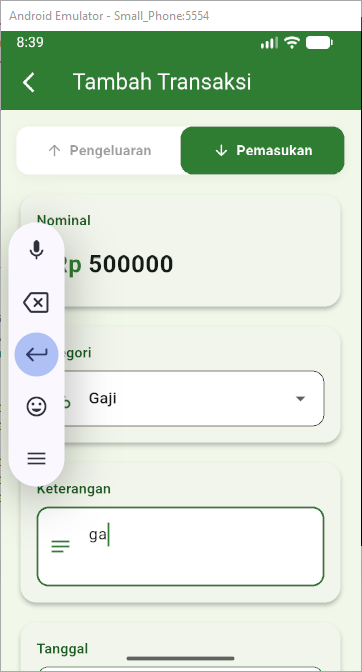
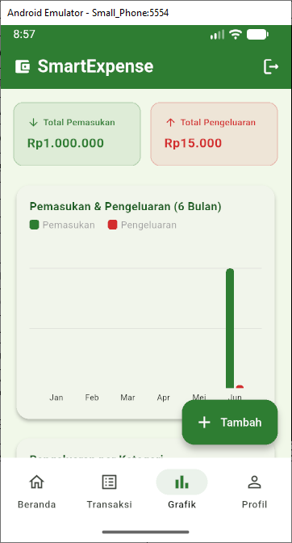

<div align="center">
    <br />
    <h1>LAPORAN PRAKTIKUM <br> APLIKASI BERBASIS PLATFORM </h1>
    <br />
    <h3>MODUL 7 <br> Integrasi Flutter Firebase/Supabase </h3>
    <br />
    
    <br />
    <br />
    <br />
    <h3>Disusun Oleh :</h3>
    <p>
        <strong>Ben Waiz Pintus W.</strong>
        <br>
        <strong>2311102169</strong>
        <br>
        <strong>S1 IF-11-REG05</strong>
    </p>
    <br />
    <h3>Dosen Pengampu :</h3>
    <p>
        <strong>Dedi Agung Prabowo, S.Kom., M.Kom</strong>
    </p>
    <br />
    <br />
    <h4>Asisten Praktikum :</h4>
    <strong>Apri Pandu Wicaksono </strong>
    <br>
    <strong>Hamka Zaenul Ardi</strong>
    <br />
    <h3>LABORATORIUM HIGH PERFORMANCE <br>FAKULTAS INFORMATIKA <br>UNIVERSITAS TELKOM PURWOKERTO <br>2026 </h3>
</div>
<hr>

## Dasar Teori


## Tugas Modul 7 

### 1. Source Code

```dart
//Ben Waiz Pintus W.
//2311102169
//IF-11-05
import 'package:flutter/material.dart';
import 'package:firebase_auth/firebase_auth.dart';
import '../../services/auth_service.dart';
import 'register_screen.dart';

class LoginScreen extends StatefulWidget {
  const LoginScreen({super.key});

  @override
  State<LoginScreen> createState() => _LoginScreenState();
}
```

**Kode Lengkap:** [lib/screens/auth/login_screen.dart](lib/screens/auth/login_screen.dart)

```dart
//Ben Waiz Pintus W.
//2311102169
//IF-11-05
import 'package:flutter/material.dart';
import 'package:firebase_auth/firebase_auth.dart';
import '../../services/auth_service.dart';

class RegisterScreen extends StatefulWidget {
  const RegisterScreen({super.key});

  @override
  State<RegisterScreen> createState() => _RegisterScreenState();
}
```

**Kode Lengkap:** [lib/screens/auth/register_screen.dart](lib/screens/auth/register_screen.dart)

```dart
//Ben Waiz Pintus W.
//2311102169
//IF-11-05
import 'package:flutter/material.dart';
import '../../services/auth_service.dart';
import '../../services/transaction_service.dart';
import '../../models/transaction_model.dart';
import '../../utils/formatters.dart';
import '../../utils/notification_helper.dart';
import '../transaction/add_edit_transaction_screen.dart';
import '../../widgets/summary_card.dart';
import '../../widgets/transaction_list_item.dart';
import '../../widgets/chart_section.dart';

class HomeScreen extends StatefulWidget {
  const HomeScreen({super.key});

  @override
  State<HomeScreen> createState() => _HomeScreenState();
}
```

**Kode Lengkap:** [lib/screens/home/home_screen.dart](lib/screens/home/home_screen.dart)

```dart
//Ben Waiz Pintus W.
//2311102169
//IF-11-05
import 'package:flutter/material.dart';
import 'package:intl/intl.dart';
import 'package:uuid/uuid.dart';
import '../../models/transaction_model.dart';
import '../../services/transaction_service.dart';
import '../../utils/notification_helper.dart';

class AddEditTransactionScreen extends StatefulWidget {
  final String userId;
  final TransactionModel? transaction;

  const AddEditTransactionScreen({
    super.key,
    required this.userId,
    this.transaction,
  });

  @override
  State<AddEditTransactionScreen> createState() =>
      _AddEditTransactionScreenState();
}
```

**Kode Lengkap:** [lib/screens/transaction/add_edit_transaction.dart](lib/screens/transaction/add_edit_transaction.dart)

```dart
//Ben Waiz Pintus W.
//2311102169
//IF-11-05
import 'package:flutter/material.dart';
import 'package:firebase_core/firebase_core.dart';
import 'package:intl/date_symbol_data_local.dart';
import 'firebase_options.dart';
import 'screens/auth/login_screen.dart';
import 'screens/home/home_screen.dart';
import 'services/auth_service.dart';

void main() async {
  WidgetsFlutterBinding.ensureInitialized();
  await Firebase.initializeApp(
    options: DefaultFirebaseOptions.currentPlatform,
  );
  await initializeDateFormatting('id_ID', null);
  runApp(const SmartExpenseApp());
}
```

**Kode Lengkap:** [lib/main.dart](lib/main.dart)

### 2. Penjelasan

SmartExpense adalah aplikasi catatan keuangan pribadi berbasis Flutter yang terintegrasi dengan Firebase Authentication untuk manajemen akun pengguna dan Cloud Firestore sebagai database real-time. Aplikasi ini memungkinkan pengguna mencatat, mengelola (tambah, edit, hapus), dan memvisualisasikan transaksi pemasukan maupun pengeluaran mereka melalui ringkasan saldo dan grafik interaktif dengan tampilan tema hijau modern.

### 3. Output








