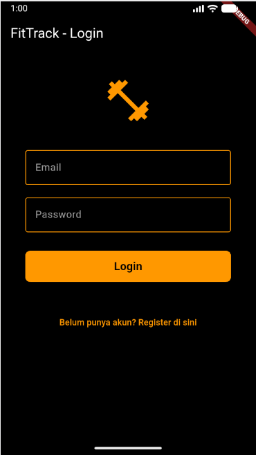
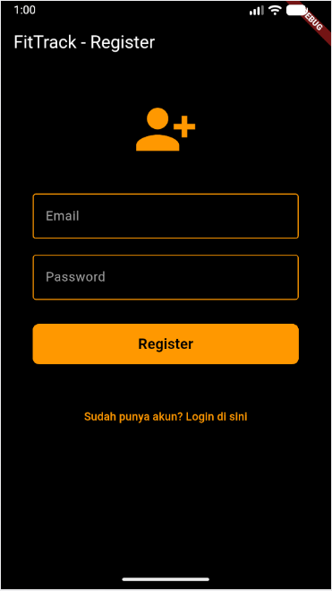
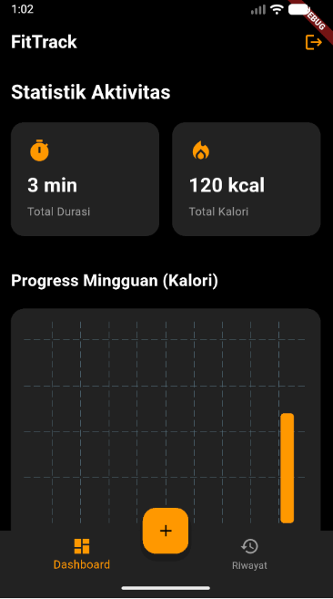
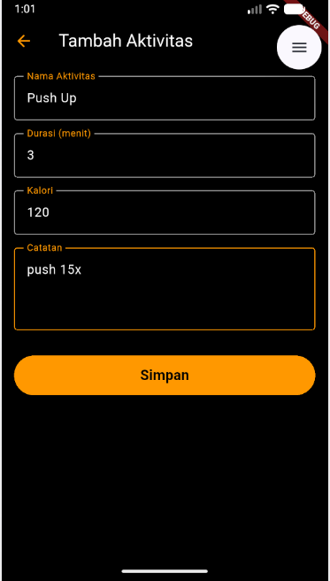
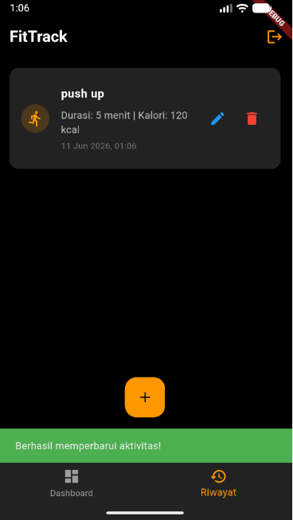

<div align="center">
    <br />
    <h1>LAPORAN PRAKTIKUM <br> APLIKASI BERBASIS PLATFORM </h1>
    <br />
    <h3>MODUL 7 <br> Integrasi Flutter Firebase/Supabase </h3>
    <br />
    
    <br />
    <br />
    <br />
    <h3>Disusun Oleh :</h3>
    <p>
        <strong>Kartika Pringgo Hutomo</strong>
        <br>
        <strong>2311102196</strong>
        <br>
        <strong>S1 IF-11-REG05</strong>
    </p>
    <br />
    <h3>Dosen Pengampu :</h3>
    <p>
        <strong>Dedi Agung Prabowo, S.Kom., M.Kom</strong>
    </p>
    <br />
    <br />
    <h4>Asisten Praktikum :</h4>
    <strong>Apri Pandu Wicaksono </strong>
    <br>
    <strong>Hamka Zaenul Ardi</strong>
    <br />
    <h3>LABORATORIUM HIGH PERFORMANCE <br>FAKULTAS INFORMATIKA <br>UNIVERSITAS TELKOM PURWOKERTO <br>2026 </h3>
</div>
<hr>

## Dasar Teori

Firebase Authentication digunakan untuk mengelola autentikasi pengguna secara aman, sementara Cloud Firestore berfungsi sebagai basis data NoSQL untuk menyimpan data aktivitas secara *real-time*. Firebase Cloud Messaging (FCM) ditambahkan untuk mendukung pengiriman *Push Notification* ke perangkat pengguna.

## Tugas Modul 7 

### 1. Source Code

```dart
//Kartika Pringgo Hutomo
//2311102196
//IF-11-05
import 'package:flutter/material.dart';
import '../services/auth_service.dart';
import 'register_screen.dart';
import 'home_screen.dart';

class LoginScreen extends StatefulWidget {
  @override
  _LoginScreenState createState() => _LoginScreenState();
}

class _LoginScreenState extends State<LoginScreen> {
  final _formKey = GlobalKey<FormState>();
  final AuthService _authService = AuthService();
  
  String email = '';
  String password = '';
  String error = '';
  bool loading = false;

  @override
  Widget build(BuildContext context) {
    return Scaffold(
      backgroundColor: Colors.black,
      appBar: AppBar(
        title: Text('FitTrack - Login', style: TextStyle(color: Colors.white)),
        backgroundColor: Colors.black,
        elevation: 0,
```

**Kode Lengkap:** [lib/screens/login_screen.dart](lib/screens/login_screen.dart)

```dart
//Kartika Pringgo Hutomo
//2311102196
//IF-11-05
import 'package:flutter/material.dart';
import '../services/auth_service.dart';
import 'login_screen.dart';
import 'home_screen.dart';

class RegisterScreen extends StatefulWidget {
  @override
  _RegisterScreenState createState() => _RegisterScreenState();
}

class _RegisterScreenState extends State<RegisterScreen> {
  final _formKey = GlobalKey<FormState>();
  final AuthService _authService = AuthService();
  
  String email = '';
  String password = '';
  String error = '';
  bool loading = false;

  @override
  Widget build(BuildContext context) {
    return Scaffold(
      backgroundColor: Colors.black,
      appBar: AppBar(
        title: Text('FitTrack - Register', style: TextStyle(color: Colors.white)),
        backgroundColor: Colors.black,
        elevation: 0,
```

**Kode Lengkap:** [lib/screens/register_screen.dart](lib/screens/register_screen.dart)

```dart
//Kartika Pringgo Hutomo
//2311102196
//IF-11-05
import 'package:flutter/material.dart';
import 'package:provider/provider.dart';
import 'package:firebase_auth/firebase_auth.dart';
import '../services/auth_service.dart';
import '../services/firestore_service.dart';
import '../models/workout.dart';
import 'dashboard_screen.dart';
import 'history_screen.dart';
import 'workout_form_screen.dart';
import 'login_screen.dart';

class HomeScreen extends StatefulWidget {
  @override
  _HomeScreenState createState() => _HomeScreenState();
}

class _HomeScreenState extends State<HomeScreen> {
  final AuthService _authService = AuthService();
  int _currentIndex = 0;

  final List<Widget> _children = [
    DashboardScreen(),
    HistoryScreen(),
  ];

  void onTabTapped(int index) {
    setState(() {
```

**Kode Lengkap:** [lib/screens/home_screen.dart](lib/screens/home_screen.dart)

```dart
//Kartika Pringgo Hutomo
//2311102196
//IF-11-05
import 'package:flutter/material.dart';
import '../models/workout.dart';
import '../services/firestore_service.dart';
import '../services/auth_service.dart';

class WorkoutFormScreen extends StatefulWidget {
  final Workout? workout;

  WorkoutFormScreen({this.workout});

  @override
  _WorkoutFormScreenState createState() => _WorkoutFormScreenState();
}

class _WorkoutFormScreenState extends State<WorkoutFormScreen> {
  final _formKey = GlobalKey<FormState>();
  
  String _namaAktivitas = '';
  int _durasi = 0;
  int _kalori = 0;
  String _catatan = '';
  
  bool _isLoading = false;

  @override
  void initState() {
    super.initState();
```

**Kode Lengkap:** [lib/screens/workout_form_screen.dart](lib/screens/workout_form_screen.dart)

```dart
//Kartika Pringgo Hutomo
//2311102196
//IF-11-05
import 'package:flutter/material.dart';
import 'package:firebase_core/firebase_core.dart';
import 'package:provider/provider.dart';
import 'package:firebase_auth/firebase_auth.dart';
import 'firebase_options.dart';
import 'services/auth_service.dart';
import 'services/firestore_service.dart';
import 'services/notification_service.dart';
import 'screens/login_screen.dart';
import 'screens/home_screen.dart';
import 'models/workout.dart';

void main() async {
  WidgetsFlutterBinding.ensureInitialized();
  
  // Inisialisasi Firebase
  // Pastikan Anda telah menjalankan `flutterfire configure` di terminal
  // dan meng-uncomment options di bawah jika diperlukan untuk web/iOS.
  try {
    await Firebase.initializeApp(
      options: DefaultFirebaseOptions.currentPlatform,
    );
  } catch (e) {
    print("Firebase initialization error: $e");
  }

  // Inisialisasi Notifikasi
```

**Kode Lengkap:** [lib/main.dart](lib/main.dart)

### 2. Penjelasan

Aplikasi FitTrack mengintegrasikan Firebase Authentication untuk fitur login/register dan Cloud Firestore untuk proses CRUD data aktivitas olahraga. Selain itu, aplikasi mendukung *Push Notification* melalui Firebase Cloud Messaging (FCM) dan menggunakan *Provider* untuk mempermudah *state management* secara efisien.

### 3. Output





