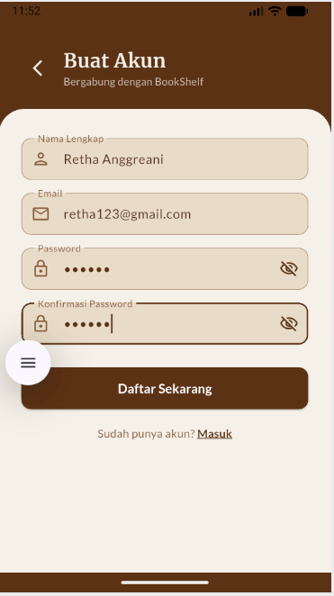
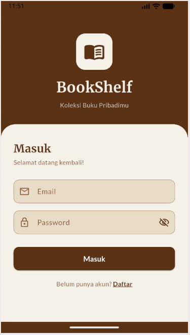
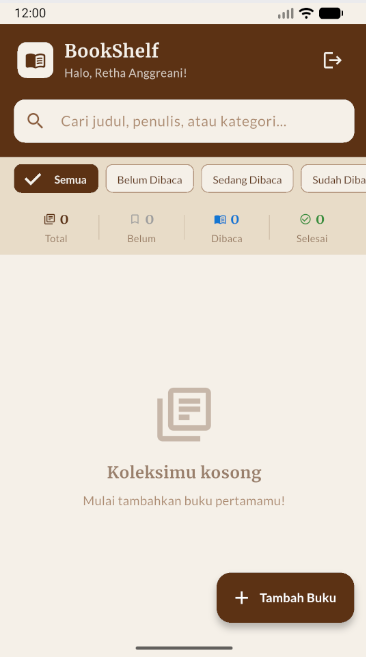
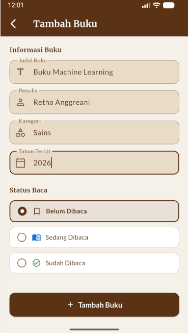
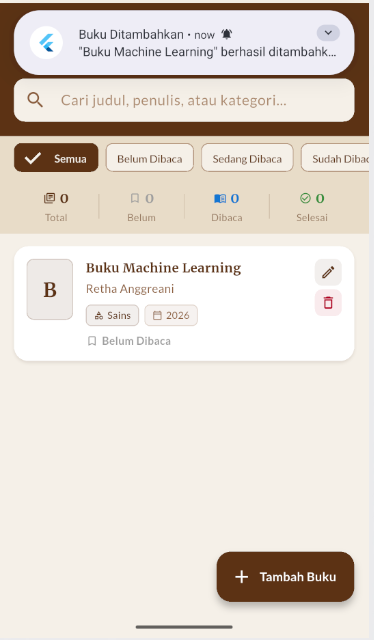

<div align="center">
    <br />
    <h1>LAPORAN PRAKTIKUM <br> APLIKASI BERBASIS PLATFORM </h1>
    <br />
    <h3>MODUL 7 <br> Integrasi Flutter Firebase/Supabase </h3>
    <br />
    
    <br />
    <br />
    <br />
    <h3>Disusun Oleh :</h3>
    <p>
        <strong>Retha Anggreani</strong>
        <br>
        <strong>2311102265</strong>
        <br>
        <strong>S1 IF-11-REG05</strong>
    </p>
    <br />
    <h3>Dosen Pengampu :</h3>
    <p>
        <strong>Dedi Agung Prabowo, S.Kom., M.Kom</strong>
    </p>
    <br />
    <br />
    <h4>Asisten Praktikum :</h4>
    <strong>Apri Pandu Wicaksono </strong>
    <br>
    <strong>Hamka Zaenul Ardi</strong>
    <br />
    <h3>LABORATORIUM HIGH PERFORMANCE <br>FAKULTAS INFORMATIKA <br>UNIVERSITAS TELKOM PURWOKERTO <br>2026 </h3>
</div>
<hr>

## Dasar Teori

Firebase Authentication adalah layanan dari Google yang menyediakan sistem otentikasi *backend*, antarmuka pengguna yang mudah digunakan, dan SDK yang komprehensif untuk mengautentikasi pengguna aplikasi. Layanan ini mendukung berbagai metode login, mulai dari kombinasi email dan password, nomor telepon, hingga penyedia identitas populer seperti Google, Facebook, dan Twitter. Dengan menggunakan Firebase Authentication, pengembang dapat dengan cepat membangun sistem *login* dan *register* yang aman tanpa harus mengelola server otentikasi sendiri.

Cloud Firestore adalah *database* dokumen NoSQL yang fleksibel dan terukur untuk menyimpan, menyinkronkan, dan mengambil data pada aplikasi sisi klien dan server. Firestore menyimpan data dalam bentuk dokumen yang diatur ke dalam koleksi, memungkinkan hierarki data yang kompleks dengan kueri yang ekspresif. Dalam aplikasi Flutter, Firestore sering digunakan untuk menyimpan data pengguna secara *real-time*, sehingga setiap perubahan data langsung tersinkronisasi di semua perangkat yang terhubung.

Integrasi Firebase dalam Flutter dilakukan melalui *plugin* FlutterFire yang menyediakan akses langsung ke berbagai layanan Firebase. Selain *Authentication* dan *Firestore*, layanan lain seperti Firebase Cloud Messaging (FCM) dan Push Notifications juga dapat diintegrasikan untuk meningkatkan *user experience* (UX). Melalui integrasi ini, aplikasi dapat memberikan umpan balik instan kepada pengguna—misalnya mengirimkan notifikasi lokal setelah suatu dokumen berhasil ditambahkan atau dihapus dari *database* Firestore.

## Tugas Modul 7 

### 1. Source Code

```dart
// Retha Anggreani 2311102265 IF-11-05
import 'package:flutter/material.dart';
import 'package:firebase_auth/firebase_auth.dart';
import 'package:google_fonts/google_fonts.dart';

import '../../services/auth_service.dart';
import 'register_screen.dart';

class LoginScreen extends StatefulWidget {
  const LoginScreen({super.key});

  @override
  State<LoginScreen> createState() => _LoginScreenState();
}

class _LoginScreenState extends State<LoginScreen> {
  final _formKey = GlobalKey<FormState>();
  final _emailController = TextEditingController();
  final _passwordController = TextEditingController();
  final _authService = AuthService();

  bool _isLoading = false;
  bool _obscurePassword = true;

  @override
  void dispose() {
    _emailController.dispose();
    _passwordController.dispose();
    super.dispose();
  }
```

**Kode Lengkap:** [lib/screens/auth/login_screen.dart](lib/screens/auth/login_screen.dart)

```dart
// Retha Anggreani 2311102265 IF-11-05
import 'package:flutter/material.dart';
import 'package:firebase_auth/firebase_auth.dart';
import 'package:google_fonts/google_fonts.dart';

import '../../services/auth_service.dart';

class RegisterScreen extends StatefulWidget {
  const RegisterScreen({super.key});

  @override
  State<RegisterScreen> createState() => _RegisterScreenState();
}

class _RegisterScreenState extends State<RegisterScreen> {
  final _formKey = GlobalKey<FormState>();
  final _nameController = TextEditingController();
  final _emailController = TextEditingController();
  final _passwordController = TextEditingController();
  final _confirmPasswordController = TextEditingController();
  final _authService = AuthService();

  bool _isLoading = false;
  bool _obscurePassword = true;
  bool _obscureConfirm = true;

  @override
  void dispose() {
    _nameController.dispose();
    _emailController.dispose();
```

**Kode Lengkap:** [lib/screens/auth/register_screen.dart](lib/screens/auth/register_screen.dart)

```dart
// Retha Anggreani 2311102265 IF-11-05
import 'package:flutter/material.dart';
import 'package:google_fonts/google_fonts.dart';

import '../../models/book_model.dart';
import '../../services/auth_service.dart';
import '../../services/book_service.dart';
import '../../services/notification_service.dart';
import '../book/book_form_screen.dart';
import '../book/book_detail_screen.dart';
import '../../widgets/book_card.dart';
import '../../widgets/stats_bar.dart';

class HomeScreen extends StatefulWidget {
  const HomeScreen({super.key});

  @override
  State<HomeScreen> createState() => _HomeScreenState();
}

class _HomeScreenState extends State<HomeScreen> {
  final _authService = AuthService();
  final _bookService = BookService();
  final _searchController = TextEditingController();

  String _searchQuery = '';
  StatusBaca? _filterStatus;

  static const primaryBrown = Color(0xFF5C3317);
```

**Kode Lengkap:** [lib/screens/home/home_screen.dart](lib/screens/home/home_screen.dart)

```dart
// Retha Anggreani 2311102265 IF-11-05
import 'package:flutter/material.dart';
import 'package:firebase_auth/firebase_auth.dart';
import 'package:google_fonts/google_fonts.dart';

import '../../models/book_model.dart';
import '../../services/book_service.dart';
import '../../services/notification_service.dart';

class BookFormScreen extends StatefulWidget {
  final Book? book; // null = tambah, non-null = edit

  const BookFormScreen({super.key, this.book});

  @override
  State<BookFormScreen> createState() => _BookFormScreenState();
}

class _BookFormScreenState extends State<BookFormScreen> {
  final _formKey = GlobalKey<FormState>();
  final _bookService = BookService();

  late final TextEditingController _judulController;
  late final TextEditingController _penulisController;
  late final TextEditingController _kategoriController;
  late final TextEditingController _tahunController;

  StatusBaca _statusBaca = StatusBaca.belumDibaca;
  bool _isLoading = false;
```

**Kode Lengkap:** [lib/screens/book/book_form_screen.dart](lib/screens/book/book_form_screen.dart)

```dart
// Retha Anggreani 2311102265 IF-11-05
import 'package:flutter/material.dart';
import 'package:firebase_core/firebase_core.dart';
import 'package:firebase_auth/firebase_auth.dart';
import 'package:google_fonts/google_fonts.dart';

import 'firebase_options.dart';
import 'screens/auth/login_screen.dart';
import 'screens/home/home_screen.dart';
import 'services/notification_service.dart';

void main() async {
  WidgetsFlutterBinding.ensureInitialized();
  await Firebase.initializeApp(
    options: DefaultFirebaseOptions.currentPlatform,
  );
  await NotificationService.initialize();
  runApp(const BookShelfApp());
}

class BookShelfApp extends StatelessWidget {
  const BookShelfApp({super.key});

  @override
  Widget build(BuildContext context) {
    return MaterialApp(
      title: 'BookShelf',
      debugShowCheckedModeBanner: false,
      theme: _buildTheme(),
      home: const AuthWrapper(),
```

**Kode Lengkap:** [lib/main.dart](lib/main.dart)

### 2. Penjelasan

Aplikasi BookShelf ini menggunakan Firebase Authentication untuk manajemen pengguna (Login/Register) dan Cloud Firestore sebagai database NoSQL untuk menyimpan data buku secara *real-time*. Berikut adalah hasil tangkapan layar dari aplikasi yang telah dijalankan, meliputi halaman otentikasi, beranda buku, dan form penambahan buku (silakan lengkapi/ganti gambar sesuai hasil *run* Anda sendiri).

### 3. Output





