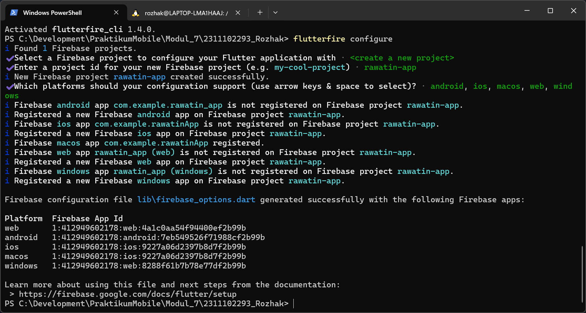
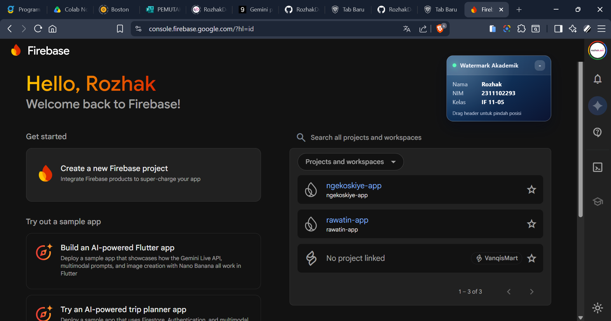
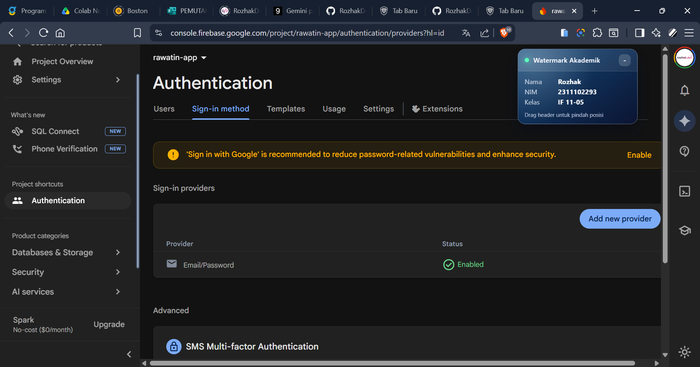
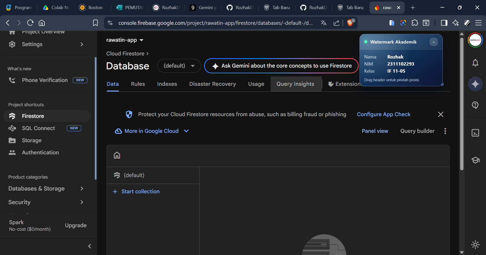
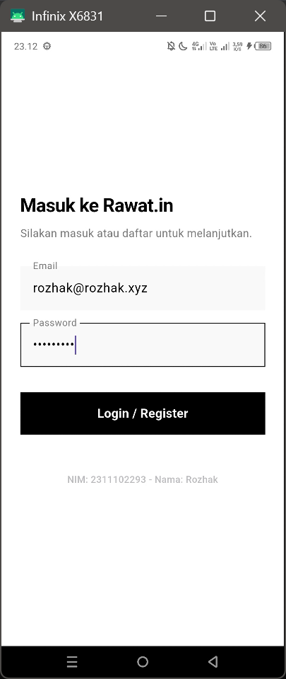
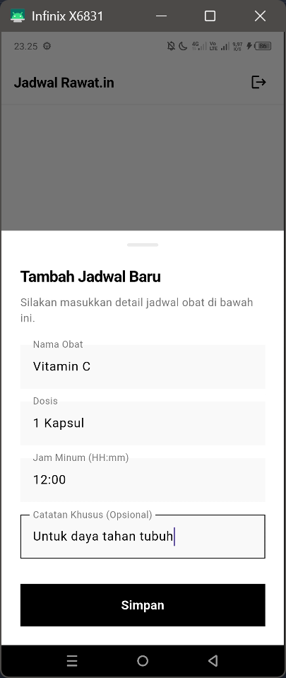
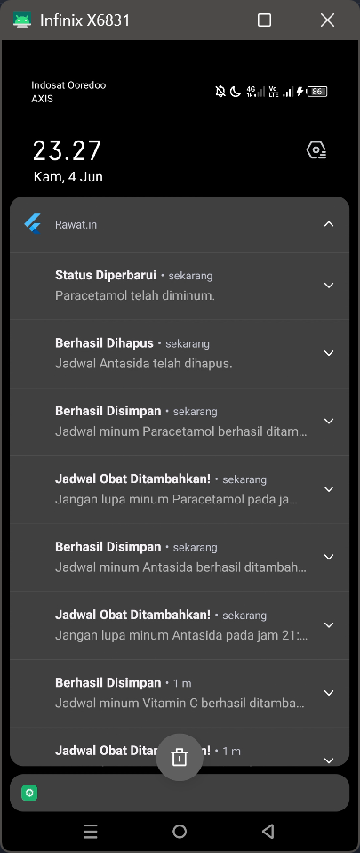
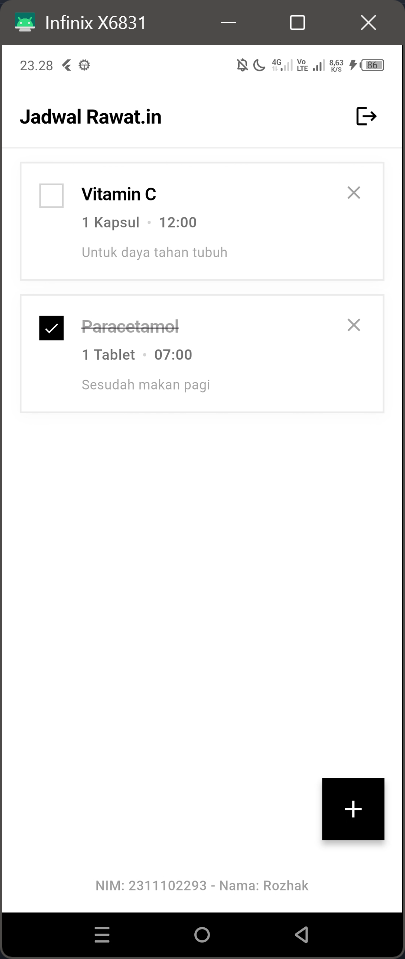
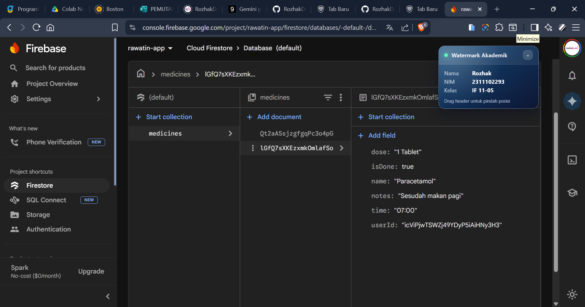

<div align="center">
    <br />
    <h1>LAPORAN PRAKTIKUM <br> APLIKASI BERBASIS PLATFORM </h1>
    <br />
    <h3>MODUL 7 <br> INTEGRASI FLUTTER FIREBASE </h3>
    <br />
    
    <br />
    <br />
    <br />
    <h3>Disusun Oleh :</h3>
    <p>
        <strong>Rozhak</strong>
        <br>
        <strong>2311102293</strong>
        <br>
        <strong>S1 IF-11-REG05</strong>
    </p>
    <br />
    <h3>Dosen Pengampu :</h3>
    <p>
        <strong>Dedi Agung Prabowo, S.Kom., M.Kom</strong>
    </p>
    <br />
    <br />
    <h4>Asisten Praktikum :</h4>
    <strong>Apri Pandu Wicaksono </strong>
    <br>
    <strong>Hamka Zaenul Ardi</strong>
    <br />
    <h3>LABORATORIUM HIGH PERFORMANCE <br>FAKULTAS INFORMATIKA <br>UNIVERSITAS TELKOM PURWOKERTO <br>2026 </h3>
</div>
<hr>

## Dasar Teori

Integrasi _Backend-as-a-Service_ (BaaS) seperti Firebase sangat penting dalam pengembangan aplikasi _mobile_ modern. Firebase menyediakan solusi instan untuk mengelola autentikasi pengguna (_Firebase Authentication_) dan basis data secara _real-time_ (_Cloud Firestore_). Autentikasi memastikan bahwa data yang disimpan aman darn hanya dapat diakses oleh pemiliknya. Sementara itu, _Cloud Firestore_ memungkinkan aplikasi melakukan operasi CRUD (Create, Read, Update, Delete) yang datanya otomatis tersinkronisasi. Penggunaan Notifikasi Lokal juga berperan vital untuk memberikan _feedback_ asinkron kepada pengguna (seperti pengingat atau _alert_) tanpa harus membuka aplikasi secara aktif.

## Tugas Modul 7 - Integrasi Firebase (Aplikasi Rawat.in)

### 1. Source Code

```dart
void main() async {
  WidgetsFlutterBinding.ensureInitialized();
  await Firebase.initializeApp(options: DefaultFirebaseOptions.currentPlatform);
  await NotificationService.initialize();
  runApp(const RawatinApp());
}

class RawatinApp extends StatelessWidget {
  const RawatinApp({super.key});

  @override
  Widget build(BuildContext context) {
    return MaterialApp(
      ...
    );
  }
}

class AuthGate extends StatelessWidget {
  const AuthGate({super.key});

  @override
  Widget build(BuildContext context) {
    return StreamBuilder<User?>(
      ...
    );
  }
}
```

**Kode Lengkap:** [lib/main.dart](lib/main.dart)

```dart
class LoginPage extends StatefulWidget {
  const LoginPage({super.key});

  @override
  State<LoginPage> createState() => _LoginPageState();
}

class _LoginPageState extends State<LoginPage> {
  final TextEditingController _emailController = TextEditingController();
  final TextEditingController _passwordController = TextEditingController();

  Future<void> _loginOrRegister() async {
    try {
      await FirebaseAuth.instance.signInWithEmailAndPassword(
        email: _emailController.text,
        password: _passwordController.text,
      );
    } on FirebaseAuthException catch (e) {
      if (e.code == 'user-not-found' || e.code == 'invalid-credential') {
        try {
          await FirebaseAuth.instance.createUserWithEmailAndPassword(
            email: _emailController.text,
            password: _passwordController.text,
          );
        } catch (ex) {
          debugPrint('Register Error: $ex');
        }
      }
    }
  }

  @override
  Widget build(BuildContext context) {
    return Scaffold(
      ...
    )
  }
}
```

**Kode Lengkap:** [lib/pages/auth/login_page.dart](lib/pages/auth/login_page.dart)

```dart
class MedicineModel {
  final String id;
  final String name;
  final String dose;
  final String time;
  final String notes;
  final bool isDone;
  final String userId;

  MedicineModel({
    ...
  });

  Map<String, dynamic> toMap() {
    return {
      ...
    };
  }
  factory MedicineModel.fromMap(String id, Map<String, dynamic> map) {
    return MedicineModel(
      ...
    );
  }
}
```

**Kode Lengkap:** [lib/models/medicine_model.dart](lib/models/medicine_model.dart)

```dart
class NotificationService {
  static final FlutterLocalNotificationsPlugin _notificationsPlugin = FlutterLocalNotificationsPlugin();

  static Future<void> initialize() async {
    tz.initializeTimeZones();
    tz.setLocalLocation(tz.getLocation('Asia/Jakarta'));

    const AndroidInitializationSettings androidSettings = AndroidInitializationSettings('@mipmap/ic_launcher');
    const InitializationSettings settings = InitializationSettings(android: androidSettings);
    await _notificationsPlugin.initialize(settings: settings);
  }

  static Future<void> requestPermission() async {
    final AndroidFlutterLocalNotificationsPlugin? androidImplementation =
        _notificationsPlugin.resolvePlatformSpecificImplementation<
            AndroidFlutterLocalNotificationsPlugin>();
    await androidImplementation?.requestNotificationsPermission();
  }

  static Future<void> showNotification({required String title, required String body}) async {
    const AndroidNotificationDetails androidDetails = AndroidNotificationDetails(
      ...
    );
    const NotificationDetails details = NotificationDetails(android: androidDetails);
    await _notificationsPlugin.show(
      ...
    );
  }

  static Future<void> scheduleMedicineNotification(MedicineModel medicine) async {
    final now = tz.TZDateTime.now(tz.local);
    final parts = medicine.time.split(':');
    if (parts.length != 2) return;
    
    int hour = int.parse(parts[0]);
    int minute = int.parse(parts[1]);

    tz.TZDateTime scheduledDate = tz.TZDateTime(tz.local, now.year, now.month, now.day, hour, minute);
    
    if (scheduledDate.isBefore(now)) {
      scheduledDate = scheduledDate.add(const Duration(days: 1));
    }

    const AndroidNotificationDetails androidDetails = AndroidNotificationDetails(
      ...
    );
    const NotificationDetails details = NotificationDetails(android: androidDetails);

    final int notificationId = medicine.id.hashCode;

    await _notificationsPlugin.zonedSchedule(
      ...
    );
  }

  static Future<void> cancelNotification(String medicineId) async {
    await _notificationsPlugin.cancel(id: medicineId.hashCode);
  }
}
```

**Kode Lengkap:** [lib/services/notification_service.dart](lib/services/notification_service.dart)

```dart
class FirestoreService {
  final CollectionReference _medicinesCollection = FirebaseFirestore.instance.collection('medicines');

  Future<void> addMedicine(MedicineModel medicine) async {
    await _medicinesCollection.add(medicine.toMap());
    await NotificationService.showNotification(
      ...
    );
  }

  Stream<List<MedicineModel>> getMedicines(String userId) {
    return _medicinesCollection
        ...
  }

  Future<void> toggleMedicineStatus(String id, bool currentStatus) async {
    await _medicinesCollection.doc(id).update({'isDone': !currentStatus});
  }

  Future<void> deleteMedicine(String id) async {
    await _medicinesCollection.doc(id).delete();
  }
}
```

**Kode Lengkap:** [lib/services/firestore_service.dart](lib/services/firestore_service.dart)

```dart
class MedicineCard extends StatelessWidget {
  final MedicineModel medicine;
  final VoidCallback onToggle;
  final VoidCallback onDelete;

  const MedicineCard({
    super.key,
    required this.medicine,
    required this.onToggle,
    required this.onDelete,
  });

  @override
  Widget build(BuildContext context) {
    return Container(
      ...
    );
  }
}
```

**Kode Lengkap:** [lib/widgets/medicine_card.dart](lib/widgets/medicine_card.dart)

```dart
class HomePage extends StatefulWidget {
  const HomePage({super.key});

  @override
  State<HomePage> createState() => _HomePageState();
}

class _HomePageState extends State<HomePage> {
  final FirestoreService _firestoreService = FirestoreService();
  final String userId = FirebaseAuth.instance.currentUser!.uid;

  final TextEditingController _nameController = TextEditingController();
  final TextEditingController _doseController = TextEditingController();
  final TextEditingController _timeController = TextEditingController();
  final TextEditingController _notesController = TextEditingController();

  @override
  void initState() {
    super.initState();
    NotificationService.requestPermission();
  }

  void _showAddBottomSheet() {
    showModalBottomSheet(
      ...
    );
  }

  @override
  Widget build(BuildContext context) {
    return Scaffold(
      ...
    );
  }
}
```

**Kode Lengkap:** [lib/pages/home/home_page.dart](lib/pages/home/home_page.dart)

### 2. Penjelasan

Aplikasi **Rawat.in** menggunakan `FirebaseAuth` pada kelas `AuthGate` untuk memonitor _state_ autentikasi pengguna melalui `authStateChanges()`. Jika pengguna belum masuk, aplikasi memanggil `LoginPage`. Autentikasi ditangani oleh metode `_loginOrRegister()`; jika `signInWithEmailAndPassword` mengembalikan kode akun tidak ditemukan, metode `createUserWithEmailAndPassword` akan langsung dieksekusi. Pengelolaan database dilakukan melalui kelas `FirestoreService` menggunakan `FirebaseFirestore.instance.collection('medicines')`. Setiap data obat yang disimpan menyertakan parameter `userId`. Pada `HomePage`, data dari koleksi tersebut diambil melalui fungsi `snapshots()` dan ditampilkan secara _real-time_ menggunakan _widget_ `StreamBuilder`.

Fungsi penambahan data memicu `showModalBottomSheet()` yang memuat elemen `TextField` untuk nama, dosis, waktu, dan catatan, dibungkus dalam `SingleChildScrollView` untuk menghindari _overflow_ saat _keyboard_ terbuka. Ketika tombol simpan ditekan, metode `addMedicine()` dipanggil untuk mengirimkan objek model yang di-_parsing_ menjadi `Map` ke Firestore. Pembaruan status (selesai/belum) terjadi melalui _widget_ `GestureDetector` yang mengeksekusi metode `update()` di Firestore guna mengubah nilai boolean `isDone`. Penghapusan jadwal memanggil metode `delete()` pada _DocumentReference_ terkait. Sebagai penanda, teks berisi NIM dan Nama disematkan di `LoginPage` dengan _widget_ `Opacity`.

Untuk sistem pengingat, aplikasi menginisialisasi `flutter_local_notifications` dan modul `timezone` pada fungsi `main()`. Saat jadwal berhasil disimpan ke database, `NotificationService` mengeksekusi metode `zonedSchedule()` yang akan menghitung waktu alarm berdasarkan _string_ jam minum obat dari pengguna, lalu mendaftarkan notifikasi tersebut ke sistem operasi. Apabila jadwal obat dihapus melalui tombol silang, metode `cancel()` pada _plugin_ notifikasi akan dipanggil menggunakan parameter ID obat untuk mencabut alarm yang sudah dijadwalkan.

### 3. Output

| No | File Name                    | Keterangan                          |
|----|------------------------------|-------------------------------------|
| 1  |  | Proses konfigurasi FlutterFire CLI di terminal. |
| 2  |  | Dashboard utama project Firebase Rawat.in. |
| 3  |  | Konfigurasi Firebase Authentication Email/Password. |
| 4  |  |Halaman database Firestore Firebase. |
| 5  |  | Halaman login aplikasi Rawat.in. |
| 6  |  | Form input jadwal obat baru. |
| 7  |  | Hasil notifikasi CRUD aplikasi. |
| 8  |  | Halaman utama daftar jadwal obat. |
| 9  |  | Collection medicines pada Firestore. |

## Kesimpulan

Berdasarkan praktikum Modul 7, Firebase Auth dan Cloud Firestore terbukti sangat efisien dalam memfasilitasi fitur autentikasi dan operasi CRUD _real-time_ secara modular. Selain itu, integrasi fitur _Local Notification_ juga berhasil diimplementasikan dengan baik untuk memberikan pengingat asinkron yang fungsional kepada pengguna.