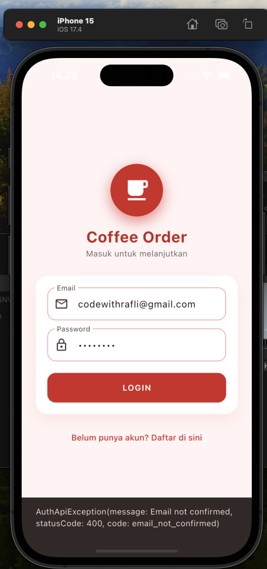
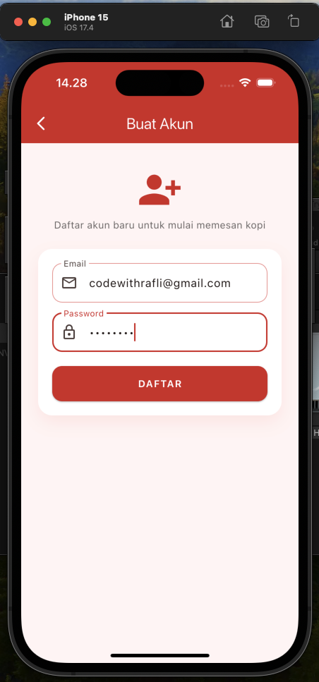
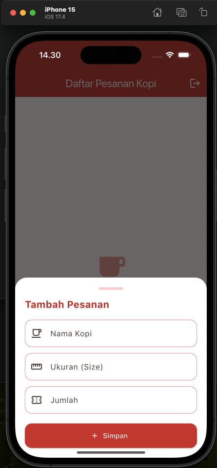
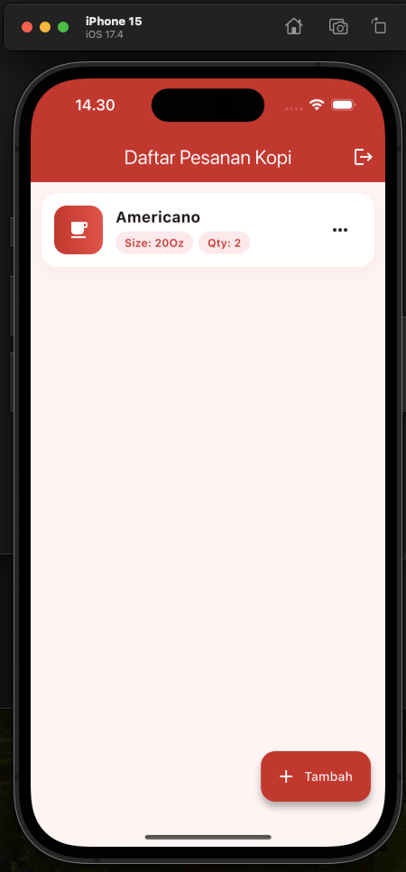
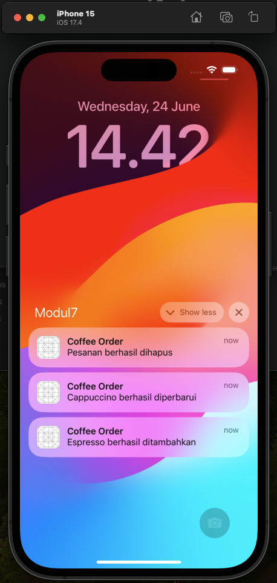

<div align="center">
  <br />
  <h1>LAPORAN PRAKTIKUM <br> APLIKASI BERBASIS PLATFORM </h1>
  <br />
  <h3>MODUL 7 <br> FLUTTER </h3>
  <br />
  
  <br />
  <br />
  <br />
  <h3>Disusun Oleh :</h3>
  <p>
    <strong>Muhamad Rafli Al Farizqi</strong>
    <br>
    <strong>2311102315</strong>
    <br>
    <strong>S1 IF-11-REG05</strong>
  </p>
  <br />
  <h3>Dosen Pengampu :</h3>
  <p>
    <strong>Dedi Agung Prabowo, S.Kom., M.Kom</strong>
  </p>
  <br />
  <br />
  <h4>Asisten Praktikum :</h4>
  <strong>Apri Pandu Wicaksono </strong>
  <br>
  <strong>Hamka Zaenul Ardi</strong>
  <br />
  <h3>LABORATORIUM HIGH PERFORMANCE <br>FAKULTAS INFORMATIKA <br>UNIVERSITAS TELKOM PURWOKERTO <br>2026 </h3>
</div>

<hr>


# Dasar Teori

<p align="justify">
Flutter merupakan framework pengembangan aplikasi mobile lintas platform yang dikembangkan oleh Google dengan menggunakan bahasa pemrograman Dart. Flutter memungkinkan pengembang membuat aplikasi untuk Android, iOS, web, dan desktop dari satu basis kode yang sama. Dalam pengembangan aplikasi modern, Flutter sering diintegrasikan dengan layanan Backend as a Service (BaaS) seperti Firebase dan Supabase untuk mempermudah pengelolaan data, autentikasi pengguna, penyimpanan file, serta sinkronisasi data secara real-time tanpa perlu membangun server backend secara mandiri.
</p>
<p align="justify">
Firebase dan Supabase merupakan platform layanan backend yang menyediakan berbagai fitur untuk mendukung pengembangan aplikasi. Firebase dikembangkan oleh Google dan menawarkan layanan seperti Authentication, Cloud Firestore, Realtime Database, dan Cloud Storage. Sementara itu, Supabase merupakan platform open-source yang menggunakan PostgreSQL sebagai basis data utama dan menyediakan fitur autentikasi, database real-time, penyimpanan berkas, serta API otomatis. Integrasi Flutter dengan Firebase atau Supabase memungkinkan aplikasi berinteraksi secara langsung dengan layanan backend sehingga proses pengelolaan data menjadi lebih efisien, aman, dan mudah diimplementasikan dalam pengembangan aplikasi modern.
</p>


# Tugas 7 - Flutter

> Aplikasi **Coffee Order** dengan integrasi **Supabase** (Authentication + CRUD + Local Notification). Tema warna **merah** dengan tampilan UI yang dimodifikasi (login berbentuk card dengan logo, form input menggunakan bottom sheet, daftar pesanan berbentuk kartu modern dengan menu popup).

## 1. Source Code main.dart
```dart
// 2311102315
// Muhamad Rafli Al Farizqi
// S1IF-11-05
import 'package:flutter/material.dart';
import 'package:supabase_flutter/supabase_flutter.dart';

import 'notification_service.dart';
import 'login_page.dart';
import 'home_page.dart';
import 'supabase_config.dart';

Future<void> main() async {
  WidgetsFlutterBinding.ensureInitialized();

  await NotificationService.init();

  await Supabase.initialize(
    url: supabaseUrl,
    publishableKey: supabaseAnonKey,
  );

  runApp(const MyApp());
}

class MyApp extends StatelessWidget {
  const MyApp({super.key});

  @override
  Widget build(BuildContext context) {
    return MaterialApp(
      debugShowCheckedModeBanner: false,
      title: "Coffee Order",
      theme: ThemeData(
        useMaterial3: true,
        scaffoldBackgroundColor: const Color(0xFFFFF5F5),
        colorScheme: ColorScheme.fromSeed(
          seedColor: Colors.red,
          primary: Colors.red.shade700,
        ),
        // ... AppBar, input, dan tombol bertema merah
      ),
      home: Supabase.instance.client.auth.currentSession == null
          ? const LoginPage()
          : const HomePage(),
    );
  }
}
```
**Kode Lengkap : [lib/main.dart](lib/main.dart)**

## 2. Source Code login_page.dart
```dart
// 2311102315
// Muhamad Rafli Al Farizqi
// S1IF-11-05
import 'package:flutter/material.dart';
import 'package:supabase_flutter/supabase_flutter.dart';

import 'register_page.dart';
import 'home_page.dart';

class LoginPage extends StatefulWidget {
  const LoginPage({super.key});

  @override
  State<LoginPage> createState() => _LoginPageState();
}

class _LoginPageState extends State<LoginPage> {
  final email = TextEditingController();
  final password = TextEditingController();
  bool loading = false;

  Future login() async {
    setState(() => loading = true);
    try {
      await Supabase.instance.client.auth.signInWithPassword(
        email: email.text,
        password: password.text,
      );
      Navigator.pushReplacement(
        context,
        MaterialPageRoute(builder: (_) => const HomePage()),
      );
    } catch (e) {
      ScaffoldMessenger.of(context).showSnackBar(
        SnackBar(content: Text(e.toString())),
      );
    } finally {
      if (mounted) setState(() => loading = false);
    }
  }
  // ... UI: logo lingkaran merah + card form login
}
```
**Kode Lengkap : [lib/login_page.dart](lib/login_page.dart)**

## 3. Source Code home_page.dart
```dart
// 2311102315
// Muhamad Rafli Al Farizqi
// S1IF-11-05
import 'package:flutter/material.dart';
import 'package:supabase_flutter/supabase_flutter.dart';

import 'notification_service.dart';
import 'login_page.dart';

class HomePage extends StatefulWidget {
  const HomePage({super.key});

  @override
  State<HomePage> createState() => _HomePageState();
}

class _HomePageState extends State<HomePage> {
  final supabase = Supabase.instance.client;
  List orders = [];

  Future loadData() async {
    final response = await supabase.from('orders').select().order('id');
    setState(() => orders = response);
  }

  // Form Tambah/Edit menggunakan showModalBottomSheet
  // Insert / Update / Delete ke tabel 'orders' di Supabase
  // Daftar pesanan ditampilkan sebagai kartu modern dengan PopupMenuButton
}
```
**Kode Lengkap : [lib/home_page.dart](lib/home_page.dart)**

## 4. Source Code notification_service.dart
```dart
// 2311102315
// Muhamad Rafli Al Farizqi
// S1IF-11-05
import 'package:flutter_local_notifications/flutter_local_notifications.dart';

class NotificationService {
  static final FlutterLocalNotificationsPlugin
      flutterLocalNotificationsPlugin =
      FlutterLocalNotificationsPlugin();

  static Future init() async {
    const AndroidInitializationSettings androidSettings =
        AndroidInitializationSettings('@mipmap/ic_launcher');
    const InitializationSettings settings =
        InitializationSettings(android: androidSettings);
    await flutterLocalNotificationsPlugin.initialize(settings);
  }

  static Future showNotification({
    required String title,
    required String body,
  }) async {
    const AndroidNotificationDetails androidDetails =
        AndroidNotificationDetails(
      'coffee_channel',
      'Coffee Notification',
      importance: Importance.max,
      priority: Priority.high,
    );
    const NotificationDetails details =
        NotificationDetails(android: androidDetails);
    await flutterLocalNotificationsPlugin.show(
      DateTime.now().millisecond, title, body, details);
  }
}
```
**Kode Lengkap : [lib/notification_service.dart](lib/notification_service.dart)**

## 5. Source Code register_page.dart
```dart
// 2311102315
// Muhamad Rafli Al Farizqi
// S1IF-11-05
import 'package:flutter/material.dart';
import 'package:supabase_flutter/supabase_flutter.dart';

class RegisterPage extends StatefulWidget {
  const RegisterPage({super.key});

  @override
  State<RegisterPage> createState() => _RegisterPageState();
}

class _RegisterPageState extends State<RegisterPage> {
  final email = TextEditingController();
  final password = TextEditingController();
  bool loading = false;

  Future register() async {
    setState(() => loading = true);
    try {
      await Supabase.instance.client.auth.signUp(
        email: email.text,
        password: password.text,
      );
      ScaffoldMessenger.of(context).showSnackBar(
        const SnackBar(content: Text("Register berhasil")),
      );
      Navigator.pop(context);
    } catch (e) {
      ScaffoldMessenger.of(context).showSnackBar(
        SnackBar(content: Text(e.toString())),
      );
    } finally {
      if (mounted) setState(() => loading = false);
    }
  }
  // ... UI form daftar bertema merah
}
```
**Kode Lengkap : [lib/register_page.dart](lib/register_page.dart)**

# Output

### 1. Halaman Login
<p align="justify">
Halaman login dengan desain card dan logo lingkaran merah. Pengguna memasukkan email dan password untuk masuk ke aplikasi menggunakan Authentication Supabase.
</p>



### 2. Halaman Register
<p align="justify">
Halaman registrasi untuk membuat akun baru. Data email dan password dikirim ke Supabase Auth melalui fungsi <code>signUp</code>.
</p>



### 3. Form Tambah Pesanan
<p align="justify">
Form tambah/edit pesanan ditampilkan dalam bentuk bottom sheet yang muncul dari bawah layar, berisi input Nama Kopi, Ukuran (Size), dan Jumlah.
</p>



### 4. Daftar Pesanan Kopi
<p align="justify">
Data pesanan yang tersimpan di tabel <code>orders</code> Supabase ditampilkan dalam bentuk kartu modern lengkap dengan informasi Size dan Qty, serta menu popup untuk Edit/Hapus.
</p>



### 5. Notifikasi CRUD
<p align="justify">
Setiap aksi Create, Update, dan Delete memunculkan notifikasi sistem menggunakan package <code>flutter_local_notifications</code>, sehingga pengguna mendapat informasi setiap kali berhasil menambahkan, memperbarui, atau menghapus data.
</p>



# Penjelasan
<p align="justify">
Aplikasi Coffee Order merupakan aplikasi mobile berbasis Flutter yang menggunakan Supabase sebagai backend untuk mengelola data secara online. Aplikasi ini menerapkan fitur Authentication berupa registrasi dan login pengguna menggunakan email dan password, sehingga setiap pengguna dapat mengakses sistem secara aman. Setelah berhasil login, pengguna dapat melakukan operasi CRUD (Create, Read, Update, Delete) pada data pesanan kopi yang tersimpan di database Supabase. Data yang dikelola meliputi nama kopi, ukuran (size), dan jumlah pesanan. Selain itu, aplikasi juga dilengkapi dengan notifikasi CRUD yang muncul baik dalam bentuk notifikasi mengambang (SnackBar) di dalam aplikasi maupun notifikasi pada panel notifikasi Android menggunakan package flutter_local_notifications, sehingga pengguna memperoleh informasi setiap kali berhasil menambahkan, mengubah, atau menghapus data. Pada aplikasi ini, tampilan antarmuka dimodifikasi agar berbeda dari versi standar: halaman login dibuat dalam bentuk card dengan logo lingkaran, form tambah/edit pesanan menggunakan bottom sheet yang muncul dari bawah layar, serta daftar pesanan ditampilkan dalam bentuk kartu modern lengkap dengan menu popup (edit/hapus). Seluruh komponen utama menggunakan tema warna **merah** sehingga aplikasi memiliki identitas visual yang khas. Dengan demikian, aplikasi ini menunjukkan implementasi integrasi Flutter dengan Supabase untuk autentikasi, penyimpanan data online, serta pengelolaan data secara real-time.
</p>
